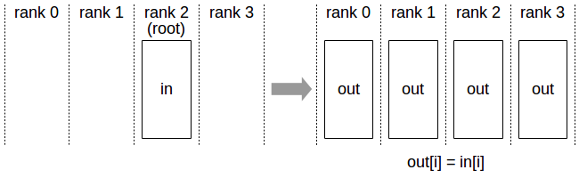

**********
Operations
**********

Like MPI collective operations, NCCL collective operations have to be called for each rank (hence CUDA device) to form a complete collective operation. Failure to do so will result in other ranks waiting indefinitely.

.. _allreduce:

AllReduce
---------

The AllReduce operation is performing reductions on data (for example, sum, max) across devices and writing the result in the receive buffers of every rank.

The AllReduce operation is rank-agnostic. Any reordering of the ranks will not affect the outcome of the operations.

AllReduce starts with independent arrays Vk of N values on each of K ranks and ends with identical arrays S of N values, where S[i] = V0[i]+V1[i]+…+Vk-1[i], for each rank k.

.. figure:: images/allreduce.png
 :align: center
 
 All-Reduce operation: each rank receives the reduction of input values across ranks.

Related links: :c:func:`ncclAllReduce`.

.. _broadcast:

Broadcast
---------

The Broadcast operation copies an N-element buffer on the root rank to all ranks.

 
 Broadcast operation: all ranks receive data from a “root” rank. 

Important note: The root argument is one of the ranks, not a device number, and is therefore impacted by a different rank to device mapping.

Related links: :c:func:`ncclBroadcast`.

.. _reduce:

Reduce
------

The Reduce operation is performing the same operation as AllReduce, but writes the result only in the receive buffers of a specified root rank.

.. figure:: images/reduce.png
 :align: center
 
 Reduce operation : one rank receives the reduction of input values across ranks.

Important note : The root argument is one of the ranks (not a device number), and is therefore impacted by a different rank to device mapping.

Note: A Reduce, followed by a Broadcast, is equivalent to the AllReduce operation.

Related links: :c:func:`ncclReduce`.

.. _allgather:

AllGather
---------

In the AllGather operation, each of the K processors aggregates N values from every processor into an output of dimension K*N. The output is ordered by rank index.

.. figure:: images/allgather.png
 :align: center
 
 AllGather operation: each rank receives the aggregation of data from all ranks in the order of the ranks. 

The AllGather operation is impacted by a different rank or device mapping since the ranks determine the data layout.

Note: Executing ReduceScatter, followed by AllGather, is equivalent to the AllReduce operation.

Related links: :c:func:`ncclAllGather`.

.. _reducescatter:

ReduceScatter
-------------

The ReduceScatter operation performs the same operation as the Reduce operation, except the result is scattered in equal blocks among ranks, each rank getting a chunk of data based on its rank index.

.. figure:: images/reducescatter.png
 :align: center

 Reduce-Scatter operation: input values are reduced across ranks, with each rank receiving a subpart of the result.

The ReduceScatter operation is impacted by a different rank or device mapping since the ranks determine the data layout.

Related links: :c:func:`ncclReduceScatter`
