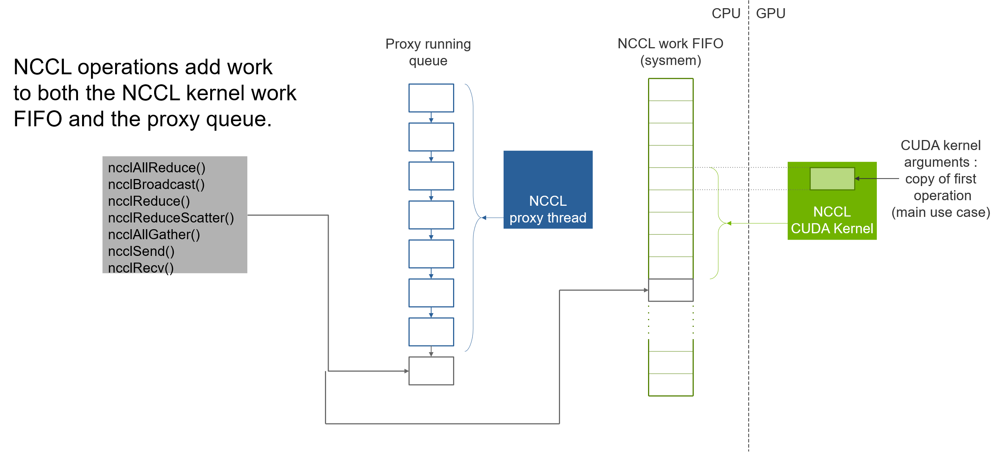
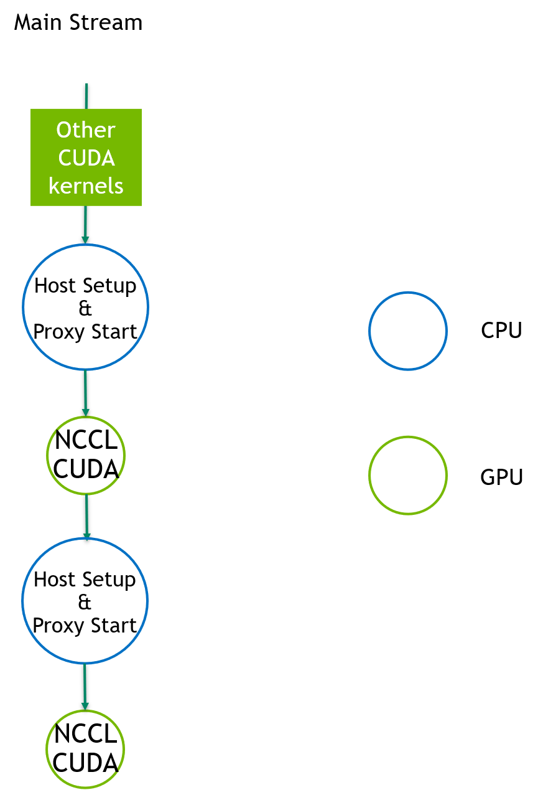
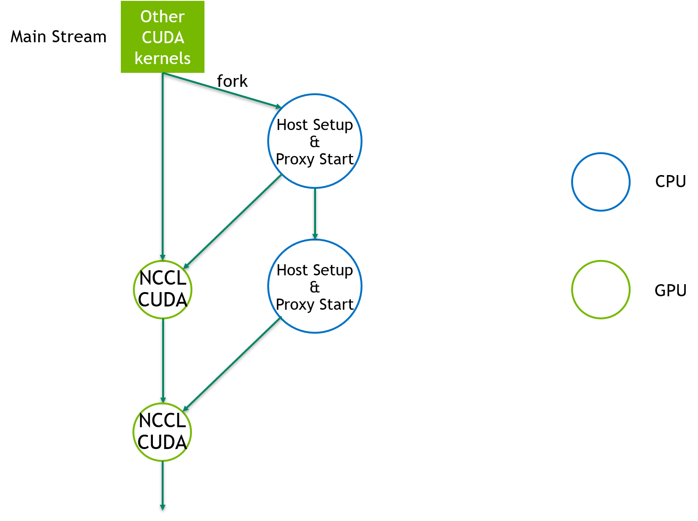
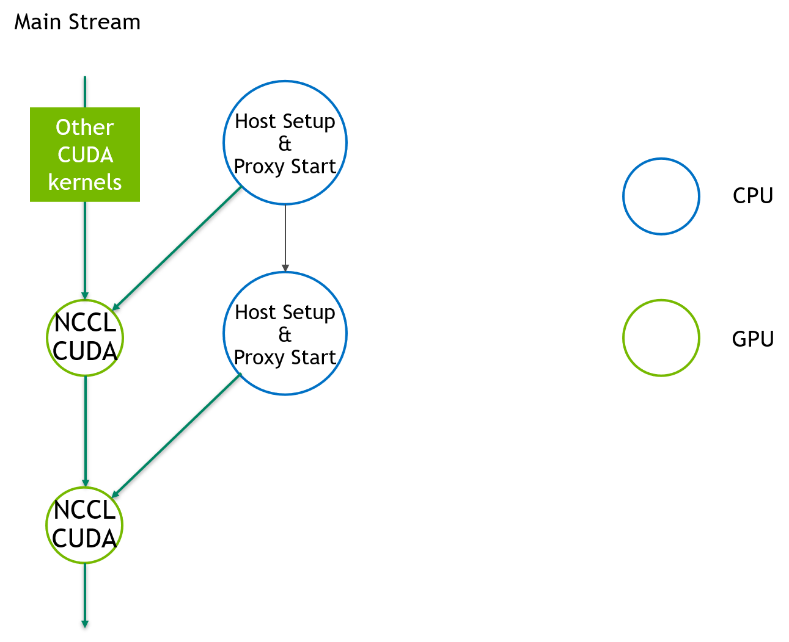

# CUDA_GRAPH

<h2>Requirements</h2>

### Project Context and Purpose

NCCL provides fast inter-GPU communication for parallel applications.

### NVbugs / Jira Tickets

[NVBug 12345](http://nvbugs.nvidia.com/12345)

[Jira NCCL-991](https://jirasw.nvidia.com/browse/NCCL-991)

### User Experience

NCCL is used through deep learning frameworks or other HPC applications
to accelerate GPU-to-GPU communication. It is supposed to be transparent
to the user.

### Assumptions, constraints and dependencies

None/\$TBD

### Use Cases

The CUDA graph support in NCCL would allow users to capture NCCL
operations (collectives and P2P) with other compute kernels in the same
CUDA graph. Simplifying the programming model and reducing the launch
times.

### Functional Requirements

Support NCCL calls between CUDA graph start/end capture APIs

### System Requirements

None.

### Interface Requirements

None.

### KPI Requirements

None.

### Platform Requirements

N/A

### Security Requirements

NCCL is a user library and benefits from the user-mode security.

### Legal and Standards Requirements

N/A

### Telemetry Requirements

N/A

### Backward Compatibility Requirements

Changes do not need to be backward compatible.

### Virtualization Requirements

N/A

### Signoff list

Author : Ke Wen

<h2>Design</h2>

### Proposed Design

The goal is to have NCCL support CUDA graph when user uses CUDA graph at
higher level.

This means adding the following capabilities to NCCL:

\- ability to detect that it is in a graph capture

\- ability to support graph capturing in NCCL enqueuing system

\- modulizing NCCL host setup code such that it can be called back by
CUDA graph

#### NCCL Enqueuing System Overview

NCCL CUDA Kernel: Performs the NCCL operation, loading user data,
summing with data coming from other GPUs, and sending the result to
other GPUs

NCCL Proxy Thread: Performs all network operations, taking data from a
CUDA kernel and transmitting it to the destination GPU.

#### NCCL+Graph Implementation

##### The Synchronous Way

The simplest way, also the way with the biggest performance dropback.
The host setup callback is enqueued in the main stream as the CUDA
kernel. This could lead to a bubble in the pipeline before every NCCL
CUDA kernel.

##### The Fork Way (for CUDA 11.2)

Due to the lack of the cuStreamAddCaptureDependency API in 11.2, we need
to fork a stream to enqueue all the host setup callbacks. This method
may still expose the first host callback, but the later ones can go in
parallel with the NCCL CUDA kernels. We need the capability to detect we
are in a new graph (by looking at graph ID) to determine whether we need
to fork from the main stream (if we are in a new graph) or to add
dependency from the previous host node.

##### The Asynchronous Way (for CUDA 11.3 and newer)

CUDA 11.3 provides an API to launch a host function as a node, without
the need to put such node on any stream. Such node can become a new
entrant point of the graph, avoiding the pipeline bubble. To avoid race
condition between host callbacks, these host nodes need to be
serialized.

#### Design Challenges

##### Problem 1: CUDA graphs records kernel arguments

NCCL Kernel arguments include a copy of the first operation to execute,
which includes a variable index like the FIFO index.

Solution: for the purpose of low latency, we still pass the kernel
argument of the first operation to CUDA graph. This is done at capture
time. For the index, since we don't know it at capture time, we removed
it from the kernel argument and let each CUDA channels read its own FIFO
index and increase it linearly. This puts an end to the cross-channel
workFifoTail alignment in the CPU code.

##### Problem 2: Modulization of CPU codes

We need to decouple capture-time and dynamic-time preparation codes.

Solution: we use the following steps (and naming convention):

save: save info to a temporary queue (e.g. async colls, p2p)

setup: calculate work elem args and proxy args (capture-time CUDA graph
operations)

enqueue: enqueue work elems into channel FIFOs and proxy FIFOs (run-time
CUDA graph operations)

launch: launch kernel

##### Problem 3: Memory leak of the parameter space for the host function

Solution: CUDA 11.3 is providing a method to treat the parameter space
as a CUDA object. By providing a delete function to this object and CUDA
tracking its reference count, CUDA would be able to free it
automatically. For CUDA 11.2, NCCL communicator would be responsible for
cleaning the parameter space.

##### Problem 4: CGMD mode

There is no corresponding graph API for cooperative CGMD launch.

Solution: we use the PARALLEL launch mode if we are using CGMD + graph.
To do that we need to change the GROUP mode to a third mode (say
GROUP_GRAPH) before launch and have it execute the same path as
PARALLEL. Then we change it back to the GROUP mode after the launch.

### Interface Architecture

As defined by CUDA graph, no new interfaces added from NCCL.

### System KPIs & Metrics

Same or similar performance in graph mode as in non-graph mode when
single execution is concerned.

### Data Architecture

N/A

### Security Design

N/A

### Debugging & Troubleshooting

None.

### Logging and Instrumentation

None.

### Operational Considerations

None.

### Signoff list

Author : Ke Wen

<h2>Coding</h2>

<h2>Testing</h2>

### Objectives and Timeline

#### Code Coverage Goal Defined

None.

#### KPI Coverage Goals Defined (performance, stress, stability, throughput, latency)

No change.

#### Requirement Coverage Goal Defined

TBD.

#### Quality Thresholds Defined

No error.

#### Test Timeline

#### SW Verification and Test Plan

### Test plan

#### Requirements Tests

We are adding a "-G 1" option in the perf test to test the CUDA graph
feature. It would be part of QA's acceptance/sanity test.

#### Interface Tests

TBD

#### Fault-injection Tests

None.

#### Resource Usage Tests

None.

#### Design Coverage Testing

None.

#### Boundary Tests

None.

#### Certification Tests

None.

#### Stress Tests

None.

#### Stability Tests

None.

#### Perf and Power KPI Tests

None.

#### Usability & OOBE Tests

None.

#### Manufacturing Diagnostic(Factory) Tests

None.

### Signoff list

