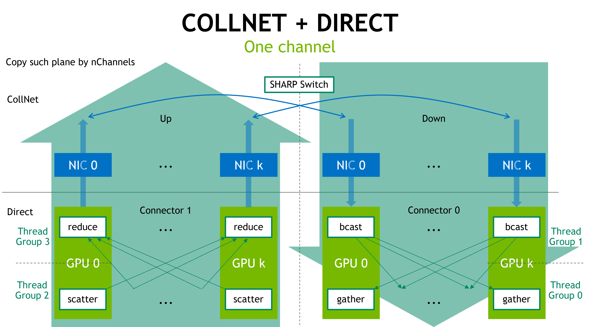
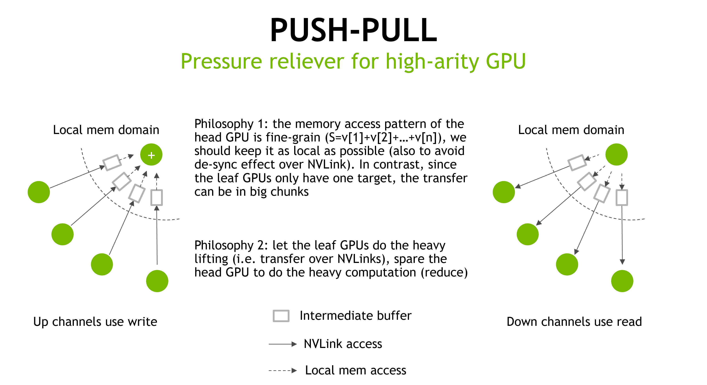

# Oneshot algorithm

<h2>Requirements</h2>

### Project Context and Purpose

NCCL provides fast inter-GPU communication for parallel applications.

### NVbugs / Jira Tickets

[Jira NCCL-989](https://jirasw.nvidia.com/browse/NCCL-989)

### User Experience

NCCL is used through deep learning frameworks or other HPC applications
to accelerate GPU-to-GPU communication. It is supposed to be transparent
to the user.

### Assumptions, constraints and dependencies

Up to 8 GPUs per node.

### Use Cases

When users use network switches capable of reduction operations, NCCL
will invoke the CollNet algorithm. The oneshot implementation, as
compared to the previous chain implementation, will improve the
performance of CollNet for medium message sizes (roughly 1MiB to
100MiB), which match well with current DL training message profile.

### Functional Requirements

None/\$TBD -- new functionalities

### System Requirements

All-to-all intra-node GPU connectivity (such as NVSwitch) preferred,
i.e. DGX-A100 or similar, connected by SHARP switches

### Interface Requirements

None

### KPI Requirements

Improved AllReduce performance for DL relevant sizes

### Platform Requirements

N/A

### Security Requirements

NCCL is a user library and benefits from the user-mode security.

### Legal and Standards Requirements

N/A

### Telemetry Requirements

N/A

### Backward Compatibility Requirements

Changes do not need to be backward compatible.

### Virtualization Requirements

N/A

### Signoff list

Author : Ke Wen

<h2>Design</h2>

### Proposed Design

Each GPU close to the NIC will become a reduce agent. All other GPUs
within the node will send their data to the reducing agent, after the
reduction, the reducing agent will send the data to the network. Vice
versa, in the down direction, the reducing agent acts as a broadcast
agent: it receives the already-reduced data from the network, broadcasts
it to all other peers within the node, and all other peers will gather
the data from the broadcast agent.

When there are multiple NICs on the system, and hence multiple head GPUs
acting as a reducing/broadcast agent, each head GPU takes care of a
shard of the data.

On such multi-head systems, some GPU may need to simultaneously act as a
scatterer, a reducer, a broadcaster and a gatherer, to ensure credit
flows. Thus, the thread block needs to be split into four parts, each
part corresponding to one of these roles. The thread splitting ratio
depends on the workload of each role, with the reducing role being the
heaviest one. In a thread block of 640 threads, each of scatter, gather
and broadcast is assigned 96 threads, all the remaining threads, less
the sync warps, go to reduce.

In such an arrangement, a channel no longer corresponds to a single NIC
as in the chain configuration, but multiple NICs at the same time. This
avoids inter-channel synchronization.

To leverage the block-level parallelism, we need to create multiple such
channels, where each channel is identical. This raises a new requirement
on the proxy side, where each proxy corresponds to a NIC, and we now
need to aggregate the channels at the proxy. This is achieved by
allocating a shared buffer at the proxy side, and each channel writes to
the shared buffer at a corresponding offset. The offset pointer needs to
be passed from the proxy back to the CUDA kernel. At last, the proxy
sends out the aggregated message when all channels flip their flags.

To balance the workload among different thread groups, we also introduce
a push-pull mechanism. The goal is to let the "multi" side do the remote
transfer in the multi-to-one or one-to-multi flow pattern. Thus, the
scatterer would push data to the reducer, and the gatherer would pull
data from the broadcaster. This way, the reducer and the broadcaster,
which have high-arity, only need to access local buffers.

### Interface Architecture

Connection have a new ptrsFifo field which CUDA kernels may use in
send/receive operations.

### System KPIs & Metrics

### Data Architecture

N/A

### Security Design

N/A

### Debugging & Troubleshooting

None.

### Logging and Instrumentation

None.

### Operational Considerations

None.

### Signoff list

Author : Ke Wen

<h2>Coding</h2>

Merge request !14 "Oneshot" on GitLab

<h2>Testing</h2>

### Objectives and Timeline

#### Code Coverage Goal Defined

None.

#### KPI Coverage Goals Defined (performance, stress, stability, throughput, latency)

No change.

#### Requirement Coverage Goal Defined

No change.

#### Quality Thresholds Defined

No error.

#### Test Timeline

Part of NCCL multi-node testing for MLPerf 1.0

#### SW Verification and Test Plan

Part of NCCL multi-node testing for MLPerf 1.0

### Test plan

NCCL multi-node test plan for MLPerf 1.0

#### Requirements Tests

None.

#### Interface Tests

None.

#### Fault-injection Tests

None.

#### Resource Usage Tests

None.

#### Design Coverage Testing

None.

#### Boundary Tests

None.

#### Certification Tests

None.

#### Stress Tests

None.

#### Stability Tests

None.

#### Perf and Power KPI Tests

None.

#### Usability & OOBE Tests

None.

#### Manufacturing Diagnostic(Factory) Tests

None.

### Signoff list

Author : Ke Wen

