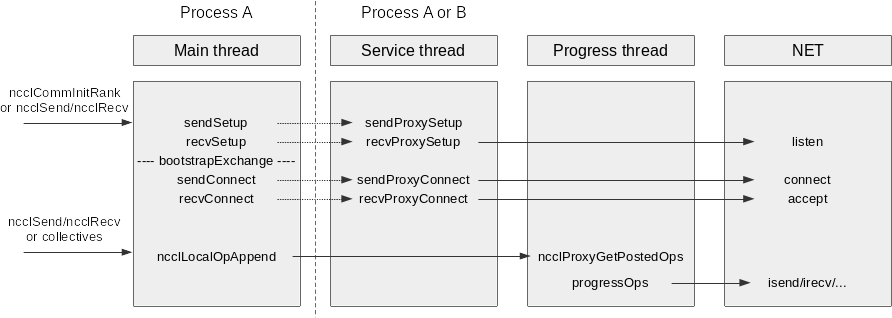
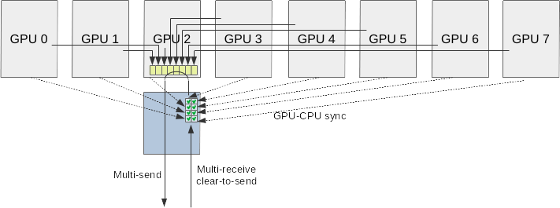
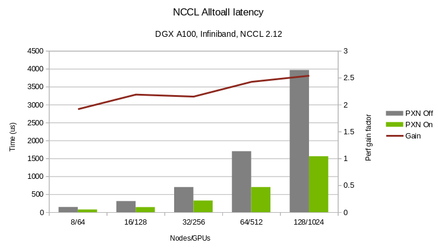

# One hop nvlink network communication (PXN)

<h2>Requirements</h2>

### Project Context and Purpose

NCCL provides fast inter-GPU communication for parallel applications.

### NVbugs / Jira Tickets

[Jira NCCL-1072](https://jirasw.nvidia.com/browse/NCCL-1072)

### User Experience

NCCL is used through deep learning frameworks or other HPC applications
to accelerate GPU-to-GPU communication. It is supposed to be transparent
to the user.

### Assumptions, constraints and dependencies

None.

### Use Cases

#### Rail-local alltoall

When performing an alltoall operation, every GPU uses its local NIC.
Therefore, only 1/8th of the traffic will be local to the network rail,
and 7/8th will have to go to higher levels of the network fabric. That
causes more network contention, and although adaptive routing aleviates
that problem, not all customers use Infiniband network.

Besides the potential performance improvement, using NVLink to switch to
the right network rail and keep traffic as local as possible would also
decrease load on the fabric and improve performance of other
applications.

#### Hopper 1:1 NIC:GPU ratio

Some platforms, including future hopper-based systems will feature a 1:1
NIC:GPU ratio. This is a problem for ring algorithms when running on
multiple GPUs per node, since each ring needs to enter the node into one
GPU and exit the node from another GPU. Both GPUs need to have optimized
access to the same NIC to guarantee optimal performance and use the same
NIC for both ingress and egress traffic for a given ring, to avoid
crossing rails and keep ring traffic local to rails.

Using NVLink to copy data from the last GPU to the first one as the last
hop would close the loop and only require one GPU to be local to a given
NIC, easing constraints on NIC topologies.

#### Depopulated topologies

Some systems do not want to pay the price of one NIC per GPU. To
guarantee each GPU has direct access to a NIC, such system would need
large PCI switches which would connect 1 NIC to e.g. 4 GPUs. Given those
systems are tight on cost, that is usually not the desire.

To build systems with only say 2 GPUs with a NIC each and no PCI switch,
we would need to be able to leverage NVLink to copy data to GPUs which
are close to NICs.

This requires both sender side and receiver side to be able to use
NVLink as extra hop for network communication. Only the sender side will
be addressed in this feature, but it is a first step to achieve this
capability.

### Functional Requirements

GPUs should be able to send data to a remote NIC using NVLink-accessible
memory from another GPU.

### System Requirements

Alltoall needs to perform at a bandwidth similar or better than when we
allow for crossing NICs, provided the NVLink bandwidth is sufficient to
handle all flows. It should be the case on DGX systems with NVSwitch.

### Interface Requirements

No change.

### KPI Requirements

Alltoall latency should be significantly reduced on Infiniband, at least
2x.

Alltoall bandwidth must be SOL.

### Platform Requirements

N/A

### Security Requirements

NCCL is a user library and benefits from the user-mode security.

### Legal and Standards Requirements

N/A

### Telemetry Requirements

N/A

### Backward Compatibility Requirements

Changes do not need to be backward compatible.

### Virtualization Requirements

N/A

### Signoff list

Author : Sylvain Jeaugey

<h2>Design</h2>

### Proposed Design

#### Overview

We allow for any rank to use a network proxy from another rank in the
communicator, for memory allocation (NVB), but also for network
connection establishment and inter-node communication.

As a consequence, the network connection establishment code is split in
two parts:

- the GPU side manages all mapping of memory to the GPU setting up
  pointers for the GPU, ...
- the CPU proxy side is handling network connection, memory allocation
  and associated memory setup for the NIC.

To allow any process managing a GPU to use a proxy from another process
to send (and in the future receive) data, the communication between
those two entities is made using:

- sockets, for most of the setup (TCP/IP, although we could use file
  sockets)
- CUDA IPCs, shared memory, or shared pointers for memory allocation and
  mapping between one GPU rank and another GPU's proxy.
- shared memory for proxy operation queue management, since it is in the
  critical path.

#### Architecture

The remote memory allocation thread is extended into a full service
thread, responding to any local rank's request, including creating the
whole infrastructure to send from its local GPU. Connect and accept
functions are split in two halves: sendSetup/sendConnect and
recvSetup/recvConnect remain on the GPU side, but are almost empty,
simply asking the service thread to create all connections and allocate
memory, then simply map those memory regions and set the GPU pointers
accordingly. New functions, sendProxySetup/sendProxyConnect and
recvProxySetup/recvProxyConnect do most of the work, allocating memory,
creating connections, and registering memory on the NIC. They then
produce a memory map containing all information to map memory regions
either on the same process or on a remote process, which is returned to
the main thread for mapping.

The service thread also spawns the progress thread and allocates a
shared memory for the fast communication between the main thread and the
progress thread. Once initialization is done, the service thread no
longer does anything, except at the end for tear-down and clean up.

The drawing above describes the split between main thread managing a
GPU, the service thread managing a NIC and a local GPU for intermediate
memory and the progress thread performing the actual communication with
the NIC and GPU.

For receive operations, all threads will be in the same process. For
send operations the main thread can be on a different process or
managing a different rank than the two others.

#### Topology choice

The choice to use a remote NIC through NVLink is done in two places.
During path computation, we compute as a second step cases which would
benefit from accessing remote NICs through NVLink and mark their paths
as PXN. That means when searching for rings and trees, that path will be
available to easily close rings which don't have 2 local GPUs.

For point-to-point operations, when connecting to a remote rank, and if
PXN_P2P_LEVEL is set to more than 0, instead of using the local NIC, we
will lookup which NIC the remote rank defined as its "preferred" NIC.
We'll then see whether we can use that NIC directly or through PXN. If
PXN_P2P_LEVEL=1, we'll access that NIC directly if possible, but if
PXN_P2P_LEVEL=2 then we'll find which local rank on the node defined
that NIC as its preferred one, so that all ranks go through the same
intermediate hop, and we can maximize aggregation for better latency.

#### Network aggregation and latency reduction

Now that all ranks have the ability to send data through a remote GPU
and network proxy, we can push all data to a given destination through a
single rank per node. That means each rank will receive all messages
from the node to a destination on the same rail. Instead of creating one
connection between each source rank and each destination, and because
all connections are now created between the same rank pair, we fuse all
connections into one. Then instead of sending 8 messages independently,
we wait for all messages to arrive then send all 8 messages as a single
multi-send operation. In terms of NET plugin API, it actually takes the
form of a multi-receive and independent sends.

The sender cannot know who on the node will send to that destination.
But the receiver does know from which rank it will receive from. Given
our IB protocol is receiver based (i.e. the receiver has to send a
"clear-to-send" message to the sender before the sender can send
anything), instead of sending a single "clear-to-send" message to the
sender, the receiver now sends a multi-clear-to-send, providing up to 8
ranks it wishes to receive from, with corresponding buffers and sizes.

When all isend operations corresponding to the multi-receive have been
initiated, the sender triggers a multi-send, pushing all messages as
one. 

### Interface Architecture

The new network API is modified to add multi-receive capability,
including tags. This API change is described in details in the net
plugin documentation.

User interface is unchanged. New environment variables are added:
NCCL_PXN_DISABLE and NCCL_PXN_P2P_LEVEL. NCCL_CROSS_NIC may also affect
PXN choices so that an alltoall operation avoids (or not) to cross NIC
rails.

### System KPIs & Metrics

Alltoall latency on 8 to 128 nodes is decreased by 1.9 to 2.5x.

### Data Architecture

N/A

### Security Design

N/A

### Debugging & Troubleshooting

None.

### Logging and Instrumentation

None.

### Operational Considerations

None.

### Signoff list

<h2>Coding</h2>

- nccl@922a3db687111ddf78bd2d781c2e8801b29fbd01
- nccl@30793a6f2a32f419629f1907171813fdddd65c3f
- nccl@4688e714339d651ce3542058b367af8f3bfd41e7
- nccl@bdfbd8849fa9dedd1b96e6c8b05c20ffc5bdd82c
- nccl@cc11747ce3380c97310939e99d46085b76afa232
- nccl@929fb1d76043748ab163f54b7650692f2cd21020
- nccl@47bcc01199c6136c0cf50a44a77d66d3bdf4c030
- nccl@c9df933b8437250c96f8a9de71f704f273d06236
- nccl@262253c234b114ef7208d6683e680fcc84792a7a
- nccl@d8660bbe4c239750ec0a68b20daf578e1d134343
- nccl@870fb88eb9a0a646868c29b993d28f64a372715e
- nccl@258536f652e517fee17b9c9fc62ca5dbdb357d4b
- nccl@e289cc6cc5a3277a99c82ac8713e4e7dec94186b
- nccl@32d52f4147f5d692a8318336c36b6f3f4871b74f
- nccl@ab91cf3541534078eaece6d4365cce78ca879f22
- nccl@8c071e69084b13c5f3e99d9558ed26f75cc4183e
- nccl@53297417c80408f10f66bf2f8c814f8db13d589d
- nccl@db9c75ab8c7b4044c5513dbd8cce87a7901237b7
- nccl@4fe86f7dd879db5101e1d73faa39b5983158e67c
- nccl@1e654a8f9310696e686a8919882ff61b931c2ab8
- nccl@2464031464781ba7295871ce583c115fc87f2da7
- nccl@9b533ae3cb66742485f41ae791e2174fbc358d41
- nccl@4247a39b91db6e34b46ee44bcca5f8730fc4a674
- nccl@097ecd27a84c138711e567fc381344ffc014fe39
- nccl@feaca8a4103a58090a902cd668c9bd67b5d0106f
- nccl@179f853a73e07d7c35c35bb0b4428ab5b45a518f
- nccl@139d7e403488b5eee3e94234f647cab34fdc3ffa
- nccl@084c756a4e0e0b339b1ce9aae1a20c63b624e33a
- nccl@5e9e184926786b2e7375b0409093fd76285ed21e
- nccl@9c6837089b3a5ed27e1f174b7c068c6cfbd6197e
- nccl@e2b0b5dabeb09453a105b33816429438f6f8edb5
- nccl@0da0aa7f43d38cea746428fdbfb1ffe66e5d65e7
- nccl@637354ddc367077a188ae38d9db98c795d882699
- nccl@7586f9148ca66dbf093aa6754032bb9c78552eaa
- nccl@698ee902ce2a96ff6b7ff47eaad5f5727b0f1393
- nccl@ad4759e7794842e501f5ac00bbca6ee0e353d38a
- nccl@0cb6501855c5c5181728361060e6f35f0a0900fb
- nccl@b70fab01922dd8cbb64a763af42a283df6096fe2
- nccl@9f76295ea4ba4af5f57becd002b1a34378191477
- nccl@ea17255b7495dcbfed02bb671efaaa64c0785318
- nccl@d5f2ae94efd36eb3397274f7bec0eb34939a0353
- nccl@d07871eeb00243cec2a80951a4669a7e8559be68
- nccl@66234d7fc5c50244eea9eeabee3e12c09e7fd7b4
- nccl@67c9cb8bc88a1209e7b4ff0f994ee2b30dec60e2
- nccl@c06b9aa276e94cbc4c1ce1e6b04e82138a8e14dd
- nccl@dc988ffd879442dbe6acea199216792c4ba445e8
- nccl@bffea12dd3199b40fca44bf3506f88b374526192
- nccl@64025967b8ce703b60fd8ce9e11272ea77169d7a
- nccl@3e59a07cfce7e29fbf0deac995dbc002293246c5
- nccl@b5ba9618bcc07b3902dbc2e8b484f53403fa2f04
- nccl@839a2ae825545715d4882414f518be50ac5b8a51
- nccl@8652c79b2b7b736f66bb873f63930394b3a09cfc
- nccl@935b0179f6abde4ead19ed6e630a9042220ecbfd
- nccl@9efadf9b2213273cfef45bd4f519f203766d930c
- nccl@060f5d9b6d1f041ceab7fd77f3941eb127eb5a6b
- nccl@bef26aa054da8479fca0b539d17a1d616956a19e
- nccl@e42e5c4ebe36e170b3cb486c9bd1422ead46f91d
- nccl@4d2987e79f89ee4fec13a6b02531475ba304ca8c
- nccl@1a284e6069d53be544c960e6b83d216481a93180
- nccl@aeba25a23636d8c61c575e0dd8ff5c643e0e9a43
- nccl@582d01f975874dcc71fefbc998a8c036e8dc3e34
- nccl@4e47e51282448e7b9e860a330bedef386a11446f
- nccl@896cbe2b56693895aee53c7697cb2e70d397c5ac
- nccl@6367fd76d9d231473bab740d5f1b1c7056354caa
- nccl@e2544aadbbf4cddebabb6fec65538efffcd9f128
- nccl@70e76858a75708078db06e6fe3b4e49f5e6cd9f0
- nccl@4b089fbf1c1950cf0fc65617da86c2fbca298203
- nccl@f700c6e3a0e8503c084927ecced0e40a7eaa01fb
- nccl@ac7e56a934d115b380889fadc89b99b73f934685
- nccl@324bbfe33c463f23ed96d63fa5ffdc1968cb8107
- nccl@5d92c468f382cae81b3332079ea0f7004d9e6232
- nccl@f865ab7af9dc127484804a1502d7d0fcfb024bc9
- nccl@7bc55415250b316c859bfd137efdd79b63683a86
- nccl@6292e4cdebd406775c0ee580233723a662b8eb2d
- nccl@1cc4b69ff89766a00d922fcca91c129152110fc8
- nccl@d72494d09237ff8fc5085a6d5a5dab3002ba670f
- nccl@f9da24327dfadd280f339f69e642ba4edb487df2
- nccl@0fbcb29272f5ec6f5c7a1a2f20239bf7227aff6b
- nccl@b4d978011873850c1f2ac5a82e298e295c630e09
- nccl@ed04e7bf50274c4085a78fec0c3f6d596b93cca9
- nccl@ed3fb778d2f1bf3b09f11704a55737b86bee6942
- nccl@c1e9cac878e8804983cc00ea941e7d8b282515f8
- nccl@b8bde9165c26352cea5ddb2af1a79d61f55b50ae
- nccl@ed2f08e38388c6a6fd9302844806fe932f8eea1b
- nccl@c58f70e808b4c3095bb0275edce4913a85c27282
- nccl@7a6340237e37ca9c9129965dd889f330b5993029
- nccl@db81c6ec40c43d152e6420ed89aa46596c4df937
- nccl@c9027719f53839db4404435c8d0e91f27ce8a7c9
- nccl@ae66f033f9ac8b6e6d25ac2a8d4d135b2388698c
- nccl@b431b1feac7f256f8e1fc70a9f0c69308447d46b
- nccl@b9ae5292e3c72c3a98e52bed79598b784e85c5f1
- nccl@cf04d6c6a7ccee75741eee86a234f5d71f67096c
- nccl@bded47640571b298b256b0cb995b733d7e432986
- nccl@f21552985f9ca2add010ea74c2c6abbe186f8027
- nccl@43215cad44f544d066ee4ad7692bdfe8be093aa3
- nccl@55a3544ea776ca70a889287d38fdc0dc94a667ec
- nccl@dced2af937c518399f855e0558fe04e010d327a8
- nccl@2ce907e83eb0ce254917324e41e371284d346b47
- nccl@ab9e285cb036785fa13d274e9c6583b9c749b91a
- nccl@b9d964aef082524e231501bfb8bc27bb662874e5
- nccl@c4dadfbd0089d8f988253381fe6003ca99fd6667
- nccl@cb68240a5e8e16248fc9f2577d3520c3becd0881
- nccl@be5c8e2bb3766fbb2d36f3614ca51e14ab2ab56f
- nccl@734c688b1d4f79f49f524a4f0daf3bd6d0c619f1
- nccl@5d3e5bd64365502c5f9be0a1829e1586b30fcf32
- nccl@223f8ef8468b6873d3748aea8434503794b2e94c
- nccl@cbc5b8c2d1fb1ffc4ddc4111ec03f1fe994c1815
- nccl@5634cff335602dd5ba1a112d0f88eecc872dc937
- nccl@887f7507b1f732a0bc5b1226bedd71de7ba06929
- nccl@ffe43aa9e3a208ca6b360fc15c3c8b2c8dcc97d7
- nccl@764f68dab77ec295dfb7066a19c45ba3d5e23a78
- nccl@7c6615e19722d73193e28b432aa7ca161eea24d3
- nccl@c356aee941d917646cc9f0c448f2e26805694147
- nccl@9cde247143090dfcb34066f384ae4bc9977d5c0d
- nccl@b6b49ac635d401ac8a8412aa2ea596b7ff422bf9
- nccl@c3ea94f0460b621530a914795433f3809a0d9a87
- nccl@485e727c2ed7e72d03ae8eaaa68f157382279b25
- nccl@b4437486d7418e661c7a8a871bc8c95dcdd22e44
- nccl@6ba13a4803f01869f90e0e8414d99bfd3036ce73
- nccl@e9c1f79dba7f5fa43f9fe01fd15162dd2c680f9c
- nccl@a7c0537fdb42aa968fc6b888bb4618d2e379c8fc
- nccl@1a9accee471c9a4aedc9d3bbd394deef2d2a3bfc
- nccl@07328afd0adc313350197b75f7d033e1d3288a38
- nccl@ec45c06d56b1a56a8a295a9159055efe05c47ae9
- nccl@2fe2e71ab96eea2ec2e5697fa0fd96ab9e47614a
- nccl@49ac05d15ed19e5694399c234dbe06d41e521713
- nccl@92055a4c7bda60caff7147c788d76ba6bc2fb364
- nccl@6ccf3c98e9e009f7dcb9533758e92d7ea28133e6
- nccl@59152f429340adb9203729132b6adbc281c99ffb
- nccl@93917b051774eac9e52b08670526eb62c92896c6
- nccl@e32122a6df3c3dbea84963b696a4cfb29da2481f

<h2>Testing</h2>

### Objectives and Timeline

#### Code Coverage Goal Defined

None.

#### KPI Coverage Goals Defined (performance, stress, stability, throughput, latency)

No change.

#### Requirement Coverage Goal Defined

None.

#### Quality Thresholds Defined

No error.

#### Test Timeline

Testing will be done during NCCL 2.12 QA cycle.

#### SW Verification and Test Plan

NCCL 2.12 test plan will cover testing for this feature.

### Test plan

#### Requirements Tests

NCCL perf tests will cover this feature, in particular alltoall and
allreduce tests.

#### Interface Tests

No new interface.

#### Fault-injection Tests

None.

#### Resource Usage Tests

None.

#### Design Coverage Testing

None.

#### Boundary Tests

None.

#### Certification Tests

None.

#### Stress Tests

None.

#### Stability Tests

None.

#### Perf and Power KPI Tests

None.

#### Usability & OOBE Tests

None.

#### Manufacturing Diagnostic(Factory) Tests

None.

### Signoff list

