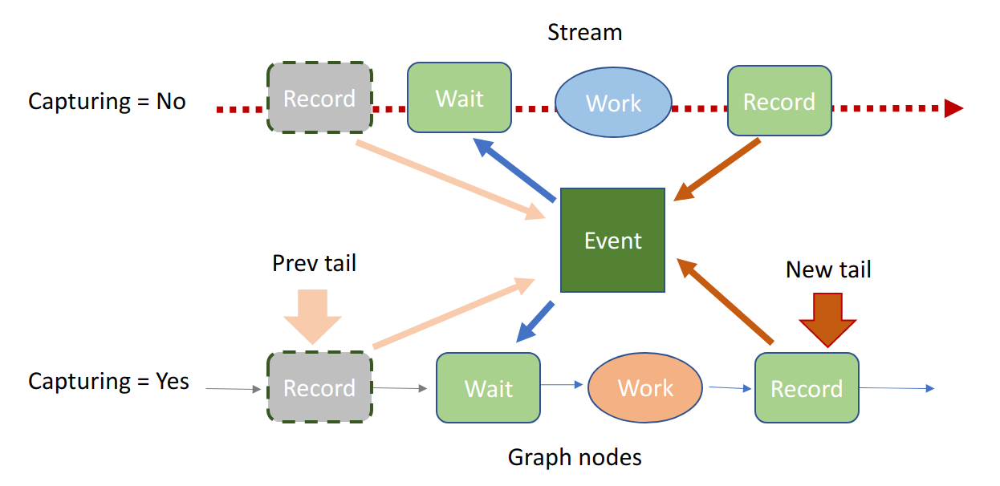

# Enqueue Refactor for CUDA Graphs

<h2>Requirements</h2>

### Project Context and Purpose

The launch system needed a rewrite to support CUDA graphs in the
following ways:

- Bugfix: support mixing of outstanding graph captured NCCL ops with
  uncaptured ops.
- Bugfix: support mixing of outstanding graph captured ops of multiple
  graphs on multiple streams.
- Perf boost: Allocating persistent device memory associated with a
  graph to hold ncclWork structs so that the work need not be uploaded
  through the host memory fifo each time.
- Perf boost: Eliminate the host callback graph nodes when possible.

### NVbugs / Jira Tickets

[NVbug 3609057 : \[NCCL\]\[PyTorch\] all_gather hangs when CUDA Graphs
is used together with eager execution](https://nvbugs/3609057)

### User Experience

None.

### Assumptions, constraints and dependencies

### Use Cases

### Functional Requirements

None

### System Requirements

None

### Interface Requirements

No new API

### KPI Requirements

Intra-node CUDA graph performance better or equal to intra-node without
graph.

### Platform Requirements

N/A

### Security Requirements

NCCL is a user library and benefits from the user-mode security.

### Legal and Standards Requirements

N/A

### Telemetry Requirements

N/A

### Backward Compatibility Requirements

Changes do not need to be backward compatible.

### Virtualization Requirements

N/A

### Signoff list

<h2>Design</h2>

### Proposed Design

The launch system needed a rewrite to support CUDA graphs in the
following ways:

- Bugfix: support mixing of outstanding graph captured NCCL ops with
  uncaptured ops. The previous implementation had bad race condition
  when an uncaptured launch followed a captured launch, the two would
  race to get into the ncclWork fifo.
- Bugfix: support mixing of outstanding graph captured ops of multiple
  graphs on multiple streams. The old implementation only serialized the
  host node callbacks within the scope of a single graph and lacked
  ordering between graphs, thus multiple NCCL kernels could be executing
  in parallel racing to the same resources.
- Perf boost: Allocating persistent device memory associated with a
  graph to hold ncclWork structs so that the work need not be uploaded
  through the host memory fifo each time.
- Perf boost: Eliminate the host callback graph nodes when possible.
  Since uploading ncclWork has been optimized away by the previous item,
  the only remaining job for the callback is to upload proxy ops. Thus
  NCCL ops which require no use of the proxy threads (network) will not
  require host node callbacks at all.

Other enhancements:

- Lift the "2048 maximum ops per comm within a ncclGroup()" constraint
  by storing ops in dynamically growing linked lists.
- Lift the "one stream per comm within a ncclGroup()" constraint by
  remembering the set of all streams submitted during the group.

Things that needed a redesign to support this effort:

1.  ncclWork FIFO
2.  Internal CUDA streams
3.  Dynamic memory management
4.  Kernel planning/launching

#### ncclWork FIFO

Since ncclWork's could be in either the fifo (uncaptured) or persistent
graph memory (captured), the kernel code needed to be able to know how
to locate the next ncclWork in either case. Emphasis was given to
finding a way that was flexible enough to handle both cases without
requiring separate code paths during traversal kernel-side. The approach
settled on was to make ncclWork's reside in a linked list where each
ncclWork would have an integral "next" field encoded as an offset
(positive or negative) from the "head" ncclWork pointer kernel argument.
The head element for each channel would be located at "head +
blockIdx.x"

With the "head" ncclWork pointer kernel argument being used in both
formulas for the head and next values for each channel's linked list, it
was necessary that all channel's ncclWork's be allocated in the same
array. Thus the per-channel FIFO allocations have been fused into one
allocation shared by all channels. Graph captured ops similarly have all
works residing in a single array allocated per launched kernel.

The fifo reclamation policy uses a monotonically increasing 32-bit
unsigned credit counter per channel. When a channel has finished
executing a kernel, it writes back a credit value that was prescribed to
it from the CPU (supplied in the final ncclWork) to a per-channel
counter slot. Each credit value X encodes the fact that all ncclWork
FIFO indices less than X which were destined to that channel have been
consumed. When the CPU needs to look for free space in the FIFO array,
it scans all of the per-channel credit return slots and reduces them
together via min(X...) to learn that all indices less than min(X...) are
free. Credit counters being both 32-bit unsigned and monotonic seems at
odds due to wraparound. This is handled using special less-than
comparison logic that assumes no two credit values could have a
difference requiring more than 31 bits to encode (for example,
less_than(0xffffffff, 0) would return true). Since the fifo array size
is a power of 2 which is significantly smaller than pow(2,31) this
becomes easy to enforce.

#### Internal CUDA Streams

NCCL requires our device-side communication FIFOs be used in mutually
exclusive manner and in a deterministic order agreed on by all ranks.
The use of an internal CUDA stream serves both needs. CUDA graph
capturing semantics work such that the stream at capture time has no
relation to that stream when capturing is off. A captured stream is
therefore merely a lane of parallelism in the graph being constructed.
Thus we need some mechanism to ensure NCCL kernels launched within a
graph order themselves into our internal stream. While CUDA graphs have
no facility to submit to an external stream, they do have special node
types for waiting on and recording to external CUDA events. This gives
us barely enough to recreate our desired exclusivity and deterministic
ordering in a way that works with both uncaptured and captured work from
possibly many graphs all outstanding together. To achieve this the
communicator stores an internal CUDA event which becomes an immediate
dependency of every kernel launched and is subsequently recorded over to
reflect that kernel's completion, thus ordering the kernel launches
exactly like a regular stream. The infrastructure to launch work against
this stream-like event either captured or uncaptured has been
implemented as a new abstraction called the strong stream
(ncclStrongStream).

Simply replacing our internal CUDA stream with a strong stream still
wouldn't be enough to correctly handle the case where a captured launch
(via cudaGraphLaunch) would immediately be followed by an uncaptured
launch. This is because the captured launch would do its proxy op
submission in a host execution node, which CUDA executes on some hidden
thread, while the uncaptured launch would begin the proxy op submission
immediately on the user thread, leading to a non-deterministic proxy op
submission order. The simplest way to fix this is to always do proxy op
submission, whether it be captured or not, from a second host-only
internal strong stream. Thus an uncaptured op no longer submits proxy
ops directly during launch, but launches a callback that does this on
the new stream. We follow this structure in the implementation, but add
the optimization that enqueuing to the host stream is only required if
any graphs capturing this communicator are currently alive, so that in
the case when there are none we can use the more expedient practice of
proxy submission directly from the user thread.

#### Dynamic Memory Management

To be more accommodating of unbounded amounts of work being submitted
within a ncclGroup, we have moved to linked lists in several places. To
ensure our linked lists grow with minimal CPU overhead, we allocate
memory from a new datastructure called the ncclMemoryStack. Objects
allocated from the stack are grouped into frames, where a new empty
frame can be pushed to the top, objects are allocated from the top
frame, and the top frame can be popped which deallocates all of its
objects in one shot. Object allocation is extremely fast since it
typically only incurs bumping a pointer forward, and object deallocation
is even faster since there is just a pointer bump backwards for the
entire frame.

Frames map very well to ncclGroup's: at ncclGroupStart we push a new
frame, then all ops enqueued during that group allocate from this frame,
and after all launches have been completed in ncclGruopEnd we pop the
frame to reclaim the memory quickly.

Object which do not fit a LIFO lifetime order pull from a ncclMemoryPool
which manages a simple linked list of free objects of all the same size.
If the free list is empty, new objects are allocated by a backing
ncclMemoryStack. This stack cannot be the same that services the LIFO
objects as needed in ncclGroup, so each communicator keeps two
ncclMemoryStack's: one which only has one frame which is never popped
(thus objects are allocated permanently) which is the one the free lists
are backed by, and a "scoped" memory stack used for LIFO objects.

#### Kernel Planning/Launching

All user submitted ops during a ncclGroup are aggregated into a per
communicator ncclTasks structure. This struct just tries to collect the
ops in a memory compact way, no interesting planning is done until
ncclGroupEnd where the tasks are interested and scheduled within
ncclKernelPlan's (each ncclKernelPlan having all data needed to launch
one kernel). ncclKernelPlan creates an aesthetic separation between
persistent communicator state (like credit trackers, etc) which remain
in ncclComm, from transient state needed only to schedule the ops within
a kernel. Conveniently, it is also the structure we persist with a CUDA
graph so that each time the graph is launched only this is consulted on
the host side (for proxy op submission).

To accommodate an unbounded number of ops per ncclGroup, we batch ops
together into multiple kernels where each kernel tries to occupy at most
half of all available slots in the ncclWork FIFO. Batching to separate
kernels is required because the total size of the FIFO places a hard
bound on how much work a single kernel can hold. This is due to the
requirement that all work in the FIFO must be present before the kernel
can run. We use a soft bound of half FIFO capacity per kernel to permit
overlap between device and host. Thus when translating the tasks of
ncclTasks to launchable kernels, we build a linked list of
ncclKernelPlan's in the communicator.

Launching the kernels requires special attention to ensure forward
progress by CUDA (despite CUDA still not giving us any forward progress
guarantees, sigh). For all communicators owned by this thread, first we
collect the communicators into cliques according to which "global"
communicator they belong to (for when a device belongs to multiple
communicators). The cliques are locally ordered according to the order
their first op was inserted into the ncclGroup. This ensures the user's
program order dictates the order we process multi-communicator devices.
We iterate the cliques in the top loop, where for each communicator in
the clique we pull and launch only its head kernel plan before moving to
the next in-clique communicator. We repeat this until all plans in all
comms in this clique have been launched, then progress to the next
clique.

### Interface Architecture

### System KPIs & Metrics

### Data Architecture

N/A

### Security Design

N/A

### Debugging & Troubleshooting

None.

### Logging and Instrumentation

None.

### Operational Considerations

None.

### Signoff list

<h2>Coding</h2>

<h2>Testing</h2>

### Objectives and Timeline

#### Code Coverage Goal Defined

None.

#### KPI Coverage Goals Defined (performance, stress, stability, throughput, latency)

No change.

#### Requirement Coverage Goal Defined

TBD.

#### Quality Thresholds Defined

No error.

#### Test Timeline

#### SW Verification and Test Plan

### Test plan

#### Requirements Tests

New apitest cases to stress:

- Multiple graphs launches on multiple streams.
- Graph launched work followed by uncaptured work.

#### Interface Tests

None.

#### Fault-injection Tests

None.

#### Resource Usage Tests

None.

#### Design Coverage Testing

None.

#### Boundary Tests

None.

#### Certification Tests

None.

#### Stress Tests

None.

#### Stability Tests

None.

#### Perf and Power KPI Tests

None.

#### Usability & OOBE Tests

None.

#### Manufacturing Diagnostic(Factory) Tests

None.

### Signoff list

