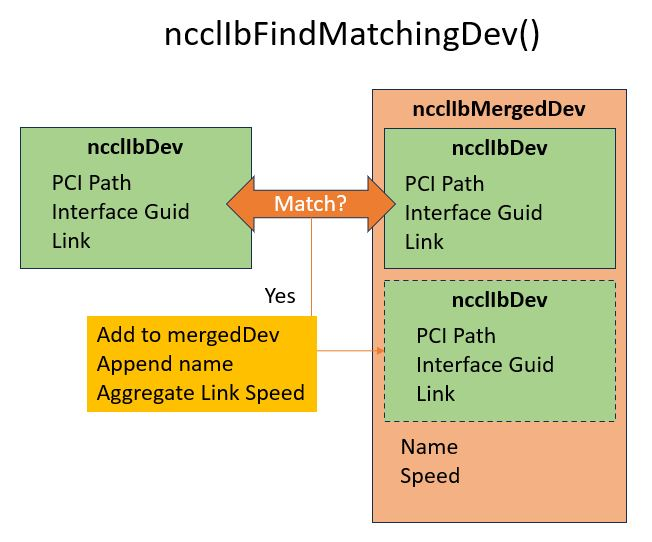
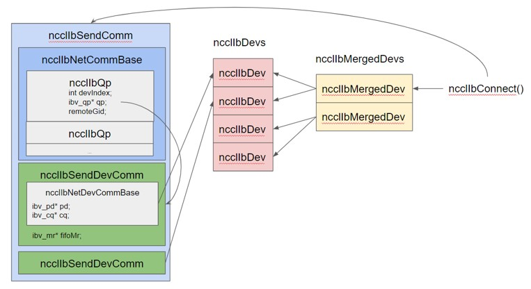

# InfiniBand Port Fusion

<h2>Requirements</h2>

### Project Context and Purpose

NCCL provides fast inter-GPU communication for parallel applications.

### NVbugs / Jira Tickets

[NVBug 12345](http://nvbugs.nvidia.com/12345)

[Jira NCCL-12345](https://jirasw.nvidia.com/browse/NCCL-12345)

### User Experience

NCCL is used through deep learning frameworks or other HPC applications
to accelerate GPU-to-GPU communication. It is supposed to be transparent
to the user.

### Assumptions, constraints and dependencies

None/\$TBD

### Use Cases

\$TBD

### Functional Requirements

None/\$TBD -- new functionalities

### System Requirements

None/\$TBD -- perf, scalability

### Interface Requirements

None/\$TBD -- specific API

### KPI Requirements

None/\$TBD -- perf

### Platform Requirements

N/A

### Security Requirements

NCCL is a user library and benefits from the user-mode security.

### Legal and Standards Requirements

N/A

### Telemetry Requirements

N/A

### Backward Compatibility Requirements

Changes do not need to be backward compatible.

### Virtualization Requirements

N/A

### Signoff list

<h2>Design</h2>

### Problem Statement

Dual port CX-6 RoCE NICs, which are physically a single 200 Gbs device,
present themselves to the PCI bus, OS, and Infinband Verbs library as
two distinct 100 Gbps devices. NCCL struggles to cleanly drive the full
bandwidth of two NICs per-GPU with its current graph search.

### Solution

Port Fusion, or Port Merging. We have implemented the ability for the IB
network plugin to "merge" two matching NICs into a single logical NIC,
which aggregates the bandwidth of both. This causes NCCL to properly use
all NICs and scale channels better as well.

### Proposed Design

The key differences in design from before are as follows:

1.  NCCL must match and merge dual port devices together.
2.  Each port of a dual-port NIC exposes and must be driven from a
    distinct ibv_context.
3.  Both devices can be involved in a single send/recv operation.

#### Matching devices

 NCCL must match
and merge dual port devices together. We have a simple O(N^2) search of
all enumerated IB devices on a system, and which match the specified
criteria to be considered one merged device.

        // Compare ncclIbDev[dev] to all stored mergedIbDevs
        int ncclIbFindMatchingDev(int dev) {
          for (int i = 0; i < ncclNMergedIbDevs; i++) {
            int compareDev = ncclIbMergedDevs[i].devs[0];
            if (strcmp(ncclIbDevs[dev].pciPath, ncclIbDevs[compareDev].pciPath) == 0 &&
              (ncclIbDevs[dev].guid == ncclIbDevs[compareDev].guid) &&
              (ncclIbDevs[dev].link == ncclIbDevs[compareDev].link)) {
              return i;
            }
          }

          // No match found
          return ncclNMergedIbDevs;
        }

#### Decomposing ibv_context's from netComm

 Each port of a
dual-port NIC exposes and must be driven from a distinct ibv_context.
This is a big difference from the prior design, which equated one
ibv_context and all its associated resources with a single netComm. Now,
there is a wrapper around physical device structs which live under one
merged netComm object. QPs must know which device they reside on, as
well as which remote device they are connected to.

##### ncclIbQp

Small wrapper around an ibv_qp\*, with a deviceIndex (pointing to a
local devComm index on this netComm) and remoteGidInfo, as each QP could
be connected to a different remote GID.

    struct ncclIbQp {
      struct ibv_qp* qp;
      int devIndex;
      int remDevIndex;
    };

##### ncclIbNetCommBase

Base information needed for both ncclIbSendComm and ncclIbRecvComm
objects, namely a list of QPs, tcp socket, ready flag, and number of
devices / qps. isSend is a new field necessary - before any function
which took either a sendComm or recvComm could rely on the fact that the
commBase had all the information it would need. Now these functions need
to index into each devComm, thus the need to conditionally cast to the
correct type of netComm.

    struct alignas(32) ncclIbNetCommBase {
        int ndevs;
        bool isSend;
        struct ncclIbRequest reqs[MAX_REQUESTS];
        struct ncclIbQp qps[NCCL_IB_MAX_QPS];
        int nqps;
        int qpIndex;
        int devIndex;
        struct ncclSocket sock;
        int ready;
        // Track necessary remDevInfo here
        int nRemDevs;
        struct ncclIbDevInfo remDevs[NCCL_IB_MAX_DEVS_PER_NIC];
        };

##### ncclIbNetDevCommBase

Wrapper around needed info for operating a devComm. Contains per-dev
things like PD, CQ, gidInfo, and also ibDevN which lets us look up
properties from the global ncclIbDev

    struct ncclIbNetCommDevBase {
        int ibDevN;
        struct ibv_pd* pd;
        struct ibv_cq* cq;
        uint64_t pad[1];
        struct ncclIbGidInfo gidInfo;
        };

#### Handling multi-device sends and recvs

Memory Regions must be managed more carefully. A given rkey / lkey pair
can only be used from the ibv_context that was used to register it. This
can pose a problem when we want both NICs to send or receive from the
same address range. What we've done is, instead of passing around
ibv_mr\* back to NCCL, we return an memhandleWrapper struct which holds
all ibv_mr\* related to one address. Furthermore, IB RC qps (which NCCL
uses) can only reference an rkey registered by the same device. What we
needed to do was expand the CTS fifo entry to include two rkeys, and
have the responding (send-side) QP select the correct rkey given which
remove device it is connected to.

        // Wrapper to track an MR per-device, if needed
        struct ncclIbMrHandle {
        ibv_mr* mrs[NCCL_IB_MAX_DEVS_PER_NIC];
        };

Beyond this, a minimum of ndevs (2 in the merged device case) QPs are
used for every send and receive. Each IB flush operation is also spread
across both devices. Completion queues are polled in an alternating
fashion across devices.

### Interface Architecture

### System KPIs & Metrics

1\. Drive all 16 ports to the maximally achievable bandwidth 2. Ensure
stability and performance for non-merged cases

### Data Architecture

N/A

### Security Design

N/A

### Debugging & Troubleshooting

There is an assumption, for now, that both sides of a connection must be
merged devices. An attempt was made to be resilient and flexible to this
scenario, but it's not guarunteed to work. Therefore, if one port were
to go down on one node, it's not guarunteed the system will be stable.
This can be worked around by either selecting exactly the same set of
HCAs on both nodes (NCCL_IB_HCA) or turning off port-merging
(NCCL_IB_MERGE_NICS=0)

### Logging and Instrumentation

N/A

### Operational Considerations

None.

### Signoff list

<h2>Coding</h2>

<h2>Testing</h2>

### Objectives and Timeline

#### Code Coverage Goal Defined

None.

#### KPI Coverage Goals Defined (performance, stress, stability, throughput, latency)

No change.

#### Requirement Coverage Goal Defined

TBD.

#### Quality Thresholds Defined

No error.

#### Test Timeline

#### SW Verification and Test Plan

### Test plan

#### Requirements Tests

TBD

#### Interface Tests

TBD

#### Fault-injection Tests

None.

#### Resource Usage Tests

None.

#### Design Coverage Testing

None.

#### Boundary Tests

None.

#### Certification Tests

None.

#### Stress Tests

None.

#### Stability Tests

None.

#### Perf and Power KPI Tests

None.

#### Usability & OOBE Tests

None.

#### Manufacturing Diagnostic(Factory) Tests

None.

### Signoff list

