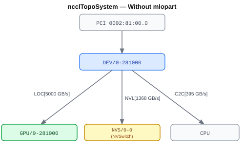
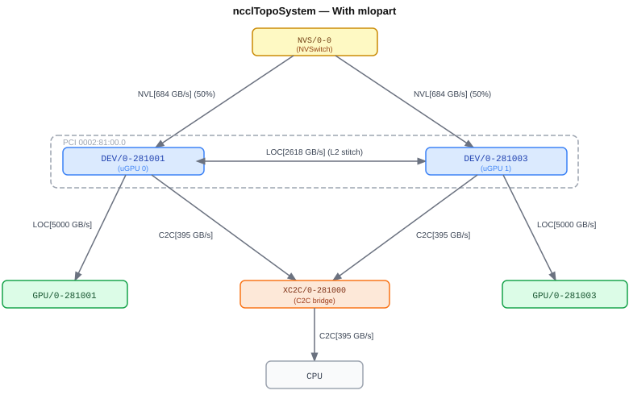

# VR Support for MPS with MLOPart

## Abstract

Starting with Blackwell architecture, the GPU comes with two micro-GPUs (uGPU).
In Blackwell both uGPUs have access to the full NVLink and C2C bandwidth, and each accesses the other uGPU's HBM at the same bandwidth as its local HBM.

On Rubin (GR100) architecture however, the uGPU model comes with further limitations and the increasing importance of taking the localization into account.
Specifically, a uGPU has an HBM bw of 10TB/s but the L2 stitch between the two uGPUs is only 3.6TB/s. This makes the observed bw for non-localized memory and localized execution around 7.5TB/s
Further, both uGPUs have only access to 50% of the full NVLink bandwidth.

These two limitations (L2 stitch and NVLink perf) are the main reason application kernels will want to be localized (both memory and execution).
To localize memory and execution, the MPS server with mlopart is the easiest approach: it makes both uGPUs appear as two distinct GPUs and all resources associated to each of them is therefore localized.
This comes with no code changes and can be easily deployed in production.

Aside from the topology changes needed to be added to support MPS, the localization of memory comes with the added limitation that the C2C link is not able to handle localized memory.
Therefore, NCCL must allocate non-localized buffers when mlopart is enabled.
This can be done through `cuMemCreate` by adding the `gpuDirectRDMACapable` attribute (see [nvbug 5899355](https://nvbugs/5899355)).

### What is NOT in this PLC?

Not included in this work is NVLS support and
[Programmatic Localization (PL)](https://nvidia.atlassian.net/wiki/spaces/GCG/pages/3135233557/NCCL+support+for+uGPU+Programmatic+Localization+PL).

- NVLS support (sometimes called Hierarchical Multicast) will require modification of the kernels to do a local reduction
among uGPU0 and uGPU1 pairs before all uGPU0s do a NVLS reduction and all uGPU1s do an NVLS reduction (presumably both
reach the same numbers).
- Programmatic localization (CUDA locality domains APIs) seeks explicit placement onto uGPUs via allocations and SM usage; out of scope for this PLC except where noted for RDMA interop.

<!-- ============================================================================================-->
<details>
<summary><h2>Motivation and requirements</h2></summary>
<!-- ============================================================================================-->

### NVbugs / Jira Tickets

- [[RFE][GR100] Add NCCL Support for MPS-based Application Level uGPU Localization](https://nvbugs/4978966)

### User Experience

With Rubin, the L2 stitch only supports 3.6TB/s while the local HBM can be accessed at 10TB/s.
This gap is expected to increase with Rubin Ultra (GR150) with a bump to 20TB/s for the local HBM.

Users will therefore rely on localization to achieve the best performance.
MPS is the way to achieve localization without kernel change on the user side.

On precluster, the submission of a mlopart job is very simple with `--ntasks-per-node=8 --comment=mlopart`.
Once the mlopart server is spawned the user will see 8 GPUs per host.

### Assumptions, constraints, and dependencies

- Platform: VR is the primary target.
  Blackwell (e.g. GB200) also supports locality domains and will be supported, even though locality domains are not required for peak performance there.
- CUDA / driver: MLOPart requires CUDA 13.1 and a matching 590-series driver.
- CUDA Toolkit 13.4: Will adopt the official mlopart partition query when available; until then, mlopart is inferred from the device name string (see below).
- GPUDirect RDMA + MLOPart: Buffers passed to `regMr` as GPU memory must be allocated through `cuMemCreate` with `gpuDirectRDMACapable` (via `ncclCuMemAlloc` / `ncclMemAlloc`) when `GPU_DIRECT_RDMA_WITH_CUDA_VMM_SUPPORTED` is set.
  If the attribute is unavailable, NCCL will disable GDR.
- NVML is agnostic to MPS with mlopart. Only the `cuX` calls are aware of the MPS layer.

<!-- ### Use Cases -->

### Platform Requirements

- Vera-Rubin hardware and supported driver/CUDA combinations used for VR NCCL validation.
  Blackwell also to be fully supported.
- MLOPart enabled where tests require partitioned devices.

<!-- ### Functional Requirements -->
<!-- ### System Requirements -->
<!-- ### Interface Requirements -->
<!-- ### KPI Requirements -->
<!-- ### Security Requirements -->
<!-- ### Legal and Standards Requirements -->
<!-- ### Telemetry Requirements -->
<!-- ### Backward Compatibility Requirements -->
<!-- ### Virtualization Requirements -->

</details>

<!-- ============================================================================================-->
<details>
<summary><h2>Design</h2></summary>
<!-- ============================================================================================-->

### Detection of MPS with mlopart

When the MPS server is started with MLOPart, the name of each of the devices is suffixed with `MLOPart X` which indicates that the device is the local uGPU `X`.


```
Device Ordinal  PCI IDs        UUID                                      Name                              Attributes
N/A             0002:81.00.00  GPU-0febe11b-b4ad-5301-abfb-86f6c3c11e7f  NVIDIA Graphics Device            M
0               0002:81.00.00  GPU-75d55e49-c25b-5f4a-82d9-bc3e4e4b2eca  NVIDIA Graphics Device MLOPart 0  MD
1               0002:81.00.00  GPU-c2abb56f-520b-5212-b4c8-30187532ac5e  NVIDIA Graphics Device MLOPart 1  MD
```

The name can be recovered with `cudaGetDeviceProperties()`.

The MLOPart index is then extracted by NCCL and set as part of the XML topology.
For example, the following snippet is part of the topology XML for VR200 with mlopart.

```xml
<pci busid="0002:81:00.0" class="0x030200" vendor="0x10de" device="0x307f" subsystem_vendor="0x10de" subsystem_device="0x221a" link_speed="64.0 GT/s PCIe" link_width="2">
  <gpu dev="0" sm="107" mlopart="0" rank="0" gdr="1">
    <nvlink target="fffffff:ff:ff.0" count="36" tclass="0x068000"/>
    <c2c bw="56376" count="7"/>
  </gpu>
  <gpu dev="0" sm="107" mlopart="1" rank="1" gdr="1">
    <nvlink target="fffffff:ff:ff.0" count="36" tclass="0x068000"/>
    <c2c bw="56376" count="7"/>
  </gpu>
</pci>
```

Similar to the multiple ranks per GPU configuration, all GPUs are listed with the full NVLink bw and the full C2C bw.
The only difference in the XML snippet is the presence of `mlopart` attribute as part of the GPUs, which indicates that the mlopart MPS server is being used.

NCCL will translate the preceding XML topology into the internal representation of the system `ncclTopoSystem`.
With the existing approach, each GPU is tied to a DEV (existing logic). The device is itself a child of the PCI node associated to the GPU. The GPU is linked to the DEV using a LOC link at very high bw (5000+ GB/s).

When `mlopart` is set, we will split the devices into 2 devices. We change the PCI Bus ID of each device to encode (1) the enablement of mlopart, and (2) the ID of the uGPU.
For the moment, only 2 bits are required and there is a check to make sure that those bits are 0 in order to avoid collision.
In the case of the GPU `0002:81:00.0`, the two devices created are `DEV/0-281001` and `DEV/0-281003`.

Each device will then get the 50% NVLink bw to the NVSwitch. However, because each dev can saturate the full C2C bw, but also the C2C bw needs to be shared, we have to introduce a new topo node: the C2C bridge (`XC2C`).
That additional bridge serves only 1 purpose: cap both the C2C links from each device at full bw into a single C2C link to the CPU.
This guarantees that both uGPU can saturate the full C2C bw, but will also have to share it.

Finally, a `LOC` link is linking both devices. The bw used for that link is the L2 stitch one with an efficiency of 72% (typical of NVLink protocol).
The idea is to use a bandwidth large enough to support the rings generated but lower than the default LOC bandwidth linking the GPU and the device.

The two diagrams below compare the internal `ncclTopoSystem` representation before and after mlopart is enabled for a single physical GPU.

| Without mlopart | With mlopart |
|:---:|:---:|
|  |  |

After the XML has been processed, the topology looks like

```
+ PCI[12.0] - DEV/0-281001 (10de304110de221a)
              + LOC[5000.0] - GPU/0-281001
              + LOC[2618.0] - DEV/0-281003
              + NVL[684.0] - NVS/0-0
              + C2C[394.6] - XC2C/0-281000
+ PCI[12.0] - DEV/0-281003 (10de304110de221a)
              + LOC[5000.0] - GPU/0-281003
              + LOC[2618.0] - DEV/0-281001
              + NVL[684.0] - NVS/0-0
              + C2C[394.6] - XC2C/0-281000
```

Each device will get the following links:
- a connection to the NVSwitch that is 50% of the NVLink bw: `NVL[684.0] - NVS/0-0`,
- a connection to the C2C bridge (XC2C) at full bw: `C2C[394.6] - XC2C/0-281000`,
- a connection to the peer uGPU: `LOC[2618.0] - DEV/0-281001`.


### GPUDirect RDMA (NET) and locality domains on VR self-hosted

On Grace/Vera, C2C is not able to handle localized memory (hardware limitation). Therefore, two options are available:

1. non-localized the memory allocation with `cuMemCreate`. This solution will move all the buffers intended for communication to be non-localized. This means that the user will see reduced HBM bandwidth with them.
2. disable GDR and stage the memory on the CPU.

The first solution will be offered as part of CUDA 13.4, with `cuMemCreate`.
Note that the memory allocate with `cudaMalloc` will always be localized and therefore not usable with GPU Direct RDMA.

The work required to make the non-localized memory in `cuMem` call is described in [NVBUG 5899355](https://nvbugs/5899355).
The implementation an extension to `cuMemCreate` with `CUmemAllocationProp::allocFlags.gpuDirectRDMACapable` to allocate non-localized memory with mlopart.
In NCCL, `ncclCuMemAlloc` (`src/include/alloc.h`) and `ncclMemAlloc` (`src/allocator.cc`) set this flag when the device supports VMM GDR and `ncclCuMemEnable()` allows VMM.


All internal buffers for NCCL are not intended for compute and therefore will all be non-localized.
The externally managed buffers can be localized or non-localized.

If the buffer is non-localized, then GDR can be used.
If the buffer is localized, then NCCL will use the internal buffers as stagging buffers in order to be able to use RDMA.


In this work, we propose to:
- determine if the GPU supports GDR as usual
- loop over the GPUs in `ncclTopoSystem` and disable `gdrSupport` if `mlopart` is enabled for that GPU, and if cuMemGdrSupport is set to `false`.

This will prevent the usage of GDR for allocations that do not support it.

<!-- Diagrams (optional): observed vs target DEV/GPU graph can be added under `images/` later. -->

<!-- ### System KPIs & Metrics -->
<!-- ### Data Architecture -->
<!-- ### Security Design -->
<!-- ### Debugging & Troubleshooting -->
<!-- ### Logging and Instrumentation -->
<!-- ### Operational Considerations -->


</details>

<!-- ============================================================================================-->
<details>
<summary><h2>Coding</h2></summary>
<!-- ============================================================================================-->

<!-- ### Details -->

### Commit list or MR

- [MR!2334](https://gitlab-master.nvidia.com/nccl/nccl/-/merge_requests/2334)

</details>

<!-- ============================================================================================-->
<details>
<summary><h2>Testing and Validation</h2></summary>
<!-- ============================================================================================-->

### Validation

#### Where to run?

- Vera-Rubin NVL72 (and follow-on VR systems used for NCCL release qualification).
  Currently using RTF nodes for testing.
- Dual-node to include NET paths; single-node for intra-node.

#### What to run?

- Perf: primarily `all_reduce_perf` (but also testing others) under mlopart.
- Topology: Capture `NCCL_DEBUG=INFO` and `NCCL_DEBUG_SUBSYS=GRAPH` topology output and set `NCCL_TOPO_DUMP_FILE=<path>` to write system XML.
  Verify duplicate DEV is created.
- Regression: MPS without mlopart and no MPS — confirm unchanged device topology shape.
- Performance comparison at same GPU count: the performance with and without MPS should be equivalent.

<!-- #### Expected output?

- No hangs; collectives complete within reasonable time.
- INFO / XML: `NCCL_TOPO_ID` not the same for two uGPUs on one physical GPU; split NVLink bandwidth in the target graph; `LINK_INTER_UGPU` edges and `PATH_INTER_UGPU` paths between co-resident uGPUs.
- Logs remain diagnosable (partition detection path, busId encoding visible in debug). -->

<!-- #### Code Coverage Goal Defined -->
<!-- #### KPI Coverage Goals Defined (performance, stress, stability, throughput, latency) -->
<!-- #### Requirement Coverage Goal Defined -->
<!-- #### Quality Thresholds Defined -->
<!-- #### Test Timeline -->
<!-- #### SW Verification and Test Plan -->
<!-- ### Test plan -->
<!-- #### Requirements Tests -->
<!-- #### Interface Tests -->
<!-- #### Fault-injection Tests -->
<!-- #### Resource Usage Tests -->
<!-- #### Design Coverage Testing -->
<!-- #### Boundary Tests -->
<!-- #### Certification Tests -->
<!-- #### Stress Tests -->
<!-- #### Stability Tests -->
<!-- #### Perf and Power KPI Tests -->
<!-- #### Usability & OOBE Tests -->
<!-- #### Manufacturing Diagnostic(Factory) Tests -->

### Performance

#### What is measured?

#### Results

- None yet.

</details>

<!-- ============================================================================================-->
<details>
<summary><h2>Signoff List</h2></summary>
<!-- ============================================================================================-->

Author(s):

  - tgillis@nvidia.com
  - msantesson@nvidia.com

Reviewers:

  - akvenkatesh@nvidia.com

</details>
