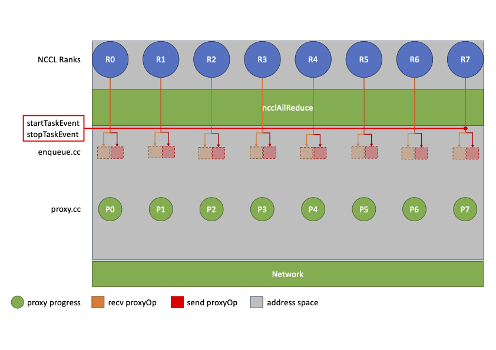
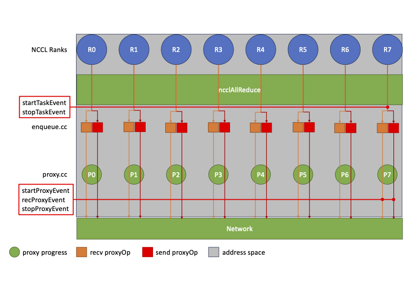
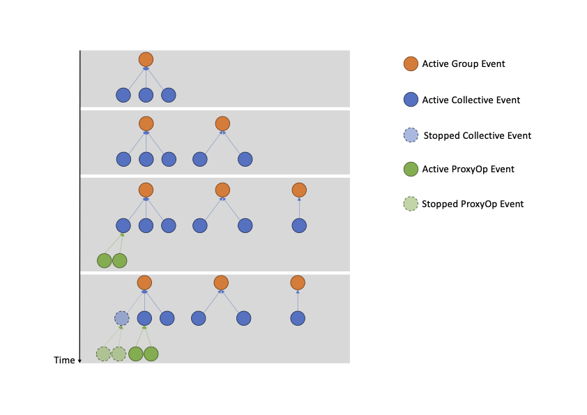
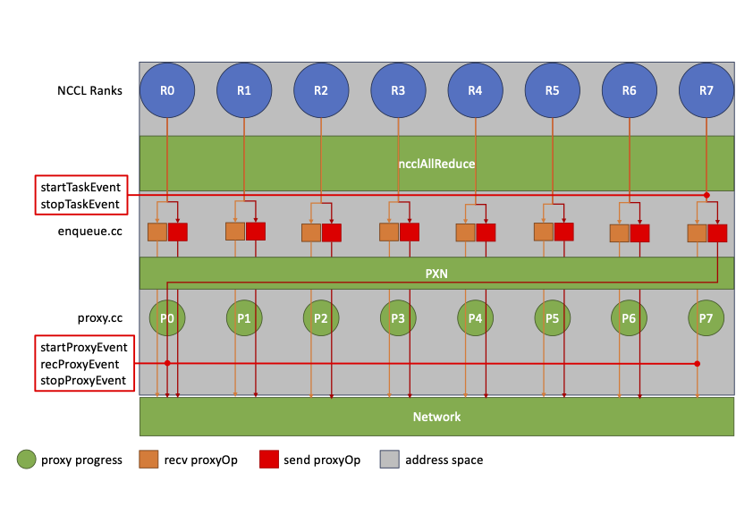
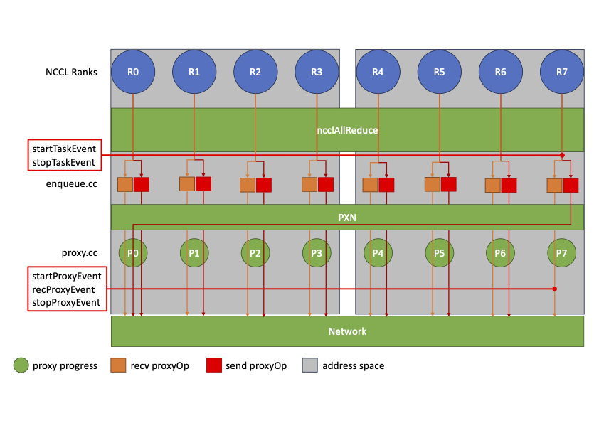

# Profiler Pluing Interface
<!-- use this template to share the details of your feature. Non-commented sections are strongly encouraged -->

## Abstract
The goal of the NCCL profiler plugin interface is to provide different NCCL consumers, such
as debugging and performance tools, with a flexible API to peek into NCCL internal activity
(e.g., Network and GPU) while it is carrying out communication.

The profiler plugin interface needs to capture current and future requirements, meaning it
should be sufficiently generic that new trace points (along with new events) can be added
with minimal code extensions, i.e., code instrumentation and event definition.

<!-- here detail what the feature is about. A few sentence that can be copy-pasted to external actors -->

<!-- ============================================================================================-->
<details>
<summary><h2>Motivation and requirements</h2></summary>
<!-- ============================================================================================-->
Performance anomalies are getting harder to detect and root cause as the GPU cluster scale increases.
Problems such as network contention/congestion, overheating hardware components, software bugs can
all cause hard to diagnose issues. Domain specific monitoring and diagnostic tools are needed to
collect, analyze and understand telemetry data, keeping overhead as low as possible.

### NVbugs / Jira Tickets
https://nvbugspro.nvidia.com/bug/4593186
https://jirasw.nvidia.com/browse/NCCL-1656

### User Experience
The user (profiler plugin writer) is given a set of interfaces that NCCL uses to communicate internal
state information while performing communication. Such interfaces mark the begin and end of certain
operations inside NCCL (e.g., a send/recv operation on a given channel). The user can employ the
NCCL supplied information, e.g., to build a hierarchy of related operations and place them in a time
line to analyze NCCL's performance. Alternatively, the user can simply record all the internal NCCL
operation as they take place for debugging purposes.

### Assumptions, constraints and dependencies
The profiler plugin is expected to receive data from NCCL through the supplied interfaces and not
perform any heavy computation that could cause slowing down NCCL excessively. Ideally, the profiler
will take whatever information NCCL provides and record it internally for later use/display.

There are no known dependencies for the profiler plugin.

### Use Cases

### Platform Requirements
No specific requirements are needed. The profiler plugin should be able to run on any platform NCCL
supports.

<!-- ### Functional Requirements -->
<!-- ### System Requirements -->
### Interface Requirements
The interface needs to be able to support mechanisms to control the volume of information that
NCCL supplies to the profiler plugin. This can be in the form of an event activation mask where
every bit represents a given event in NCCL. The activation mask is internal to NCCL and is
shared with the plugin during initialization.

The interface needs to be able to convey when a given event begins and when it ends. It should
also be able to update events that have been previosly started if these define multiple states.
One example could be a send operation on a channel that needs to wait for data from the GPU
to be available before sending it across the network. The wait for GPU availability, in this case,
would be an event state. As data moves from the GPU to the network, the event state is updated.

The interface should expose event hierarchy to the profiler plugin reflecting dependencies
of NCCL internal operations. This allows the user to correlate individual NCCL internal
operations and root them to the individual collective or point-to-point operation.

The interface also allows users to isolate profiler instances across communicators through a
profiler context passed to the plugin during init time.

<!-- ### KPI Requirements -->
<!-- ### Security Requirements -->
<!-- ### Legal and Standards Requirements -->
<!-- ### Telemetry Requirements -->
<!-- ### Backward Compatibility Requirements -->
<!-- ### Virtualization Requirements -->

</details>

<!-- ============================================================================================-->
<details>
<summary><h2>Design</h2></summary>
<!-- ============================================================================================-->

### Proposed Design
The proposed profiler plugin interface is heavily inspired by the legacy NCCL profiler infrastructure
and expands it to make it more generic and able to capture more than proxy activity.

The interface identifies the following objects:

 - Profiler context:
   A profiler context provides an isolation mechanism across profiler instances across different
   communicators

 - Event:
   An event is an object used to track NCCL internal activity at a certain level of granularity

 - Event descriptor
   An event descriptor is an object that is supplied to the profiler plugin during event start.
   It provides the plugin with details about the type and attributes of the event being profiled.

 - Event state:
   An event state is an integer value that is supplied to the profiler plugin during an event
   update, recorded by NCCL during collective (point-to-point) operation progress.

 - Event state argument:
   An event state argument is an object that is optionally supplied to the profiler plugin during
   an event update (an example could be the number of send/recv completed for a given channel).

The interface provides calls to init/finalize profiler instances, start/stop events, record event
state transitions and update event attributes.

### Interface Architecture
#### Main design features
The interface is designed with the following features in mind:

 - Support tunable profiler overhead through an event activation mask. Passed to the plugin
   during profiler initialization. This is a bitmask where every bit corresponds to a given
   event. Event selection is hierarchical, meaning that profiling an event at the bottom of
   the hierarchy causes all the events above it to be profiled as well.

 - Expose event hierarchy to the plugin. The event descriptor passed to the plugin has a parent
   object reference. The parent object reference can be used by the plugin to organize events
   in a tree, correlating information from different events together (e.g., collective argument
   algorith and protocol, network transfer granularity and peers involved).

 - Easy to extend interface. Adding new events only requires a new event object in the event
   descriptor and (optionally) new states and state arguments.

#### Interface definition
The proposed profiler plugin interface is following described:

 - `init`: callback to initialize the external profiler plugin. The callback takes a pointer to the NCCL
   event activation mask and exposes it to the plugin. The plugin can enable/disable profiling of NCCL
   events by setting bits to 1/0, respectively. When NCCL makes the callback, the plugin can also
   perform any internal initialization, like pre-allocating memory for event objects that will be later
   handed over to NCCL when needed. The callback returns a pointer to the allocated profiler context that
   NCCL uses in following profiler calls.

 - `finalize`: callback to finalize the external profiler plugin. The callback takes a pointer to the
   profiler context. When NCCL makes the callback the plugin can perform any internal finalization, like
   freeing previously allocated event resources for the given context and dump the collected events to a
   file.

 - `startEvent`: callback to start the profiling of a specific event. The callback takes a profiler
   context and an event descriptor. The event descriptor is used to allocate a new event object in the
   given context. The callback returns a pointer to the allocated event to NCCL.

 - `stopEvent`: callback to stop the profiling of a specific event. When NCCL makes the callback it
   provides the plugin with the event handle, previously obtained through the startEvent callback. The
   plugin can update the corresponding event object and release it (e.g. return it to the object pool).

 - `recordEventState`: callback to record an event state transition and, optionally, update event object
   attributes. When NCCL makes the callback it provides the plugin with the event handle, previously
   obtained through the startEvent callback. NCCL also provides an event state and, optionally, an
   event state argument object. Such object is used to pass the plugin event attributes that should
   be updated.

#### Interface objects definition
The interface defines the following objects:

 - `ncclProfilerEventDescr_t`: event descriptor passed to the plugin during the startEvent callback. This
   is a structure containing event specific attributes as well as metadata describing the event type and
   the parent event. Indeed, events are exposed to the plugin following a hierarchical organization. This
   allows the plugin to reconstruct the relationship between different events and better assist users in
   understanding the way NCCL handles point-to-point and collective operations at different levels.

 - `ncclProfilerEventState_t`: event state passed to the plugin during the recordEventState callback. This
   is an integer value representing one of the possible states the event can go through during the course of
   its lifecycle. It is allowed for one event to have no states associated. This happens if the event does
   not need to record any state transition or its attributes don't change between calls to startEvent and
   stopEvent.

 - `ncclProfilerEventStateArgs_t`: event state arguments passed to the plugin during the recordEventState
   callback. This is a structure containing event specific attributes.

#### Captured events:

 - `ncclProfileGroup`: group events are defined to represent NCCL group operations and can, indeed, group
   NCCL collective and point-to-point events. Group events have a very simple event descriptor as they are
   not carrying any meaningful information besides serving as the root event for other events.

 - `ncclProfileColl`: collective events are defined to represent NCCL collective operations, such as
   ncclAllReduce, ncclAllGather, etc. They have an event descriptor describing the collective to the plugin.
   The collective event descriptor has a pointer to the parent group event and contains collective specific
   attributes.

 - `ncclProfileP2p`: point-to-point events are defined to represent NCCL point-to-point operations, such as
   ncclSend and ncclRecv. They have an event descriptor describing the point-to-point operation to the plugin.
   The point-to-point event descriptor has a pointer to the parent group event and contains point-to-point
   specific attributes.

 - `ncclProfileProxyOp`: proxyOp events are defined to represent NCCL low-level channel activity. They have
   an event descriptor describing the channel operation to the plugin. The proxyOp event descriptor has a
   pointer to the parent collective or point-to-point event and contains channel specific attributes, e.g.,
   the peer rank the channel is used for, the direction of the data flow (send/recv), how many network
   transfers the channel is responsible for, etc.

 - `ncclProfileProxyStep`: proxyStep events are defined to represent NCCL low-level network activity. They
   have an event descriptor describing the single network transfer (send/recv) to the plugin. The proxyStep
   event descriptor has a pointer to the parent proxyOp event and contains specific transfer attributes, e.g.,
   the number of the transfer in the channel.

 - `ncclProfileProxyCtrl`: proxyCtrl events are defined to represent NCCL low-level proxy progress thread
   activity. They have a very simple event descriptor as they are not carrying any significant information
   beside marking the beginning and end of specific phases in the proxy progress thread.

#### Captured events hierarchy

```
   Group event
   |
   +- Collective event
   |  |
   |  +- ProxyOp event
   |     |
   |     +- ProxyStep event
   |
   +- Point-to-point event
      |
      +- ProxyOp event
         |
         +- ProxyStep event

   ProxyCtrl event
```

#### Kernel events

Kernel events are not currently implemented in the profiler interface. The reason is that, at this point,
it is not clear how to accurately time kernel events and present them in the same timeline as host events,
also correlating them to the right NCCL operation.
The following approach was considered and discarded because unsatisfactory:

 - CUDA events: `cudaEvent_t` can be used to record the state of the NCCL launch stream before and
   after the the kernel launch. This is achieved by creating start and stop CUDA events, using
   `cudaEventCreate`, and then recording the state of the stream before and after the kernel launch,
   using `cudaEventRecord`. After CUDA events have been recorded, a call to `cudaEventSynchronize`
   waits for the stop event to complete. Then, a call to `cudaEventElapsedTime` returns the time
   between the two events. There are two main limitations with this approach: (1) the interface does
   not give timestamp information of single CUDA events (just the delta between the two); (2) even
   if such timestamps were available, CUDA does not make any guarantee they would be accurate. More
   operations can be inserted between the two events and false the measurement.

The CUPTI activity API could be a valid solution to the above problem and is under assessment.

<!-- ### System KPIs & Metrics -->
<!-- ### Data Architecture -->
<!-- ### Security Design -->
<!-- ### Debugging & Troubleshooting -->
### Logging and Instrumentation
The NCCL core is instrumented with profiler callbacks at different levels to capture start/stop of groups,
collective and point-to-point operations, as well as proxy progress activity.

Due to the asynchronous nature of NCCL operations, events associated to collectives and point-to-point
are not easy to delimit precisely. For example, withou both proxy and kernel activity it is impossible
to figure out when a collective completes. Therefore, collective events start and stop simply indicate
that the collective has been enqueued by NCCL. However, ProxyOp events (if present) can still be used by
the profiler to get an idea of when the collective ends (this might not be precise as kernel events
are currently unsupported and PXN might cause some ProxyOps to be invisible to the profiler).

As mentioned, collective and point-to-point events are started/stopped in the enqueue code (enqueue.cc) by
`hostStreamPlanTask`. Each of these might (or might not) have associated network activity, represented by
the presence (or absence) of ProxyOps in the kernel plan.

The following picture showcases the profiling of Rank7 running a ncclAllReduce operation. In this case
there are no ProxyOps (e.g., all communication happens through nvlink or shared memory).



If the user disables nvlink and share memory, NCCL generates ProxyOps to perform communication using the
loopback network interface. This is showcased in the following picture. In this case R7 has two ProxyOps,
one for receiving from R6 and one for sending to Rank0 in the ring.



The following picture showcases a sequence of collectives as they are observed by the profiler. In the
picture we see that as time moves on NCCL is enqueuing more grouped collective operations. At some point
the ProxyOps for the first enqueued collective will be processed by the proxy progress thread and made
visible to the profiler. As all the ProxyOps associated to a collective are completed the profiler can
mark the corresponding collective event as complete as well. When all the collective events in the group
are complete the group event, along with all the children events, can be recycled by the profiler. If the
collective does not have any ProxyOp (e.g., intra-node collective using nvlink) the profiler can't know
whether ProxyOps will be coming later on or not. Thus, the profiler can decide to recycle the collective
event when it runs out of space, at the condition that it will ignore following ProxyOp events if they
reference that collective.



### PXN

Some ProxyOps might be processed remotely when PXN is enabled. In such cases there are two scenarios:

The remote proxy progress thread is in the same address space as the originating rank:



The remote proxy progress thread is not in the same address space as the originating rank:



In the former case, the profiler can see the ProxyOp associated event and show it in the traces. In the
latter case, however, the ProxyOp is completely invisible to the profiler running on Rank7 and will be
only visible to the Rank0 executing the ProxyOp.

<!-- ### Operational Considerations -->

</details>

<!-- ============================================================================================-->
<details>
<summary><h2>Coding</h2></summary>
<!-- ============================================================================================-->

Profiler initialization and instrumentation points have been added to NCCL in the following files:

 - src/init.cc: profiler loading/unloading/init/finalize
 - src/enqueue.cc: group and collective/point-to-point operations instrumentation
 - src/proxy.cc: proxy progress thread instrumentation
 - src/transport/net.cc: network transfers instrumentation
 - src/misc/profiler.cc: profiler loading/unloading/init/finalize logic and profiler plugin wrapper
   call

A new plugin example is also provided in the following files:

 - ext-profiler/example/plugin.cc: plugin implementation of the profiler interface
 - ext-profiler/example/event.h: plugin event definition
 - ext-profiler/example/print\_event.cc: plugin print functions for dumping traces to a file

### Commit list or MR
e51524065 profiler: add profiler plugin infrastructure

</details>

<!-- ============================================================================================-->
<details>
<summary><h2>Testing and Validation</h2></summary>
<!-- ============================================================================================-->

### Objectives and Timeline

### Validation

#### Where to run?

#### What to run?

#### Expected output?

<!-- #### Code Coverage Goal Defined -->
<!-- #### KPI Coverage Goals Defined (performance, stress, stability, throughput, latency) -->
<!-- #### Requirement Coverage Goal Defined -->
<!-- #### Quality Thresholds Defined -->
<!-- #### Test Timeline -->
<!-- #### SW Verification and Test Plan -->
<!-- ### Test plan -->
<!-- #### Requirements Tests -->
<!-- #### Interface Tests -->
<!-- #### Fault-injection Tests -->
<!-- #### Resource Usage Tests -->
<!-- #### Design Coverage Testing -->
<!-- #### Boundary Tests -->
<!-- #### Certification Tests -->
<!-- #### Stress Tests -->
<!-- #### Stability Tests -->
<!-- #### Perf and Power KPI Tests -->
<!-- #### Usability & OOBE Tests -->
<!-- #### Manufacturing Diagnostic(Factory) Tests -->

### Performance

#### What is measured?

#### Results


</details>

<!-- ============================================================================================-->
<details>
<summary><h2>Signoff List</h2></summary>
<!-- ============================================================================================-->

Author(s):
  - Giuseppe Congiu <gcongiu@nvidia.com>

</details>
