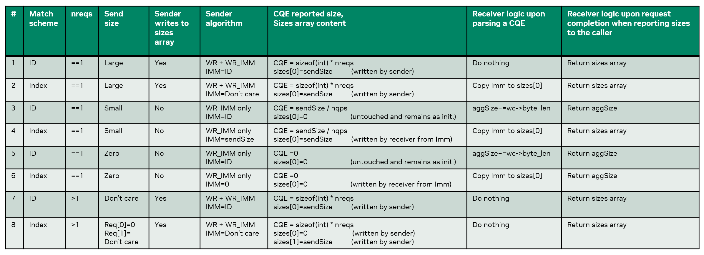

# ID-based matching scheme
<!-- use this template to share the details of your feature. Non-commented sections are strongly encouraged -->

## Abstract

This PLC describes the implementation of an ID-based matching scheme to enhance communication efficiency in NCCL. The ID-based matching scheme allows the receiver to identify and associate completions with the correct receive requests efficiently using a unique identifier passed along with each receive request.

This feature is a pre-requisite for enabling port-failover capabilities in NCCL, which will enhance the robustness and reliability of communication in multi-path network environments. Port-failover allows NCCL to seamlessly switch between different network paths/devices in case of failures, ensuring continuous data flow and minimizing disruptions. To facilitate this, the receiver should be able to accept data from multiple network interfaces without knowing apriori on which device each data transfer will be sent, which is made possible by the ID-based matching scheme.

<!-- here detail what the feature is about. A few sentence that can be copy-pasted to external actors -->

<!-- ============================================================================================-->
<details>
<summary><h2>Motivation and requirements</h2></summary>
<!-- ============================================================================================-->

### NVbugs / Jira Tickets

* [[Feature Request] NCCL Failover Support on CX8 (NVBug #5256433)](https://nvbugspro.nvidia.com/bug/5256433)

### User Experience

The feature is configurable via the following environment variable:
- `NCCL_IB_RECEIVER_SIDE_MATCHING_SCHEME`
  * Value of `0` (default): disables the ID-based matching scheme. Implicitly it means that the receiver matches as prior to this change, using `wr_id` only.
  * Value of `1`: enables the ID-based matching scheme. The receiver uses an ID-based matching scheme to match completions with receive requests.

### Assumptions, constraints and dependencies

No system assumptions or constraints are introduced by this feature. The feature is optional and disabled by default.

### Use Cases

The main use-cases for this feature are:
1. Enabling port-failover capabilities in NCCL, allowing for seamless switching between different network paths/devices in case of failures.
2. Providing foundation for advanced receive-side optimizations such as Receive WQE pre-posting.

#### Port-failover use-case

Port-failover allows NCCL to seamlessly switch between different network paths/devices in case of failures, ensuring continuous data flow and minimizing disruptions. To facilitate this, when some device fails, the receiver side should be able to accept data from other functional devices (the devices that the sender fails-over to) network devices without knowing apriori on which device or devices each data transfer will be sent, which is made possible by the ID-based matching scheme.

#### Receive WQE pre-posting use-case

When pre-posting WQEs, it's not possible to rely on `wr_id` to match completions with receive requests, as the pre-posted Receive WQEs are identical and do not correspond to specific receive requests. The ID-based matching scheme allows the receiver to match completions with the correct receive requests using the unique identifier (ID) passed along with each receive request, enabling the implementation of Receive WQE pre-posting.

### Platform Requirements

<!-- ### Functional Requirements -->
<!-- ### System Requirements -->
<!-- ### Interface Requirements -->
<!-- ### KPI Requirements -->
<!-- ### Security Requirements -->
<!-- ### Legal and Standards Requirements -->
<!-- ### Telemetry Requirements -->
<!-- ### Backward Compatibility Requirements -->
<!-- ### Virtualization Requirements -->

The feature is platform agnostic and does not have any specific platform requirements.

</details>

<!-- ============================================================================================-->
<details>
<summary><h2>Design</h2></summary>
<!-- ============================================================================================-->

### Design

#### ID-based matching scheme

The ID-based matching scheme is implemented by passing a unique identifier (ID) along with each receive request. This ID is used by the receiver to match completions with the corresponding receive requests. The ID is derived from the "slot" which the receive request occupies in the "FIFO" between the sender and receiver.

Since the sender polls on the FIFO directly (by polling on memory), no need for the receiver to pass the ID explicitly in the CTS, as the sender can derive the ID from the slot it is polling on. Then, the sender encodes the ID in the Immediate Data field of the RDMA Write with Immediate operation used to send the data. The receiver extracts the ID from the Immediate Data field upon completion of the RDMA Write with Immediate operation and uses it to match the completion with the corresponding receive request.

In some cases, the plugin used the Immediate Data field to pass other information (e.g., the size of the data being sent). This usage was redundant, as the size of the data can be derived from the completion of the receiver requests itself (`CQE.byte_len`). Still, when ID-based matching scheme is not enabled, the plugin continues to use the Immediate Data field to pass the size of the data being sent, even though it is not strictly necessary.

A special is addressed when ID-based scheme is enabled: When the sender issues a single (`nreqs==1`) sufficiently small (`<ArThreshold`) send request, the sender uses an optimization according to which it posts a single RDMA Write with Immediate operation to send the data, instead of posting first an RDMA Write followed by an RDMA Write with Immediate operation. A special attention is required when the sender also uses multiple QPs to transfer the data. In this case, the receiver cannot simply retreive the size of the original send request from the completion (`CQE.byte_len`), but needs to _aggregate_ the values reported in all completions across all QPs that were used to transfer the data. For that, the reciever was added with a new member `aggSize` in the `ncclIbRequest` strucutre.

To accomodate all cases possible (i.e., ID-based matching scheme enabled/disabled, single/multiple send/receive requests, small/large/zero-sized send requests, single/multiple QPs), the sender and receiver implement the following logic:

**Receiver-side**

```c++
ncclIbIrecv() {
  // Initialization of the sizes array and the aggSize member
  memset(r->recv.sizes, 0, sizeof(int)*nreqs);
  r->aggSize == 0;
}

// Called for every CQE generated for a receive request on the receiver side
ncclIbHandleCompletion(ncclIbRequest r, struct ibv_wc wc) {
  if (r->nreqs == 1) {
    if (ncclParamIbReceiverSideMatchingScheme() == BY_INDEX) {
      req->recv.sizes[0] = be32toh(wc->imm_data);
    } else if (req->recv.sizes[0] == 0) {
      req->recv.aggSize+= wc->byte_len;
    }
  }
}

// Called upon completion of a recive reuqest when the size should be reported
// back to the caller
ncclIbRequestComplete(ncclIbRequest r, int* sizes) {
  int *sizesToReport = NULL;
  if (r->nreqs > 1 || r->recv.sizes[0] > 0) {
    sizesToReport = r->recv.sizes
  } else {
    sizesToReport = &(r->recv.aggSize);
  }
  sizes = sizesToReport;
}
```

**Sender-side**

```c++
ncclIbMultiSend() {
  ncclIbMultiSend(ncclIbRequest r, int nreqs) {
    immData = ncclParamIbReceiverSideMatchingScheme() == BY_ID ? reqs[0]->id : reqs[0]->send.size;
    if (nreqs > 1 || (comm->ar && reqs[0]->send.size > ncclParamIbArThreshold())) {
      lastWr++; // Send additional RDMA Write with Imm
    }
  }
}
```

Below is a table summarizing all of the logic of the sender and receiver sides in all scenarios and the above code snippets illustrate the key parts of the implementation that follows the logic in the table.



</details>

<!-- ============================================================================================-->
<details>
<summary><h2>Coding</h2></summary>
<!-- ============================================================================================-->

### Commit list or MR

* [MR!1400](https://gitlab-master.nvidia.com/nccl/nccl/-/merge_requests/1400)

</details>

<!-- ============================================================================================-->
<details>
<summary><h2>Testing and Validation</h2></summary>
<!-- ============================================================================================-->

### Validation

To validate the implementation of the ID-based matching scheme, the environment variable should be set:
* `NCCL_IB_RECEIVER_SIDE_MATCHING_SCHEME=1`

#### Where to run?

Systems that supports NCCL with InfiniBand transport can be used to run the tests. The implementation should be tested when Adaptive Routing is enabled and disabled as well.

#### What to run?

The standard NCCL test suite can be used to validate the implementation. This includes running various collective operations (e.g., all-reduce, broadcast, reduce, etc.) with different message sizes and numbers of processes.

Specifically, need to cover zero-sized messages, small messages (less than ArThreshold), and large messages (greater than ArThreshold), as well as single and multiple send/receive requests.

#### Expected output?

<!-- #### Code Coverage Goal Defined -->
<!-- #### KPI Coverage Goals Defined (performance, stress, stability, throughput, latency) -->
<!-- #### Requirement Coverage Goal Defined -->
<!-- #### Quality Thresholds Defined -->
<!-- #### Test Timeline -->
<!-- #### SW Verification and Test Plan -->
<!-- ### Test plan -->
<!-- #### Requirements Tests -->
<!-- #### Interface Tests -->
<!-- #### Fault-injection Tests -->
<!-- #### Resource Usage Tests -->
<!-- #### Design Coverage Testing -->
<!-- #### Boundary Tests -->
<!-- #### Certification Tests -->
<!-- #### Stress Tests -->
<!-- #### Stability Tests -->
<!-- #### Perf and Power KPI Tests -->
<!-- #### Usability & OOBE Tests -->
<!-- #### Manufacturing Diagnostic(Factory) Tests -->

The tests should complete successfully without any errors or crashes. The results of the collective operations should be correct and match the expected output.

### Performance

ID-based matching scheme should not have a significant impact on performance with the proposed optimizations in place (storing the receive requests in an array on the receiver communicator). But, numbers were not collected.

#### Results

Numbers were not collected.

</details>

<!-- ============================================================================================-->
<details>
<summary><h2>Signoff List</h2></summary>
<!-- ============================================================================================-->

Author(s):
  - Rami Nudelman

</details>
