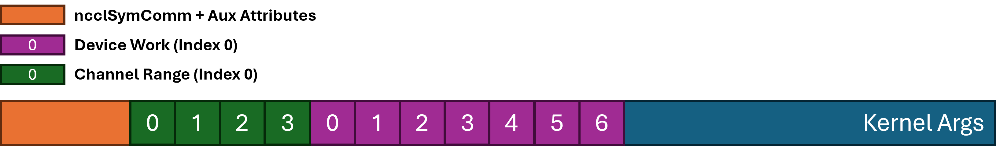

# Grouped Symmetric Kernels
<!-- use this template to share the details of your feature. Non-commented sections are strongly encouraged -->

## Abstract
<!-- here detail what the feature is about. A few sentence that can be copy-pasted to external actors -->
Although NCCL 2.27 supports symmetric kernels for AR, AG and RS, it does not support grouped symmetric kernels.
JAX, Nemo and other DL frameworks highly depend on grouped NCCL ops to provide the best performance, and this
implementation fills the gap.
<!-- ============================================================================================-->
<details>
<summary><h2>Motivation and requirements</h2></summary>
<!-- ============================================================================================-->

### NVbugs / Jira Tickets
https://nvbugspro.nvidia.com/bug/5294329

### User Experience
Grouped NCCL ops will use symmetric kernels

### Assumptions, constraints and dependencies
Buffers are symmetrically registered

### Use Cases
All grouped symmetric kernels

### Platform Requirements
NA

<!-- ### Functional Requirements -->
<!-- ### System Requirements -->
<!-- ### Interface Requirements -->
<!-- ### KPI Requirements -->
<!-- ### Security Requirements -->
<!-- ### Legal and Standards Requirements -->
<!-- ### Telemetry Requirements -->
<!-- ### Backward Compatibility Requirements -->
<!-- ### Virtualization Requirements -->

</details>

<!-- ============================================================================================-->
<details>
<summary><h2>Design</h2></summary>
<!-- ============================================================================================-->

### Proposed Design
The grouped symmetric kernels design keeps 2 key points in mind:
1. Make grouped kernels launch simple even though imperfect in order to reduce complexity and latency overhead.
2. The workload should be evenly distributed among channels to avoid imbalance issue as much as possible.
3. Work struct definition should be flexible so that we can designate any number of channels to work on any workload.

To keep the grouped symmetric kernels simple, we first sort out all grouped NCCL ops and put the same type of tasks into one queue.
The same type means same collective op, datatype, reduction op. Then we create a virtual task which contains all workload of the same type tasks and decide the unified symmetric algorithm and protocol for all of
them. This strategy can guarantee us that one kernel can process all NCCL ops without involving any function calls on device side. In addition,
the number of channels launched will be set to the max channels among NCCL ops.

After grouping the same type of NCCL ops, we start to schedule the workload onto the channels. The key idea still follows Continuous
Bytes Distribution (CBD) scheduling method, but we allow multiple channels to work on the same work. We add up all bytes from all NCCL
ops and divide it by the number of channels and cell size (e.g., 1K), and we get the soft workload upper limit for each channel; then the NCCL ops are enqueued
from 0 to N-1 channels one by one until all tasks are scheduled. The work task is defined as follow:

```
struct alignas(16) ncclSymkDevWork {
  uint64_t redOpArg; // must be collectively uniform
  size_t nElts;
  struct ncclWindow_vidmem* inputWin, *outputWin;
  size_t inputOff, outputOff;
  uint64_t rootRank;
  uint64_t sChannelId:16, nChannels:16, padding:32;
};
```

In this struct, `nElts` is the count of the collective, `inputOff` and `outputOff` are the offset of input and output buffer from the head of
window symmetric heap (i.e., `inputWin` and `outputWin`); `redOpArg` is reduction op for reduction-based ops. `sChannelId` and `nChannels`
indicate start id and the number of fused channels. As long as blockIdx.x locates between `[sChannelId, sChannelId + nChannels)`, all these channels will work on the same portion of workload.

In addition, besides the dev work definition, we also add a channel range to indicate the workload for each channel. The definition is as follow:

```
struct ncclSymkChannelWorkRange {
  uint16_t workHi; // inclusive index of my ending work
  uint16_t fracHi; // 16-bit fraction in (0.0, 1.0] indicating where my part ends
};
```

`struct ncclSymkChannelWorkRange` determines the range of work the channel needs to process.
`fracHi` is encoded float point whose value represents [0.0, 1.0]; it represents the overall percent of workload after the partial workload is scheduled on the channel.
The actual percent of workload the channel will take is `channelWorkRange[channelId].fracHi - channelWorkRange[channelId - 1].fracHi`; channel 0 is a special case
whose workload percent should be `channelWorkRange[0].fracHi`.
For a channel, the `fracHi` is encoded as `DIVUP(0x10000L * (taskCell - cellLeft), taskCell) - 1`, if `fracHi` is `0xFFFF`, it means the channel will take the rest of workload.

`workHi` means the highest work index the channel needs to process.
The work range of a channel should be `[channelWorkRange[channelId - 1].workHi, channelWorkRange[channelId].workHi]`; if `channelId` is 0, low bound should be 0
instead of `channelWorkRange[channelId - 1].workHi`; if previous channel takes over the whole workHi (i.e., `channelWorkRange[channelId - 1].fracHi == 0xFFFF`),
then this channel should start from `channelWorkRange[channelId - 1].workHi + 1`.

Finally we define the args header:

```

struct alignas(16) ncclSymkDevWorkArgs {
  struct ncclSymComm comm;
  int nMaxChannels;
  // starting of channelWorkRange will be aligned to 16 bytes
  // channelWorkRange[nChannels];
  // ncclSymDevWork[nWorks];
  // aux functions
  __host__ static constexpr size_t calcArgsSize(int nChannels, int nWorks) {
    return alignUp(sizeof(struct ncclSymkDevWorkArgs), 16) + alignUp(nChannels * sizeof(struct ncclSymkChannelWorkRange), 16) + nWorks * sizeof(struct ncclSymkDevWork);
  }
  __host__ __device__ struct ncclSymkChannelWorkRange* getWorkRange() {
    return (struct ncclSymkChannelWorkRange*)((uint8_t*)this + alignUp(sizeof(struct ncclSymkDevWorkArgs), 16));
  }
  __host__ __device__ struct ncclSymkDevWork* getWorks(int nChannels) {
    return (struct ncclSymkDevWork*)((uint8_t*)this->getWorkRange() + alignUp(nChannels * sizeof(struct ncclSymkChannelWorkRange), 16));
  }
};
```

The header struct is a dynamic-size struct, which will contain `nChannels` channel range elements and `nWorks` dev work elements. Using `getWorkRange()` and
`getWorks(int nChannels)` can help to find the starting address of each array. In device side, we can read these 2 arrays and assign corresponding workload
to each channel.

Combine these together, we have the following task FIFO format which will be consumed by the device kernels:




<!-- note: the following HTML code is also valid -->
<!--  -->

### Interface Architecture

<!-- ### System KPIs & Metrics -->
<!-- ### Data Architecture -->
<!-- ### Security Design -->
<!-- ### Debugging & Troubleshooting -->
<!-- ### Logging and Instrumentation -->
<!-- ### Operational Considerations -->

</details>

<!-- ============================================================================================-->
<details>
<summary><h2>Coding</h2></summary>
<!-- ============================================================================================-->

### Commit list or MR

</details>

<!-- ============================================================================================-->
<details>
<summary><h2>Testing and Validation</h2></summary>
<!-- ============================================================================================-->

### Objectives and Timeline

### Validation

#### Where to run?

#### What to run?

#### Expected output?

<!-- #### Code Coverage Goal Defined -->
<!-- #### KPI Coverage Goals Defined (performance, stress, stability, throughput, latency) -->
<!-- #### Requirement Coverage Goal Defined -->
<!-- #### Quality Thresholds Defined -->
<!-- #### Test Timeline -->
<!-- #### SW Verification and Test Plan -->
<!-- ### Test plan -->
<!-- #### Requirements Tests -->
<!-- #### Interface Tests -->
<!-- #### Fault-injection Tests -->
<!-- #### Resource Usage Tests -->
<!-- #### Design Coverage Testing -->
<!-- #### Boundary Tests -->
<!-- #### Certification Tests -->
<!-- #### Stress Tests -->
<!-- #### Stability Tests -->
<!-- #### Perf and Power KPI Tests -->
<!-- #### Usability & OOBE Tests -->
<!-- #### Manufacturing Diagnostic(Factory) Tests -->

### Performance

#### What is measured?

#### Results


</details>

<!-- ============================================================================================-->
<details>
<summary><h2>Signoff List</h2></summary>
<!-- ============================================================================================-->

Author(s):
  - Kaiming Ouyang

</details>
