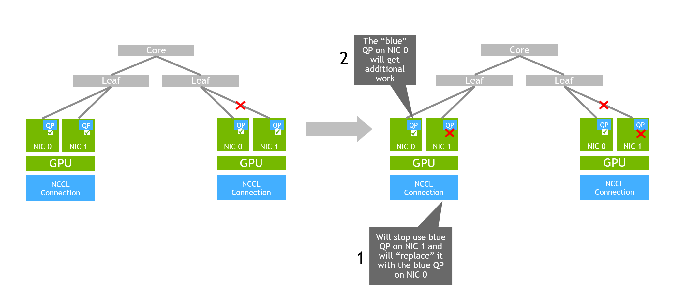
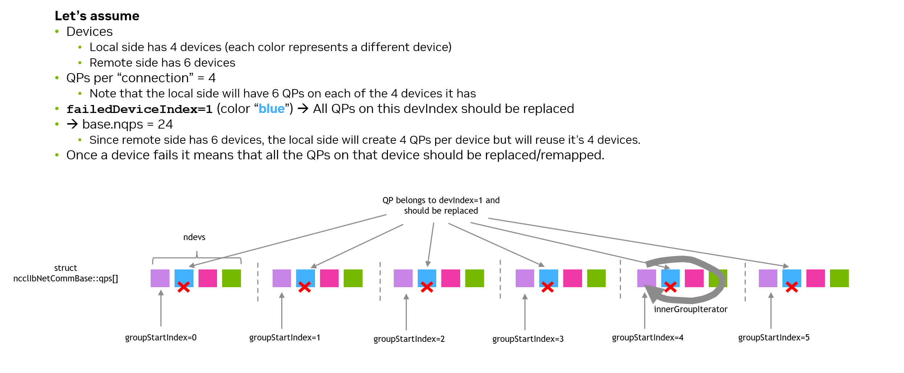
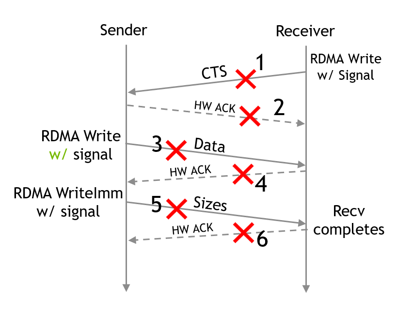
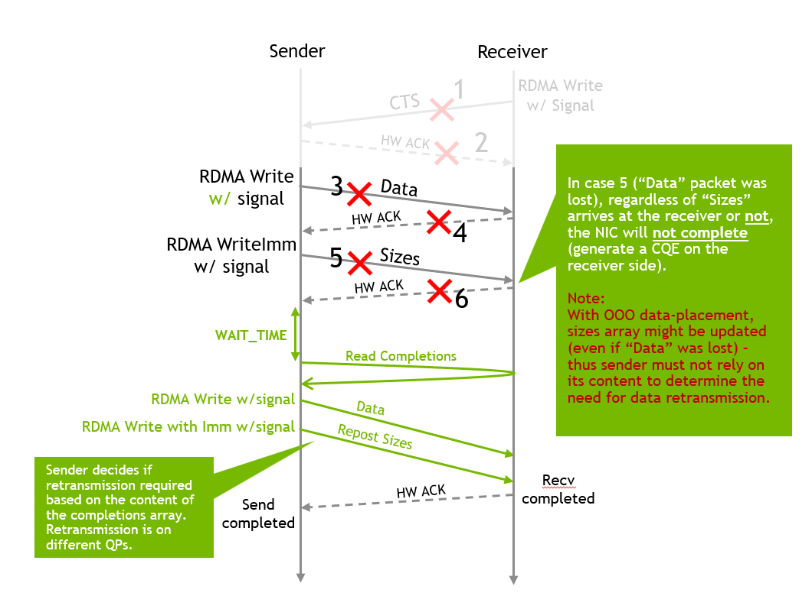

# Port-failover

## Abstract

The Port-failover feature is an enhancement to the NCCL IB plugin (peer-to-peer send/recv) that enables the NCCL IB plugin to continue after a network error occurs. The feature allows NCCL IB plugin to handle device failures transparently to the user application, maintaining job continuity.

## Motivation and requirements

<details><summary></summary>

In large-scale AI and high-performance computing (HPC) workloads, maintaining uninterrupted runtime of the job is crucial due to the potential for significant overall performance degradation and computation loss caused by device failures, which can cause the job to abort.

The port-failover support is important as it lets the job continue to run, even in case of failures, and allows avoiding computation loss (assuming the job uses checkpoint and restart mechanisms).

The port-failover feature is designed to let the workload continue in case of a failure, without any functional side effects and be safe from the point of view of the user (e.g., API semantics of the IB plugin are not changed).

### NVbugs / Jira Tickets

* [[Feature Request] NCCL Failover Support on CX8 (NVBug #5256433)](https://nvbugspro.nvidia.com/bug/5256433)
* [[External][RFC] NCCL Port Failover and Recovery](https://docs.google.com/document/d/1je4sc1DoQpvcZjPOWYBxi5qj5iLXo6oyOTBp2KoWiP4/edit?resourcekey=0-Uth9d3yOXeBKIzjY310vqw&tab=t.0#heading=h.6muo8fckfdp)
* [SWQA task for "[Feature Request] NCCL Failover Support on CX8"](https://jirasw.nvidia.com/browse/NCCL-2191)

### User Experience

To enable the port-failover feature, the user should set `NCCL_IB_RESILIENCY_PORT_FAILOVER` to `1` and also enable the required features that port-failover relies on:
* [Pre-posting of receive work requests](../id_14cfa49d/Pre-posting_Receive_WQEs.md) (`NCCL_IB_PREPOST_RECEIVE_WORK_REQUESTS=1`)
* [ID-based matching scheme on the receiver side](../id_4bde6b8f/ID-based_matching_scheme.md) (`NCCL_IB_RECEIVER_SIDE_MATCHING_SCHEME=1`)

> **Note**
>
> By default, the feature is disabled.

With the port-failover feature enabled, the IB plugin automatically handles device failures without higher SW stack intervention or awareness of the failure (without any functional side effects), achieving the highest performance possible, given the system's capabilities and functional resources.

### Assumptions, constraints and dependencies

The implementation of the port-failover feature is based on the following assumptions:

* Port-failover can be performed only between devices that are under the same fused NIC (allowed by [NIC Fusion](../id_ecf30b98/NIC_Fusion.md)).
* The port-failover feature is able to handle failures that only occur after the communicator initialization phase is completed.
* The port-failover feature does not support GIN.

### Use Cases

Whenever a system failure may occur and the workload is not *too* sensitive to peak performance at *all* times, the port-failover feature should be enabled to allow the job to continuously operate on a system which might experience temporal or permanent failures.

The workload can either be tolerant to performance degradation and continue until completion or can get to the next checkpoint and avoid computation loss.

### Platform/System requirements

The port-failover feature is implemented in the NCCL IB plugin, so the platform/system requirements are to have an InfiniBand or RDMA over Converged Ethernet (RoCE) network.

The port-failover feature is built on top of [NIC Fusion](../id_ecf30b98/NIC_Fusion.md) and allows device/port failover only between devices that are part of the fused NIC.

</details>

## Design and architecture

<details><summary></summary>

The port-failover feature is implemented in the NCCL IB plugin.

### Port-failover

#### Correctness guarantees in presence of a failure

The port-failover feature makes sure that the communication is not interrupted in case of a failure, covering the cases where there are outstanding data transfers initiated on the device that failed. The port-failover feature guarantees that both newly initiated data transfers and the data transfers that were initiated before the failure will be completed successfully by implementing a replay protocol (when needed) regardless of when the failure occurred and at which stage of the data transfer.

#### Failure detection

The plugin detects a failure by monitoring the completion queue of every device. The plugin polls the completion queue for completion notifications and if a completion notification is received with an error, the plugin marks the device as failed.

Code sample that shows how error detection is performed can be viewed below:

```c++
// Performed for every work completion (CQE) in ncclIbTest() function
if (wc->status != IBV_WC_SUCCESS) {
   ...
   NCCLCHECK(ncclIbResiliencyHandleCompletionError(r, wc, i));
   ...
}
```

In the code above, the plugin will check if the error (described by the completion `wc`) is fatal or not. If the error is not fatal, the port-failover protocol will be initiated.

> **Note**
>
> In the current implementation, port-failover is only triggered by errors detected on the local device. Even though multiple communicators might use the same device that failed, a communicator that detects a failure on a device does not notify other communicators about the failure in a "proactive" manner to let them perform a port-failover before detecting an error on their connections.
>
> This kind of optimization can be considered in future implementations.

As soon as the device generated an error, the device is marked as failed. As long as a device is marked as failed, the plugin does not use the device for any data transfer purposes.

> **Note**
>
> The failure detection is done with such a granularity that potentially, there is no need to declare a *whole* device as failed. Instead, only a specific QP on the device can be marked as failed. This is a design decision that can be considered in future implementations.

#### Fatal errors

Not all errors will trigger the port-failover feature. Some errors are deemed to be fatal and will result in the plugin aborting the connection and returning an error to the upper SW layer, which in turn, potentially could lead to job abort.

An example of a fatal error is when a connection detects a device error but has no other devices to fail over to.

#### QP replacement procedure

As soon as a device is marked as failed, the plugin performs a QP replacement procedure, in which it reconfigures the connection to perform data transfers over a different set of QPs that are not affected by the failure. The QP replacement procedure is done in a way that is transparent to the user, and the user is not aware of the QP replacement procedure. The replacement is a *local operation* (i.e., does not require coordination between sender and receiver), so the sender and receiver are not dependent on each other to complete the QP replacement procedure and sync.

The function that implements that QP replacement procedure is `ncclIbResiliencyReplaceQps()`.

##### Preservation of the number of QPs used by the connection

Before the port-failover feature was added, the sender side and receiver side were in sync on the number of completions the receiver should get for a single send/receive operation. The number of completions was correlated to the number of QPs used by the connection (`NCCL_IB_QPS_PER_CONNECTION`) and by the manner in which the QPs were used (`NCCL_IB_SPLIT_DATA_ON_QPS`).

The addition of port-failover support did not change this fundamental design in the plugin, therefore the QP procedure design in the port-failover feature was designed in a way that the overall number of QPs used by the connection, after the port-failover when a device failed, is the same as before the port-failover.

> **Note**
>
> This design, that preserves the number of QPs used by the connection, might not be optimal in some cases. For example, let's assume the case in which the fused device is comprised out of 2 devices and on each device there is a single QP. In this case, when all devices are operational and no failures were detected, the plugin first splits the message across devices and then sends a portion of the message on the QP of each device. With port-failover, when one device of a fused device fails, the QP replacement procedure will make sure that the receiver still gets two completions as before, and essentially will cause the plugin to send two RDMA Write with Immediate messages on the same single QP of the operational device.
>
>
> 
>
> This has further effects that are not handled in the device related to the QP size that each QP is created with. With port-failover in place, a QP used for data transfer is created with a queue size large enough to accommodate a scenario where all devices failed except for the device on which this QP operates, so essentially this QP has a very large queue size that does not only take into account network parameters as it should (e.g., network latency) but also parameters which can cause the queue to be full for no additional benefit of bandwidth or message rate.

##### QP replacement policy

The QPs that are used for data transfer are pointed by the `base.qps` array. The `base.qps` array is filled in a "grouped" manner, in such a manner that within every group, every QP belongs to a different device. Whenever a QP that belongs to the failed device is encountered, the QP is replaced, with a QP in the same group, since every QP in the group belongs to a different device, it's guaranteed that such a QP exists.

For example, if there are:
   -  $ D $ local devices
   -  $ Q $ QPs per connection
   -  $ C $ connections (which is the maximum between $ D $ and the number of devices on the remote side)
Then the total number of QPs is $ Q \times C $ and the array is filled as follows:
For every i-th QP:
   * `qps[i].qpIndex = i;`
   * `qps[i].devIndex = i % D;`
For example, in case of
   - $ D=4 $ (#local devices)
   - $ Q=2 $ (#QPs per connection)
   - $ C=6 $ (#connections)

The `qps` array is filled as follows:
```txt
qp[ 0]: Device 0, Connection 0  <-- Device = i % D =  0 % 4 = 0, Connection = i / Q =  0 / 2 = 0
qp[ 1]: Device 1, Connection 0  <-- Device = i % D =  1 % 4 = 1, Connection = i / Q =  1 / 2 = 0
qp[ 2]: Device 2, Connection 1  <-- Device = i % D =  2 % 4 = 2, Connection = i / Q =  2 / 2 = 1
qp[ 3]: Device 3, Connection 1  <-- Device = i % D =  3 % 4 = 3, Connection = i / Q =  3 / 2 = 1
qp[ 4]: Device 0, Connection 2  <-- Device = i % D =  4 % 4 = 0, Connection = i / Q =  4 / 2 = 2
qp[ 5]: Device 1, Connection 2  <-- Device = i % D =  5 % 4 = 1, Connection = i / Q =  5 / 2 = 2
qp[ 6]: Device 2, Connection 3  <-- Device = i % D =  6 % 4 = 2, Connection = i / Q =  6 / 2 = 3
qp[ 7]: Device 3, Connection 3  <-- Device = i % D =  7 % 4 = 3, Connection = i / Q =  7 / 2 = 3
qp[ 8]: Device 0, Connection 4  <-- Device = i % D =  8 % 4 = 0, Connection = i / Q =  8 / 2 = 4
qp[ 9]: Device 1, Connection 4  <-- Device = i % D =  9 % 4 = 1, Connection = i / Q =  9 / 2 = 4
qp[10]: Device 2, Connection 5  <-- Device = i % D = 10 % 4 = 2, Connection = i / Q = 10 / 2 = 5
qp[11]: Device 3, Connection 5  <-- Device = i % D = 11 % 4 = 3, Connection = i / Q = 11 / 2 = 5
```

And the "groups" of QPs are:
* Group 0: `{0,1,2,3}`
* Group 1: `{4,5,6,7}`
* Group 2: `{8,9,10,11}`

This manner of filling the `qps` array guarantees that devices are evenly "loaded" with QPs.

In case of a failure, for example on device 1, QPs `{1,5,9}` should be replaced. In the current implementation they will be replaced by `{2,6,10}` respectively.

Another example, with different configuration can be viewed below:



#### Replay protocol

The current implementation of the port-failover feature implements a **one-sided replay protocol**.

After the QP replacement procedure, the plugin examines the internal state of the plugin and the stage of each outstanding data transfer, and if needed, initiates a replay protocol (using the new set of QPs) to complete the data transfer. The completion of the outstanding data transfers that were outstanding during the failure are guaranteed to be completed successfully, complying to the existing API semantics without any side effects.

> **Note**
>
> The only side effect, which should be understandable, is that the send/receive might not be completed with the same performance as before the failure, as the fused device now has less aggregated BW.

The sender and receiver sides have different replay protocols that were designed under the existing API semantics and the existing protocol that the plugin uses for data transfers, which relies on the receiver sending a Clear-to-Send (CTS) message to the sender, which initiates the data transfer using an optional RDMA Write and notifies the receiver upon completion using RDMA Write with Immediate.

> **Note**
>
> In some cases, the RDMA Write and RDMA Write with Immediate are replaced with a single RDMA Write with Immediate.

##### Safety guarantees

The replay protocol is designed to be safe, meaning that it guarantees that the user will not see any side effects caused by the replay protocol from a functional perspective. As the data transfer implements a send/receive operation, it mainly means that the main concern that needs to be addressed is that the plugin on the receiver side should provide the same semantics as before the failure. In details, it means that towards the user, the plugin should guarantee that a receive request can only be completed once and once it's completed, the buffers used for this receive request will not be accessed by the plugin.

In order to achieve the above, the replay protocol is designed so that before any replay of a data transfer that writes into user's memory (which is initiated only by the sender side), the sender first verifies if the receive request was already completed by the receiver. If the receive request was already completed by the receiver side, the sender will not replay the data transfer and will complete the matching send request as well.

##### Different types of lost messages

Since the plugin does not control the stage in which the failure may occur, the replay protocol addresses all the possible stages in which a data transfer might fail.



###### Receiver side: CTS message loss

If a CTS message is lost, or the HW acknowledgement packet for a CTS message is lost, the receiver will detect a completion with error on its side.

By the guarantees of the data transfer protocol, the receiver can replay the CTS message safely (even if it's only the HW acknowledgement packet that was lost and caused the CQE with error).

In case the CTS itself was lost, the sender will not detect the CTS until a successful replay, and if the CTS was received and only the HW acknowledgement packet was lost, the sender will not observe any changes in memory as the receiver will replay the same CTS message.


Note that there is no way in which the receiver will try to send a different CTS message to the same "slot" in memory of the sender (i.e., in case of a wrap around) because the receiver handles the CTS in a FIFO manner and unless a receive request completes, the receiver will not issue another CTS for a different receive request on the same "slot".

###### Sender side: Data transfer loss

When the sender initiates a data transfer, it posts an RDMA Write with Immediate message (possibly with a RDMA Write without Immediate beforehand).

There are four cases to consider:

* Case 3: The RDMA Write message is lost.
* Case 4: The HW acknowledgement packet for the RDMA Write message is lost.
* Case 5: The RDMA Write with Immediate message is lost.
* Case 6: The HW acknowledgement packet for the RDMA Write with Immediate message is lost.

> **Note**
>
> In case 4, assuming NCCL uses `LL` and `LL128` protocols (where the receiver GPU does not necessarily wait for a completion from the receiver CPU to start consuming the data), replay is safe because as long as the receiver CPU does not complete the receive request (and this is the case since the receiver CPU will not be able to complete the receive request because it will not get a completion notification), the GPU is already aware of the fact that multiple writes might be done to the same memory location, as the InfiniBand specification does not restrict it (until a completion is generated).


**Cases 3-4**
In these cases, the receiver is not aware of the failure and will not change its internal state.

Therefore, if the sender receives a completion notification with error on the RDMA Write message, it can immediately replay the data transfer safely.

> **Note**
>
> In today's implementation, the sender asks for a completion only for the RDMA Write with Immediate message. If the sender posts an RDMA Write message before that, it's only signaled (i.e., does not report a completion on the sender side), therefore in case of a failure on the RDMA Write, the sender will not detect the failure and will only notice the error when the following RDMA Write with Immediate message fails (which is guaranteed to happen by the device). Therefore, an earlier failure detection could be implemented. This optimization can be considered in future implementations.

**Cases 5-6**
Although in case 5, the receiver is still unaware of the failure (same as in cases 3-4), the sender is unable to differentiate between cases 5 and 6 and therefore a simple immediate replay of the data transfer is not possible (because if it's actually case 6, the sender cannot assume it can write directly to the receive buffers as they might have been released by the application)

Instead, the sender initiates an RDMA Read towards a receiver's dedicated memory in which the receiver stores completions of requests it has completed.

> **Note**
>
> The RDMA Read requests are initiated on dedicated QPs (one QP per device) that are used for this purpose of probing the receiver's memory only. The QPs that are used are QPs on devices that are considered in operational state. The sender uses dedicated QPs and not the QPs that are used for data transfers so there will not be interference and performance degradation on the data transfers.

After the RDMA Read is completed, the sender can determine whether the replay of the data transfer is required or not. If the replay is required, the sender initiates the data transfer protocol again.



Even though initiating the data transfer in the same way as if a failure didn't happen is possible, the implementation optimizes the data that is being retransmitted. This is done on the sender side. The sender side tracks how much data was sent on every QP for every request, thus able to determine upon a failure the QP that lost the data and able to determine which portion of the data requires retransmission.

##### Delaying the probing of the receiver's memory

The sender should not probe the receiver's memory immediately after the failure is detected, because it might be that the data transfer is still in progress in the fabric. By waiting for a certain (configurable) delay, the sender guarantees that when reading the receiver's memory, it will not read a wrong indication so it won't potentially access the user's buffer after the receiver has already completed the data transfer.

> **Note**
>
> What might happen if the sender probes too early the receiver's memory and concludes that the data transfer was not completed, while in fact the data transfer was completed right after the sender probed the receiver's memory?
> In this case, the sender will replay the data transfer and potentially write into user's buffers after the receiver had already completed the receive request towards the user. In a "good" case, the buffer was released/deregistered by the user and the sender's write will cause an access violation and the NIC will report an error. In a "bad" case, the buffer is still registered by the user and the sender's write will corrupt user's data.

##### Why probing is done on the completions array and not on the sizes array

When the sender probes the receiver's memory to determine if a replay of a data transfer is required, it does it on the completions array and not on the sizes array. The reason is that SW should not rely on data ordering to be preserved in all scenarios and the sender should only rely on the completion array, which is explicitly updated by the receiver upon completion of a data transfer.

In addition, in some cases, the sender does not write into the sizes array and cannot rely on the receiver side to update the array so probing it is not possible.

#### Data transfer protocol

Some aspects of the data transfer protocol are affected by the port-failover feature. Before the addition of the port-failover feature, the plugin's protocol design relied on some ordering rules which were guaranteed by the protocol the plugin used together with the underlying InfiniBand/RoCE specifications. The high-level protocol the plugin was implementing was as follows:

##### Data transfer protocol before adding port-failover support

* Sender and receiver are in sync on the number of completions the receiver should get for a single data transfer (single send/receive operation or a multi-receive operation). The sync is both on how many completions are expected and also the number of completions per QP.
   > **Note**
   >
   > Total number of completions is controlled by the `NCCL_IB_QPS_PER_CONNECTION` and `NCCL_IB_SPLIT_DATA_ON_QPS` configuration parameters. The implementation of the plugin is designed in a way that every QP that is used for the data transfer is generating a single completion on the receiver side. So in a sense, the sender and receiver are in sync on the total number of completions and also on the number of completions per QP.
* Receiver, upon issuing a `ncclIbIrecv()` call, writes a Clear-to-Send (CTS) message to the sender's memory using RDMA Write messages.
* Sender, upon issuing a `ncclIbIsend()` call, checks if the matching CTS message was received from the receiver.
   * If the CTS message was not received, the sender will notify the user to "try again" by returning a NULL request.
* Sender processes CTSs messages **in-order**
   * No matter the fact that the receiver sent the CTS messages (in parallel), using RDMA Write which could result in the fact that CTS messages are written out of order into the sender's memory (because of multi-pathing in the network, like in Adaptive Routing) the sender polled on memory in-order. Meaning the sender always processes the CTS messages in-order.
* Sender initiates data-transfers in-order of the CTS messages. Meaning sender posts RDMA Write with Immediate messages in-order of the CTS messages.
   > **Note**
   >
   > Whether the connection used (per device) multiple QPs or a single one, does not matter.
* The sender and receiver are relying on the fact that the completion notifications on the receiver side (resulted by the sender posting RDMA Write with Immediate) are completed **in order on every QP** on the receiver side, which is guaranteed by the InfiniBand specification.
* All of the above, allowed the receiver, upon receiving a completion notification, to retrieve the correct receive request from the `wr_id` field of the CQE and complete the receive request towards the user.
   * The receiver always waits for the number of completions that the sender and receiver are in sync on, before completing the receive request.

##### Data transfer protocol after adding port-failover support

With the addition of the port-failover feature, the above protocol is no longer valid, as the assumption that all messages on a single QP are completed in-order is not valid. Note that this is not because of any changes to the InfiniBand/RoCE semantics but purely because of how the port-failover feature is implemented and its inherent requirement to be able to complete messages in the presence of failures.

In case of a failure, the replay protocol is initiated, and although the sender and receiver are still in sync on the total number of completions, they are **not in sync** on the number of completions per QP, because of the QP replacement procedure.

As a result of the QP replacement procedure, the sender might replay a message on a different set of QPs, resulting the receiver to receive completion notifications on a QP and not being able to retrieve the correct receive request solely from the `wr_id` field of the CQE.

For example, let's assume that the sender and receiver communicate using two QPs (one on each device), in a round robin manner. Let's assume that the first CTS arrives to the sender. The sender tries to post the request on the first QP but the path this QP takes is broken and the sender gets a completion notification with error on the first QP. The sender will eventually try to replay the data transfer on the second QP but the receiver does not expect a receive request to be consumed on the second QP, and no receiver request could be consumed so sender will get Receiver-not-Ready (RNR) message. To prevent this RNR message, the receiver pre-posts receive requests on all QPs but it cannot know which data transfer will arrive and in which order so relying on `wr_id` to retrieve the request will not work. The example is visualized below:


Because of the above, when enabling port-failover, it's required to use the feature [ID-based matching scheme](../id_4bde6b8f/ID-based_matching_scheme.md) for the data transfer protocol (`NCCL_IB_RECEIVER_SIDE_MATCHING_SCHEME=1`). Using ID-based matching scheme, allows avoiding the reliance on `wr_id` and instead allows the receiver to retrieve the correct receive request using an ID that is exchanged between the sender and receiver as part of the data transfer protocol.

Another change on the receiver side is that before completing a receive request towards the user, the receiver updates the status of the receive request to be "completed" in the local completions array. This completion array is the array which might be used by the sender to determine if a replay of a data transfer is required.

##### Pre-posting of receive requests

In case of some failures, only the sender is the side that detects the failure. In those cases, the sender will replay the data transfer on different devices, hence different QPs, so the receiver must be able and ready to receive data transfers on all QPs. Therefore, the receiver must pre-post receive requests for all QPs that can be used by the sender, and pre-post enough receive requests to be able to receive all the data transfers that the sender will initiate.

Pre-posting of receive requests is a feature described in the [Pre-posting Receive WQEs](../id_14cfa49d/Pre-posting_Receive_WQEs.md) document and should be enabled (`NCCL_IB_PREPOST_RECEIVE_WORK_REQUESTS=1`) when the port-failover feature is enabled.

#### Flush requests in the presence of port-failover

When a flush request is issued, the plugin issues an RDMA Read on all of the devices. Therefore, if one device fails and returns a completion with error for the flush request, it is safe to assume that other devices will be able to complete at least one RDMA Read and the flush request will be able to complete successfully. For this reason, when the plugin receives a completion with error that belongs to a flush request, it removes the expected event for the flush request from the event counter that belongs to the failed device without any further action.

#### Environment variables

* `NCCL_IB_RESILIENCY_PORT_FAILOVER`
   * Enables the use of the port-failover feature.
   * Default is `0` (disabled). Set to `1` to enable the port-failover feature.
* `NCCL_IB_RESILIENCY_PORT_FAILOVER_PROBE_DELAY`
   * Delay in milliseconds before the sender initiates a probe to determine whether data replay is required after detecting an error in a data transfer.
   * Default is `10`.

</details>

## Coding

<details><summary></summary>

The port-failover feature is implemented in the NCCL IB plugin, mainly in the `src/transport/net_ib/p2p_resiliency.{h,cc}` files (and integrated into other files in `net_ib/`), as part of resiliency logic.

The resiliency API consists of two main parts: Control-path API and data-path API.

The control-path API is called during the connection establishment phase of the P2P connection establishment and it follows the existing structure and phases in the connection establishment of the P2P connection.

The data-path API is called on the data path of the P2P implementation, whenever a failure happens and should be handled. To reduce the overhead of calling resiliency API functions when not needed, the resiliency API exposes an API to easily and quickly check if progress should be called or not for the resiliency context.

On the data-path, the resiliency API has two entry points: The progress API and the error processing API. The progress API is called periodically to allow the resiliency API to make progress on its internal state machine and the error processing API is called whenever an error is detected on a device so it could be added to the resiliency context and progressed.

> **Note**
>
> Designing the API with only a single point of entry on the data-path would be desirable but it would require the P2P implementation to call the resiliency API for every completion (allowing the resiliency progress), even when no error happened. Such design would have added unnecessary overhead when no failures happen. In addition, calling the resiliency API only when an error happens and not calling progress regularly, might cause the progress to be blocked indefinitely if no new errors happen.

### Design principles

The design principles that resiliency API follows are:
* Minimal performance overhead when no resiliency is needed/enabled
* Code separation
* Maximal reuse of existing code path in the P2P implementation when possible.

**Minimal performance overhead**
To follow the minimal overhead principle design, the resiliency API exposes for the P2P implementation a single member that can be checked to determine whether the resiliency context requires to be called for progress or not. In addition, the receiver's protocol for completing a request was required to be changed to update a "completions" array, but since the update of the array should be a lightweight operation, the receiver always updates the "completions" array without checking whether resiliency is enabled or not.

Another change in the existing code path that was required to be done to accommodate the selective retransmission in the replay protocol is the tracking of how much data was sent on every QP for every request. This change was required to be done so that when a failure happens, the sender could determine which portion of the data requires retransmission. This change was designed to be lightweight and is done by simply updating an array whenever a send operation is posted.

**Code separation**
The resiliency API implements the "probing" protocol (to determine whether a send request requires a replay or not) completely internally, without the P2P implementation being aware of it. Only in case the replay protocol determines there is a need for a replay, the resiliency implementation "calls-back" and reuses the existing functions of the P2P implementation to retransmit the data.

Even though code separation is a desired design principle, some parts are "exposed" in other files other than the headers of the resiliency API. For example, resiliency requires some information exchange between the connection sides, and since the information exchanged (`struct ncclIbConnectionMetadata`) in the connection establishment phase is a "flat" structure without any pointers, forward declarations of structures that are defined in the resiliency API headers are not possible. Therefore, the structure `struct ncclIbResiliencyInfo` was defined outside of the resiliency header file.

**Code reuse**
Another example of code reuse is connection establishment and setup. The resiliency API relies on the P2P implementation to perform the connection setup and information exchange required both for P2P communication and the resiliency API. The resiliency API only adds the new information that should be exchanged during that process. Memory registration is also optimized to be performed only once and registers all the memory required at that single registration.

**Internal API design**
According to the failover protocol, the receiver does not have a lot of state it should hold. For example, once a CTS message returns an error, the receiver immediately replays the message and from a resiliency point-of-view the request is completed. If the replay encounters an error, it's treated as a new error. Therefore, the receiver only instantiates a "base" resiliency context (`struct ncclIbResiliency`), as it does not require any extension of the base for its functionality.

### Changes to existing P2P API and implementation

#### RDMA resources

When resiliency is enabled, it requires changes in the RDMA resources. The CQ size (on every device) that is created to accommodate CQEs from all the QPs that are used for data transfers on that device needs to be increased to accommodate CQEs that might be generated because the QPs on that device are serving more work requests, instead of QPs that are on devices that failed. In a similar way, receive work requests posted on receive WQEs must be increased to accommodate the fact that a functional QP might be serving more data transfers as a result of device failures.

#### Completion Records

The receiver's communicator (`struct ncclIbRecvComm`) was changed to have a structure to describe completions records: the sizes that are updated by the sender side and the completions that are updated by the receiver. This change is also reflected in the `struct ncclIbRequest` as it stores a pointer to the specific records of that request.

> **Note**
> The reason the `sizes` and `completions` arrays are stored in a single structure on the receiver side is to allow easier memory registration and management. Single memory registration allows the resiliency module to re-use the existing memory registration code path in the P2P implementation, without requiring additional memory registration and exchange that information during the connection establishment phase between the sender and receiver.

#### Sender side changes

On the sender side, every request (`struct ncclIbRequest`) was added with a new array, that tracks the amount of data sent on each QP for every request which is updated during the posting of every send request. This tracking is required so that when the resiliency API probes a completion array on the receiver side, it could determine on which QP data was posted and which QPs failed to deliver the data. Alternatively, it could be computed what QPs were used by each send request but such approach still requires storing some information in the send request (and it's also hard to compute which QPs were used in case of failed devices), so this simpler approach was chosen instead. Still on the sender side, the sender side was also changed to calculate the correct remote address to which it writes the sizes of the send request to accommodate to the changes on the receiver side regarding the completion records.

Another change is the addition of `ncclIbQp* activeQps[]` array in the base communicator (`struct ncclIbNetCommBase`). This array of pointers allows easy manipulation of the QPs used for the actual data transfer protocol between the sender and the receiver. Whenever a failure happens, the resiliency API manipulates this array so that each element in the array will point to a functional QP to be used for the data transfer.

#### Event counters

When port-failover is enabled, a request can be completed on any device (due to device failures). Therefore, the event counters that track the number of completions required for a request to be completed, might reach negative values. This can happen for example in case of two devices fused together and one of them fails. In this case, the functioning device will complete all the required completions for the request, i.e., will report double the amount of completions compared to the initially expected number of events, making the event counter reach a negative value. To accommodate this change, the `ncclIbTest()` function was changed not to skip polling of devices whose corresponding event counter has reached zero.

### Port-failover internal design

#### Completion of a receive request in presence of failures

With port-failover in place, the receiver must be able to complete a receive request safely, even if the data transfer is replayed.

For that, the logic that checks if a receive request can be completed was changed. Instead of just waiting for all the event counters to reach zero on all devices that the receiver expects to get completions on, the receiver now allows the event counters to reach values below zero, and counts the total number of events it got before completing the receive request. If the total number of events received is equal to the expected number of events, the receiver completes the receive request towards the user.

#### Selective retransmission

When a data transfer is replayed it is more efficient in terms of network bandwidth to retransmit only the data that was not delivered successfully to the receiver side. Moreover, if the failure occurred only on the sender side and not on the receiver side, there might be cases where only selective retransmission is possible. For these reasons, a selective retransmission mechanism is implemented.

> **Note**
>
> Consider the case where the sender issues a send request that is smaller than the AR threshold, therefore posts a single RDMA Write with Immediate message. The receiver, on its side, aggregates the payload size from all the completions over all QPs used by the sender. If the sender will retransmit data that was already delivered successfully on some QPs, the receiver will not be able to determine that that data is a replay and will accumulate wrong size of the send request in the aggregation. Finally, the receiver will report a wrong size to the user.

The sender probes which QPs failed to deliver their payload and only retransmits data that was posted on these QPs.

#### Separate CQ for probing

Port-failover uses a separate CQ associated with the QPs used for probing the receiver's memory to determine if a replay of a data transfer is required. This is done to avoid interference with the data transfers and possible performance degradation.

The CQ is only polled when a failure is detected and at least one probing is outstanding. The polling is done in the same thread that polls the CQs used for data transfers, by calling the progress API of the resiliency API.

#### Support for asymmetric device configurations

Receiver and sender sides might have a different number of devices. In order to support such a configuration, each side of the connection creates as many QPs for probing as the maximum number of devices on either side of the connection. This way, each side of the connection can probe all local devices and be sure that the remote side has a QP connected (on the remote side) to every local QP.

#### Matching a CQE with error to the correct request

When a CQE with error is received, the resiliency module should be able to match the CQE to the correct request. When a CQE with error is issued, not all fields in the CQE are valid. Specifically, the only fields that are valid are:
* `wr_id`
* `status`
* `vendor_err`

> **Note**
> The rdma-core driver (during the `ibv_poll_cq()` call), that converts the HW CQE to SW CQE, sets only these fields and all other fields are not guaranteed to be valid.

> **Note**
> The `opcode` field is not guaranteed to be valid because in some failure scenarios. For example, in case of a CQE for a receive work request, there might be cases where the message consuming the receive work request didn't have a valid opcode so the HW is unable to report a valid opcode in the CQE as well.

Therefore, the implementation relies on the fact that when a CQE is generated, it is known whether it's on the receiver or on the sender side and also uses the `wr_id` field to match the CQE with error to the correct request.

#### CTS retransmission

When a CTS message fails on the receiver side, the receiver immediately reposts the CTS message without probing whether the CTS message was received or not. The reason is that CTS messages are small and the performance impact of retransmitting them unnecessarily is negligible compared to the added complexity of probing whether the CTS message was received or not.

#### Fast probing

If the sender posted multiple send requests (each request on a different "slot") and then an error is detected on some send, e.g., slot X, – the sender must probe the completion of that send request on the receiver side.

But does the sender _**really**_ need to probe all the outstanding requests that follow slot X to determine whether they require retransmission or not?

Note that if the send request on slot X requires retransmission, then all the following send requests also require retransmission (because of the QP completion semantics on the receiver), so probing them is not required. Theoretically, the sender can probe sequentially, starting from slot X and stop probing as soon as it finds a send request that requires retransmission. Though such approach minimizes the number of probes sent, it adds delay to the retransmission process, as the sender must wait for the completion of every probe before sending the next probe.

Therefore, the implementation opts to send probes for all outstanding send requests immediately after detecting an error on a send request, as every probe message is small and the overhead of sending unnecessary probes is negligible compared to the time added for sequential probing.

#### CQEs with error

When a device encounters an error on some QP, the device flushes all outstanding work requests on that QP and generates CQEs with error for them. Note that even if only some work requests (and not all of them!) were marked as signaled, the device will generate CQEs with error for all of them. Therefore, there could be cases where the CQEs will be generated with a flush error status (`IBV_WC_WR_FLUSH_ERR`) and there will be more CQEs than the number of signaled work requests. On the sender side, all work requests are using a specific `wr_id` pattern that allows identifying the request type, and it's easy match the CQEs with error to the send requests. On the receiver side, since pre-posting of receive work requests is used, these work requests are posted with a "dummy" `wr_id` value and when such a CQE is encoutered, the receiver ignores it. The receiver only cares about CQEs with error that belong to CTS messages, which are posted with a "valid" `wr_id` value.

#### Handling stale CQEs with errors

The plugin may poll a CQE with error and complete the replay protocol for the associated request (including releasing it) before polling all the remaining CQEs with error from the original failed operation. Subsequently, when the plugin encounters another CQE with error, it may attempt to match it to a request that has already been released. To handle this scenario, a "generation" mechanism is used to identify stale CQEs that are being processed after their corresponding request has been freed. Each request managed by the resiliency module is assigned a generation field, implemented using an ID. This ID corresponds to the original request that encountered the failure. When processing a CQE with error, the resiliency module retrieves the potentially matching request and verifies its generation. If the request's generation is older than the generation currently expected by the resiliency module, the CQE with error is ignored.


</details>

## Testing and Validation

<details><summary></summary>

### Objectives and Timeline

Validate that the IB port-failover feature is working correctly. The port-failover feature detects a failure.

### Validation

#### Where to run?

- Multi-node clusters with at least two devices per node
- Test environments with capability to simulate device (or link) failures.

#### What to run?

- Run NCCL application (e.g., NCCL test) and configure the plugin to fuse multiple devices.
- Emulate a link/device failure.

#### Expected output?

- Jobs continue execution despite link failures
- No data corruption or loss

</details>

## Future work

<details><summary></summary>

### Port recovery

The recovery feature is an enhancement to the NCCL IB plugin that enables the NCCL IB plugin to recover a device that failed. If the port returns to be operational (for example the failure was only because of a temporary network issue, like link flapping), the recovery feature will allow NCCL IB plugin to try to restore the usage of the device by initiating a recovery protocol. If the recovery protocol succeeds, the device is restored to an operational state and the IB plugin will be able to use it again, allowing a seamless continuous operation with no side effects.

### Two-sided replay protocol

A two-sided replay protocol would allow to avoid relying on a fixed (potentially long) delay before probing the receiver's memory to determine whether a replay is required.

Instead of relying on a fixed delay before probing the receiver's memory to determine whether a replay is required, a two-sided protocol can be used to determine whether a retransmission is required or not, and since both sides are involved in the protocol, the receiver can guarantee that any "late" messages that arrive after the probing are handled correctly on the receiver side.

### Handover the progress of replay protocol to a separate asynchronous thread

Such change would eliminate the need to call for progress during `ncclIbTest()` calls and would allow the main thread to call into the resiliency API only when an error is detected.

The asynchronous thread would have two entry points:
1. When the main thread on the data path encounters an error.
2. When a CQE for a probing operation is generated.

### CTS retransmission optimization

A possible optimization is that if receiver got a CTS that fails and knows that it had already sent more CTS messages on the same QP/device that failed it can retransmit those CTS messages even before getting a CQE with error for them.

</details>

## Signoff List

<details><summary></summary>

Author(s):
  * Rami Nudelman
  * Sreeram Potluri
  * Asaf Schwartz

</details>

