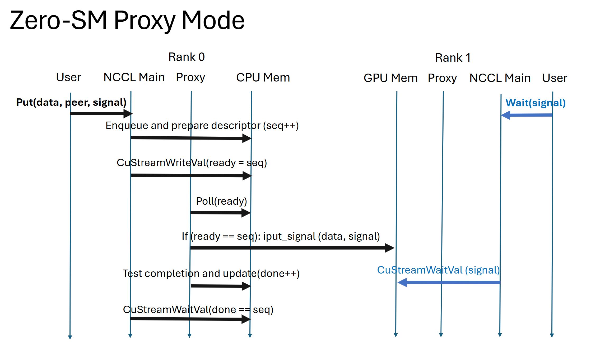
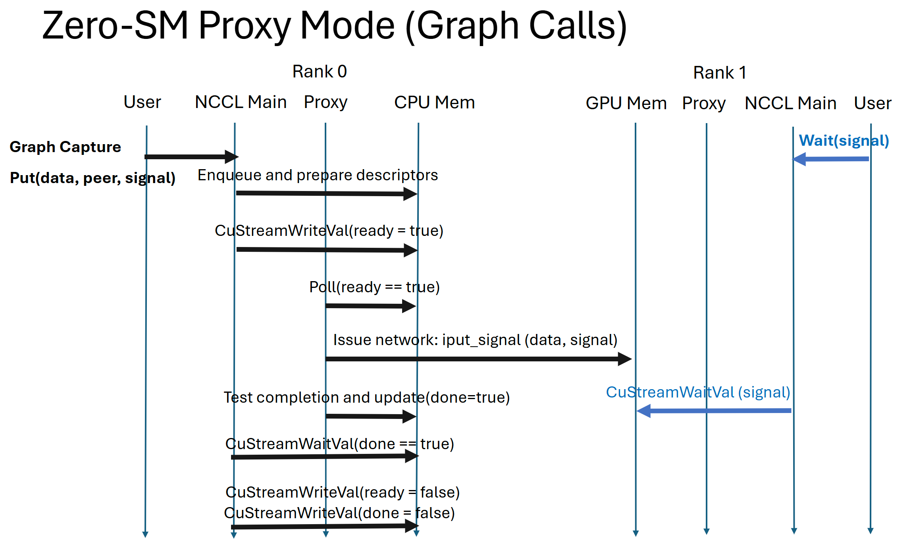

# NCCL Zero-SM Put API
<!-- use this template to share the details of your feature. Non-commented sections are strongly encouraged -->

## Abstract
<!-- here detail what the feature is about. A few sentence that can be copy-pasted to external actors -->

This PLC discusses the definition of the host-initiated one-sided `ncclPut` API and its zero-SM implementation.

<!-- ============================================================================================-->
<details>
<summary><h2>Motivation and Requirements</h2></summary>
<!-- ============================================================================================-->

Up to NCCL V2.28, NCCL primarily offers two-sided point-to-point APIs, such as send and recv. However, users have requested one-sided APIs due to their advantages, including reduced synchronization overhead and the ability to directly access remote memory without requiring active participation from the remote peer.

The foundation for one-sided operations was laid in NCCL V2.27 with the introduction of symmetric memory registration. This feature allows user buffers to be registered into a symmetric memory window, enabling direct operations on the memory region of the target peer.

This PLC is divided into two main parts:

- Definition of the host-initiated one-sided point-to-point API: The first part focuses on defining the API, which is designed to facilitate efficient one-sided operations.

- Implementation of the one-sided API with zero-SM techniques: The second part addresses the implementation details, specifically focusing on zero-SM techniques. The focus on zero-SM implementation is crucial for reducing SM utilization during communication. NCCL V2.28 introduced zero-SM using the Copy Engine (CE), which could be leveraged for our one-sided operations within the NVL domain. However, the current CE-based zero-SM method is limited to the NVL domain and does not extend to network operations, such as IB/ROCE. This work proposes new designs to extend zero-SM capabilities to network operations.

In summary, the overall goal is to provide a set of host-initiated one-sided APIs with implementations that enable zero-SM both within the NVL domain and over the network.

### API Requirements

- **Offer a complete set of APIs for one-sided Put operations:** Our focus is on the Put operation, and we aim to define a functional and minimal set of APIs to achieve one-sided Put operations. Other operations, such as Get or Flush, are not within the scope of this PLC.

- **Leverage symmetric memory registration APIs:** The one-sided API is required to operate on a symmetric window for direct target memory region access. The target buffer is required to register to the symmetric window in advance. Therefore, it is required to leverage the symmetric memory registration APIs introduced in NCCL V2.27.

- **Maintain resemblance to the device-initiated Put API:** In NCCL V2.28, NCCL provides a device-initiated Put API. The host-initiated API does not need to be identical but should be designed with reference to it.

### Functional Requirements

- **Eliminate SM usage for network operations:** The primary requirement is to eliminate the use of SMs for network operations. Unlike existing proxy-based networks or the latest GPU-initiated networks in NCCL that require GPU SMs to trigger, poll, and process network activities, our goal is to facilitate network operations for data produced or consumed by the GPU without involving SMs.

- **Keep stream semantics for zero-SM network:** NCCL operations must adhere to CUDA stream semantics, extending this requirement to the zero-SM network design. Traditional host-based network APIs (IB verbs, MPI Put) execute independently of GPU streams without ordering guarantees. Our zero-SM implementation must bridge this gap by ensuring network operations respect CUDA stream ordering. In a typical pipeline: (1) Kernel A produces data, (2) network transfers data to remote peer, (3) remote Kernel B consumes data. Correct execution requires ordering: network operations start only after Kernel A completes, and Kernel B starts only after transfer finishes. Host-based network operations cannot provide these stream ordering guarantees since they execute on CPU independently of GPU stream scheduling. Our zero-SM design must resolve this mismatch through careful synchronization mechanisms.

- **Support a wide-range of platforms:** There are multiple mechanisms to implement zero-SM networks. Some of these mechanisms may depend on specific hardware features of the NIC attached to the system. For the current PLC, our focus is on mechanisms that offer broad compatibility, ensuring support not only for NVIDIA NICs but also for NICs from other vendors.

- **Support NCCL grouped calls:** The implementation should allow users to group multiple one-sided calls while maintaining group semantics.

- **Support NCCL graph capture:** The implementation should be compatible with NCCL CUDA graph capture and execution.

- **Overall compatibility of Zero-SM NVL and Net implementations:** The zero-SM network implementation should ensure compatibility with the intra-NVL CE-based zero-SM. In a compatible implementation, when a user calls the NCCL one-sided API, the system should automatically select the appropriate zero-SM implementation based on whether the operation is within the NVL or across the network.

### Performance Requirements

- **Throughput:** Our design should achieve maximum single queue-pair bandwidth utilization for large message transfers with a single zero-SM Put operation. For concurrent operations targeting different peers, the design should aggregate multiple queue-pair throughputs to fully saturate the available NIC bandwidth.

- **Latency & Message rate:** Our design aims to optimize latency and message rate within the scope of our design. However, achieving SOL latency and maximum message rates is not a primary requirement for two key reasons: First, the design prioritizes broad platform compatibility over hardware-specific optimizations that could improve latency. Second, we balance performance against implementation complexity to ensure maintainability and extensibility. The design should nevertheless provide a foundation for future latency and message rate optimizations.

### Future and Beyond V2.29

- **Latency & message rate optimizations:** While out of scope for this PLC, these optimizations are planned for the V2.29 release. The current proxy-based design leverages existing NCCL proxy threads, which introduces known performance overhead compared to dedicated threads. This limitation has been observed in proxy-assisted device-side API evaluations. A potential solution involves spawning dedicated threads specifically for zero-SM proxy processing, but this represents a larger implementation effort that will be addressed after the current PLC design is completed.

- **Zero-SM collectives over the network:** Many collective operations (e.g., allgather, alltoall) could leverage the zero-SM Put API to achieve zero-SM network communication. Additionally, collectives could employ hybrid/hierarchical algorithms that combine zero-SM CE for intra-NVL communication with zero-SM network operations for inter-node transfers. This capability is out of scope for the current PLC and will be addressed in a separate specification.

- **Support other one-sided APIs:** This PLC focuses on the Put API. Additional one-sided operations such as Get, and Flush are deferred to future releases.

- **Zero-SM with GDA-ST:** This optimization is planned for post-V2.29 development. The current PLC focuses on a proxy-based mechanism for zero-SM network operations, which trades off performance for broad platform compatibility. GPUDirectAccess-StreamTriggered (GDA-ST) represents an alternative zero-SM network mechanism optimized specifically for NVIDIA NICs. This approach eliminates the need for CPU proxy threads, potentially delivering significant performance improvements. GDA-ST implementation is deferred as future work.


### NVbugs / Jira Tickets

https://nvbugspro.nvidia.com/bug/5303988

https://nvbugspro.nvidia.com/bug/5303999

### Assumptions, constraints and dependencies

- The Put API requires the symmetric memory registration APIs introduced in NCCL V2.27. Thus, all the dependencies required by the symmetric memory registration also apply here.

- The zero-SM network is built on top of GIN plugin introduced in NCCL V2.28. Thus dependencies to enable the GIN plugin also apply here.

### Use Cases
Zero-SM Put API provides substantial benefits in environments where:
1. Applications require one-sided communication APIs
2. Applications have high SM utilization requirements for computation
3. Communication and computation overlap is desired with minimal SM resource contention
4. System performance is currently bottlenecked by SM resource allocation for communication

<!-- ### User Experience -->
<!-- ### Platform Requirements -->
<!-- ### Functional Requirements -->
<!-- ### System Requirements -->
<!-- ### Interface Requirements -->
<!-- ### KPI Requirements -->
<!-- ### Security Requirements -->
<!-- ### Legal and Standards Requirements -->
<!-- ### Telemetry Requirements -->
<!-- ### Backward Compatibility Requirements -->
<!-- ### Virtualization Requirements -->

</details>

<!-- ============================================================================================-->
<details>
<summary><h2>API Definition</h2></summary>
<!-- ============================================================================================-->

The minimal set of APIs for the Put operation must achieve the following core functionalities:
- **Data Transfer**: Enable the active side to transfer data from a local buffer to a target memory region on the remote peer.
- **Memory Registration**: Utilize target memory regions that are pre-registered within the symmetric window.
- **Completion Detection**: Allow the active side to determine when the Put operation has completed successfully.
- **Arrival Verification**: Enable the passive side to verify that data has arrived and is ready for consumption.

Referring to the NCCL device-initiated Put API, we propose a host-initiated `ncclPut` API with integrated `signal` operations for remote notification. Synchronization is achieved through these put-with-signal operations used in conjunction with `wait` primitives on the remote side.

### Available Signal Operators

We propose to support the following signaling operations.

```cpp
typedef enum ncclSignalOp_t {
  ncclSignalInc = 0,
  ncclSignalAdd,
  ncclSignalSet,
} ncclSignalOp_t;
```
Supporting these operations presents challenges as they rely on underlying signaling mechanisms (e.g., atomic operations), and the signaling requirements differ between NVL and network environments.

- **Signal operations in NVL**: In the context of zero-SM, the `ncclSignalInc` and `ncclSignalAdd` operations rely on host-initiated atomic operations over NVL without consuming SM resources. This requires stream memory operations for signaling. However, stream memory operations with atomic reductions are not supported until CUDA 13.1. Therefore, for CUDA versions prior to 13.1, NVL signal operations only support `ncclSignalSet`.

- **Signal operations across network**: The `ncclSignalInc` and `ncclSignalAdd` operations depend on NIC atomic capabilities over the network. For example, typical RDMA NICs support Atomic FADD and Atomic CAS operations. Atomic FADD can be used to efficiently implement `ncclSignalInc` and `ncclSignalAdd`. However, implementing `ncclSignalSet` requires an initiator to perform a spin loop with CAS operations, retrying until successful completion. This approach has significant performance and consistency implications. Consequently, the existing network plugin used by NCCL core does not support the `ncclSignalSet` operation.

This creates a fundamental mismatch in supported signal operations between NVL and network environments:

- **Network operations**: Primarily support `ncclSignalInc` and `ncclSignalAdd` through NIC atomic operations
- **NVL operations**: Only support `ncclSignalSet` for CUDA versions prior to 13.1 due to stream memory operation limitations

This incompatibility requires careful consideration in the API design to ensure consistent behavior across different transport mechanisms.

### Context and Ordering Semantics

We introduce a **communication context** that defines an independent ordering and completion environment for Put operations. Communication contexts provide isolation and deterministic behavior for complex multi-operation sequences.

**Context Configuration**: Communication contexts are configured during communicator initialization, allowing users to specify the number of contexts needed for their application:

```cpp
ncclConfig_t config = NCCL_CONFIG_INITIALIZER;
    config.numCtxs = 1;
    NCCLCHECK(ncclCommInitRankConfig(&comm, nRanks, id, myRank, &config));
```

Each communication context maps to a dedicated queue pair. Put operations targeting the same peer but using different contexts utilize separate queue pairs, enabling independent ordering and progress guarantees per context. This design provides both performance isolation and semantic clarity.

Communication contexts provide the following guarantees:

**Signal Completion Semantics**: The completion of a signal update on the remote peer indicates that the corresponding data has been successfully delivered to the target memory location on that peer.

**Ordering Guarantees**: Operations within the same context targeting the same peer maintain strict ordering. When a regular Put operation is followed by a Put-with-signal operation to the same peer within the same context, the signal completion guarantees that both operations' data have been successfully delivered.

**Example**: Consider this sequence targeting the same peer and context:
1. `ncclPut(ctx, peer, data1, ...)` - regular Put without signaling
2. `ncclPut(ctx, peer, data2, ..., signal)` - Put with signaling

When the signal update completes on the remote peer, it guarantees delivery of both `data1` and `data2`, effectively providing a completion fence for all preceding operations in the context.

### API Option 1

We propose the following host-initiated `ncclPut` API definition. The API operates asynchronously with respect to the CPU host thread and adheres to CUDA stream semantics. The `ctx` parameter provides operation context for the Put request. The `localbuff` source buffer does not require registration in the symmetric window. The target buffer address is determined by `peeroffset` within the `win` object registered by the target peer. Signal operations are configured through `signalWin`, `signalOffset`, `signalType`, and `signalValue` parameters, enabling the passive side to verify data arrival. Signaling can be disabled by passing `NULL` to the `signalWin` parameter. When signalWin is NULL, the signalOffset, signalType, and signalValue parameters are ignored.

Unlike the device-initiated Put API, which includes a `counter` argument for the origin rank to verify completion, this host-initiated API does not include such an argument. Instead, completion can be verified using `cudaStreamSynchronize` from the host.

```cpp
/*
 * Put
 *
 * One-sided communication operation that writes data from the local buffer to a
 * remote peer's registered memory window without explicit participation from the
 * target process.
 *
 * Parameters:
 *   ctx          - Context identifier for the operation
 *   localbuff    - Local source buffer containing data to be transferred
 *   count        - Number of elements to transfer
 *   datatype     - NCCL data type of each element
 *   peer         - Target rank to write data to
 *   peeroffset   - Offset in bytes from the start of peer's registered window
 *   win          - Memory window object registered by the target peer
 *   signalWin    - Memory window containing the signal location for notification
 *   signalOffset - Offset in bytes from the start of signal window
 *   signalType   - Type of signal operation (increment, add, set, etc.)
 *   signalValue  - Value to use for the signal operation
 *   comm         - NCCL communicator
 *   stream       - CUDA stream to enqueue the operation on
 *
 * Returns:
 *   ncclSuccess on successful enqueue, error code otherwise
 */
ncclResult_t ncclPut(int ctx, const void* localbuff, size_t count, ncclDataType_t datatype, int peer, size_t peeroffset, ncclWindow_t win,
    ncclWindow_t signalWin, size_t signalOffset, ncclSignalType_t signalType, int signalValue, ncclComm_t comm, cudaStream_t stream);

/* Signal operation APIs */
ncclResult_t ncclWaitSignal(int ctx, ncclWindow_t signalWin, size_t signalOffset, uint64_t expected_value, cudaStream_t stream);
```

Here is an example of how to use the ncclPut API:
- **Buffer allocation and registration**: Allocate device buffers for data transfer. The receive buffer must be registered within the symmetric memory window.
- **Signal allocation and registration**: Allocate and register a separate signal space within the symmetric window for remote notification.
- **Active side**: Issue the ncclPut operation with signal parameters (`signalWindow`, `signalOffset`, `signalType`, `signalValue`). The operation is ordered within the CUDA stream but executes asynchronously with respect to the host thread. Use `cudaStreamSynchronize` to synchronize the host thread with ncclPut completion.
- **Passive side**: Use `ncclWaitSignal` with the same signal window and offset to wait for data arrival. This operation is also ordered within the stream and maintains proper synchronization semantics.

```cpp

NCCLCHECK(ncclCommInitRank(&comm, nranks, id, rank));

// Allocate device buffers
CUDACHECK(cudaMalloc(&d_sendbuf, bytes));
CUDACHECK(cudaMalloc(&d_recvbuf, bytes));

// Create and register memory windows
ncclWindow_t dataWindow;
ncclWindow_t signalWindow;
NCCLCHECK(ncclCommWindowRegister(comm, d_recvbuf, bytes, &dataWindow, NCCL_WIN_COLL_SYMMETRIC));

// Allocate and register signal space
int *d_signalBuf;
CUDACHECK(cudaMalloc(&d_signalBuf, sizeof(int)));
CUDACHECK(cudaMemset(d_signalBuf, 0, sizeof(int)));
NCCLCHECK(ncclCommWindowRegister(comm, d_signalBuf, sizeof(int), &signalWindow, NCCL_WIN_COLL_SYMMETRIC));

if (rank == 0) {
  // Rank 0 puts data to rank 1
  int ctx = 0;                     // Context identifier
  int target_rank = 1;
  size_t target_offset = 0;        // Put at beginning of target's data window
  size_t signal_offset = 0;        // Signal at beginning of signal window
  int signal_value = 1;            // Signal value to add

  // Perform PUT operation with signal
  NCCLCHECK(ncclPut(ctx, d_sendbuf, dataSize, ncclInt32, target_rank, target_offset,
                    dataWindow, signalWindow, signal_offset, ncclSignalAdd, signal_value,
                    comm, stream));

  // Wait for PUT to complete using stream synchronization
  CUDACHECK(cudaStreamSynchronize(stream));

} else if (rank == 1) {
  // Rank 1 waits for signal indicating data arrival (expecting value 1)
  int ctx = 0;                     // Context identifier
  size_t signal_offset = 0;        // Signal at beginning of signal window
  uint64_t expected_value = 1;     // Expected signal value

  // Wait for signal
  NCCLCHECK(ncclWaitSignal(ctx, signalWindow, signal_offset, expected_value, stream));

  CUDACHECK(cudaStreamSynchronize(stream));
}

```

The benefit of this API is that user has more control over the signal type and behavior. For instance, user could decide whether to use a per-peer signal with ncclSignalSet operation or to use a shared signal where all the peers increment on the same signal with ncclSignalInc.

However, this API approach has several drawbacks:

**Signal Type Incompatibility**: Due to the incompatibility between NVL and network signal types mentioned earlier, users must write separate code paths for NVL and network operations. If not handled properly, this leads to non-portable code that cannot work seamlessly across different transport layers.

**Memory Registration Ordering Requirements**: Buffers targeted by signaling operations require strong memory ordering to ensure signals cannot overtake data writes. This creates a fundamental problem because the current `ncclCommWindowRegister` function only supports relaxed ordering, as it was originally designed for data buffers rather than signal buffers.

This limitation forces a choice between these approaches to update the `ncclCommWindowRegister`:

1. **Dual Registration**: Register each memory region twice with the NIC - once with relaxed ordering for regular data operations and once with strong ordering for signal-targeted operations.

2. **Universal Strong Ordering**: Register all memory regions with strong ordering by default. This simplifies the implementation but may significantly impact performance for operations that don't require ordering guarantees.

3. **Enhanced Registration API**: Extend `ncclCommWindowRegister` with new flags that allow users to specify different memory ordering requirements at registration time.

**Signal Race Conditions**: In this API, signal memory registration through `ncclCommWindowRegister` is not bound to any specific communication context, allowing users to associate the same signal address with multiple contexts. Since different contexts map to different queue pairs (as explained earlier), and queue pairs may be distributed across multiple NICs in multi-NIC systems, this enables different NICs to target the same signal location simultaneously. This creates a race condition when NICs use non-atomic operations. Concurrent read-modify-write operations from multiple NICs can corrupt each other's updates, leading to inconsistent signaling state. The problem is particularly severe with current hardware: many NICs including ConnectX-7 and ConnectX-8 use read-modify-write operations instead of PCIe atomics in their default firmware configurations. Users can inadvertently trigger these races by reusing the same signal address across operations that utilize different contexts, which may be handled by different NICs.

### API Option 2

Previous options require users to explicitly manage signaling behavior, including choosing signal operations (e.g., `ncclSignalInc` or `ncclSignalSet`). This option abstracts signaling configuration from the user by providing a simplified semantics:

- **Put operations**: Use flexible signaling modes to control signal behavior
- **Wait operations**: Wait for `nsignals` number of signals from `peers`

The benefit of this approach is to provide flexible signaling semantics while allowing NCCL to optimize the underlying implementation for NVL and network. Users can choose between aggregated signaling (for barrier-like patterns) and distinct signaling (when peer identity matters), while NCCL handles the hardware-specific optimizations automatically.

```cpp
typedef enum {
    NCCL_SIGNAL_NONE = 0,        // No signaling
    NCCL_SIGNAL_AGGREGATE = 1,   // Signals can be aggregated/merged across peers
    NCCL_SIGNAL_DISTINCT = 2     // Signals must remain distinct per-peer
} ncclSignalMode_t;

/*
 * Put with flexible signaling modes
 *
 * One-sided communication operation that writes data from the local buffer to a
 * remote peer's registered memory window without explicit participation from the
 * target process.
 *
 * Parameters:
 *   ctx          - Context identifier for the operation
 *   localbuff    - Local source buffer containing data to be transferred
 *   count        - Number of elements to transfer
 *   datatype     - NCCL data type of each element
 *   peer         - Target rank to write data to
 *   peeroffset   - Offset in bytes from the start of peer's registered window
 *   win          - Memory window object registered by the target peer
 *   signalMode   - Signaling behavior:
 *                  NCCL_SIGNAL_NONE: No signaling after put operation
 *                  NCCL_SIGNAL_AGGREGATE: Signal can be merged with others (use for barrier-like patterns)
 *                  NCCL_SIGNAL_DISTINCT: Signal must remain separate per-peer (use when peer identity matters)
 *   comm         - NCCL communicator
 *   stream       - CUDA stream to enqueue the operation on
 *
 * Returns:
 *   ncclSuccess on successful enqueue, error code otherwise
 */
ncclResult_t ncclPut(int ctx, const void* localbuff, size_t count, ncclDataType_t datatype, int peer, size_t peeroffset, ncclWindow_t win, ncclSignalMode_t signalMode, ncclComm_t comm, cudaStream_t stream);

/*
 * Send signal to peer
 *
 * Sends a signal to the specified peer without transferring data. This provides
 * a lightweight synchronization mechanism for coordination between ranks. The
 * signal implementation is abstracted - NCCL automatically selects the appropriate
 * signaling mechanism (increment, set, etc.) based on the transport layer.
 *
 * Parameters:
 *   ctx          - Context identifier for the operation
 *   peer         - Target rank to send signal to
 *   signalMode   - Signaling behavior:
 *                  NCCL_SIGNAL_AGGREGATE: Signal can be merged with others (use for barrier-like patterns)
 *                  NCCL_SIGNAL_DISTINCT: Signal must remain separate per-peer (use when peer identity matters)
 *                  Note: NCCL_SIGNAL_NONE is not valid for explicit signal operations
 *   comm         - NCCL communicator
 *   stream       - CUDA stream to enqueue the operation on
 *
 * Returns:
 *   ncclSuccess on successful signal enqueue, error code otherwise
 */
ncclResult_t ncclSignal(int ctx, int peer, ncclSignalMode_t signalMode, ncclComm_t comm, cudaStream_t stream);

/*
 * Wait for signals from multiple peers
 *
 * Waits for specified number of signals from each peer. This provides flexible
 * synchronization patterns for multi-peer communication while allowing NCCL to
 * optimize signal counters based on transport types (network vs NVL).
 *
 * Parameters:
 *   ctx          - Context identifier for the operation
 *   peers        - Array of peer ranks to wait signals from
 *   nsignals     - Array of signal counts, where nsignals[i] is the number of
 *                  signals to wait for from peers[i]. NCCL uses the peer rank to
 *                  infer transport type (network vs NVL) and selects appropriate
 *                  signal counters with correct atomicity properties.
 *   npeers       - Number of peers (length of both peers and nsignals arrays)
 *   signalMode   - Signaling behavior:
 *                  NCCL_SIGNAL_AGGREGATE: Signals within same transport can be merged
 *                  NCCL_SIGNAL_DISTINCT: All signals must remain separate per-peer
 *                  Note: NCCL_SIGNAL_NONE is not valid for wait operations
 *   comm         - NCCL communicator
 *   stream       - CUDA stream to enqueue the operation on
 *
 * Returns:
 *   ncclSuccess when all required signals received, error code otherwise
 */
ncclResult_t ncclWaitSignal(int ctx, int* peers, int* nsignals, int npeers, ncclSignalMode_t signalMode, ncclComm_t comm, cudaStream_t stream);
```

#### Signal Modes

This API abstracts away the signaling behavior details from the user, providing a clean interface while addressing the limitations of Option 1. However, this abstraction creates an optimization challenge for NCCL: identical API calls may require fundamentally different implementations for optimal performance or correctness depending on the communication pattern. There are two major siganling approaches that we need to support:

1. **Per-peer signal locations**: Required for peer-specific ordering but more complex and potentially slower
2. **Shared counter signaling**: More efficient for bulk synchronization but breaks peer-specific ordering

To enable optimal implementations, we propose two signal modes that serve as hints from the user:

- **`NCCL_SIGNAL_DISTINCT`**: Forces per-peer signal locations to maintain peer-specific ordering. This mode ensures that signals from different peers remain distinguishable, enabling sequential processing patterns and point-to-point coordination.

- **`NCCL_SIGNAL_AGGREGATE`**: Allows NCCL to use shared counter signaling for better performance. This mode enables NCCL to use atomic reductions on a single memory location when supported by the underlying hardware, optimizing bulk synchronization patterns like barriers and gather operations.


#### Example 1: When NCCL_SIGNAL_DISTINCT is Required

The `NCCL_SIGNAL_DISTINCT` mode is essential for communication patterns where **peer identity matters** and specific ordering between peers must be maintained. This is required when:

- Operations depend on knowing which specific peer sent a signal
- Sequential processing requires data from specific peers in a particular order
- Point-to-point coordination between designated neighbors is needed

**Multi-step Ring Data Transfer Example:**

The following example demonstrates a ring-based data transfer algorithm where each rank communicates only with its immediate neighbors. This pattern requires `NCCL_SIGNAL_DISTINCT` because each rank must coordinate specifically with its upstream and downstream neighbors - using aggregated signaling would break the ring topology and create race conditions.

```cpp
// Register memory window for data transfers
cudaMalloc(&dataBuffer, bufferSize);
ncclWindow_t dataWindow;
NCCLCHECK(ncclCommWindowRegister(comm, dataBuffer, bufferSize, &dataWindow,
                                NCCL_WIN_COLL_SYMMETRIC));

// Calculate ring topology
int ctx = 0;  // Use context 0
int upstream_rank = (rank - 1 + nranks) % nranks;
int downstream_rank = (rank + 1) % nranks;

// Allocate local buffers
float *recv_buf, *send_buf;
cudaMalloc(&recv_buf, chunk_size);
cudaMalloc(&send_buf, chunk_size);

// Multi-step ring data transfer algorithm
for (int step = 0; step < nranks; step++) {
    // Step 1: Process recv_buf and populate send_buf
    processDataKernel<<<blocks, threads, 0, stream>>>(recv_buf, send_buf, chunk_size);

    // Step 2: Send signal upstream to indicate ready to receive
    ncclSignal(ctx, upstream_rank, NCCL_SIGNAL_DISTINCT, comm, stream);

    // Step 3: Wait for downstream to give us free space (ready signal)
    int downstream_peer = downstream_rank;
    int nsignals_downstream = 1;
    ncclWaitSignal(ctx, &downstream_peer, &nsignals_downstream, 1, NCCL_SIGNAL_DISTINCT, comm, stream);

    // Step 4: Send data downstream with completion signal
    size_t elements = chunk_size / sizeof(float);
    ncclPut(ctx, send_buf, elements, ncclFloat32, downstream_rank,
            step * chunk_size, dataWindow, NCCL_SIGNAL_DISTINCT, comm, stream);

    // Step 5: Wait for data from upstream
    int upstream_peer = upstream_rank;
    int nsignals_upstream = 1;
    ncclWaitSignal(ctx, &upstream_peer, &nsignals_upstream, 1, NCCL_SIGNAL_DISTINCT, comm, stream);
}
```

#### Example 2: When NCCL_SIGNAL_AGGREGATE is Optimal

The `NCCL_SIGNAL_AGGREGATE` mode is ideal for **bulk synchronization patterns** where only the total count of completions matters, not the identity of individual senders. This mode enables significant performance optimizations:

- Uses shared signal counters instead of per-peer signal locations
- Reduces memory overhead
- Eliminates need to track individual peer states
- Optimal for barrier-like operations and gather patterns

**Gather Operation Example:**

The following gather operation demonstrates when aggregated signaling is preferred. Rank 0 only needs to know that all data has arrived from other ranks - the arrival order is irrelevant since each rank writes to a distinct memory offset.

```cpp
// Gather operation: All ranks send to rank 0, arrival order doesn't matter
if (rank != 0) {
  // All non-zero ranks put data to rank 0
  int ctx = 0;
  int target_rank = 0;
  size_t target_offset = rank * chunk_size;  // Each rank has its own offset

  NCCLCHECK(ncclPut(ctx, d_sendbuf, chunk_size, ncclInt32, target_rank, target_offset,
                    dataWindow, NCCL_SIGNAL_AGGREGATE, comm, stream));

} else if (rank == 0) {
  int ctx = 0;

  // Create arrays for all sending peers (ranks 1 through nranks-1)
  int *sending_peers = (int*)malloc((nranks - 1) * sizeof(int));
  int *nsignals_per_peer = (int*)malloc((nranks - 1) * sizeof(int));

  for (int i = 0; i < nranks - 1; i++) {
    sending_peers[i] = i + 1;  // Ranks 1, 2, ..., nranks-1
    nsignals_per_peer[i] = 1;  // Expect 1 signal from each peer
  }

  // Wait for ALL senders to complete - order doesn't matter
  // NCCL can optimize this using a shared counter for all peers
  NCCLCHECK(ncclWaitSignal(ctx, sending_peers, nsignals_per_peer, nranks - 1,
                          NCCL_SIGNAL_AGGREGATE, comm, stream));

  // Process gathered data (all data is now available)
  gather_process_kernel<<<blocks, threads, 0, stream>>>(d_recvbuf);

}

CUDACHECK(cudaStreamSynchronize(stream));
```

#### Addressing Option 1 Drawbacks

This API design addresses the three major drawbacks identified in Option 1:

1. **Eliminates Signal Type Incompatibility**: The API abstracts away the underlying signal operation types (`ncclSignalAdd` or `ncclSignalSet`). NCCL automatically selects the appropriate signaling mechanism based on user hints provided through `signalMode` and platform capabilities. This allows users to write portable code that works seamlessly across both NVL and network transports without requiring separate code paths.

2. **Resolves Memory Registration Ordering Issues**: Signal space allocation and registration are completely abstracted from the user. NCCL internally manages signal memory registration and can apply the necessary strong memory ordering guarantees specifically for signal buffers, eliminating the ordering mismatch problem that existed when users manually registered signal spaces through the generic `ncclCommWindowRegister` function.

3. **Prevents Signal Race Conditions**: All Put and signaling APIs are explicitly associated with a communication context. This context-based design ensures that signals are properly bound to their respective contexts, eliminating the race conditions that occurred in Option 1 when multiple contexts (potentially mapped to different NICs) could target the same unbound signal location simultaneously.

</details>

<!-- ============================================================================================-->
<details>
<summary><h2>Zero-SM Put over Network</h2></summary>
<!-- ============================================================================================-->

### Proxy-Based Zero-SM over Network

We utilize a proxy-based mechanism to implement zero-SM Put operations over the network. The overall design employs CPU-based proxy threads to orchestrate network tasks while maintaining CUDA stream semantics:

- Main Thread: Handles API calls, manages descriptor queues, and sets up stream synchronization

- Proxy Thread: Performs actual network operations independently, polling for work and handling network plugin interactions

- Stream Semantics: Maintains CUDA stream ordering guarantees through use of cuStreamWriteValue and cuStreamWaitValue operations

We will use an example to illutrate overall flow of the design.

#### Active Side

1. **Operation Enqueue**: When the active rank calls `ncclPut` with a `signal`, the NCCL main thread parses the `ncclPut` call and enqueues the operation into the NCCL processing pipeline. This is accomplished by adding a zero-SM network function descriptor to a descriptor queue in CPU memory. The function descriptor also includes a sequence number which is incremented for each of the operation.

2. **Stream Order Maintenance**: NCCL also maintains a set of ready/done signals. The main thread updates the ready signal using `cuStreamWriteValue` with the sequence number of the operation. This ensures that the network operation maintains stream order with respect to previous operations on the CUDA stream, as `cuStreamWriteValue` completes only after preceding kernels/operations on the same stream finish.

3. **Completion Synchronization**: The main thread issues a `cuStreamWaitValue` for the done signal, which is updated by the proxy thread once the network transfer is complete. This ensures that subsequent kernels/operations start only after the network operation is finished. After this setup, the main thread can proceed to other tasks.

4. **Proxy Thread Processing**: The proxy thread, created during initialization, continuously polls the descriptor queue and the ready signal. If the queue is not empty and the ready signal is set, the proxy thread initiates the network operation using network plugin APIs. It transfers the data and updates the `signal` on the target rank. The proxy also checks for the completion of the network operation using the network plugin's test function. Once complete, it updates the done signal, unblocking the `cuStreamWaitValue` issued by the main thread.

#### Passive Side

To verify data arrival, the user can call `ncclWaitSignal`, which internally uses `cuStreamWaitValue` on the `signal`.




### Zero-SM Put Graph Calls

NCCL APIs support CUDA graph capture and execution. For zero-SM network operations, we need to adapt our synchronization mechanism to work correctly with CUDA graphs. The sequence number-based synchronization approach used for regular stream operations is incompatible with CUDA graphs. During graph capture, sequence numbers become fixed values that are baked into the graph. When the graph is executed multiple times, these sequence numbers do not increment between executions, causing the counter-based ready/done signal mechanism to fail. Specifically, each graph execution would wait for the same counter value, leading to incorrect synchronization behavior.

To address this limitation, we implement a flag-based synchronization protocol specifically designed for CUDA graphs:

- **Ready Signal**: Instead of writing an incrementing sequence number, the main thread sets the ready flag to 1 using `cuStreamWriteValue`. This indicates that the operation is ready to be processed by the proxy thread.

- **Proxy Polling**: The proxy thread polls the ready signal, waiting for it to become true (value 1) before initiating the network operation.

- **Completion Signal**: The main thread issues a `cuStreamWaitValue` operation waiting for the done signal to be set to 1, which will be updated by the proxy thread upon operation completion.

- **Signal Reset**: To prepare for subsequent graph executions, the main thread enqueues additional stream memory operations to reset both the ready and done signals back to 0. This ensures that each graph execution starts with clean signal states.

This approach comes with the cost of additional signal reset operations. Therefore, we will use flag-based synchronization only for CUDA graph capture and execution and use sequence-based synchronization for other cases.



<!-- ### Interface Architecture -->
<!-- ### System KPIs & Metrics -->
<!-- ### Data Architecture -->
<!-- ### Security Design -->
<!-- ### Debugging & Troubleshooting -->
<!-- ### Logging and Instrumentation -->
<!-- ### Operational Considerations -->

</details>


</details>

<!-- ============================================================================================-->
<details>
<summary><h2>Testing and Validation</h2></summary>
<!-- ============================================================================================-->

<!-- ### Objectives and Timeline -->

<!-- ### Validation -->

<!-- #### Where to run? -->

<!-- #### What to run? -->

<!-- #### Expected output? -->

<!-- #### Code Coverage Goal Defined -->
<!-- #### KPI Coverage Goals Defined (performance, stress, stability, throughput, latency) -->
<!-- #### Requirement Coverage Goal Defined -->
<!-- #### Quality Thresholds Defined -->
<!-- #### Test Timeline -->
<!-- #### SW Verification and Test Plan -->
<!-- ### Test plan -->
<!-- #### Requirements Tests -->
<!-- #### Interface Tests -->
<!-- #### Fault-injection Tests -->
<!-- #### Resource Usage Tests -->
<!-- #### Design Coverage Testing -->
<!-- #### Boundary Tests -->
<!-- #### Certification Tests -->
<!-- #### Stress Tests -->
<!-- #### Stability Tests -->
<!-- #### Perf and Power KPI Tests -->
<!-- #### Usability & OOBE Tests -->
<!-- #### Manufacturing Diagnostic(Factory) Tests -->

<!-- ### Performance -->

<!-- #### What is measured? -->

<!-- #### Results -->


</details>

<!-- ============================================================================================-->
<details>
<summary><h2>Signoff List</h2></summary>
<!-- ============================================================================================-->

Author(s):
  - Zhenhao He

</details>
