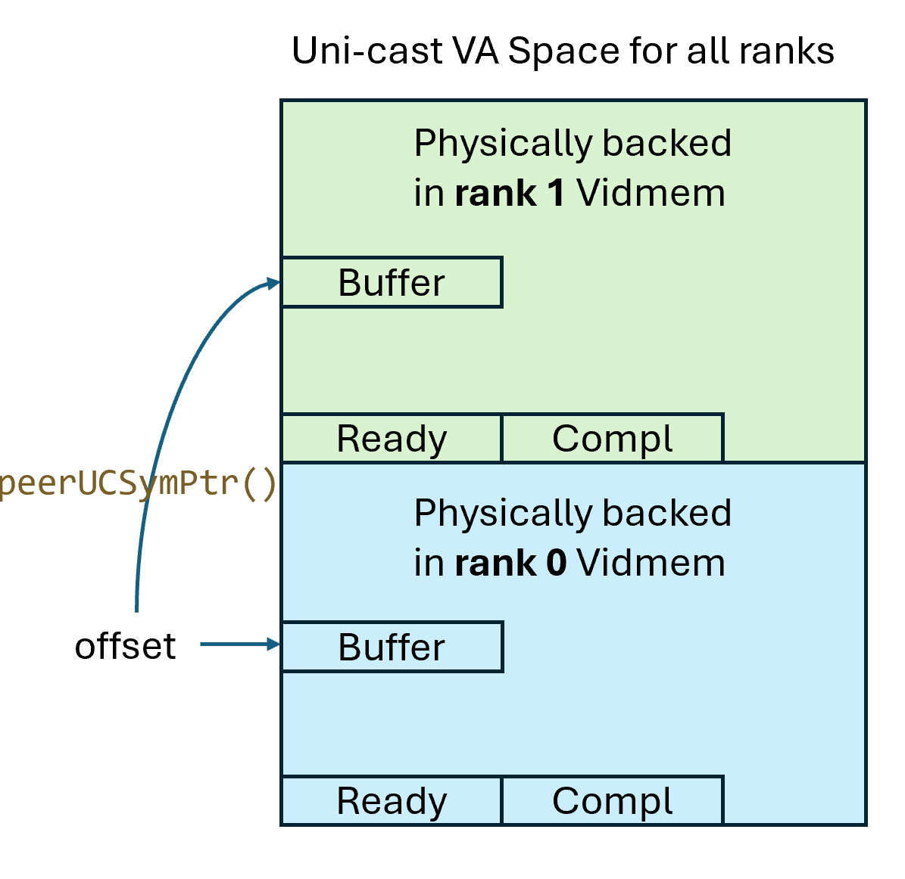
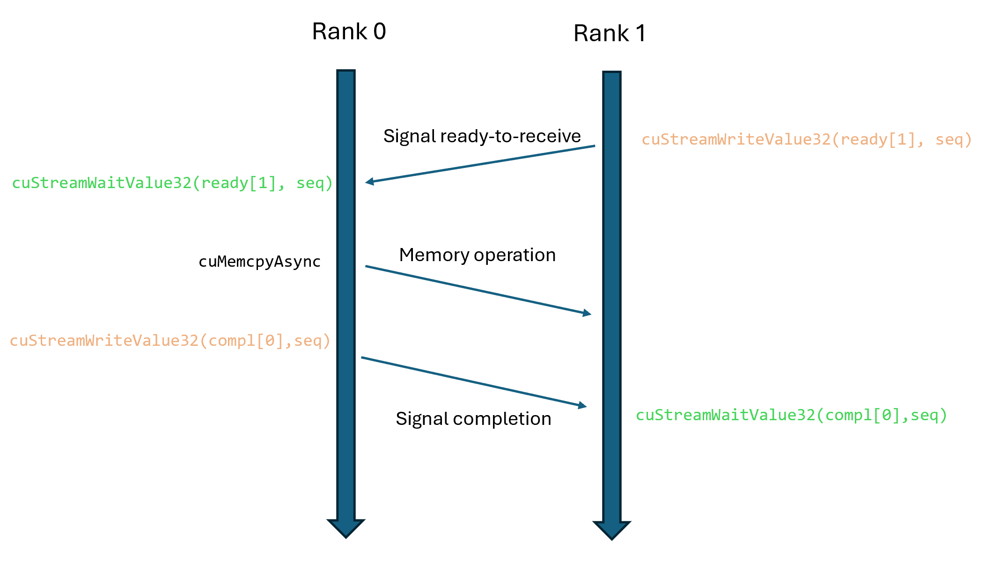
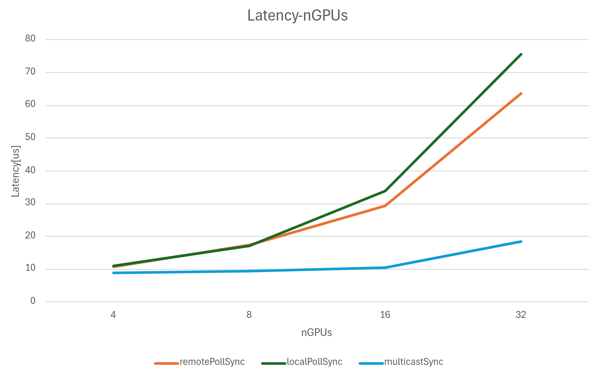
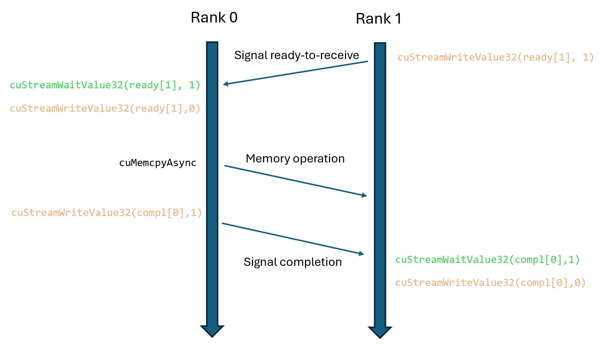
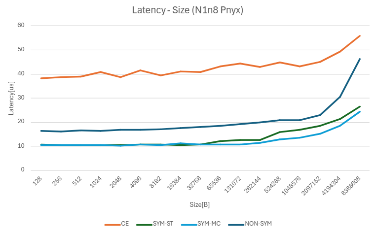
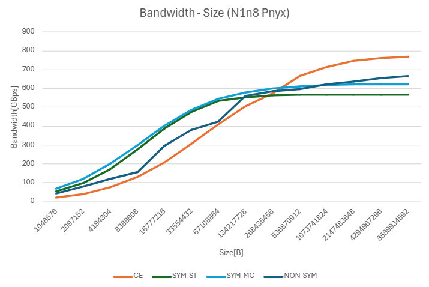
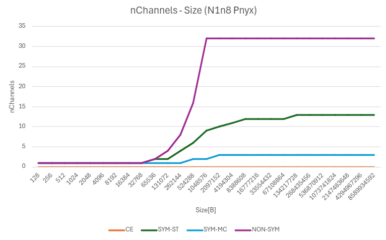

# CE_Collectives
<!-- use this template to share the details of your feature. Non-commented sections are strongly encouraged -->

## Abstract
<!-- here detail what the feature is about. A few sentence that can be copy-pasted to external actors -->

Copy Engine (CE) based collectives is a feature that reduces the SM utilization in NCCL while maintaining high-bandwidth communication performance.

<!-- ============================================================================================-->
<details>
<summary><h2>Motivation and Requirements</h2></summary>
<!-- ============================================================================================-->

Existing SM-based collectives in NCCL consume substantial SM resources (typically 16 or 32 SMs) to saturate NVLink bandwidth. This creates resource contention between communication and computation tasks, which becomes more pronounced as NVLink bandwidth continues to increase, requiring even more SMs to achieve peak performance.

CE-based collectives address this challenge by leveraging dedicated copy engines to perform data transfers within a single NVLink domain, preserving valuable SM resources for computational workloads.


### Key Functional Requirements for V2.28:

1. **Use copy engine to minimize SM utilization**
   - The goal is to reduce the SM utilization as much as possible by utilizing copy engines for the majority of data movement operations. We focus on host-initiated CUDA APIs like `cudaMemcpyAsync` that invoke hardware copy engines.

2. **Exploit symmetric memory registration APIs in NCCL**
   - Since NCCL 2.27, the `NCCL symmetric memory registration APIs` are available in the public release. And the CE-based collectives can be benefit from the symmetric memory registration APIs in NCCL to avoid staging buffer copies and to eliminate user buffer exchange. We plan to use the symmetric memory registration APIs in NCCL to ensure that collective buffers are registered and accessible within a global address space. This symmetric memory model enables direct CE-based operations without requiring explicit buffer address exchange prior to collective operations.

3. **Keep the two-sided semantic in NCCL CE collectives**
   - Even with the symmetric memory registration API, the CE-based collective still requires some synchronization becuase of two-sided semantic in NCCL collectives, i.e., the sender needs to know the readiness of the receiver and the receiver needs to know the completion of the data transfer process. Therefore, it requires the following synchronizations:
      - **Readiness synchronization**: ensures receivers are prepared before data transfer begins.
      - **Completion synchronization**: confirms to receivers that data transfer has completed.
   - We propose to use GPU-resident synchronization by using CUDA stream memory operations: `cuStreamWriteValue32` and `cuStreamWaitValue32` to build synchronization primitives. These operations are in stream order, do not block the host CPU thread, and do not require GPU kernel launches as they are handled by the HOST engine in hardware.

4. **Allow users to enable/disable CE-based collectives**
   - The use of CE-based collective should be incorporated into the NCCL tuning process. Besides, users should be able to choose to enable or disable CE-based collectives based on their specific requirements, particularly with respect to SM availability and the need for computation and communication overlap.

5. **Support non-arithmetic collectives**
   - We plan to support non-arithmetic collectives (e.g., AllGather) in this release, as they can be efficiently implemented using copy engines. In this release, we do not support arithmetic collectives (e.g., AllReduce).

6. **Support multi-node NVLink**
   - CE-based collectives require operation within a single NVLink domain, as copy engines cannot move data across separate NVLink domains. As the NVL domain grows larger and scales across multiple nodes, our design needs to ensure compatibility with emerging multi-node NVLink cluster architectures.

7. **Graph support of CE collectives**
   - The CE-based collectives should be compatible with NCCL CUDA graph capture and execution.


### Performance/Optimization Requirements for V2.28:
The use of CE-based collectives involves trade-offs between performance and SM utilization. The overall performance goal is not to achieve lower latency and higher throughput across all message sizes compared to SM-based collectives. We accept that due to the launch and synchronization overheads, CE-based collectives may have higher latency for small messages. However, we still need optimize the latency for small messages and the throughput for large messages as much as possible. Such that CE-based collectives could be a appealing option for users who want to save SM usage.

1. **Use batch APIs to optimize latency and throughput**
   - One challenge is to address the inherently higher launch and synchronization overhead of CE operations compared to SM-based collectives and we aim to reduce the latency as much as possible and saturate the NVL bandwidth.
   - Since CUDA 12.8, there are newer APIs to invoke multiple CE operations in a batch to reduce the launching overhead (e.g., `cuMemcpyBatchAsync`). These APIs group multiple CE operations into a batch and launch them in a single call and potentially pipeline the CE operations, thus reducing the overhead of launching multiple CE operations and improving the throughput.
   - Similarly, we plan to use batch APIs (e.g., `cuStreamBatchMemOp`) for synchronization primitives to reduce the overhead of launching multiple synchronization operations.

2. **Provide a fast path in NCCL core for enqueue and invocation of CE collectives**
   - The CE collectives are different than existing NCCL collectives in many different ways. For instance, it does not require SM kernel invocation, it does not require user buffer exchange, it does not use the same synchronization mechanism etc. This means that many of the existing NCCL core functionalities are not applicable to CE collectives and thus should be skipped in the CE collectives invocation path. This could be a potential performance overhead if we keep the existing NCCL core functionalities in the CE collectives invocation path.
   - We plan to identify the NCCL core functionalities that are not applicable to CE collectives and provide a fast path in NCCL core for enqueue and invocation of CE collectives.

3. **Use NVLS multi-cast to optimize synchronization**
    - The synchronization of multiple ranks involves operations such as broadcasting a flag value to all ranks. We plan to use NVLS multi-cast to optimize the synchronization overhead.

### Optional and Beyond V2.28:

1. **Support Send/Recv**
   - Two-sided point-to-point APIs like `Send/Recv` require explicit buffer address exchange between peers since they typically do not follow symmetric memory semantics in real-world applications. This exchange typically requires host network operations to resolve peer addresses before CE operations can begin. The host thread must block while resolving addresses, adding latency overhead. Due to these performance implications and the extra complexity, we consider point-to-point support optional for V2.28.

2. **Support Put/Get**
   - One-sided point-to-point APIs such as `Put/Get` provide a better integration mechanism for CE-based collectives since they eliminate the need for explicit buffer address exchange between peers. The one-sided semantics also remove the requirement for completion synchronization between sender and receiver. However, since Put/Get APIs are not yet available in the current NCCL release, we plan to implement support for them in V2.29.

3. **Support Alltoall**
   - The Alltoall collective operation with symmetrically registered buffers could benefit from CE-based implementation to reduce SM utilization. However, since the NCCL Alltoall API is being developed in parallel for V2.28 release, we have decided to make CE-based Alltoall support optional for V2.28. It will be supported in V2.29 if it is not ready for V2.28.

4. **Network support**
   - There has been discussion on SM-reduction techniques for collectives that span across network, e.g., IB/RoCE. This is out of the scope for V2.28 and we plan to look into it in a future release.

5. **Support arithmetic collectives**
   - Arithmetic collectives (e.g., AllReduce) is more complicated and requires additional reduction operations in the SM. We plan to support arithmetic collectives in the future, potentially using a hybrid approach where CE handles data movement and SMs perform reduction operations.

6. **Support MMIO-based CE invocation**
   - There is internal effort of providing a new mechanism to invoke copy engines from the device side: MMIO-based CE APIs. The use of this mechanism is not yet available in the public release and is out of scope for V2.28. We plan to investigate the use of this mechanism in a future release, in conjuction with the NCCL device side APIs.

7. **Relaxed synchronization for CE collectives**
   - Current NCCL API semantics require both Readiness and Completion synchronization. However, in many real-world applications, such strict synchronization can be relaxed. For example, readiness synchronization—ensuring that the receiver is prepared before the sender initiates transfer—can often be handled by the application itself. This is particularly common in designs that use double buffering. We plan to investigate relaxing the synchronization requirements for CE collectives to potentially improve performance. However, these semantic changes require careful consideration and will be explored in a future release.

### NVbugs / Jira Tickets

- [NCCL-1909](https://jirasw.nvidia.com/browse/NCCL-1909)

### Assumptions, constraints and dependencies for CE-based collectives in V2.28

- We accept non-zero SM usage for certain operations (e.g., intra-GPU transfers). While copy engines handle inter-GPU transfers, some intra-GPU operations (such as self-copies in out-of-place collectives) may still use SMs. Such setting depends on the CUDA implementation of the `cudaMemcpyAsync` API. This trade-off is acceptable as these transfers represent a small fraction of overall data movement.

- CE-based collectives are limited to operating within a single NVLink domain, as copy engines cannot transfer data across different NVLink domains.

- CE collectives are built on top of symmetric memory and collective calls not using symmetric memory will not use CE collectives.

- The initial implementation targets collectives that do not involve arithmetic operations on the data, such as AllGather. Support for arithmetic-based collectives, like AllReduce, is planned for future versions.

- The CE collectives relies on NCCL's symmetric memory registration APIs (since NCCL 2.27) and requires support for CUDA Virtual Memory Management (VMM).

- The batch memory copy APIs for CE operations are available in CUDA 12.8 and later. We have a fallback mechanism to use non-batch APIs for older CUDA versions.

- The CE-based AlltoAll depends on the new NCCL AlltoAll API (should be available in NCCL 2.28).

- The CE-based Put/Get depends on the new NCCL Put/Get API (should be available in NCCL 2.28).

- The stream memory operations do not support device pointer allocated by VMM APIs before CUDA 12.5. We need to have a fallback mechanism for older CUDA versions.

- The multi-node NVLink support is only available in CUDA 12.8 and later.

- The cudaMemcpyBatchAsync is not supported during CUDA graph capture as of CUDA 12.8.

- Group calls of multiple collectives will not invoke the CE collectives.

### Use Cases
CE-based collectives provide substantial benefits in environments where:
1. Applications have high SM utilization requirements for computation
2. Communication and computation overlap is desired with minimal resource contention
3. System performance is currently bottlenecked by SM resource allocation for collective operations

<!-- ### Platform Requirements -->
<!-- ### Functional Requirements -->
<!-- ### System Requirements -->
<!-- ### Interface Requirements -->
<!-- ### KPI Requirements -->
<!-- ### Security Requirements -->
<!-- ### Legal and Standards Requirements -->
<!-- ### Telemetry Requirements -->
<!-- ### Backward Compatibility Requirements -->
<!-- ### Virtualization Requirements -->

</details>

<!-- ============================================================================================-->
<details>
<summary><h2>Design</h2></summary>
<!-- ============================================================================================-->

### Proposed Design

#### 1. Symmetric Memory Registration

CE-based collectives exploit symmetric user buffer registration for two critical reasons:

- **Avoid Staging Buffer Copies**: host-initiated CE operations incur significant invocation and synchronization overhead and using CEs to operate on staging buffers degrades the performance. Direct operation on registered user buffers eliminates the need for additional staging buffer copies.

- **Eliminate SM-based Buffer Exchange**: even though pre-2.27 NCCL already provides non-symmetric user buffer registration and it can avoid staging buffer copies with the user buffer registration, it still requires mechanisms to exchange the user buffers between senders and receivers prior to the collective operations. And the existing user buffer exchange mechanisms requires NCCL proxy threads orchestration and SM kernel invocation. The SM-based user buffer exchange contradicts our goal of minimizing SM utilization. Using the symmetric memory registration APIs can avoid the need for user buffer exchange synchronization at all.

The figure below illustrates the uni-cast virtual address space layout used for symmetric memory registration. Each rank is allocated a fixed-size stride in the virtual address range, which maps to distinct physical memory regions. During the initialization of the communicator, the communicator allocates ready/completion flags in the symmetric heap, which is used for CE synchronization. Using NCCL 2.27's symmetric memory APIs, the application can register user buffers within this symmetric window. During the collective operations, NCCL will check if the user buffer is registered in the symmetric window and if the CE conditions are met. If conditions are met, NCCL will use CE collectives for the operation.



#### 2. Peer Synchronization Mechanism
Existing NCCL APIs have a two-sided semantic, i.e., the sender needs to know the readiness of the receiver and the receiver needs to know the completion of the data transfer process. Therefore, it requires the following synchronizations:

- **Readiness Synchronization**: Ensures receivers are prepared before data transfer begins
- **Completion Synchronization**: Confirms to receivers that data transfer has completed

Several approaches can be used to implement synchronization for CE-based collectives. Since we aim to enqueue both synchronization and CE operations into the CUDA stream in stream order, and to avoid using SM resources, new synchronization designs are needed.
  - One option is to use the CPU network, such as `NCCL proxy threads`, to synchronize readiness and completion. However, this approach requires blocking the host CPU thread before enqueuing CE operations, as CPU network operations are not in stream order with the CUDA stream.
  - Another option is to use SM GPU kernels for synchronization, similar to the mechanism in NCCL 2.27’s `symmetric kernel implementation` for symmetric memory models. However, this involves launching GPU kernels, which conflicts with our goal of minimizing SM usage.
  - The third option is to use CUDA `stream memory operations` such as `cuStreamWriteValue32` and `cuStreamWaitValue32` to build synchronization primitives. These operations are in stream order, do not block the host CPU thread, and do not require GPU kernel launches as they are handled by the HOST engine in hardware. They can target remote GPU memory locations within a single NVLink domain, work across multi-node configurations without requiring CPU-side networking for synchronization, and enable completely **GPU-resident Synchronization** for collective operations.

We propose to use the third option by using CUDA stream memory operations. Here is the basic synchronization mechanism:
   - Receiver posts ready flag using `cuStreamWriteValue32`
   - Sender waits on ready flag using `cuStreamWaitValue32`
   - Sender initiates data transfer via `cudaMemcpyAsync`
   - Sender posts completion flag using `cuStreamWriteValue32`
   - Receiver waits on completion flag using `cuStreamWaitValue32`

Each CE operation uses sequence numbers for both ready and completion flags. The sequence number starts at 0 and increments by 1 for each new CE operation. This ensures that ranks are always waiting for a new, unique flag value in each iteration. This sequence-based synchronization prevents any potential race conditions between consecutive CE operations.



#### 3. Batched APIs for Synchronization and Multi-cast Synchronization
To optimize synchronization across multiple peers, we propose using batched APIs for stream memory operations (`cuStreamBatchMemOp`) and CUDA multicast APIs to reduce overhead when managing multiple synchronization points.

We define three synchronization mechanisms based on where polling occurs and how memory operations are issued:

- **remotePollSync**: Each peer performs:
  - One local write operation to its own memory
  - (nRank-1) remote wait operations on other peers' memory

- **localPollSync**: Each peer performs:
  - (nRank-1) remote write operations to other peers' memory
  - (nRank-1) local wait operations on its own memory
  - Benefit: Polling on local memory can reduce latency.
  - Drawback: Requires more total stream memory operations.

- **multicastSync**: Each peer performs:
  - Registers its ready/completion flags into a multicast group via CUDA multicast APIs
  - Performs 1 local write (cuStreamWriteValue32) to the multicast object, which broadcasts the value to all peers
  - Each peer then performs a local wait (cuStreamWaitValue32) on its own memory
  - Benefit: Achieves local polling while minimizing the number of memory operations by leveraging multicast hardware support.

The figure below illustrates the performance analysis of the three synchronization mechanisms. And as we can see, the multicastSync outperforms the other two mechanisms and shows better scalability.



#### 4. Graph Support
NCCL APIs support CUDA graph capture and execution. For CE-based collectives, we need to modify our synchronization mechanism to work with CUDA graphs. The challenge is that during graph capture, sequence numbers become fixed values that don't increment between graph executions. This means the standard sequence-based synchronization would fail, as each operation would wait for the same flag value.

To address this, we implement a toggle-based synchronization mechanism for CUDA graphs:

   - Receiver sets ready flag to 1 using `cuStreamWriteValue32`
   - Sender waits for ready flag value 1 using `cuStreamWaitValue32`
   - Sender resets ready flag to 0 using `cuStreamWriteValue32`
   - Sender performs data transfer via `cudaMemcpyAsync`
   - Sender sets completion flag to 1 using `cuStreamWriteValue32`
   - Receiver waits for completion flag value 1 using `cuStreamWaitValue32`
   - Receiver resets completion flag to 0 using `cuStreamWriteValue32`

This toggle approach ensures proper synchronization across multiple graph executions since flags alternate between 0 and 1 rather than using incrementing sequence numbers. However, this approach comes with the cost of additional synchronization operations. Therefore, we will use toggle-based synchronization only for CUDA graph capture and execution and use sequence-based synchronization for other cases.

The figure below illustrates this synchronization mechanism for CUDA graph capture and execution.




<!-- ### Interface Architecture -->

<!-- ### System KPIs & Metrics -->
<!-- ### Data Architecture -->
<!-- ### Security Design -->
<!-- ### Debugging & Troubleshooting -->
<!-- ### Logging and Instrumentation -->
<!-- ### Operational Considerations -->

</details>

<!-- ============================================================================================-->
<details>
<summary><h2>Coding</h2></summary>
<!-- ============================================================================================-->

### Implementation Components

### 1. Data Structure for CE Collective Synchronization
CE collective synchronization requires additional data structures to store the synchronization pointers that the stream memory operations write and wait on. These synchronization pointers should be allocated in the symmetric heap.

  - Add new fields to the `ncclComm` structure to store the synchronization pointers and the CE operation sequence number.
    ```cpp
    // src/include/comm.h
    struct ncclComm {
      ...
      uint8_t* baseUCSymReadyPtr;
      uint8_t* baseUCSymComplPtr;
      uint32_t ceSeqNum;
      ...
    };
    ```

- The allocation of the new data structure could use the existing function `ncclCommSymmetricAllocInternal`.

  ```cpp
  // initTransportsRank function in src/init.cc
  if (comm->symmetricSupport) {
    struct ncclSymDevBase* symBase;
    size_t size = ncclSymDevBase::size(comm->localRanks);
    NCCLCHECKGOTO(ncclCommSymmetricAllocInternal(comm, size, alignof(struct ncclSymDevBase), (void**)&symBase), ret, fail);
    assert((void*)symBase == (void*)(comm->baseUCSymPtr + comm->localRank * comm->baseStride));
    CUDACHECKGOTO(cudaMemset(symBase, 0, size), ret, fail);

    comm->symDevComm.base = (struct ncclSymDevBase*)(comm->baseUCSymPtr + comm->localRank * comm->baseStride);
    comm->symDevComm.baseMc = (struct ncclSymDevBase*)comm->baseMCSymPtr;
    comm->symDevComm.nRanks = comm->localRanks;
    comm->symDevComm.nRanks_rcp32 = idivRcp32(comm->localRanks);
    comm->symDevComm.rank = comm->localRank;
    comm->symDevComm.stride4G = comm->baseStride>>32;

    // Added code to allocate CE-related synchronization pointers
    if (comm->config.enableCE) {
      uint8_t* ceDevBase;
      size_t ceDevBaseSize = alignUp(comm->nRanks*sizeof(uint32_t), 16) * 2;
      NCCLCHECKGOTO(ncclCommSymmetricAllocInternal(comm, ceDevBaseSize, 16 /*alignment*/, (void**)&ceDevBase), ret, fail);
      CUDACHECKGOTO(cudaMemset(ceDevBase, 0, ceDevBaseSize), ret, fail);
      comm->baseUCSymReadyPtr = ceDevBase;
      comm->baseUCSymComplPtr = ceDevBase + alignUp(comm->nRanks*sizeof(uint32_t), 16);
      comm->ceSeqNum = 0;
    }
  }
  ```

### 2. Symmetric address resolution
To calculate destination rank's symmetric memory address (both unicast and multicast addresses) based on specified offset, we add new functions:
  ```cpp
  // src/include/register_inline.h
  static inline void* peerUCSymPtr(struct ncclComm* comm, int peer_rank, const void* ucSymPtr) {
    uintptr_t localBase = (uintptr_t)comm->baseUCSymPtr + comm->localRank * comm->baseStride;
    return (void*)(comm->baseUCSymPtr + peer_rank * comm->baseStride + (uintptr_t)ucSymPtr - localBase);
  }

  static inline void* peerMCSymPtr(struct ncclComm* comm, int peer_rank, const void* ucSymPtr) {
    uintptr_t localBase = (uintptr_t)comm->baseUCSymPtr + comm->localRank * comm->baseStride;
    return (void*)(comm->baseMCSymPtr + (uintptr_t)ucSymPtr - localBase);
  }
  ```

### 3. Enable and tune CE-based collectives
We plan to use the existing CTA policy flags to enable and tune CE-based collectives.

- First, when CE collective is better than all other kernels, e.g., large message size where CE has higher bandwidth, we should choose it by default and this should be baked into the tuning.
- Second, for cases where using CE saves some SM with minor performance degradation, users could enable it by setting the `NCCL_CTA_POLICY_EFFICIENCY` , which is a flag already exists. If the flag is set, CE is just one of the methods of increasing the CTA efficiency and the use of it and tuning is decided by NCCL.
- Third, we should also support cases where users want to use zero-SM CE collectives for sure, even with quite a lot of performance degradation. We plan to add a new flag `NCCL_CTA_POLICY_ZERO` to the existing policy for the communicator.  When it is set, CE implementation will be used whenever possible. Note that the fallback of `NCCL_CTA_POLICY_ZERO`  is `NCCL_CTA_POLICY_DEFAULT` , instead of `NCCL_CTA_POLICY_EFFICIENCY` . So if user runs AllReduce now which is not supported by CE, the tuning will use default tuning. However, users could concatenate multiple policies together, e.g., specify both `NCCL_CTA_POLICY_ZERO`  and `NCCL_CTA_POLICY_EFFICIENCY`  at the same time.
- Since multiple policies could be specified at the same time, we need to clearly document the priority of these policies. E.g., `NCCL_CTA_POLICY_ZERO`  has higher priority than `NCCL_CTA_POLICY_EFFICIENCY` .

```cpp
NCCL Communicator CTA Policy Flags
----------------------------------

.. c:macro:: NCCL_CTA_POLICY_DEFAULT

  Use the default CTA policy for NCCL communicator. In this policy, NCCL will automatically adjust resource usage and achieve
  maximal performance. This policy is suitable for most applications.

.. c:macro:: NCCL_CTA_POLICY_EFFICIENCY

  Use the CTA efficiency policy for NCCL communicator. In this policy, NCCL will optimize CTA usage and use minimal
  number of CTAs to achieve the decent performance when possible. This policy is suitable for applications which require
  better compute and communication overlap.

+.. c:macro:: NCCL_CTA_POLICY_ZERO
+
+  Use the CTA zero-CTA policy for NCCL communicator. In this policy, NCCL will use zero CTA whenever it can, even when that choice
+  may sacrifice some performance. Select this mode when your application must preserve the maximum number of CTAs for compute kernels.
```
### 4. Update ncclKernelPlanner and ncclKernelPlan
Add a new field `isCeColl` to `ncclKernelPlanner` and `ncclKernelPlan` to indicate if the collective is using CE-based collectives.

```cpp
// src/include/comm.h
struct ncclKernelPlanner {
  ...
  struct ncclTaskCollSorter collSorter;
  struct Peer* peers/*[nRanks]*/;
  int nTasksColl, nTasksP2p;
  bool persistent;
  bool isSymColl;
  bool isCeColl; // Added for CE collective
  ...
};

struct ncclKernelPlan {
  ...
  bool persistent; // aka captured in a graph
  bool isHostCbEnq;
  bool isSymColl;
  bool isCeColl; // Added for CE collective
  ...
};
```

### 5. Update ncclPrepareTasks
- The `ncclPrepareTasks` function is the entry point for the collective task planning and scheduling. We need to add a new path for CE-based collectives. The code snippet shows the added logic for CE-based collectives.
- Similar to the existing symmetric kernel path, the added logic for CE collectives path will be executed if the system is within a NVL domain, the number of collective tasks is 1, and there are no point-to-point tasks. The added logic checks if the send and recv buffers are both in the symmetric window, if the CE collectives flag is set, and if the collective operation is supported by CE. If all the conditions are met, the task will be enqueued to the planner's collTaskQueue with the flag `isCeColl` set to true.
- If the collective path is chosen, the logic will exit early and therefore, the rest of the code will not be executed, including the symmetric kernel path and the CBD tuning logic which is not applicable to CE collectives. Moreover, by exiting early, the algoNeedConnect and needConnect flags will not be set to true, which means the preconnect functions will not be called.

```cpp
// src/enqueue.cc
ncclResult_t ncclPrepareTasks(struct ncclComm* comm, bool* algoNeedConnect, bool* needConnect, ncclSimInfo_t* simInfo) {
  struct ncclKernelPlanner* planner = &comm->planner;
  planner->persistent = ncclCudaGraphValid(planner->capturingGraph);
  // Tasks from the sorter come out ordered size descending.
  struct ncclTaskColl* task = ncclTaskCollSorterDequeueAll(&planner->collSorter);

  ...

  //-----------Added logic for CE collective path--------------------
  if (comm->nNodes == 1 && planner->nTasksColl == 1 && planner->nTasksP2p == 0) {
    void* sendSymPtr;
    void* recvSymPtr;
    struct ncclReg* sendReg;
    struct ncclReg* recvReg;
    size_t size = task->count*ncclTypeSize(task->datatype);
    NCCLCHECK(ncclRegFindSymmetric(comm, task->sendbuff, size, &sendSymPtr, &sendReg)); // check if the send buffer is in the symmetric window
    NCCLCHECK(ncclRegFindSymmetric(comm, task->recvbuff, size, &recvSymPtr, &recvReg)); // check if the recv buffer is in the symmetric window

    // check if the send and recv buffers are both in the symmetric window, if the CE collectives flag is set, and if the collective operation is supported by CE
    bool ceImplemented = ncclCeImplemented(task->func, task->opDev.op, task->datatype);
    if (sendReg && recvReg && (sendReg->winFlags & recvReg->winFlags & NCCL_WIN_COLL_SYMMETRIC) && comm->config.enableCE && ceImplemented) {
      task->sendbuff = sendSymPtr;
      task->recvbuff = recvSymPtr;
      ncclIntruQueueEnqueue(&planner->collTaskQueue, task);
      planner->isCeColl = true;
      return ncclSuccess;
    }
  }
//--------------------------------------------------------------

  // Symmetric kernel path
  // ...

  // Walk (fn,op,ty) bins, compute algo and proto etc. Then bin them by their
  // scheduling constraints (collnet x nvls).
  // ...
}
```

### 6. Update ncclTasksRegAndEnqueue
Similar to symmetric kernel path, CE collective path will exit early because it does not need to build `ncclDevWorkColl` struct.

```cpp
ncclResult_t ncclTasksRegAndEnqueue(struct ncclComm* comm) {
  struct ncclKernelPlanner* planner = &comm->planner;
  if (planner->isSymColl) return ncclSuccess;
  if (planner->isCeColl) return ncclSuccess; // Added for CE collective
  ...
}
```

### 7. Update ncclLaunchPrepare
The `ncclLaunchPrepare` function is the entry point for kernel plan creation, task scheduling and stream synchronization. We need to add a new path for CE-based collectives. The logic is similar to the existing symmetric kernel path.

### 8. Update ncclLaunchKernel
The `ncclLaunchKernel` function is the entry point for kernel launch. We need to add a new path for CE-based collectives. Instead of launching the GPU kernels, the added path will call the CE-based collective implementation.

### 9. Synchronization Implementation
- Create new source file `ce.cc` in the `src` directory
- Implement the synchronization mechanisms using the stream memory operations (`cuStreamWaitValue32`, `cuStreamWriteValue32`) and other CUDA APIs.

```cpp
// src/ce.cc
// MulticastSync implementation for sequence-based synchronization
ncclResult_t ncclMemOpSync(struct ncclComm* comm, bool isCompltSync, cudaStream_t stream) {
  ncclResult_t ret = ncclSuccess;
  uint32_t currentSeq = ++ comm->ceSeqNum;
  uint32_t* readyPtrs = (uint32_t*)comm->baseUCSymReadyPtr;
  uint32_t* completePtrs = (uint32_t*)comm->baseUCSymComplPtr;

  std::vector<CUstreamBatchMemOpParams> batchParams;
  batchParams.reserve(comm->nRanks);

  CUstreamBatchMemOpParams writeParams = {};
  writeParams.writeValue.operation = CU_STREAM_MEM_OP_WRITE_VALUE_32;
  writeParams.writeValue.address = (CUdeviceptr)(isCompltSync ? peerMCSymPtr(comm, comm->rank, &completePtrs[comm->rank]) : peerMCSymPtr(comm, comm->rank, &readyPtrs[comm->rank]));
  writeParams.writeValue.value = currentSeq;
  writeParams.writeValue.flags = CU_STREAM_WRITE_VALUE_DEFAULT;
  batchParams.push_back(writeParams);

  for (int i = 0; i < comm->nRanks; i++) {
      if (i != comm->rank) {
          CUstreamBatchMemOpParams params = {};
          params.waitValue.operation = CU_STREAM_MEM_OP_WAIT_VALUE_32;
          params.waitValue.address = (CUdeviceptr)(isCompltSync ? peerUCSymPtr(comm, comm->rank, &completePtrs[i]) : peerUCSymPtr(comm, comm->rank, &readyPtrs[i]));
          params.waitValue.value = currentSeq;
          params.waitValue.flags = CU_STREAM_WAIT_VALUE_EQ;
          batchParams.push_back(params);
      }
  }

  // Execute the batch operation with nRanks operations (1 write + (nRanks-1) waits)
  CUCHECKGOTO(cuStreamBatchMemOp(stream, comm->nRanks, batchParams.data(), 0), ret, fail);

exit:
  return ret;
fail:
  goto exit;
}
```

### 10. CE Collective Implementation
- Create new source file `ce.cc` in the `src` directory
- Implement CE-based versions of supported collective operations:
  - Initial focus: AllGather (operations without arithmetic)
  - Utilize CUDA APIs (`cudaMemcpyAsync`, `cuMemcpyBatchAsync`) to invoke copy engines

```cpp
// src/ce.cc
// CE-based AllGather implementation with batched memory copy
ncclResult_t ncclCeAllGather(struct ncclComm* comm, struct ncclCeCollArgs* args, cudaStream_t stream) {
  ncclResult_t ret = ncclSuccess;

  // Calculate the size of each rank's data chunk
  const size_t bytes = args->nElts * args->eltSize;
  uint8_t* mySendBuff = (uint8_t*)args->sendBuff;
  uint8_t* myRecvBuff = (uint8_t*)args->recvBuff + comm->rank * bytes;

  std::vector<void*> srcs(comm->nRanks-1);
  std::vector<void*> dsts(comm->nRanks-1);
  std::vector<size_t> sizes(comm->nRanks-1, bytes);
  std::vector<size_t> attrIdxs(comm->nRanks-1, 0);
  cudaMemcpyAttributes attrs = {};

  // Synchronization to ensure all ranks are ready
  NCCLCHECKGOTO(ncclMemOpSync(comm, false, stream), ret, fail);

  // Local copy if it is out-of-place
  if (myRecvBuff != mySendBuff) {
      CUDACHECKGOTO(cudaMemcpyAsync(
      (void*)myRecvBuff,
      (void*)mySendBuff,
      bytes,
      cudaMemcpyDeviceToDevice,
      stream), ret, fail);
  }

  // Memory copy to all other ranks' receive buffers
  for (int offset = 1; offset < comm->nRanks; offset++) {
    int targetRank = (comm->rank + offset) % comm->nRanks;
    srcs[offset-1] = (void*)mySendBuff;
    dsts[offset-1] = (void*)peerUCSymPtr(comm, targetRank, myRecvBuff);
  }

  attrs.srcAccessOrder = cudaMemcpySrcAccessOrderStream;
  attrs.flags = cudaMemcpyFlagPreferOverlapWithCompute;

  CUDACHECKGOTO(cudaMemcpyBatchAsync(
    dsts.data(),
    srcs.data(),
    sizes.data(),
    (size_t)comm->nRanks-1,
    &attrs,
    attrIdxs.data(),
    1,  // Using one set of attributes
    nullptr,
    stream), ret, fail);

  // Synchronization to ensure all transfers are complete
  NCCLCHECKGOTO(ncclMemOpSync(comm, true, stream), ret, fail);

exit:
  return ret;
fail:
  goto exit;
}
```

### Commit list or MR

</details>

<!-- ============================================================================================-->
<details>
<summary><h2>Testing and Validation</h2></summary>
<!-- ============================================================================================-->

The testing of the CE collectives could be added to the existing NCCL perf test suite. The test suit will add a new command line argument to specify the CE collectives flag `NCCL_CTA_POLICY_ZERO`, which will force the CE collectives to be used whenever possible.

It should be tested on platforms and configurations that support CE collectives, e.g., Pre-Tyche and Pre-Nyx clusters.

The validation of the test result is done through the NCCL test suite.

### Early Performance Results

Here are some initial performance results of the CE allgather implementation. The results are collected from Pre-Nyx cluster.

We are comparing NCCL allgather latency, bandwidth, and nChannels (SMs) between CE, symmetric kernel with unicast store, symmetric kernel with multicast and kernel without memory registration. The CE allgather peak bandwidth is larger than all other kernels as the CE transaction width (256B) is larger than NVL store transaction width (128B), so less packet header overhead The CE base latency is around 40 us, which includes the two NVLS-multicast synchronizations (ready and completion) and the CE invocations. We can save 3-32 SMs with CE, depends on what we are comparing against to.







</details>

<!-- ============================================================================================-->
<details>
<summary><h2>Signoff List</h2></summary>
<!-- ============================================================================================-->

Author(s):
  - Zhenhao He

</details>

