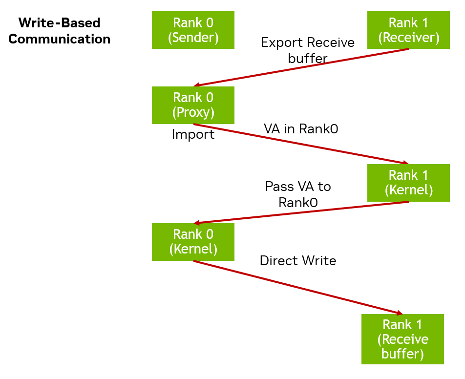
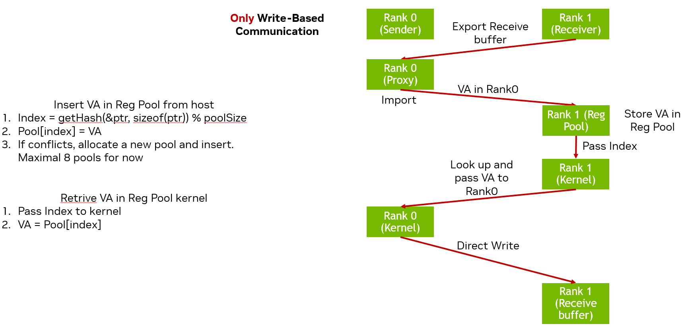
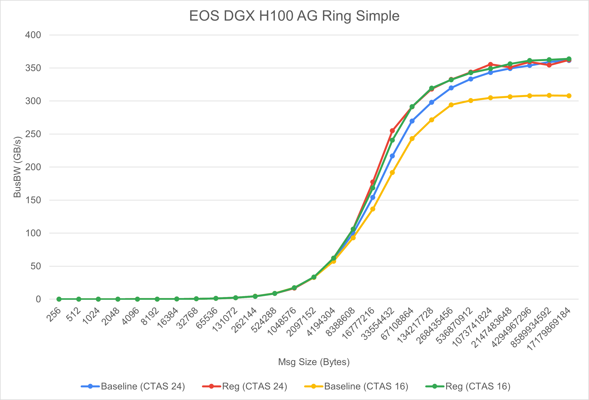
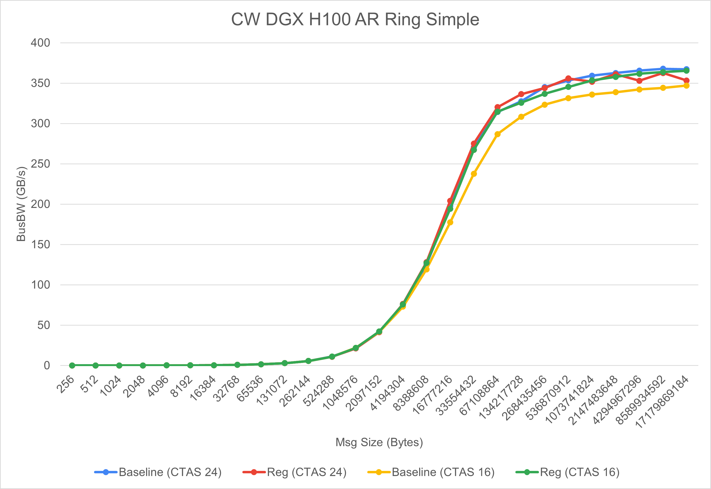

# Intra-node IPC registration
<!-- use this template to share the details of your feature. Non-commented sections are strongly encouraged -->

## Abstract
<!-- here detail what the feature is about. A few sentence that can be copy-pasted to external actors -->
This feature enables intra-node user buffer (UB) registration for all collectives and sendrecv.
<!-- ============================================================================================-->

<h2>Motivation and requirements</h2>

<!-- ============================================================================================-->
The existing AI training models start to occupy more memory and frequently overlap the computation
and communication at large scale. Both requires NCCL to provide more efficienct communications to
further speed up the applications. Intra-node user buffer registration is able to reduce the unnecessary
data copy, improve performance, and reduce memory usage. Supporting intra-node UB registration in NCCL
can greatly satisfy the needs of the existing applications.

### NVbugs / Jira Tickets
https://jirasw.nvidia.com/browse/NCCL-1632

### User Experience
User can allocate its own buffers in any way and register buffers with NCCL function `ncclCommRegister`.
After finishing all NCCL calls, `ncclCommDeregister` is called to free the registration resources.
In addition, user can also apply cuda graph to NCCL calls in which NCCL will automatically register
buffers.

### Assumptions, constraints and dependencies
NA

### Use Cases
All NCCL calls using Simple protocol within upper-layer applications except reducescatter and reduce
(they cannot benefits anything from intra-node UB registration).

### Platform Requirements
NA
<!-- ### Functional Requirements -->
<!-- ### System Requirements -->
<!-- ### Interface Requirements -->
<!-- ### KPI Requirements -->
<!-- ### Security Requirements -->
<!-- ### Legal and Standards Requirements -->
<!-- ### Telemetry Requirements -->
<!-- ### Backward Compatibility Requirements -->
<!-- ### Virtualization Requirements -->

<!-- ============================================================================================-->

<h2>Design</h2>

<!-- ============================================================================================-->

### Proposed Design
The core design of intra-node user buffer registration consists of two parts:
1. All IPC buffers are registered through proxy threads
2. The registered addresses are exchanged during kernel execution

The sendrecv user buffer registration is illustrated in the following figure. sendrecv can be
read-based or write-based, and the figure shows write-based registration process as an example.
For write-based sendrecv, receiver needs to request sender's proxy to register its receiving buffer.
After proxy thread imports the buffer, it will return the registered buffer address to receiver.
Then, receiver incorporates the remote address into the ncclDevWorkP2p structure and carry it with
kernel launch. During kernel execution at primitive instantiation, the receiver passes the remote
address to sender side and wait for the data to be transferred. On the sender side, it receives
the remote address and write the whole data into the destination buffer without chunking.

The collective user buffer registration is a bit different from sendrecv. The following figure shows
the registration process. Collective registration only allows write-based operations. The reason is
read-based operation does not provide any benefits for most of the cases. For each receiver in all
channels, they need to register the receiving buffer through senders' proxy thread and get the remote
address. Then, receiver stores the remote address into a registration pool. The pool is allocated for
each peer on host memory and has a mirrored pool on device side for kernel lookup. In total, there are 8
pools and each pool can hold 16KB registration entries (each entry is 32 bytes). Each entry includes base
and tail address of the buffer, and remote address. The position/index to store the entry into a pool is
determined by `getHash` function. Then, each rank stores the base address and registration index in
ncclDevWorkColl struct and passes to NCCL kernel. During kernel execution, the kernel thread looks up
the entry based on base address and index for remote address, then exchanges the address with all
send/receive peers. After obtaining all addresses, all ranks can directly write into the remote buffers.

<!-- note: the following HTML code is also valid -->
<!--  -->

### Interface Architecture
NA
<!-- ### System KPIs & Metrics -->
<!-- ### Data Architecture -->
<!-- ### Security Design -->
<!-- ### Debugging & Troubleshooting -->
<!-- ### Logging and Instrumentation -->
<!-- ### Operational Considerations -->

<!-- ============================================================================================-->

<h2>Coding</h2>

<!-- ============================================================================================-->

### Commit list or MR
https://gitlab-master.nvidia.com/nccl/nccl/-/merge_requests/500

<!-- ============================================================================================-->

<h2>Testing and Validation</h2>

<!-- ============================================================================================-->

### Objectives and Timeline

### Validation

#### Where to run?

#### What to run?

#### Expected output?

<!-- #### Code Coverage Goal Defined -->
<!-- #### KPI Coverage Goals Defined (performance, stress, stability, throughput, latency) -->
<!-- #### Requirement Coverage Goal Defined -->
<!-- #### Quality Thresholds Defined -->
<!-- #### Test Timeline -->
<!-- #### SW Verification and Test Plan -->
<!-- ### Test plan -->
<!-- #### Requirements Tests -->
<!-- #### Interface Tests -->
<!-- #### Fault-injection Tests -->
<!-- #### Resource Usage Tests -->
<!-- #### Design Coverage Testing -->
<!-- #### Boundary Tests -->
<!-- #### Certification Tests -->
<!-- #### Stress Tests -->
<!-- #### Stability Tests -->
<!-- #### Perf and Power KPI Tests -->
<!-- #### Usability & OOBE Tests -->
<!-- #### Manufacturing Diagnostic(Factory) Tests -->

### Performance

#### What is measured?

#### Results

<!-- ============================================================================================-->

<h2>Signoff List</h2>

<!-- ============================================================================================-->

Author(s):
  - Kaiming Ouyang

