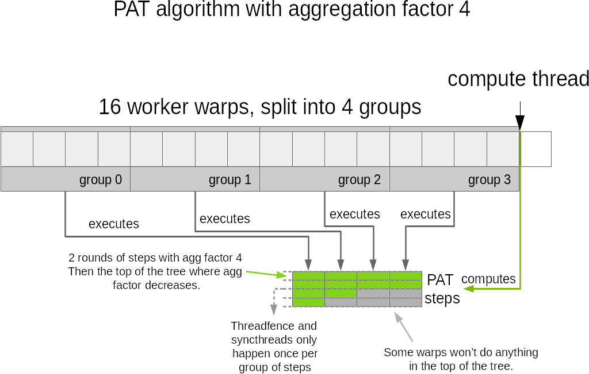

# PAT Optimization
<!-- use this template to share the details of your feature. Non-commented sections are strongly encouraged -->

## Abstract
<!-- here detail what the feature is about. A few sentence that can be copy-pasted to external actors -->

<!-- ============================================================================================-->

<h2>Motivation and requirements</h2>

<!-- ============================================================================================-->

### NVbugs / Jira Tickets

### User Experience
No change to user experience. This feature accelerates already existing operations.

### Assumptions, constraints and dependencies
This is still focusing on the case of 1 GPU per node, large scale operations. Allgather and ReduceScatter
operations using more than one GPU per node will be handled by next NCCL versions.

### Use Cases
The case of 1 PPN allgather/reduce scatter is important for LLM training where we use pipeline
parallelism and tensor parallelism in dimensions which are orthogonal to data parallelism. The
tensor parallelism dimension is usually aligned to the intra-node NVLink connectivity, meaning
that other dimensions will only have one GPU per node.

<!-- ### Functional Requirements -->
<!-- ### System Requirements -->
<!-- ### Interface Requirements -->
<!-- ### KPI Requirements -->
<!-- ### Security Requirements -->
<!-- ### Legal and Standards Requirements -->
<!-- ### Telemetry Requirements -->
<!-- ### Backward Compatibility Requirements -->
<!-- ### Virtualization Requirements -->

<!-- ============================================================================================-->

<h2>Design</h2>

<!-- ============================================================================================-->

### Proposed Design

This change optimizes the PAT algorithm by separating the computation and execution of PAT steps on
different warps. This also allows to run up to 16 PAT steps in parallel (one PAT step on each warp)
to significantly accelerate PAT operations and reduce its linear part.

The first change is to introduce a struct to hold all the parameters of a PAT operation. That is
generally useful as it makes it easier to pass the computed information onto the patReduce and
patCopy operations in the prims/simple layer.

We then dedicate a single thread to compute those steps. The PAT step computing code does not
support to compute multiple steps in parallel, although it may be possible to do so with minimal
changes in the code. For now however, it seems that even using a single thread, the worker threads
do not wait on the compute thread. So it looks like using more than one thread would not improve
performance much, except maybe for the first 16 steps.

We use the shared memory area of the computing thread to store those pre-computed PAT steps,
and then use the first 512 threads (16 warps) to execute up to 16 PAT steps in parallel. All
worker warps will execute their own PAT step, but all the synchronizations will be common to the
group of 512 workers, meaning we'll only have a single membar (threadfence\_system) and a single
barrier (patBarrier) encompassing all 512 threads.

We only use multiple warps in parallel to execute operations of the same aggregated step. The
number of warps we use will therefore be dependent on the aggregation factor of the tree. If the
aggregation factor is large, it means the sizes are small, and therefore it is ok to use less
threads per PAT step. The larger the operations are, the less we'll aggregate, and the less we
will split our warps. In the end, each warp always processes the same amount of data regardless
of the aggregation factor.

### Interface Architecture
No change.

<!-- ### System KPIs & Metrics-->
<!-- ### Data Architecture -->
<!-- ### Security Design -->
<!-- ### Debugging & Troubleshooting -->
<!-- ### Logging and Instrumentation -->
<!-- ### Operational Considerations -->

<!-- ============================================================================================-->

<h2>Coding</h2>

<!-- ============================================================================================-->

### Commit list or MR

[MR !678](https://gitlab-master.nvidia.com/nccl/nccl/-/merge_requests/678)

<!-- ============================================================================================-->

<h2>Testing and Validation</h2>

<!-- ============================================================================================-->

### Objectives and Timeline
Test allgather/reducescatter performance at various scales; ensure no regression, no data corruption.

### Validation
Validation relies on the validation inside NCCL perf tests.

#### Where to run?
DGX H100 is the main target and is where the feature has been developed, but QA should ensure that
other platforms did not see regressions or issues.

#### What to run?
The usual test plan with everything related to all\_gather\_perf and reduce\_scatter\_perf.

#### Expected output?
No errors.

<!-- #### Code Coverage Goal Defined -->
<!-- #### KPI Coverage Goals Defined (performance, stress, stability, throughput, latency) -->
<!-- #### Requirement Coverage Goal Defined -->
<!-- #### Quality Thresholds Defined -->
<!-- #### Test Timeline -->
<!-- #### SW Verification and Test Plan -->
<!-- ### Test plan -->
<!-- #### Requirements Tests -->
<!-- #### Interface Tests -->
<!-- #### Fault-injection Tests -->
<!-- #### Resource Usage Tests -->
<!-- #### Design Coverage Testing -->
<!-- #### Boundary Tests -->
<!-- #### Certification Tests -->
<!-- #### Stress Tests -->
<!-- #### Stability Tests -->
<!-- #### Perf and Power KPI Tests -->
<!-- #### Usability & OOBE Tests -->
<!-- #### Manufacturing Diagnostic(Factory) Tests -->

### Performance
Base latency has been decreased by a ~1.5x factor. It is highly dependent on the scale however,
given we need a large aggregation factor to run many PAT steps in parallel.

#### What is measured?
Allgather/ReduceScatter time on small sizes, i.e. before the bandwidth limitation becomes a
significant contributer to the total time.

#### Results
Results are dependent on the platform. Original testing was run on AWS up to ~1500 nodes, which
has high network latency, hence show a larger improvement than e.g. IB systems.

<!-- ============================================================================================-->

<h2>Signoff List</h2>

<!-- ============================================================================================-->

Author(s):
  - Sylvain Jeaugey

