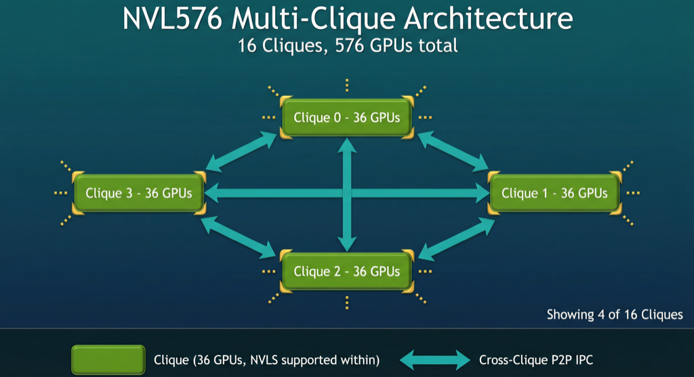
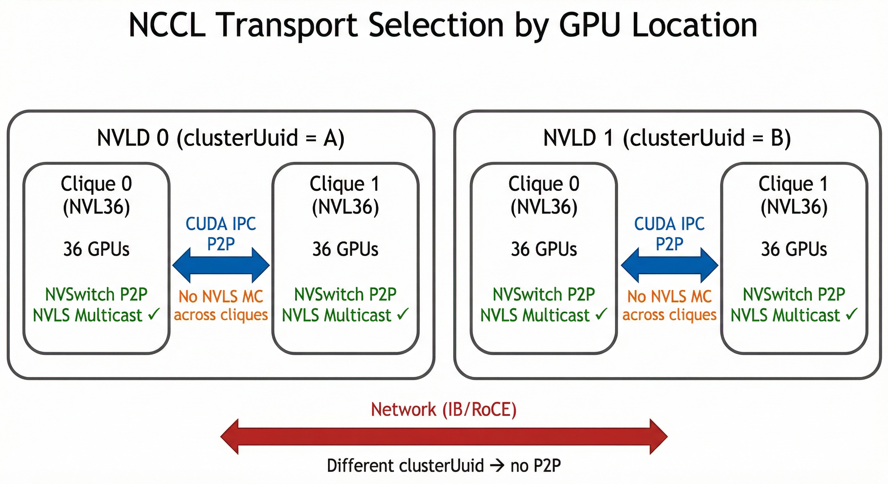

# Cross-Clique P2P IPC Support

## Abstract

This new feature enables P2P (peer-to-peer) IPC communication across MNNVL clique boundaries. In systems like NVL576, where GPUs are partitioned into cliques (e.g., using Rack ID as the clique ID via `NCCL_MNNVL_CLIQUE_ID=-2`), this feature allows NCCL to use direct GPU-to-GPU IPC transfers between GPUs in different cliques instead of falling back to potentially slower network transports. This is controlled by the `NCCL_MNNVL_CROSS_CLIQUE` environment variable.



In multi-rack NVLink systems such as NVL576, GPUs are organized into NVLink Domains (NVLDs) with LSA (Load Store Accessible) support. Each NVLD is partitioned into cliques (e.g., one per rack). Intra-clique communication runs at full NVLink bandwidth and can use NVLink SHARP (NVLS) multicast, while cross-clique paths have a reduced NVLink bandwidth and cannot make use of NVLS. On current Blackwell (GB200) NVL576 systems, each NVLD contains 16 cliques of 36 GPUs (NVL36 racks), but the design generalizes to future rack sizes (e.g., NVL72).

This feature enables NCCL to utilize these cross-clique NVLink paths for:

1. **IPC-based collectives** - Direct GPU-to-GPU transfers using User Buffer Registration and Symmetric Memory
2. **CE (Copy Engine) collectives** - Zero-SM collectives using DMA engines
3. **Extended LSA team** - All ranks in the NVL domain share memory via FABRIC handles

### Transport Selection

The diagram below shows how NCCL selects transports based on GPU location. Within a clique, NVSwitch P2P and NVLS multicast are used. Across cliques within the same NVLD, CUDA IPC P2P is used (enabled by this feature). Across NVLDs, network transports (IB/RoCE) are used.



<!-- ============================================================================================-->
<details>
<summary><h2>Motivation and requirements</h2></summary>
<!-- ============================================================================================-->

### NVbugs / Jira Tickets

- RFE 5285398 - [NVL576: NCCL - Unicast Topology Support]
- RFE 5524734 - [NVL576: NCCL - Multicast Topology Support - Production]
- BUG 5524462 - [NVL576: NCCL - Unicast UBR tests fail with data corruption and IMA]


### User Experience

Users with multi-clique systems (e.g., NVL576 systems partitioned into rack-based cliques) can enable cross-clique P2P communication by setting:

```bash
export NCCL_MNNVL_CROSS_CLIQUE=1
```
in conjunction with

```bash
export NCCL_MNNVL_CLIQUE_ID=-2
```

This allows NCCL to use direct IPC transfers between GPUs in different cliques, potentially improving performance compared to network-based communication.

### Assumptions, constraints and dependencies

- GPUs must have NVLink connectivity within and across clique boundaries
- GPUs within each NVLink domain have a common UUID. Different NVLDs have unique UUIDs.
- The `NCCL_MNNVL_CROSS_CLIQUE` environment variable must be explicitly set to enable this feature
- **NVLS/Multicast is not supported across cliques** - multicast groups cannot span clique boundaries

#### Topology Discovery: Current Workaround and CUDA/FM Transition

The current implementation relies on two environment variables as a temporary workaround:

- **`NCCL_MNNVL_CLIQUE_ID=-2`** — Uses Rack ID as the clique ID since NCCL does not yet have native NVL576 topology discovery
- **`NCCL_MNNVL_CROSS_CLIQUE=1`** — Explicitly opts in to cross-clique P2P IPC

Note: `NCCL_MNNVL_CROSS_CLIQUE` is intentionally left undocumented in the user-facing environment variable reference (`env.rst`) since it will be deprecated once the CUDA/FM clique type attributes are available and topology discovery becomes automatic.

This is necessary because today the `cliqueId` from NVML (`nvmlGpuFabricInfo_v2`) spans the entire NVLD — all 576 GPUs in an NVL576 system report the same `cliqueId`. There is no distinction between the rack-level (L1) domain where NVLS multicast works and the full NVLD where only unicast P2P is available. `NCCL_MNNVL_CLIQUE_ID=-2` overrides the NVML `cliqueId` with the Rack ID to create this boundary, and `NCCL_MNNVL_CROSS_CLIQUE=1` then enables IPC across it.

**Planned NVML/FM changes** ([Rubin Multinode Topology Inspection Design](https://nvidia.atlassian.net/wiki/spaces/CSSRM/pages/2180845500)) will extend `nvmlGpuFabricInfo` to expose multiple clique types per GPU:

```c
#define NVML_GPU_FABRIC_CLIQUE_TYPE_POINTER_UC     0  // Will replace current cliqueId (scoped to L1 domain)
#define NVML_GPU_FABRIC_CLIQUE_TYPE_POINTER_MC     1  // Pointer-based multicast reach
#define NVML_GPU_FABRIC_CLIQUE_TYPE_HANDLE_UC      2  // Handle-based unicast reach
#define NVML_GPU_FABRIC_CLIQUE_TYPE_HANDLE_MC      3  // Handle-based multicast reach
#define NVML_GPU_FABRIC_CLIQUE_TYPE_HANDLE_MC_PUSH 4  // Handle-based MC push (Rubin Ultra+)

typedef struct {
    unsigned char type;
    unsigned int  id;
} nvmlGpuFabricClique_t;
// Added to nvmlGpuFabricInfo_v4_t:
nvmlGpuFabricClique_t cliques[NVML_GPU_FABRIC_CLIQUE_MAX];
unsigned int          numCliques;
```

On NVL576 (Blackwell L2), the clique mapping is:

| Clique Type | Scope on NVL576 | NCCL Use |
|-------------|-----------------|----------|
| `POINTER_UC` | L1 domain (rack, 36 GPUs) | NVSwitch P2P (today's `cliqueId` covers full NVLD; will be narrowed to L1) |
| `POINTER_MC` | L1 domain (rack, 36 GPUs) | NVLS multicast scope |
| `HANDLE_UC` | Full NVLD (576 GPUs) | **Cross-clique IPC** — what `CROSS_CLIQUE=1` enables today |
| `HANDLE_MC` | L1 domain (rack, 36 GPUs) | Same as pointer MC on Blackwell (no HW handle support) |

The key insight: today's `cliqueId` corresponds to `HANDLE_UC` scope (full NVLD), but NCCL treats it as if it were `POINTER_UC+POINTER_MC` (using it for both NVSwitch P2P and NVLS multicast). The new clique types will separate these — `POINTER_UC`/`POINTER_MC` scoped to L1 (rack) for NVSwitch and multicast, `HANDLE_UC` spanning the full NVLD for cross-clique IPC. This directly maps to what this MR implements: IPC P2P across cliques (handle-UC reach) with multicast confined within cliques (pointer/handle-MC reach).

**Transition plan for NCCL**: When the new NVML clique types become available, NCCL will:
1. Query `nvmlGpuFabricInfo_v4` to get the clique array
2. Use `HANDLE_UC` clique ID to determine cross-clique IPC reach (replacing `CROSS_CLIQUE=1` and `CLIQUE_ID=-2`)
3. Use `POINTER_MC` / `HANDLE_MC` clique ID to scope NVLS multicast groups
4. The existing `POINTER_UC` clique continues to serve as the intra-clique NVSwitch P2P boundary

### Feature Support Summary

| Feature | Cross-Clique | Notes |
|---------|:------------:|-------|
| P2P IPC transfers | ✓ | Now uses global rank indexing |
| User Buffer Registration | ✓ | IPC exchange arrays sized to `nRanks` |
| TREE algorithm | ✓ | UBR disabled for TREE to avoid write race; non-registered path used |
| CE collectives | ✓ | Unicast sync (no multicast) |
| LSA team | ✓ | Extended to all ranks with the NVLD |
| GIN | ✓ | Works in both RAIL and FULL modes |
| NVLS Multicast | ✓ | Within cliques only; NVLSTree over P2P between cliques |
| Symmetric kernels | ✗ | Future hierarchical algorithms planned |

### Use Cases

#### NVL576 Systems

Multi-rack NVLink systems (e.g., NVL576) consist of multiple cliques connected via NVLink switches, with full NVLink connectivity between racks. On current Blackwell systems, NVL576 has 16 cliques of 36 GPUs each (576 total). Future systems may use larger rack sizes (e.g., NVL72). These systems are also fully connected with InfiniBand/RoCE and jobs can span multiple NVLDs.

CUDA IPC is possible within and across racks using FABRIC handle exchange. Without cross-clique P2P support, NCCL would fall back to network communication despite having direct NVLink paths available.
Between NVL576 systems the network transports will be utilized.

### Platform Requirements

- One or more multi-rack NVLDs (e.g., NVL576) with full NVLink connectivity
- Inter-NVLD connectivity via IB/RoCE

</details>

<!-- ============================================================================================-->
<details>
<summary><h2>Design</h2></summary>
<!-- ============================================================================================-->

### Proposed Design

#### Overview

#### Key Change: MNNVL Peer Matching Across Cliques

The fundamental enabler for cross-clique P2P is relaxing the MNNVL peer matching logic in `ncclTopoCheckMNNVL()` (`paths.cc`). Previously, two GPUs were only considered MNNVL peers if they shared the same `clusterUuid` **and** the same `cliqueId`. With cross-clique enabled, GPUs with the same `clusterUuid` but different `cliqueId` values are now also matched:

```c
// Same UUID required. Within same UUID: either same clique OR cross-clique enabled
if ((memcmp(fabricInfo1->clusterUuid, fabricInfo2->clusterUuid, NVML_GPU_FABRIC_UUID_LEN) == 0) &&
    (comm->p2pCrossClique || fabricInfo1->cliqueId == fabricInfo2->cliqueId)) {
    // Return -1 for cross-clique (different clique but same UUID) to force CUDA P2P
    *ret = (comm->p2pCrossClique && fabricInfo1->cliqueId != fabricInfo2->cliqueId) ? -1 : 1;
}
```

The caller in `ncclTopoCheckP2p()` checks for `-1` and force-enables CUDA P2P, since the normal NVSwitch topology path detection won't find a direct link across clique boundaries. This is the foundation that all the other changes build upon.


### Issues that had to be resolved

The cross-clique P2P feature also addresses numerous issues that prevented IPC from working across clique boundaries.
These are discussed below:

#### Problem 1: User Buffer Registration Indexing

In standard single-clique configurations, each GPU has a unique `localRank` within the communicator. The IPC registration code used this as an index into arrays storing remote buffer addresses. However, with cross-clique configurations, ranks from different cliques can have the same `localRank`, causing array index collisions.

**Solution**: For cross-clique configurations, use the global `peerRank` as the array index instead of `localRank`, and size the array to `nRanks` instead of `localRanks`.

#### Problem 2: TREE Algorithm Race Condition

The TREE algorithm uses a hierarchical reduction pattern. In push mode (the default), children write their data to the parent's receive buffer. With IPC User Buffer Registration, multiple children can simultaneously write to the same location in the parent's buffer, causing a race condition:

**Solution**: Disable IPC User Buffer Registration for TREE in cross-clique configurations by adding `|| comm->p2pCrossClique` to the existing TREE early-exit check in `coll_reg.cc`:

```c
if (info->algorithm == NCCL_ALGO_TREE && (info->sendbuff == info->recvbuff || comm->p2pCrossClique)) goto exit;
```

This falls back to the standard non-registered buffer path which does not have this race. The underlying write-mode race condition will be addressed in a separate MR.

#### Problem 3: Proxy Connection Limits

The proxy service had a fixed limit of 73 connections (`NCCL_MAX_LOCAL_RANKS+1`), which was sufficient for single-clique configurations where only local ranks connect. With cross-clique P2P, ranks from all cliques can connect to each proxy, requiring up to `nRanks` connections.

**Solution**: Dynamically allocate proxy connection arrays based on `tpnRanks`:

```c
// Before (fixed size, stack allocated)
struct pollfd pollfds[NCCL_MAX_PROXY_CONNECTIONS+1];
struct ncclProxyLocalPeer peers[NCCL_MAX_PROXY_CONNECTIONS];

// After (dynamic size, heap allocated)
int maxProxyConnections = std::max(proxyState->tpnRanks + 1, NCCL_MAX_PROXY_CONNECTIONS);
struct pollfd* pollfds = NULL;
struct ncclProxyLocalPeer* peers = NULL;
NCCLCHECKGOTO(ncclCalloc(&pollfds, maxProxyConnections + 1), ret, fail);
NCCLCHECKGOTO(ncclCalloc(&peers, maxProxyConnections), ret, fail);
```

#### Problem 4: Dynamic IPC Info Array Sizing

The `ipcInfos` array in `ncclReg` was originally allocated at a fixed size based on `localRanks`. For cross-clique, we need to support `nRanks` entries, and the array may need to grow if more peers are discovered:

```c
// Added to struct ncclReg
struct ncclIpcRegInfo** ipcInfos;  // Dynamically allocated
int ipcInfosSize;                  // Tracks allocated size

// Dynamic resizing when needed
if (regRecord->ipcInfosSize < ipcIndexSize) {
    NCCLCHECK(ncclRealloc(&regRecord->ipcInfos, regRecord->ipcInfosSize, ipcIndexSize));
    regRecord->ipcInfosSize = ipcIndexSize;
}
```

### LSA and CE Collective Extensions

#### Problem 5: LSA Team Limited to a Single Node

The LSA (Load Store Accessible) team is normally computed based on node boundaries - ranks on the same node share memory via direct GPU-to-GPU access. For cross-clique configurations within a single NVL domain, all ranks can share memory via FABRIC handles, but the LSA team wasn't being extended to include them.

**Solution**: Track `nvlDomainSize` (ranks with same `clusterUuid`) in `mnnvl.cc`. During LSA initialization in `dev_runtime.cc`, extend the LSA team to all ranks when cross-clique is enabled and all ranks are in the same NVL domain:

```c
// In dev_runtime.cc - ncclDevrInitOnce()
if (comm->p2pCrossClique && comm->nvlDomainSize == comm->nRanks) {
    lsaSize = comm->nRanks;
}
```

Note: multi-NVLD with unequal domain sizes is not yet supported for cross-clique LSA; the code falls through to the standard node-based calculation in that case. The existing `bootstrapIntraNodeAllGather`/`bootstrapIntraNodeBarrier` functions work across nodes via bootstrap sockets despite the "IntraNode" name.

#### Problem 6: CE Collectives Blocked for Multi-Node

CE (Copy Engine) collectives were blocked for multi-node configurations (`nNodes > 1`). For cross-clique within the same NVL domain, CE collectives should be allowed since all ranks have NVLink connectivity.

Enabling CE collectives for cross-clique is particularly important for AlltoAll, where the P2P fallback path would require establishing FIFO connections to all 575 peers. Each P2P FIFO connection consumes GPU memory, and at 576-GPU scale the aggregate overhead is significant. CE collectives avoid this entirely by using the Copy Engine hardware with LSA memory, requiring no per-peer FIFO allocations.

**Solution**: Allow CE collectives when LSA spans all ranks:

```c
// In ce_coll.cc - ncclCeAvailable()
if (ncclTeamLsa(comm).nRanks < comm->nRanks) {
    TRACE(NCCL_TUNING, "Skipping CE collective: not all ranks have NVLink connectivity");
    return false;
}
```

#### Problem 7: NVLS Multicast Used Across Cliques

NVLS multicast isn't available across clique boundaries, but the code was still attempting to use multicast sync operations for cross-clique configurations.

**Solution**: Disable NVLS multicast for cross-clique LSA teams:

1. **CE collectives**: Use unicast sync instead of multicast sync
2. **Symmetric kernels**: Set `hasLsaMultimem = false` to exclude MC kernels (STMC, LDMC)
3. **Query properties**: Report `multimemSupport = false` for cross-clique

```c
// In ce_coll.cc - ncclMemOpSync()
bool useMCSync = comm->nvlsSupport && !comm->p2pCrossClique;
```

#### Problem 8: Symmetric Kernels Perform poorly

Symmetric kernels rely heavily on NVLS multicast which isn't available across clique boundaries.
We have open RFEs for implementing hierarchical Symmetric Kernels for the NVL576 product.

**Solution**: Skip symmetric kernel task creation when cross-clique is enabled:

```c
// In enqueue.cc - ncclPrepareTasks()
// Skip symmetric kernels for cross-clique
if (comm->symmetricSupport && !comm->p2pCrossClique && ...) {
    NCCLCHECK(ncclMakeSymmetricTaskList(comm, task, &planner->collSymTaskQueue, &task));
}
```

Note: CE collectives still work for cross-clique since they use unicast sync instead of relying on multicast.

</details>

<!-- ============================================================================================-->
<details>
<summary><h2>Coding</h2></summary>
<!-- ============================================================================================-->

### Internal Flags

| Flag | Location | Description |
|------|----------|-------------|
| `comm->p2pCrossClique` | `ncclComm` | Set when cross-clique P2P is detected and enabled |
| `comm->nvlDomainSize` | `ncclComm` | Number of ranks in the same NVL domain (same clusterUuid) |
| `hasLsaMultimem` | `ncclSymkState` | Set to false for cross-clique LSA teams |

### Files Modified

| File | Changes |
|------|---------|
| `src/include/device.h` | Add `p2pCrossClique` to device comm |
| `src/include/comm.h` | Add `p2pCrossClique` and `nvlDomainSize` to `ncclComm` |
| `src/include/proxy.h` | Add `peerArraySize` field for cross-clique proxy arrays |
| `src/include/register.h` | Add `ipcInfosSize` field to `ncclReg` for dynamic array sizing |
| `src/init.cc` | Detect cross-clique configuration, set `p2pCrossClique`, disable symmetric for cross-clique |
| `src/include/graph.h` | Update `ncclTopoCheckMNNVL` signature to take `ncclComm*` |
| `src/graph/paths.cc` | Use `comm->p2pCrossClique` in MNNVL P2P path detection |
| `src/mnnvl.cc` | Track `nvlDomainSize` - ranks with same `clusterUuid` in NVL domain |
| `src/proxy.cc` | Dynamic heap allocation for proxy connection arrays, use `ncclCalloc` and `goto fail` pattern |
| `src/transport/p2p.cc` | Use `peerRank` indexing for cross-clique IPC registration, dynamic `ipcInfos` array resizing |
| `src/register/coll_reg.cc` | Skip IPC registration for TREE in cross-clique to avoid write race |
| `src/enqueue.cc` | Copy cross-clique flags to device work structure |
| `src/device/prims_simple.h` | Use global rank indexing for cross-clique IPC |
| `src/dev_runtime.cc` | Extend LSA team to all ranks for cross-clique, use global bootstrap operations |
| `src/ce_coll.cc` | Allow CE collectives for cross-clique, use unicast sync instead of multicast |
| `src/sym_kernels.cc` | Disable LSA multicast for cross-clique LSA teams |
| `src/plugin/profiler.cc` | Report UC sync strategy for cross-clique CE collectives |

</details>

<!-- ============================================================================================-->
<details>
<summary><h2>Testing and Validation</h2></summary>
<!-- ============================================================================================-->

### Objectives and Timeline

Validate that cross-clique P2P IPC works correctly for all collective operations, including:

- Standard collectives with User Buffer Registration
- Symmetric kernel fallback
- CE (Copy Engine) collectives with unicast synchronization
- LSA enabled kernels
- GIN enabled kernels
- Multi-NVL576 jobs spanning multiple cliques and external network connections


### Validation

#### Where to run?

NVL576 systems with multiple cliques (e.g., rack-based cliques using `NCCL_MNNVL_CLIQUE_ID=-2`).

#### What to run?

Example SLURM commands for NVL576 testing on Polyphe:

```bash
# AllReduce with cross-clique P2P
# NVLS enabled (default) - tests hierarchical NVLS + cross-clique P2P
srun -n 512 -N 128 --mpi=pmix -pbatch -t30 \
  env NCCL_MNNVL_CLIQUE_ID=-2 \
      NCCL_MNNVL_CROSS_CLIQUE=1 \
      NCCL_DEBUG=WARN \
  all_reduce_perf -dfloat -b8 -e32G -f2 -g1 -M1

# AllReduce with cross-clique P2P and User Buffer Registration (-R1)
# NVLS enabled (default) - tests hierarchical NVLS + cross-clique P2P
srun -n 512 -N 128 --mpi=pmix -pbatch -t30 \
  env NCCL_MNNVL_CLIQUE_ID=-2 \
      NCCL_MNNVL_CROSS_CLIQUE=1 \
      NCCL_DEBUG=WARN \
  all_reduce_perf -dfloat -b8 -e32G -f2 -g1 -R1 -M1

# AllReduce with cross-clique P2P and NVLS disabled
# Tests pure cross-clique P2P without NVLS hierarchical optimization
srun -n 512 -N 128 --mpi=pmix -pbatch -t30 \
  env NCCL_MNNVL_CLIQUE_ID=-2 \
      NCCL_MNNVL_CROSS_CLIQUE=1 \
      NCCL_NVLS_ENABLE=0 \
      NCCL_DEBUG=WARN \
  all_reduce_perf -dfloat -b8 -e32G -f2 -g1 -M1

# AllReduce across multiple NVLDs
# NVLS enabled (default) - tests hierarchical NVLS + cross-clique P2P
srun -n 800 -N 200 --mpi=pmix -pbatch -t30 \
  env NCCL_MNNVL_CLIQUE_ID=-2 \
      NCCL_MNNVL_CROSS_CLIQUE=1 \
      NCCL_DEBUG=WARN \
  all_reduce_perf -dfloat -b8 -e32G -f2 -g1 -M1

# AlltoAll with CE-based collective and Symmetric memory (-R2 -x2)
srun -n 512 -N 128 --mpi=pmix -pbatch -t30 \
  env NCCL_MNNVL_CLIQUE_ID=-2 \
      NCCL_MNNVL_CROSS_CLIQUE=1 \
      NCCL_DEBUG=WARN \
  alltoall_perf -duint8 -b8 -e4G -f2 -g1 -R2 -x2 -M1

# Force TREE algorithm (UBR requested but internally skipped for cross-clique TREE)
srun -n 512 -N 128 --mpi=pmix -pbatch -t30 \
  env NCCL_MNNVL_CLIQUE_ID=-2 \
      NCCL_MNNVL_CROSS_CLIQUE=1 \
      NCCL_ALGO=Tree \
      NCCL_DEBUG=WARN \
  all_reduce_perf -dfloat -b8 -e32G -f2 -g1 -R1 -M1
```

Note: `NCCL_MNNVL_CLIQUE_ID=-2` causes NCCL to use the Rack ID as the clique ID, so each rack forms a separate clique.
This is needed because topology support for NVL576 is not yet available.

Testing with both NVLS enabled and disabled confirms that the hierarchical support works correctly.

#### Expected output?

- All tests pass without data corruption
- No hangs or crashes seen with UBR, Symmetric Memory, CE etc enabled
- Works at full scale, including between NVL576 NVLDs (pods)

### CI/CD Tests

Three new CI jobs are added to `.gitlab-ci.yml`, using an NVL72 (Theia) cluster to emulate cross-clique and multi-NVLD topologies:

| CI Job | Nodes | Configuration | What it tests |
|--------|-------|---------------|---------------|
| `perftest-multi-theia-cross-clique-2n` | 2 | `CLIQUE_SIZE=1` (each node = 1 clique) | Cross-clique P2P with all collectives, UBR, CE, TREE |
| `perftest-multi-theia-cross-clique-4n` | 4 | `CLIQUE_SIZE=2` (pairs form cliques) | Cross-clique with multiple ranks per clique |
| `perftest-multi-theia-multi-nvld-4n` | 4 | `CLIQUE_SIZE=1, NVLDS=2` (2 NVLDs of 2 nodes) | Multi-NVLD: cross-clique P2P within NVLDs + GIN across NVLDs |

**New files:**
- `test/scripts/ci/cross-clique-wrapper.sh` — Wrapper script that assigns `NCCL_MNNVL_CLIQUE_ID` and `NCCL_MNNVL_UUID` per node based on `CLIQUE_SIZE` and `NVLDS` parameters, emulating multi-rack topology on NVL72 systems
- `test/scripts/ci/gitlab-runner-perf-cross-clique.sh` — Test suite covering all collectives (AllReduce, AllGather, ReduceScatter, AlltoAll) with UBR, CE, symmetric memory, TREE, and NVLS on/off configurations

</details>

<!-- ============================================================================================-->
<details>
<summary><h2>Performance</h2></summary>
<!-- ============================================================================================-->

#### What should be measured?

- Collective latency and bandwidth with cross-clique P2P vs network transport
- AlltoAll CE collective performance at 576 GPU scale
- Full sweep of nccl-test benchmarks with UBR, Symmetric Memory and CE options

</details>

<!-- ============================================================================================-->
<details>
<summary><h2>Future enhancements</h2></summary>
<!-- ============================================================================================-->

- RFE 5504787 - [NVL576: Adapt device API to report NVLink hierarchy to user for optimization]
- RFE 5285394 - [NVL576: NCCL - NonCanonical addressing extensions support]
- RFE 5504767 - [NVL576: Symmetric kernels, two-level hierarchical algorithms]
- RFE 5504780 - [NVL576: Three level hierarchical algorithms (NVLS, NVLink P2P, IB)]
- RFE 5951286 - [NVL576: NCCL - Optimize cross-clique array sizing]

</details>

<!-- ============================================================================================-->
<details>
<summary><h2>Signoff List</h2></summary>
<!-- ============================================================================================-->

Author(s):

  - David Addison

Reviewers:

  - Sylvain
  - Kaiming
  - Kamil
  - John

</details>
