# Allgatherv Optimization
<!-- use this template to share the details of your feature. Non-commented sections are strongly encouraged -->

## Abstract
<!-- here detail what the feature is about. A few sentence that can be copy-pasted to external actors -->

Optimizing the communication pattern `allgatherv`, a set of broadcast with different roots.

<!-- ============================================================================================-->
<details>
<summary><h2>Motivation and requirements</h2></summary>
<!-- ============================================================================================-->

The request came from Graph500 submission, where the task is utilizing 2048 GPUs to perform BFS. The
typical pattern is:

```Cpp
NCCLCHECK(ncclGroupStart());
for (size_t i = 0; i < nRanks; i++) {
  NCCLCHECK(ncclBroadcast(sendbuff, recvbuff, count_base + diff[i], ncclUint8, root, comm, s));
}
NCCLCHECK(ncclGroupEnd());
```

Where each root `i` will launch a broadcast, the amount of which is calculated by `count_base + diff[i]`.
Behavior of the existing code on each channel is processing each sub task sequentially, meaning the sub tasks
can not be pipelined.
In order to reduce this overhead, the kernel needs to process as much tasks simultaneously as possbile.


### NVbugs / Jira Tickets

https://nvbugspro.nvidia.com/bug/4926955 Sub-optimal NCCL broadcast (allgatherv) performance scalability

### User Experience

### Assumptions, constraints and dependencies

1. Number of Roots Participating in AllGatherV

This optimization assumes we have more than one root participating within the grouped collectives and the
sizes of them are not the same. If there's only one root in the group (including multiple broadcasts from the same root)
allgatherv should fallback to normal broadcast to better utilize existing optimizations.

2. Limitation of Shared Memory

NCCL utilizes shared memory for work FIFO in `__shared__ ncclShmemData ncclShmem`. It allows these work
descriptors shared between the threads within a block using fast on-chip memory. However the size of shared memory
is limited and differs among GPU architectures, the number of work descriptors fit into the shared memory is limited. If
we cannot put all work descriptors from one batch into the work FIFO, we have to devide them into smaller batches to avoid
deadlock

3. Runtime Toggle

Runtime toggle is not mandatory by design, but having it adds to the robustness of the library.

### Use Cases

Large-scale AllGatherV applications, such as Graph500 benchmark.

### Platform Requirements

<!-- ### Functional Requirements -->
<!-- ### System Requirements -->
<!-- ### Interface Requirements -->
<!-- ### KPI Requirements -->
<!-- ### Security Requirements -->
<!-- ### Legal and Standards Requirements -->
<!-- ### Telemetry Requirements -->
<!-- ### Backward Compatibility Requirements -->
<!-- ### Virtualization Requirements -->

</details>

<!-- ============================================================================================-->
<details>
<summary><h2>Design</h2></summary>
<!-- ============================================================================================-->

### Proposed Design

<!-- note: the following HTML code is also valid -->


<!-- TODO: an overview diagram illustrating multiple broadcaster -->


#### 1. Batched Processing

**Revisit Broadcast Call Procedure**

First, we need to review the existing procedure for broadcast collectives. Broadcast has nothing differently compared to general collectives.

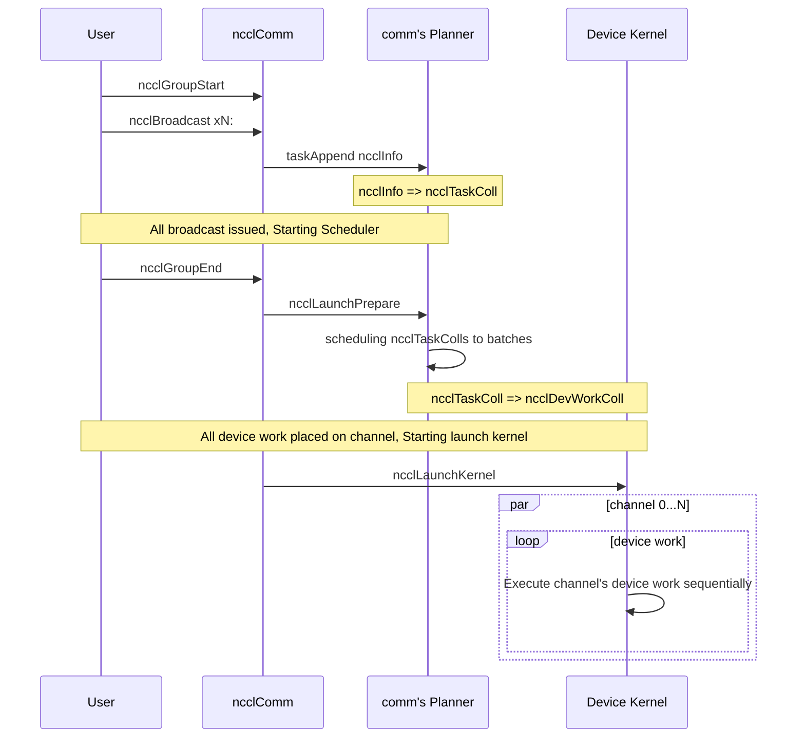

The original layout of device work is show below: they are placed on each channel sequentially. Because of the limited number of channels, not every broadcast can be
processed in parallel and this can lead to increase of time.

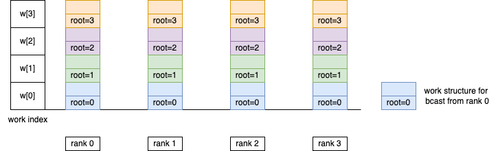 </img>

We can modify the layout of device work according to the `depth`, which represents the numnber of rounds needed before the data passed to this rank.

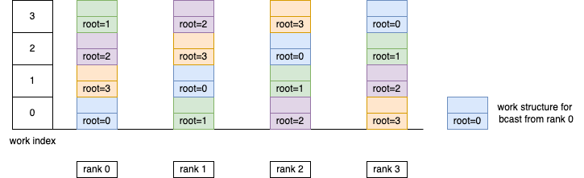 </img>

With this modification, the diagram for new broadcast would be:


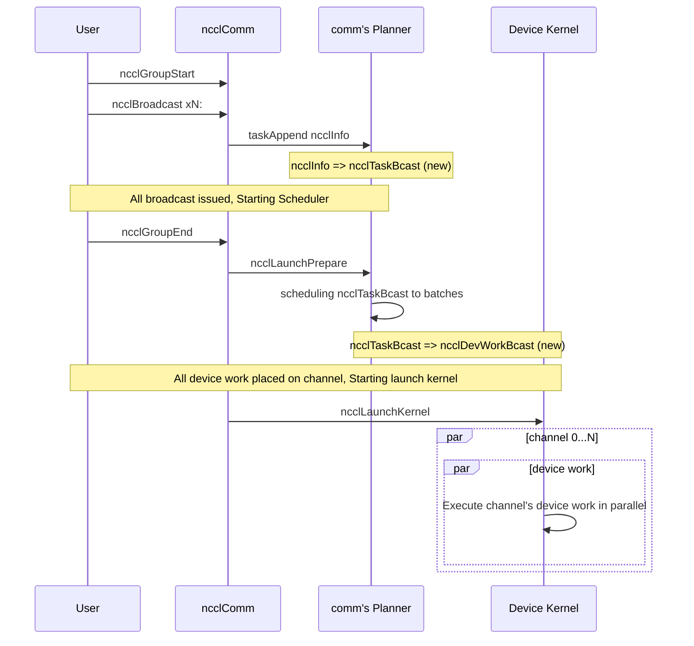

Below is the illustration of how batched broadcast works:

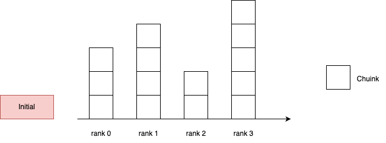

Just like other collective calls, we cut the whole data into chunks with the same length (except for the last chunk).

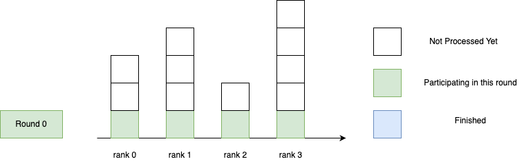

Because we place all device works into the shared memory, we can process every work in a same round.

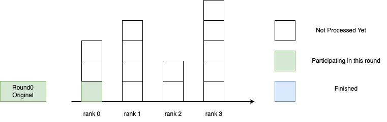

Compared to the original broadcast that process only one piece of chunk in a single round.

There are special cases where the sizes of broadcast are skewed and as a result, some rank may have nothing to send in some rounds.

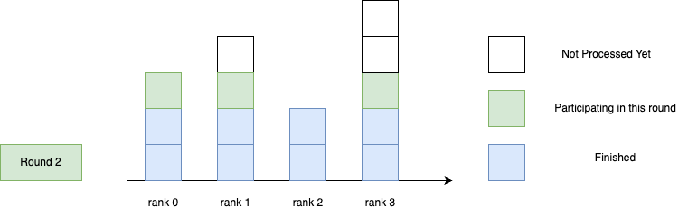


**Calculation of ringDepth**

1. Add `rankToIndex` array for calculation ring depth in channel setup
2. In task preparition, traverse bcastQueue from all peers, calculate ringDepth and its min/max value

```cpp
// Build ring depth mapping
for (int peer = minBcastPeer; nTasks != 0; peer++) {
  t = ncclIntruQueueHead(&planner->peers[peer].bcastQueue);
  if (t != nullptr) {
    int index = comm->channels[channelId].ring.rankToIndex[peer];
    int ringDepth = (index == 0) ? 0 : nRanks - index;
    ringTasks[ringDepth] = t;
    minRingDepth = min(minRingDepth, ringDepth);
    maxRingDepth = max(maxRingDepth, ringDepth);
  }
}
```

**Ring depth semantics:**
- `ringDepth = 0`: The rank is the root (no recv needed)
- `ringDepth = nRanks - 1`: The rank is the last in the ring (no send needed)
- Tasks are processed in increasing ring depth order


#### 2. Specialization functions and runtime toggle


1. Specialization functions

Instead of using the default `RunWorkBatch` for non-p2p collectivees that launchs device function `RunWorkColl` sequentially., we need to specialize the template for broadcast.
Specialized templates should be defined to separate from common collective calls and P2P calls.


The implementation provides template specializations for different protocols to enable optimized batch processing of multiple broadcast operations within a single kernel launch:

```cpp
// Specialized for broadcast
template<typename T, typename RedOp>
struct RunWorkBatch<ncclFuncAllgatherV, T, RedOp, NCCL_ALGO_RING, NCCL_PROTO_SIMPLE> {
  __device__ __forceinline__ void run() {
    using Proto = ProtoSimple<1,1>;
    runBcast<T, RedOp, Proto>();
  }
};
template<typename T, typename RedOp>
struct RunWorkBatch<ncclFuncAllgatherV, T, RedOp, NCCL_ALGO_RING, NCCL_PROTO_LL> {
  __device__ __forceinline__ void run() {
    runBcast<T, RedOp, ProtoLL>();
  }
};
template<typename T, typename RedOp>
struct RunWorkBatch<ncclFuncAllgatherV, T, RedOp, NCCL_ALGO_RING, NCCL_PROTO_LL128> {
  __device__ __forceinline__ void run() {
    runBcast<T, RedOp, ProtoLL128>();
  }
};

template<typename T, typename RedOp, typename Proto>
__device__ __forceinline__ void runBcast() {
  // Load broadcast work structures from shared memory
  struct ncclDevWorkBcast* works = (struct ncclDevWorkBcast*)ncclShmem.workStorage;

  // outer loop: For every chunk
    // inner loop: for every work in the sorted ringGap order, send or recv a chunk of its data
}
```

In order to compile device kernel and functions for AllGatherV, `generate.py` needs to be updated as well:
- all_colls
- algos_of_coll
- coll_camel_to_lower
- best_kernel
- enumerate_func_rows


By changing this script, we can insert correct AllGatherV device kernel and functions into the host and device table.

2. runtime toggle


The environment variable `NCCL_ALLGATHERV_ENABLE` is used as a runtime toggle for this feature.

- Host side code use env variable to decide the enqueue process.
- In scheduler, set a different device function ID if this toggle is enabled.
- Use new `ncclFuncAllgatherV` for this specialized function

```cpp
static ncclResult_t collTaskAppend(
    struct ncclComm* comm,
    struct ncclInfo* info,
    struct ncclDevRedOpFull opDev) {
  struct ncclKernelPlanner *planner = &comm->planner;
  if (info->coll == ncclFuncBroadcast && ncclParamAllgathervEnable()  {
    // 1. allocate ncclTaskBcast, transform ncclInfo to ncclTaskBcast
    // 2. update planner->bcast_info
    // 3. enqueue to planner->peers[info->root].bcastQueue
  } else {
    // Norma enqueue code path for non-p2p collectives
  }
}
```

The above design ensures turning off the toggle with follow the same host side code and execute the same
kernel function as the normal broadcast.


#### 3. New scheduler for broadcast

We used to have 2 schedulers, one for collectives and the other one for P2P calls. By adding a new
scheduler `ncclScheduleBcastTasksToPlan` into `ncclLaunchPrepare`, the layout of work structures is changed
into a packed way that one kernel can see all work structures and process them in the same loop.

The new scheduler `ncclScheduleBcastTasksToPlan` performs the following key functions:

1. Tasks Aggregation: Collects broadcast tasks from multiple peers and batches them together
2. Multiple Channel Support: Distributes work across multiple channels for parallel execution
3. Ring Depth Ordering: Calculates ringDepth and sorts tasks by ring depth `(index == 0) ? 0 : nRanks - index`
4. Device Work and Proxy Creation: Creates `ncclDevWorkBcast` structures for device execution

```cpp
ncclResult_t ncclScheduleBcastTasksToPlan(
    struct ncclComm* comm, struct ncclKernelPlan* plan, struct ncclKernelPlanBudget* budget
) {
  // implementation
}
```

The scheduler will be in a separate file under `src/scheduler`.

#### 4. New data structure fields

1. API and enqueue level:
   - Added `bcast_info` structure to `ncclKernelPlanner` for tracking min/max broadcast peer ranges
   - Reset in the following functions:
      - commAlloc
      - initTransportsRank
      - groupCleanup

   ```cpp
    struct {
      int minBcastPeer;  /* initialized to INT_MAX */
      int maxBcastPeer;  /* initialized to INT_MIN */
    } bcast_info;
   ```

2. Host work:
  - `ncclTaskBcast`: New host work structure for broadcast
  - Can be extended in future to hold multiple broadcast work in one structure

3. Device work:
   - `ncclDevWorkBcast`: New device work structure specifically for broadcast operations

    ```cpp
    struct alignas(16) ncclDevWorkBcast {
      int ringDepth;
      int chunkSize;
      void *sendbuff;
      void *recvbuff;
      size_t bytes;
      size_t bytes_done;
      uint8_t pad[8];
    };
    ```

    > Is it possible to remove `ringDepth`?

    `ringDepth` can be deduced by the index of dev work placed on each channel. But for this implementation we
    shall still keep this field as it will become risky if not all roots participate in the allgatherv and we
    don't have this variable to track the steps in kernel function.

4. Enums:
  - `ncclDevWorkType`:  add `ncclDevWorkTypeBcast`
  - `ncclFunc_t`: add `ncclFuncAllGatherV`


#### 5. Increase Shared Memory Size

- Uploading work to shared memory: set the correct workSize
- Add `ncclMaxDevWorkBatchBytes`: In order to resolve the limit of smem

```cpp

__host__ __device__ constexpr int ncclMaxDevWorkBatchBytes(int cudaArch = NCCL_CUDA_ARCH) {
  return cudaArch < 800 ? (1<<10) :
    cudaArch < 900 ? (8<<10) :
    (16<<10);
}

alignas(16) char workStorage[ncclMaxDevWorkBatchBytes()];
```

#### 6. Proxy changes

Due to the asymmetry between the number of send and recv chunks for each broadcast, the proxy submodule needs the following modifications:

1. During proxyOp build up, use `specifics` union field for broadcast: `proxyOp.specifics.bcast`
2. In allgatherv scheduler, set send and recv slices
3. Since allgatherv use ring as pattern, set proxyOp's coll to `ncclFuncAllGatherV` for special handling
4. in ncclProxySaveOp, set nsteps according to the direction of proxyOp if it's an allgatherv proxy

#### 7. Other changes

- cmake build system: add `allgatherv_sched.cc`
- Change some static functions to non-static
- CI: use the runtime toggle in CI

### Interface Architecture

<!-- ### System KPIs & Metrics -->
<!-- ### Data Architecture -->
<!-- ### Security Design -->
<!-- ### Debugging & Troubleshooting -->
<!-- ### Logging and Instrumentation -->
<!-- ### Operational Considerations -->

</details>

<!-- ============================================================================================-->
<details>
<summary><h2>Coding</h2></summary>
<!-- ============================================================================================-->

### Commit list or MR

</details>

<!-- ============================================================================================-->
<details>
<summary><h2>Testing and Validation</h2></summary>
<!-- ============================================================================================-->

### Objectives and Timeline

### Validation

Test should cover the following aspects:

- number of ranks: 1-1024 ranks, inter & intra nodes
- ranks participating in the group
  - only 1 rank
  - only 1 rank but appears multiple times
  - multiple ranks (from 2 - n_ranks, randomly chosen), each appears only one time
  - multiple ranks (from 2 - n_ranks, randomly chosen) and each appears multiple times
- with / without other collectives
- different protocols: Simple / LL / LL128
- different sizes

The communicator allocated for allgatherv should cover both inter-node and intra-node (or NVLD).

<!-- #### Code Coverage Goal Defined -->
<!-- #### KPI Coverage Goals Defined (performance, stress, stability, throughput, latency) -->
<!-- #### Requirement Coverage Goal Defined -->
<!-- #### Quality Thresholds Defined -->
<!-- #### Test Timeline -->
<!-- #### SW Verification and Test Plan -->
<!-- ### Test plan -->
<!-- #### Requirements Tests -->
<!-- #### Interface Tests -->
<!-- #### Fault-injection Tests -->
<!-- #### Resource Usage Tests -->
<!-- #### Design Coverage Testing -->
<!-- #### Boundary Tests -->
<!-- #### Certification Tests -->
<!-- #### Stress Tests -->
<!-- #### Stability Tests -->
<!-- #### Perf and Power KPI Tests -->
<!-- #### Usability & OOBE Tests -->
<!-- #### Manufacturing Diagnostic(Factory) Tests -->

### Performance

The performance gain shall be observed on a large scale run (Graph500 BFS tests).
Below are the perf study of utilizing shared memory as work FIFO on lyris GB200 cluster.

1. Fix nChannels

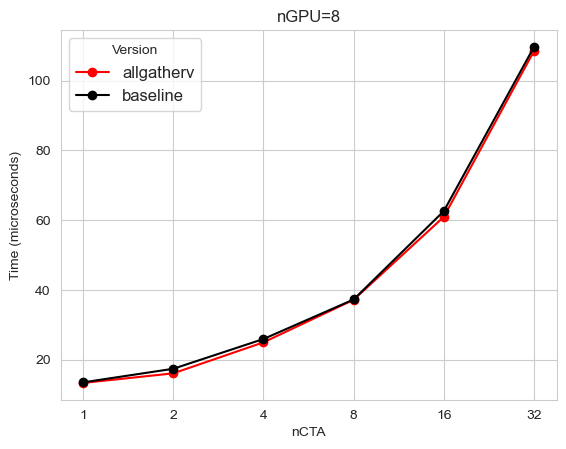 </img>

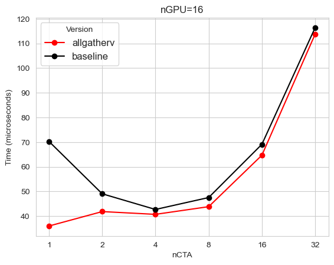 </img>

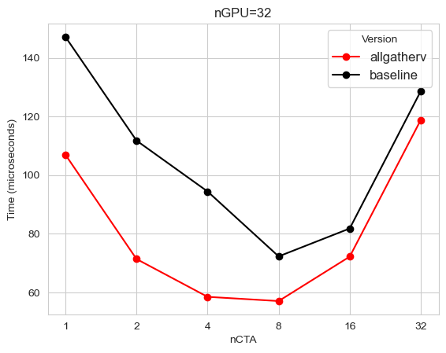 </img>

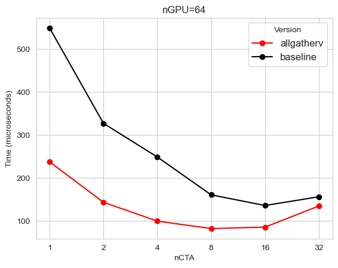 </img>

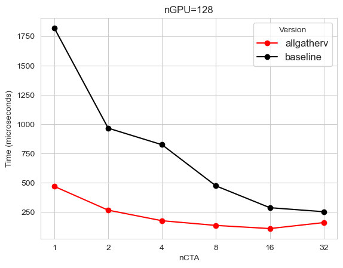 </img>

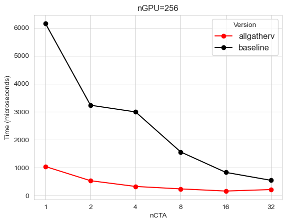 </img>

It's clear that as the number of GPU increase the more perf gain we can get from using allgatherv optimization.

#### What is measured?

#### Results


</details>

<!-- ============================================================================================-->
<details>
<summary><h2>Signoff List</h2></summary>
<!-- ============================================================================================-->

Author(s):
  - Junyu Ma

</details>
