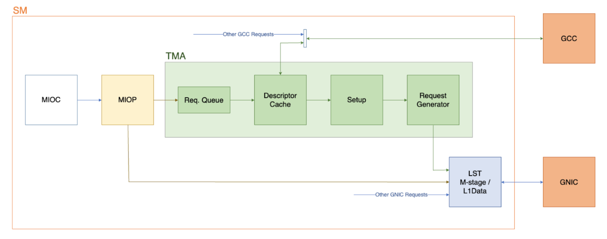
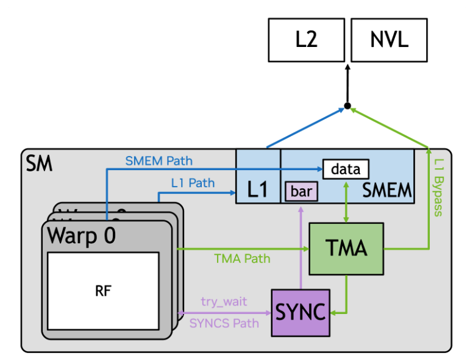
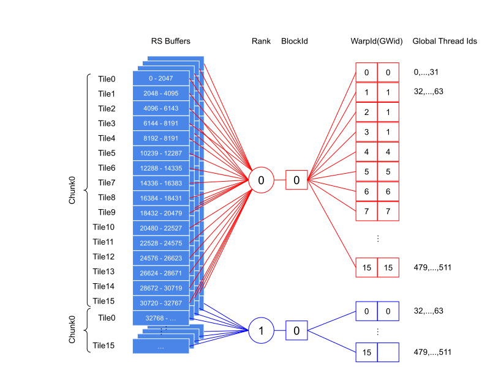
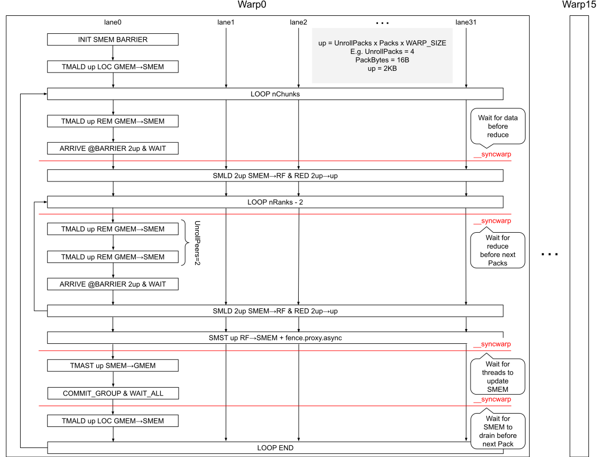
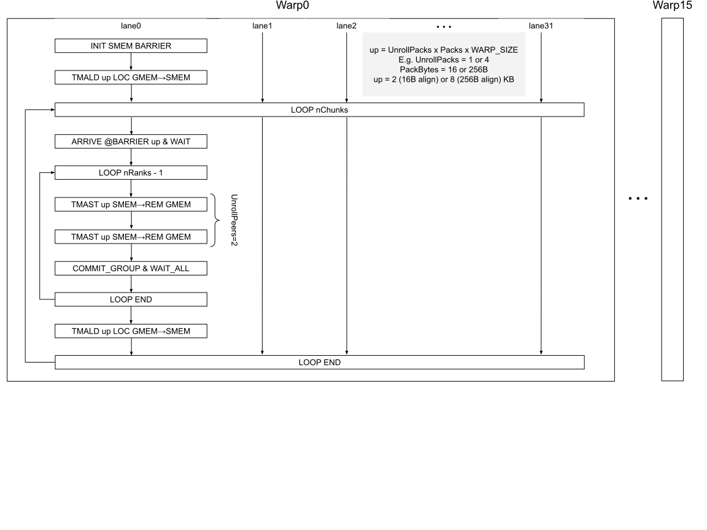

# TMA Support for Symmetric Kernels
<!-- use this template to share the details of your feature. Non-commented sections are strongly encouraged -->

## Abstract

Starting with Hopper (Compute Capability ≥ 9.0), Streaming Multiprocessors (SMs) are equipped with a specialized hardware unit for asynchronous data movement called Tensor Memory Accelerator (TMA). This unit is designed to copy large, multi-dimensional tensor blocks between global memory (GMEM) and shared memory (SMEM) with reduced overhead.

The TMA unit can be programmed through dedicated PTX instructions, available since PTX ISA 8.5. These instructions allow warps in the SM to offload data movement (and reductions) to the TMA, freeing SM threads for other tasks.

<!-- here detail what the feature is about. A few sentence that can be copy-pasted to external actors -->

This feature introduces support for TMA initiated load/store operations in selected variants of ReduceScatter, AllGather and AllReduce symmetric kernels.

## TMA Background

This section draws from the [TMA for GPU Comms](https://docs.google.com/document/d/1hx0zyOxVQjwXJPr1R_j_yJE0EyJMuZcvAi7bX_dZxJw/edit?pli=1&tab=t.0).

### Overview

Every SM has one TMA engine (shared across all sub-partitions \- warp schedulers) capable of moving data asynchronously (w.r.t. the issuing warp) between GMEM and SMEM.

TMA operations are warp-uniform, meaning that they are scoped at the warp level (either all threads in the warp converge to make TMA calls \- same calls with same arguments \- or one thread is elected to make TMA calls on behalf of others).

<div align="center">



*The MIOC block is the bridge between sub-partitions and the (per-SM) memory pipeline, the MIOP block is the entry point into the memory pipeline, the LST block is the Load Store Texture unit that sends (receives) memory request to (from) the GNIC interface. The latter connects the SM to the memory XBAR, giving it access to other SMs shared memory, L2 and NVLink ports*
</div>

While SM initiated loads and stores flow from the MIOP directly into the LST, TMA initiated loads and stores flow through a dedicated hardware path. Operations from different sub-partitions are multiplexed by an (MIOC) arbiter into the MIOP TMA queue.

### TMA Operations

TMA operations are asynchronous and have different completion semantics w.r.t. SM operations driven by the per-lane load/store units. Moreover, TMA loads have different completion semantics when compared with TMA stores. The following section describes TMA terminology and semantics.

#### Loads

TMA loads are issued using the *cp.async.bulk* PTX instruction, where the source operand is a global memory (GMEM) address and the destination operand is a shared memory (SMEM) address:

```c
// global -> shared::cta
cp.async.bulk.dst.src.completion_mechanism{.level::cache_hint}
                        [dstMem], [srcMem], size, [mbar] {, cache-policy}

.dst =                  { .shared::cta }
.src =                  { .global }
.completion_mechanism = { .mbarrier::complete_tx::bytes }
.level::cache_hint =    { .L2::cache_hint }
```

The *size* operand (expressed in bytes) is a 32-bit integer value and must be a multiple of 16\. The completion mechanism for loads uses a *mbarrier* object in shared memory, which address is also passed to the *cp.async.bulk* instruction.

##### Barrier Arrive

The *mbarrier* object needs to be configured to wait for the requested amount of data to be transferred. This is achieved using the *mbarrier.arrive.expect\_tx* PTX instruction:

```c
mbarrier.arrive.expect_tx{.sem.scope}{.shared{::cta}}.b64 state, [addr], count;

.sem   = { .release, .relaxed }
.scope = { .cta, .cluster }
```

The instruction also allows defining memory ordering semantics (.release, .relaxed) and scope (.cta, .cluster). Release semantics can be useful in inter-warp synchronization, but in the context of NCCL TMA kernels .relaxed suffices (every warp operates independently w.r.t. others).

##### Barrier Wait

The arrive operation returns a state object (or mbarrier token) that is used by the issuing thread to wait on *cp.async.bulk* completion using the *mbarrier.try\_wait* PTX instruction:

```c
mbarrier.try_wait{.sem.scope}{.shared{::cta}}.b64
                        waitComplete, [addr], state {, suspendTimeHint};

.sem   = { .acquire, .relaxed }
.scope = { .cta, .cluster }
```

The shared memory barrier is updated with the number of bytes read into SMEM by the TMA unit using the SYNC unit. When the SYNC unit detects that the requested number of bytes was transferred, it releases the barrier. At this point the token is also updated to indicate that data has reached SMEM and is ready to be consumed by the warp.

In cases where one thread is elected to issue TMA operations, other threads need to synchronize with the elected thread before they access data in SMEM (e.g., using *\_\_sync\_warp*). However, they don't need to perform any additional memory synchorization to see the correct data.

<div align="center">



*TMA \+ SYNC unit block diagram*
</div>


**Example**:

```c
// 1. Initialize barrier with 1 to indicate only one elected thread makes TMA calls
mbarrier.init.shared::cta.b64 [%s_mbar], 1;

// 2. First TMA load: 256 B from g_src0 → s_buf0
cp.async.bulk.shared::cta.global.mbarrier::complete_tx::bytes
    [%s_buf0], [%g_src0], 256, [%s_mbar];

// 3. Second TMA load: 256 B from g_src1 → s_buf1
cp.async.bulk.shared::cta.global.mbarrier::complete_tx::bytes
    [%s_buf1], [%g_src1], 256, [%s_mbar];

// 4. Tell the barrier we expect 256 + 256 bytes total
//    (both cp.async.bulk complete_tx::bytes contribute to this)
mbarrier.arrive.expect_tx.relaxed.cta.shared::cta.b64
    %token, [%s_mbar], 512;

WAIT_LOOP:
    // 5. Wait until the mbarrier has observed all 512 bytes
    mbarrier.try_wait.relaxed.cta.shared::cta.b64
        %p_done, [%s_mbar], %token;
    @!%p_done bra WAIT_LOOP;
```

#### Stores

TMA stores are issued using the *cp.async.bulk* PTX instruction, where the source operand is a SMEM address and the destination operand is a GMEM address:

```c
// shared::cta -> global
cp.async.bulk.dst.src.completion_mechanism{.level::cache_hint}{.cp_mask}
                        [dstMem], [srcMem], size {, cache-policy} {, byteMask}

.dst =                  { .global }
.src =                  { .shared::cta }
.completion_mechanism = { .bulk_group }
.level::cache_hint =    { .L2::cache_hint }
```

Since TMA operates on 16B aligned memory and has a min granularity of 16B, the 16-bit wide *.cp_mask* modifier is used to select what bytes in each 16B block need to be copyed.

##### Group Commit

The completion mechanism for stores does not use the mbarrier object. Instead, it uses the group construct. A group represents a set of TMA stores that are guaranteed to complete together. A group is started using the *cp.async.bulk.commit\_group* PTX instruction:

```c
cp.async.bulk.commit_group;
```

##### Group Wait

After TMA stores have been committed to a group, the issuing thread can wait for all the stores in the group to complete using the *cp.async.bulk.wait\_group* PTX instruction:

```c
cp.async.bulk.wait_group{.read} N;
```

An issuing thread can commit multiple groups and then wait for any number of them to complete using the *wait\_group* instruction. N represents the number of unfinished groups. If N \= 0 it means that all the groups should complete for the wait call to return.

The *.read* modifier indicates that the written data does not have to become visible to the issuing thread after return. This means that a load operation to the same global memory address by the issuing thread is not guaranteed to return the stored data.

It is important to note that *wait\_group* only guarantees local completion (i.e., the shared memory buffers have been read and can be reused), it does not guarantee that the destination global memory has received the data. Additional instructions are needed to order TMA stores and following loads to global memory.

**Example**:

```c
// 1. First TMA store: 256 B from s_buf0 → g_dst0
cp.async.bulk.global.shared::cta.bulk_group [%g_dst0], [%s_buf0], 256;

// 2. Second TMA store: 256 B from s_buf1 → g_dst1
cp.async.bulk.global.shared::cta.bulk_group [%g_dst1], [%s_buf1], 256;

// 3. Close the current bulk async‑group and flush to TMA
cp.async.bulk.commit_group;

// 4. Wait until all stores in this group are complete and visible
cp.async.bulk.wait_group 0;
```

Summarizing, TMA stores have the following structure:

```c
for (int g = 0; g < N; g++) {
  for (int s = 0; s < nStores; s++) {
    cp_async_bulk_shared_to_global(...); // store #1
    cp_async_bulk_shared_to_global(...); // store #2
  }
  // commit all N groups
  cp_async_bulk_commit_group();
}

// wait for M groups to complete
cp_async_bulk_wait_group(N-M);
```

### Proxy Synchronization

A proxy in PTX represents a method of memory access. The SM threads normally access memory using the lane load/store unit (aka generic proxy). TMA is the asynchronous method of memory access and is called async proxy. As noted above, the generic and async proxies access memory through different hardware paths. Thus, a store operation in the generic proxy is not automatically visible to the async proxy after it completes in the same thread/warp. To make the store visible, additional ordering guarantees between the SM store and the TMA load are needed. These ordering is achieved using the *fence.proxy.async* PTX instruction.


<!-- ============================================================================================-->
<details>
<summary><h2>Motivation and requirements</h2></summary>
<!-- ============================================================================================-->

The integration of TMA support in NCCL intercepts a number of HW improvements that are introduced with future generations of GPUs (Rubin+):

1. Improved packet efficiency for NVL6+ protocol from 85\% to 92\% in Rubin (GR100) vs Blackwell (GB100)

   1. Double the size of NVL packet payload from 128B to 256B for SMEM to remote GMEM copies over NVL using TMA

2. Support for SEQUENCED & COUNTED writes on Rubin

   1. SEQUENCED writes provide HW guarantees for no-split of 128B stores from SMEM to GMEM, thus better supporting LL128 protocol in NCCL.
      The GNIC interface splits stores into 32B/cycle transactions, or sectors, that can be reordered by MEMSYS. TMA stores are guaranteed to be committed to memory in ascending address order

   1. COUNTED writes remove the need for synchronization phase (membar \+ flag) as the TMA can update a byte counter after every commit to memory. This unlocks pack/unpack free LL128 protocol (w/ restriction that data and counter need to be in the same page)

3. Support NVL7 in-network (multicast) push reductions on Rubin-Ultra (GR150)

   1. Reduces end-to-end latency. Requires Compute Fabric Transport (CFT) LE support (SW emulated in GR150, natively supported in HW in FN100) and only available through TMA instructions.

A comprehensive list of TMA features is available at [this](https://nvidia.sharepoint.com/:p:/r/sites/GPUcommunications/_layouts/15/doc2.aspx?sourcedoc=%7BF2F71468-E3DC-434D-8203-1F0BFD5B30A0%7D&file=TMA%20Pipelines%20for%20Comms.pptx&action=edit&mobileredirect=true&previoussessionid=9750409e-9008-a8d9-ce93-0bcbce48230a) link.

### NVbugs / Jira Tickets

[Support for TMA](https://nvbugspro.nvidia.com/bug/5895870)

[Rubin-209 TMA: Add support for UBLKCP.256B.G.S](https://nvbugspro.nvidia.com/bug/5312943)

### User Experience

Higher bus bandwidth for NCCL collectives when using TMA-based kernels.

### Assumptions, constraints and dependencies

* Blackwell+ GPUs (SM100+)
* CTK 12.0+

### Use Cases

Main users of symmetric kernels are latency sensitive, inference workloads.

<!-- ### Platform Requirements -->
<!-- ### Functional Requirements -->
<!-- ### System Requirements -->
<!-- ### Interface Requirements -->
<!-- ### KPI Requirements -->
<!-- ### Security Requirements -->
<!-- ### Legal and Standards Requirements -->
<!-- ### Telemetry Requirements -->
<!-- ### Backward Compatibility Requirements -->
<!-- ### Virtualization Requirements -->

</details>

<!-- ============================================================================================-->
<details>
<summary><h2>Design</h2></summary>
<!-- ============================================================================================-->

This section assumes the reader is familiar with the SM-based symmetric kernels design. [This](https://docs.google.com/document/d/1yGvrqi9ZJjvhQkbEXjtZlw40sSyUezhCWUZ9-o4rfZc/edit?tab=t.rkka4mz0x2os) link points to a detailed report that provides the necessary background.

## Kernel Selection

TMA-based kernels are enabled whenever the architecture supports them (\_\_CUDA\_ARCH\_\_ ≥ 100\) and the user builds NCCL with the TMA flag set to 1 (i.e., make TMA=1).

### Host Scheduler

From the host scheduler perspective nothing changes w.r.t. the SM-based symmetric kernels design. Work items are quantized into cells and distributed across blocks using the same logic. The only difference is that TMA-based kernels need to use shared memory and can tune the default amount to account for larger alignment requirements (i.e., 256B aligned TMA stores).

Any work item that needs LL-based protocol falls back to the SM-based symmetric kernels, while any work item that uses the "SIMPLE" protocol takes the new TMA-based path. Additionally, any collective that does not satisfies TMA alignment and size requirements also fallsback to SM-based symmetric kernels.

### Target Collectives for TMA Support

The following symmetric kernels have been chosen for integration:

1. ReduceScatter\_LD
2. AllGather\_ST
3. AllGather\_STMC
4. AllReduce\_RSxLD\_AGxST

### ReduceScatter\_LD

ReduceScatter\_LD is a single shot, load-based, algorithm. Peers are processed in pairs. Every thread (across the 16 warps) loads a portion (Pack) of the tile, from each of the two peers in the pair, into registers and reduces it. Then, it stores the reduced data from registers to global memory, before moving to the next pair of peers. This process continues until all tiles have been reduced. The following image shows how tiles are assigned to ranks, CTAs and warps.

<div align="center">



*Partitioning for a 128KB RS buffer (16 byte aligned) across 4 GPUs and 1 Channel using ReduceScatter\_LD. Every GPU ends up with 32KB of reduced data.*
</div>

In the TMA version of the ReduceScatter\_LD kernel, SM loads/stores are replaced by TMA loads/stores. Peers are processed in pairs. Every tile (up) is loaded from GMEM (local and remote) into SMEM by lane0 using TMA (TMALD). Then, every lane loads 2 Packs (for a total of 2 tiles per warp) from SMEM into RF using the generic proxy (SMLD) and reduces the 2 Packs into 1. When all the tiles from all the peers are reduced, all the lanes store the reduced tile from RF to SMEM using the generic proxy (SMST). Finally, lane0 stores the reduced data from SMEM to local GMEM using TMA (TMAST). Synchronization (*\_\_syncwarp*) and memory ordering (*fence.proxy.async*) between lane0 and the rest of the lanes is needed to guarantee correctness.
<div align="center">



*reduceDeep kernel design using the TMA engine for load/store operations and SM for reductions. Lane 0 is elected to issue TMA operations for the entire warp. Every lane loads data from shared memory into RF, reduces it and stores results into shared memory. In the 16B align case, every warp reduces 4KB (16B Pack x 4 UnrollPacks x 2 UnrollPeers x 32 lanes) and 64KB in total per SM (4KB x 16 warps).*
</div>

TMA loads issued by subpartitions are pipelined in the memory I/O path and, from there, into the TMA engine. Every warp issuing TMA load and store operations independently is equivalent to a warp specialized design where a single warp per SM is responsible for issuing TMA loads and stores. This guarantees that the TMA pipeline is always fed with TMA instructions and avoid bubbles.

### AllGather\_ST

AllGather\_ST is a single shot, store-based, algorithm. Similarly to ReduceScatter\_LD, peers are processed in pairs. Every thread (across the 16 warps) loads a portion (Pack) of the tile from own global memory buffer into registers and then it stores it to every peer remote global memory buffer.

In the TMA version of the AllGather\_ST kernel, SM loads/stores are replaced by TMA loads/stores. The main difference with ReduceScatter\_LD is that data is never transfered from SMEM to RF (as there is no reduction this time). Thus TMA load/store operations are not interleaved by SM load/store operations from/to SMEM. As a result the kernel is simpler and requires no additional synchronization and memory ordering.

<div align="center">



*bcastDeep kernel design using TMA engine for load and store operations. There are two variants that differ by alignment: 16 vs 256 byte. The 256B aligned variant allows taking advantage of improved NVL protocol efficiency for 256B stores in Rubin+. In this case, the amount of shared memory doubles from 64KB per SM to 128KB (Pack size set to 256B and UnrollPacks \= 1). The 16B aligned variant is a fallback to 128B stores. In this case, the amount of shared memory per SM is 64KB (Pack size set to 16 and UnrollPacks \= 4).*
</div>

### AllReduce\_RSxLD\_AGxST

Combines *reduceDeep* and *bcastDeep* in *allreduceDeep* (two phase algorithm).

#### Design

1. **RS Phase**: lane 0 initiates one TMA load operation for every peer global memory. Following the load, lane 0 waits on the mbarrier object for the data to arrive. Then, after synchronizing, all lanes load the data from shared memory into RF and proceed to reduce it. This sequence repeats for each peer until all peers have been processed.

2. **AG Phase**: all lanes store the result to shared memory and synchronize (`__syncwarp`). This necessitates a memory fence (`fence_proxy_async`) to make results written by the generic proxy (SM threads) visible to the async proxy (TMA). Afterwards, lane 0 issues one TMA store to every peer global memory.

During the RS phase, every warp loads own data using TMA:

```c
// TMA SMEM struct -> 4KB (input/output) + 8B (barrier)
typename<typename Pack, int UnrollPacks, int UnrollPeers = 1>
struct tmaSmemStruct {
  alignas(16) Pack buffer[UnrollPeers][UnrollPacks*WARP_SIZE];
  alignas(8) __mbarrier_t bar;
};

Pack acc0[UnrollPacks];

// tileSize = 512B (4B alignment) or 2048B (16B alignment)
constexpr size_t tileSize = UnrollPacks*WARP_SIZE*sizeof(Pack);

// block local warp id
int lw = threadIdx.x/WARP_SIZE;

// allocated per-warp shared memory for TMA buffers
size_t smemSizePerWarp = ncclTmaShmemScratchWarpSize();
extern __shared__ char smemScratch[];
using tmaSmemStruct_t = tmaSmemStruct<Pack, UnrollPacks, UnrollPeers>;
tmaSmemStruct_t* tmaSmem = reinterpret_cast<tmaSmemStruct_t*>(
  smemScratch+lw*smemSizePerWarp
);

if constexpr (EnableTma) {
  if (lane == 0) {
    __mbarrier_init(&tmaSmem[lw].bar, 1);
  }
}

nIters -= w;
if (0 < nIters) {
  if constexpr (EnableTma) {
    if (lane == 0) cp_async_bulk_global_to_shared(
      tmaSmem->buff[0],
      inpPacks.peerPtr(world, rank),
      &tmaSmem->bar,
      tileSize);
    }
  } else {
    // SM path
  }
}
```

After loading own data, every warp loads the next peer’s data:

```c
while (true) {
  tmaSize = tileSize;
  AccPack acc[UnrollPacks];
  int r = rank;
  if (++rank == nRanks) r = 0;
  { Pack tmp1[UnrollPacks];
    if constexpr (EnableTma) {
      // elect thread0 to load data from peer rank into SMEM using TMA
      if (lane == 0) {
        cp_async_bulk_global_to_shared(
          tmaSmem->buff[1],
          inpPacks.peerPtr(world, r),
          &tmaSmem->bar,
          tileSize
        );

        tmaSize += tileSize;

        // configure memory barrier to wait for the data to be loaded
        __mbarrier_token_t token = barrier_arrive1_tx(
          &tmaSmem->bar,
          tmaSize);

        // wait for the data to be loaded
        while (!barrier_try_wait_token(&tmaSmem->bar, token)) {}
        tmaSize = 0;
      }
      __syncwarp();
    } else {
      // SM path
    }

    #pragma unroll
    for (int u = 0; u < UnrollPacks; u++) {
      if constexpr (EnableTma) {
        acc0[u] = tmaSmem->buff[0][lane+WARP_SIZE*u];
        tmp1[u] = tmaSmem->buff[1][lane+WARP_SIZE*u];
      }
      acc1[u] = applyReduce(red,
                            applyCast<T, Acc>(tmp1[0]),
                            applyCast<T, Acc>(tmp1[1]));
    }
```

Next, data from remaining peers is loaded and reduced in batches of UnrollPeers:

```c
// process the rest of the peers
int dr = 2;
#pragma unroll 2
for (int partial = 0; partial <= 1; partial++) {
  #pragma unroll 1
  for (int i = 0;
       partial ? i < 1 : (dr + UnrollPeers <= nRanks);
       partial ? i++ : (dr += UnrollPeers)) {
    if (partial && dr == nRanks) break;

    Pack tmp1[UnrollPeers][UnrollPacks];
    if constexpr (EnableTma) {
      // lane 0 waits for all threads to reduce tmp1 before next batch of loads
      __syncwarp();
    }

    #pragma unroll
    for (int ur=0; ur < UnrollPeers-partial; ur++) {
      if ((partial && ur != 0) && (dr + ur == nRanks)) break;
      if constexpr (EnableTma) {
        if (lane == 0) {
          cp_async_bulk_global_to_shared(
            tmaSmem->buff[ur],
            inpPacks.peerPtr(world, r),
            &tmaSmem->bar,
            tileSize
          );

          tmaSize += tileSize;
        }
      } else {
        // SM path
      }
      if (++r == nRanks) r = 0;
    }
    if constexpr (EnableTma) {
      if (lane == 0) {
        token = barrier_arrive1_tx(
          &tmaSmem->bar,
          tmaSize
        );
        while (!barrier_try_wait_token(&tmaSmem->bar, token)) {}
        tmaSize = 0;
      }
      // threads wait for peers' data to reach shared memory before reduction
      __syncwarp();
    }

    #pragma unroll
    for (int ur = 0; ur < UnrollPeers-partial; ur++) {
      if ((partial && ur != 0) && (dr + ur == nRanks)) break;
      #pragma unroll
      for (int u = 0; u < UnrollPacks; u++) {
        if constexpr (EnableTma) {
          tmp1[ur][u] = tmaSmem->buff[ur][lane+WARP_SIZE*u];
        }
        acc1[u] = applyReduce(red, acc1[u], applyCast<T, Acc>(tmp1[ur][u]));
      }
    }
  }
}
```

During the AG phase, every warp stores reduced data to target peer global memory using TMA:

```c
// TMA store the data to peer global memory
#pragma unroll
for (int u=0; u < UnrollPacks; u++) {
  if constexpr (EnableTma) {
    tmaSmem->buff[0][lane+WARP_SIZE*u] = applyCast<Acc, T>(acc1[u]);
  } else {
    // SM path
  }
}

if constexpr (EnableTma) {
  // threads flush data to point of consistency for async proxy (TMA)
  fence_proxy_async();
  __syncwarp();
}

dr = 0;
r = rank;
for (int partial = 0; partial <= 1; partial++) {
  #pragma unroll 1
  for (int i = 0;
       partial ? i < 1 : (dr + UnrollPeers <= nRanks);
       partial ? i++ : (dr += UnrollPeers)) {
    #pragma unroll
    for (int ur=0; ur < UnrollPeers-partial; ur++) {
      if ((partial && ur != 0) && (dr + ur == nRanks)) break;
        if constexpr (EnableTma) {
          if (lane == 0) {
            cp_async_bulk_shared_to_global(
              outPacks.peerPtr(world, r),
              tmaSmem->buff[0],
              tileSize);
          }
        } else {
          // SM path
        }
        if (++r == nRanks) r = 0;
      }
    }
  }
  if constexpr (EnableTma) {
    if (lane == 0) {
      cp_async_bulk_commit_group();
      cp_async_bulk_wait_all_read();
    }
    __syncwarp();
  }
```

Finally, the next local tile is loaded and loop starts over:

```c
  inpPacks += intptr_t(wn)*UnrollPacks*WARP_SIZE;
  outPacks += intptr_t(wn)*UnrollPacks*WARP_SIZE;
  nIters -= wn;
  if (nIters <= 0) break;

  // Load data for next iteration.
  if constexpr (EnableTma) {
    if (lane == 0) {
      cccccbldnkejikevutlhbbnbgdlelfbuuclruuu
  } else {
    // SM path
  }
}
```


<!-- ### Proposed Design -->

<!-- ### Interface Architecture -->

<!-- ### System KPIs & Metrics -->
<!-- ### Data Architecture -->
<!-- ### Security Design -->
<!-- ### Debugging & Troubleshooting -->
<!-- ### Logging and Instrumentation -->
<!-- ### Operational Considerations -->

</details>

<!-- ============================================================================================-->
<details>
<summary><h2>Coding</h2></summary>
<!-- ============================================================================================-->

### Commit list or MR

</details>

<!-- ============================================================================================-->
<details>
<summary><h2>Testing and Validation</h2></summary>
<!-- ============================================================================================-->

### Objectives and Timeline

### Validation

Performance analysis comparison between SM and TMA symmetric kernel variants is available at [this](https://nvidia.atlassian.net/wiki/x/Trforw) link.

#### Where to run?

#### What to run?

#### Expected output?

<!-- #### Code Coverage Goal Defined -->
<!-- #### KPI Coverage Goals Defined (performance, stress, stability, throughput, latency) -->
<!-- #### Requirement Coverage Goal Defined -->
<!-- #### Quality Thresholds Defined -->
<!-- #### Test Timeline -->
<!-- #### SW Verification and Test Plan -->
<!-- ### Test plan -->
<!-- #### Requirements Tests -->
<!-- #### Interface Tests -->
<!-- #### Fault-injection Tests -->
<!-- #### Resource Usage Tests -->
<!-- #### Design Coverage Testing -->
<!-- #### Boundary Tests -->
<!-- #### Certification Tests -->
<!-- #### Stress Tests -->
<!-- #### Stability Tests -->
<!-- #### Perf and Power KPI Tests -->
<!-- #### Usability & OOBE Tests -->
<!-- #### Manufacturing Diagnostic(Factory) Tests -->

### Performance

#### What is measured?

#### Results


</details>

<!-- ============================================================================================-->
<details>
<summary><h2>Signoff List</h2></summary>
<!-- ============================================================================================-->

Author(s):
  - Giuseppe Congiu <gcongiu@nvidia.com>

</details>
