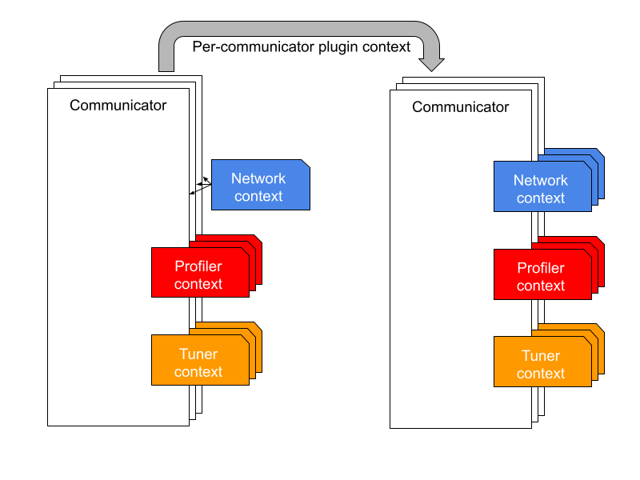
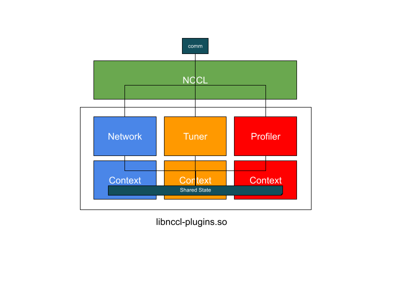

# NCCLNet Shared Plugin Context
<!-- use this template to share the details of your feature. Non-commented sections are strongly encouraged -->

## Abstract
<!-- here detail what the feature is about. A few sentence that can be copy-pasted to external actors -->
Training of large AI models is moving from single to multiple data centers, breaking previous assumptions and introducing new challenges in the communication layer. One assumption with single data center training is that the network infrastructure is uniform (E/W RDMA-based). With the introduction of long haul connections between data centers, the underlying network is no longer uniform and can potentially consist of a mix of different technologies (e.g., E/W RDMA-based and N/S socket-based) with different latency figures.

NCCL is the de facto communication library used by DL frameworks in distributed training of large AI models. NCCL uses hardware topology information to determine the most efficient form of data transport between GPUs (i.e., P2P, SHM, NET). However, NCCL knows nothing about the underlying network topology and assumes network latency is constant across all network peers during tuning (algo, proto, transport, channels, endpoints, etc).

NCCL is designed to support a variety of network technologies through the network plugin interface. Similarly, NCCL can support different network-specific tuners through the tuner plugin interface. The tuner and the network plugins can be co-located in the same library (i.e., come from the same provider) and, potentially, share information, including network topology. However, in practice, there are limitations to this happening in the current design.

The tuner plugin interface defines a context handle that the plugin can use to isolate internal resources across communicators. This handle is returned to NCCL during plugin initialization and stored in the ncclComm_t object. However, a similar handle is not returned during network plugin initialization, which is only performed once (regardless of the number of communicators created by the user). Therefore, there is no one-to-one association that can be made between the network and the tuner context and the tuner cannot make any communicator-specific optimizations based on network-related information (e.g., network topology).

Similarly, the tuner can use performance data from the profiler to adjust the NCCL tuning based on how well the current tuning performed for a given communication pattern on a specific communicator. To do so, it needs a way to match the communication context in which the tuner operates with the communication context in which the profiler operates to make sure they are the same.


<!-- ============================================================================================-->
<details>
<summary><h2>Motivation and requirements</h2></summary>
<!-- ============================================================================================-->

Having a shared context between the network, the tuner and the profiler plugins allows per-communicator tuning of the network.

There are several requirements for this to work:

### Plugins can have the same provider

This means that all (or at least a subset of) plugins can be distributed as part of the same plugin library (e.g., libnccl-net.so) and NCCL should be able to load them from the same library when it makes sense.

### Plugin initialization should be scoped per communicator

This means that all plugins need to be initialized for every new communicator. The network plugin interface, in its current form, does not provide a per-communicator context after initialization and NCCL initializes the network plugin once for all communicators.




### Plugin's state for the same communicator can be shared

The specific mechanism for context sharing is implementation dependent but ultimately relies on the communicator identifier (currently commHash) to locate the shared state, related to the same communicator, across different plugins.




### Plugin calls that depend on context should be scoped

Plugin calls that create additional resources (e.g., net plugin communicators) should also be able to access the same shared state.

### The network plugin context should not break backward compatibility

This means that for the network plugin specifically (that currently does not support a plugin context), the introduction of a per-communicator plugin context should not break compatibility with older plugins.

### NVbugs / Jira Tickets

[Jira-1924](https://jirasw.nvidia.com/browse/NCCL-1924)

[NVBUG-5205225](https://nvbugspro.nvidia.com/bug/5205225)

### User Experience

### Assumptions, constraints and dependencies

### Use Cases

### Platform Requirements

<!-- ### Functional Requirements -->
<!-- ### System Requirements -->
<!-- ### Interface Requirements -->
<!-- ### KPI Requirements -->
<!-- ### Security Requirements -->
<!-- ### Legal and Standards Requirements -->
<!-- ### Telemetry Requirements -->
<!-- ### Backward Compatibility Requirements -->
<!-- ### Virtualization Requirements -->

</details>

<!-- ============================================================================================-->
<details>
<summary><h2>Design</h2></summary>
<!-- ============================================================================================-->

### Plugins can have the same provider

NCCL needs to search for all plugin symbols in the list of comma separated network libraries supplied by the user through NCCL\_NET\_PLUGIN (since v2.27). Currently, NCCL only searches for NET and TUNER symbols in the same library. If the TUNER symbols are not found in NCCL\_TUNER\_PLUGIN, NCCL falls back to searching in the net plugin library. The same behavior needs to be extended to the PROFILER plugin.

The NCCL\_TUNER\_PLUGIN and NCCL\_PROFILER\_PLUGIN do not currently support a comma separated list of libraries like the NCCL\_NET\_PLUGIN. We don’t need to make these comma separated lists like NCCL\_NET\_PLUGIN. NCCL should only make sure all plugins are loaded from the same NCCL\_NET\_PLUGIN library whenever possible.

### Plugin initialization should be scoped per communicator

The TUNER and the PROFILER plugins are already scoped (i.e., every communicator that is initialized gets its own, independent, plugin context). For the NETWORK plugin, we need to add a new context argument to the init function (which will be stored in the ncclComm\_t object) and introduce a new finalize function that can release the network resources associated with the context.

### Plugin's state for the same communicator can be shared

In order for the plugins to be able to share state, the init functions have to take a unique communicator identifier. The unique ID allows every plugin to locate and access the shared state for a communicator. The unique ID can be part of a context structure that also contains the opaque handle returned to NCCL by the plugin. This opaque handle can either be the same for all contexts associated with the same communicator or plugins can decide to have different handles. This is an implementation detail that NCCL ignores.

### Plugin calls that depend on context should be scoped

Since the context can be used by the plugin to provide plugin resource allocation/isolation (including network specific resources such as QPs), the context handle needs to be passed to any other function that can allocate/initialize plugin resources. This includes: ``listen``, ``connect``, and ``makeVDevice``. Similarly, for the TUNER and the PROFILER, the ``getCollInfo`` and ``startEvent`` need to be updated to take advantage of the shared state context.

### The network plugin context should not break backward compatibility

NCCL allows older versions of the plugin APIs to work with most recent versions using compatibility layers. The network compatibility layers for NCCL (currently located in ``src/plugin/net/net_vX.cc``) should be updated to ignore the new context. Moreover, the compatibility layer should also handle multiple init calls to the same NETWORK plugin and only initialize the plugin once for older versions of the API (<11).

### Net Interface Changes

```C
ncclResult_t (*init)(void** ctx, uint64_t commId, ...);
ncclResult_t (*listen)(void* ctx, ...);
ncclResult_t (*connect)(void* ctx, ...);
ncclResult_t (*makeVDevice)(void* ctx, ...);
ncclResult_t (*finalize)(void* ctx);
```

### CollNet Interface Changes

```C
ncclResult_t (*init)(void** ctx, uint64_t commId, ...);
ncclResult_t (*listen)(void* ctx, ...);
ncclResult_t (*makeVDevice)(void* ctx, ...);
ncclResult_t (*finalize)(void* ctx);
```

### Tuner Interface Changes

```C
ncclResult_t (*init)(void** ctx, uint64_t commId, ...);
```

### Profiler Interface Changes

```C
ncclResult_t (*init)(void** ctx, uint64_t commId, ...);
```

</details>

<!-- ============================================================================================-->
<details>
<summary><h2>Coding</h2></summary>
<!-- ============================================================================================-->

### Commit list or MR

</details>

<!-- ============================================================================================-->
<details>
<summary><h2>Testing and Validation</h2></summary>
<!-- ============================================================================================-->

### Objectives and Timeline

#### Plugins can have the same provider

* Correctly load and initialize all plugins that are provided through the same library
* Correctly load and initialize plugins that are provided as part of separate libraries

#### Plugin initialization should be scoped per communicator

* Initialize one plugin context per communicator

#### Plugin's state for the same communicator can be shared

There is no way for NCCL to test this as the plugin context/state is opaque to NCCL. This is part of integration testing.

#### Plugin calls that depend on context should be scoped

This is a plugin internal nuance that is not visible through the API calls. This is also part of integration testing.

#### The network plugin context should not break backward compatibility

Currently NCCL QA tests old network plugins for backward compatibility.

#### Validation

#### Where to run?

#### What to run?

#### Expected output?

<!-- #### Code Coverage Goal Defined -->
<!-- #### KPI Coverage Goals Defined (performance, stress, stability, throughput, latency) -->
<!-- #### Requirement Coverage Goal Defined -->
<!-- #### Quality Thresholds Defined -->
<!-- #### Test Timeline -->
<!-- #### SW Verification and Test Plan -->
<!-- ### Test plan -->
<!-- #### Requirements Tests -->
<!-- #### Interface Tests -->
<!-- #### Fault-injection Tests -->
<!-- #### Resource Usage Tests -->
<!-- #### Design Coverage Testing -->
<!-- #### Boundary Tests -->
<!-- #### Certification Tests -->
<!-- #### Stress Tests -->
<!-- #### Stability Tests -->
<!-- #### Perf and Power KPI Tests -->
<!-- #### Usability & OOBE Tests -->
<!-- #### Manufacturing Diagnostic(Factory) Tests -->

### Performance

#### What is measured?

#### Results


</details>

<!-- ============================================================================================-->
<details>
<summary><h2>Signoff List</h2></summary>
<!-- ============================================================================================-->

Author(s):
  - Giuseppe Congiu <gcongiu@nvidia.com>

</details>
