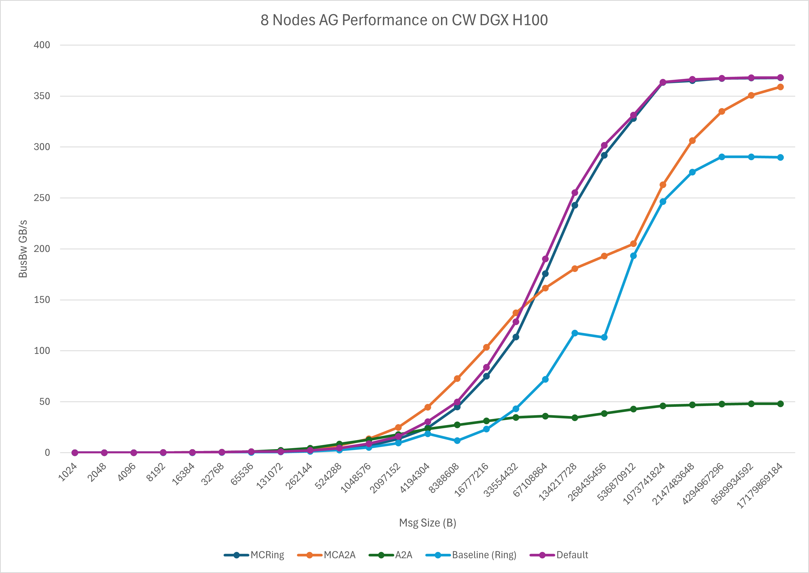
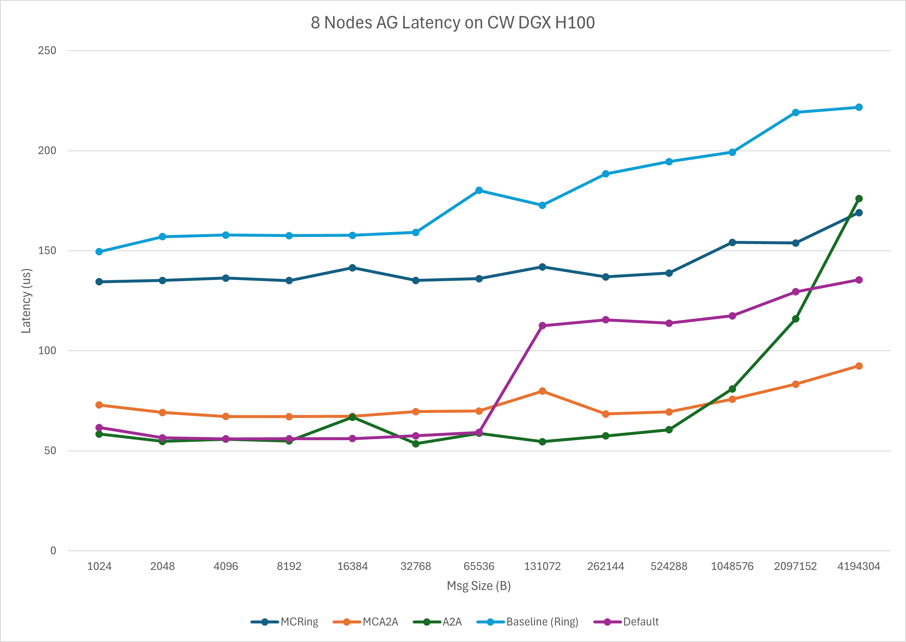

# Symmetric Kernels for GIN
<!-- use this template to share the details of your feature. Non-commented sections are strongly encouraged -->

## Abstract
This feature introduces new kernels to extend acceleration of symmetric collectives over the GIN network.

<!-- ============================================================================================-->
<details>
<summary><h2>Motivation and requirements</h2></summary>
<!-- ============================================================================================-->
Currently symmetric kernels only support single nvlink domain which limits the usages and benefits of symmetric features.
Expanding symmetric kernels for scale-out use case would be important for training as well as inference performance and
resource usage.
This feature implements scale-out kernels for AG and RS to bridge the gap.

### NVbugs / Jira Tickets
https://nvbugspro.nvidia.com/bug/5247282

### User Experience

Like symmetric kernels, all the user has to do is register the buffers in a
symmetric window and the kernels will be selected automatically.

### Assumptions, constraints and dependencies

Continuing with the design of the non-network sym kernels only AllReduce,
AllGather, and ReduceScatter will be specialized for the same datatypes.

### Use Cases

### Platform Requirements

GIN support will be required for these kernels to be enabled.

</details>

<!-- ============================================================================================-->
<details>
<summary><h2>Design</h2></summary>
<!-- ============================================================================================-->

Guiding assumptions:
* Winning the 1 byte latency benchmarks at small scale requires flat alltoall
algorithms.
* Realistic workloads lean more towards medium/large message sizes which are sensitive to the
bandwidth component.
* NVL bandwidth is now around 800GB/s but a single NIC could be as low as 100Gbps
  or as high as 800Gbps (GPU:CX8 = 1:1).

## ReduceScatter Design

A large possible disparity between NIC and NVL bw necessitates hierarchical
algos for medium sized collectives. FP8 complicates this because it has to be
accumulated as fp16. A hierarchical algo needs to send accumulators on the wire
so if the bandwidth of the network is at least half of NVL then hierarchy could
hurt more than help. For now we are instead sending FP8's on the wire, this means
there is a single truncation of the accumulator in the middle of the summation.

Hierarchical algos will use alltoalls at both levels.

Barriers will be used over LSA, but not over the network. Signalling puts
will do all the syncs necessary for the network.

The algorithms:
* AllGather_GinHier{_STMC}
* ReduceScatter_GinHier{_LDMC}

### Inbox buffers:

We want the alltoall algos to work at all scales without requiring memory in
excess of the latency-bandwidth product. Dedicated buffers per peer would
require unbounded memory, so instead we will use a rolling set of N buffers
where in the quiesced state your N immediate upstream neighbors start with a
credit, and as data is consumed the credit is forwarded to the next peer in the
alltoall pattern who needs that buffer. That means at the end of an alltoall,
clear-to-send signals will be sent to the first peers of the next round. This
will allow the kernel to immediately start doing PUTs without waiting for
initial handshake.

We also will support peer-buffer resizing for the case where we only receive
a single chunk per peer so we can maximize the number of peers that can be
sending us a chunk per step (num peer bufs = total size / chunk size).
Resizing requires a bit of ceremony because we are sending clear-to-send signals
eagerly assuming the next round uses the same buffer size as this round. So to
resize the peer-buffers:
1. We must have consumed all buffers from previous round.
2. Wait for and ignore all incoming signals which are trying to eagerly give
   us clear-to-send credits for this round (under assumption of same buffer size)
   before resetting to zero.
3. Send new clear-to-send signals for the first round of peers.

This requires we double buffer signals so the resetting of (2) doesn't race with
arrival from new clear-to-sends of (3). Additionally we don't want (3) waiting
for (2) because that prolongs the time until our peers get our clear-to-send's,
so we actually fire off (3) first and then wait in (2). This creates another
race on signals since (3) is sending signals before acknowledging that all peers
have completed previous round so its possible we could be racing with their (2)
reset from previous round. For this reason we quadruple buffer the signals.

### Outbox buffers:

Hierarchical reductions need a temporary buffer for generating intermediate
results to be sent to network. This can be a simple circular buffer with GIN
counters such that the previous kernel can still have data in flight without
blocking the next kernel from grabbing buffer space.

## Allgather Design

In order to use scale out AG symmetric kernels, we require users to symmetrically register
both src and dst buffers. Once buffers are registered and multi-node environment is detected,
scale-out kernels will be automatically picked. We assume each GPU has a local NIC or at least
can access a NIC in this implementation.

We provide 3 different algorithms for allgather.

The first one is Ring + NVLS (`ncclSymkRun_AllGather_GinHier_MCRing`). We split block into 2 parts;
the first part contains 1 warp which is used to issue GIN put on the rail, and the second part contains
the rest of warps to receive data from network and perform NVLS ops. The ring is built based on the
previous and next peer relative to my rank; for each round, each rank will load all its data received
from previous peer and put to next peer's dst buffer (except the first round where rank will directly
send its own src data).
Whenever data arrives, the second part of warps will start to broadcast data to all intra-node peers
by NVLS.

The second one is A2A + NVLS (`ncclSymkRun_AllGather_GinHier_MCA2A`). This algorithm is more for small
to medium message sizes. Everything is the same as Ring + NVLS except that rail communication pattern
becomes A2A-based put. The A2A is one-shot operation and each thread would issue all src data to a different
target rail peer until all peers are processed. At the same time, the second part of warps would wait on
them and broadcast to all intra-node peers.

The final one is pure A2A going through GIN (`ncclSymkRun_AllGather_GinFlat_A2A`). This is a fallback
algorithm for A2A + NVLS in case NVLS is not available. However, the best implementation should be doing
A2A on GIN for network and on NVLINK for intra-node. I would treat it as the future work.

### Performance Model

We have a simplified performance model for allgather, and it requires 3 major variables to compute the time:
network latency (netLatency), intra-node bandwidth (intraBw), and inter-node bandwidth (interBw). We borrow
the net latency value from legacy tuning model and now assign
netLatency to `comm->tunerConstants.hwLatencies[NCCL_HW_NET][NCCL_ALGO_RING][NCCL_PROTO_SIMPLE]`; intraBw is assigned
based on platform and empirical values (i.e., 360GB/s on Hopper and 720GB/s on Blackwell); interBw is assigned
to pure NIC bandwidth. Take Ring + NVLS algorithm as an example, we compute the number of steps, intra-node communication
time, and inter-node communication time; then, the overall time would be:
```
timeUs = steps * netLatency + std::max(intraTime, interTime);
```

Besides computing the time, we determine the block usage based on the number of bytes, chunkSize and platform, and now we
allocate 1 block to each chunk and cap it based on upper limit block usage. For example, on Blackwell with 8 GPUs, we only
need 4 SMs to saturate nvlink bandwidth, if we have 8 chunks, we would allocate std::min(4, 8) number of blocks.
chunkSize now might not be optimal and can be tuned in the future


<!-- note: the following HTML code is also valid -->
<!--  -->

### Interface Architecture

<!-- ### System KPIs & Metrics -->
<!-- ### Data Architecture -->
<!-- ### Security Design -->
<!-- ### Debugging & Troubleshooting -->
<!-- ### Logging and Instrumentation -->
<!-- ### Operational Considerations -->

</details>

<!-- ============================================================================================-->
<details>
<summary><h2>Coding</h2></summary>
<!-- ============================================================================================-->

### Commit list or MR

</details>

<!-- ============================================================================================-->
<details>
<summary><h2>Testing and Validation</h2></summary>
<!-- ============================================================================================-->

### Objectives and Timeline

### Validation

#### Where to run?

#### What to run?

#### Expected output?

<!-- #### Code Coverage Goal Defined -->
<!-- #### KPI Coverage Goals Defined (performance, stress, stability, throughput, latency) -->
<!-- #### Requirement Coverage Goal Defined -->
<!-- #### Quality Thresholds Defined -->
<!-- #### Test Timeline -->
<!-- #### SW Verification and Test Plan -->
<!-- ### Test plan -->
<!-- #### Requirements Tests -->
<!-- #### Interface Tests -->
<!-- #### Fault-injection Tests -->
<!-- #### Resource Usage Tests -->
<!-- #### Design Coverage Testing -->
<!-- #### Boundary Tests -->
<!-- #### Certification Tests -->
<!-- #### Stress Tests -->
<!-- #### Stability Tests -->
<!-- #### Perf and Power KPI Tests -->
<!-- #### Usability & OOBE Tests -->
<!-- #### Manufacturing Diagnostic(Factory) Tests -->

### Performance
The bandwidth on CW 8 DGX H100 nodes is as follows:



The corresponding latency on CW 8 DGX H100 nodes is as follows:



#### What is measured?

#### Results


</details>

<!-- ============================================================================================-->
<details>
<summary><h2>Signoff List</h2></summary>
<!-- ============================================================================================-->

Author(s):
  - John Bachan
  - Kaiming Ouyang

</details>
