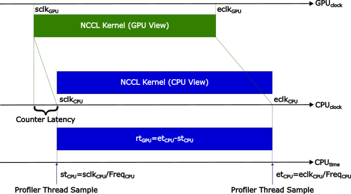
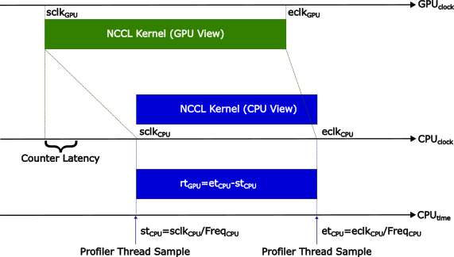
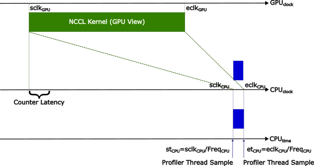

# Kernel Profiler Timestamps
<!-- use this template to share the details of your feature. Non-commented sections are strongly encouraged -->

## Abstract
Kernel profiling was introduced in NCCL v2.26. The NCCL core relies on a host thread (the proxy progress thread),
shared with network communication, to track NCCL GPU kernel progress and invoke the profiler start/stop every
time a NCCL operation begins/ends. However, this design has obvious limitations that impact the accuracy of the
profiler; Indeed, the profiler accuracy depends on the host thread timely observing the GPU kernel progress.

If the host thread is not in sync with the kernel, this can cause the following undesirable scenarios:

* Kernel Dialation: happens when the host thread observes the end of the kernel late (i.e., much after the profiler counters in the GPU have been stored to host memory)



* Kernel Compression: happens when the host thread observes the begin of the kernel late



* Kernel Collapse: happens when the host thread observes the begin of the kernel when this has already ended



To obviate this limitations, this feature adds support for Kernel Provided Timestamps (KPTS), effectively decoupling
the accuracy of the profiler from the host thread scheduling. This timestamps are in the form of PTIMERs.

<!-- here detail what the feature is about. A few sentence that can be copy-pasted to external actors -->

<!-- ============================================================================================-->
<details>
<summary><h2>Motivation and requirements</h2></summary>
<!-- ============================================================================================-->

### NVbugs / Jira Tickets

* [NVBug-5040628 (Item 9)](https://nvbugspro.nvidia.com/bug/5040628)
* [Jira-1777](https://jirasw.nvidia.com/browse/NCCL-1777)

### User Experience
Profiler plugin developers will get additional kernel timestamp information from NCCL. The plugin can use these
timestamps as additional source of information, along with the network timestamps, to estimate performance more
accurately.

### Assumptions, constraints and dependencies
PTIMERs (exposed to SMs through the globaltimer register) should be based on an immutable global clock, consistent
across all SMs and updated every 30 (or so) nanoseconds. The problem is that several factors can make this clock
drift (up to 10 microseconds per second). The profiler plugin can compute start/stop timestamps directly by converting
PTIMERs to nanoseconds and use stop - start as an approximation of the kernel's execution time. The profiler, however,
may also want to place the kernel timestamps into a timeline with other events from the CPU to correlate them, and for
this to happen it needs to convert PTIMERs into CPU times. CUPTI (Nsys) does this using linear interpolation.
I am not an expert on the topic, but my understanding is that doing this requires access to a CUDA UMD DevTools function
that would require a new dependency in NCCL. Therefore, the conversion should be done by the profiler plugin. For more
details on what function is used for the conversion refer to:
https://confluence.nvidia.com/display/DTSP/NV2080_CTRL_CMD_TIMER_GET_GPU_CPU_TIME_CORRELATION_INFO)

### Use Cases
Performance/functional characterization of NCCL GPU kernels.

### Platform Requirements

<!-- ### Functional Requirements -->
<!-- ### System Requirements -->
<!-- ### Interface Requirements -->
<!-- ### KPI Requirements -->
<!-- ### Security Requirements -->
<!-- ### Legal and Standards Requirements -->
<!-- ### Telemetry Requirements -->
<!-- ### Backward Compatibility Requirements -->
<!-- ### Virtualization Requirements -->

</details>

<!-- ============================================================================================-->
<details>
<summary><h2>Design</h2></summary>
<!-- ============================================================================================-->

### Proposed Design

The profiler instrumentation in the `ncclKernelMain` function uses work counters, incremented every time a NCCL operation
in the kernel is started, to communicate progress to the profiler host thread. Here, these counters are complemented by
timestamps, obtained by the GPU kernel by reading the `globaltimer` register. Thus, the `workStarted` and `workCompleted`
arrays now have elements of type:

```C
#define MAX_PROFILER_EVENTS_PER_CHANNEL 64

struct ncclDevProfiler {
  struct {
    uint64_t counter;
    uint64_t timestamp;
  } data[MAX_PROFILER_EVENTS_PER_CHANNEL];
};
```
Every time a NCCL operation is started/completed the `globaltimer` register is read and the timestamp placed in the data
element of the appropriate array and channel within the array.

To minimize the chance of counters and timestamp for a NCCL operation in a fused kernel to be overwritten by the next
operation, every channel has a ring buffer of size 64 elements. Overall, this allows to store up to 4096 timestamps per
fused kernel.

The NCCL profiler plugin interface is also extended to allow the profiler host thread to propagate the GPU kernel timestamps
to the profiler plugin.

<!-- note: the following HTML code is also valid -->
<!--  -->

### Interface Architecture

The NCCL profiler plugin interface is extended as follows:

```C
typedef struct {
  ...
  struct {
    uint8_t channelId;
    uint64_t startGpuClk;
  } kernelCh;
  ...
} ncclProfilerEventDescr_v4_t;

typedef union {
  ...
  struct {
    uint64_t timestamp;
  } kernelCh;
} ncclProfilerEventStateArgs_v4_t;
```

The event descriptor and the state arguments are extended with kernel timestamp support. The event state argument
is used in combination with the `recordEventState` callback to record the GPU kernel stop timestamp.

<!-- ### System KPIs & Metrics -->
<!-- ### Data Architecture -->
<!-- ### Security Design -->
<!-- ### Debugging & Troubleshooting -->
<!-- ### Logging and Instrumentation -->
<!-- ### Operational Considerations -->

</details>

<!-- ============================================================================================-->
<details>
<summary><h2>Coding</h2></summary>
<!-- ============================================================================================-->

### Commit list or MR

[MR 805](https://gitlab-master.nvidia.com/nccl/nccl/-/merge_requests/805)

</details>

<!-- ============================================================================================-->
<details>
<summary><h2>Testing and Validation</h2></summary>
<!-- ============================================================================================-->

### Objectives and Timeline

### Validation

#### Where to run?

#### What to run?

#### Expected output?

<!-- #### Code Coverage Goal Defined -->
<!-- #### KPI Coverage Goals Defined (performance, stress, stability, throughput, latency) -->
<!-- #### Requirement Coverage Goal Defined -->
<!-- #### Quality Thresholds Defined -->
<!-- #### Test Timeline -->
<!-- #### SW Verification and Test Plan -->
<!-- ### Test plan -->
<!-- #### Requirements Tests -->
<!-- #### Interface Tests -->
<!-- #### Fault-injection Tests -->
<!-- #### Resource Usage Tests -->
<!-- #### Design Coverage Testing -->
<!-- #### Boundary Tests -->
<!-- #### Certification Tests -->
<!-- #### Stress Tests -->
<!-- #### Stability Tests -->
<!-- #### Perf and Power KPI Tests -->
<!-- #### Usability & OOBE Tests -->
<!-- #### Manufacturing Diagnostic(Factory) Tests -->

### Performance

#### What is measured?

#### Results


</details>

<!-- ============================================================================================-->
<details>
<summary><h2>Signoff List</h2></summary>
<!-- ============================================================================================-->

Author(s):
  - Giuseppe Congiu <gcongiu@nvidia.com>

</details>
