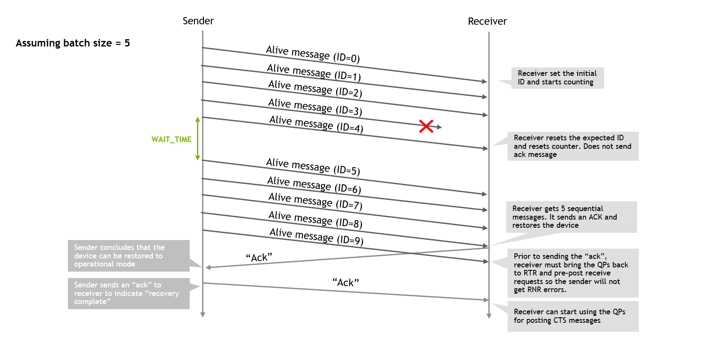
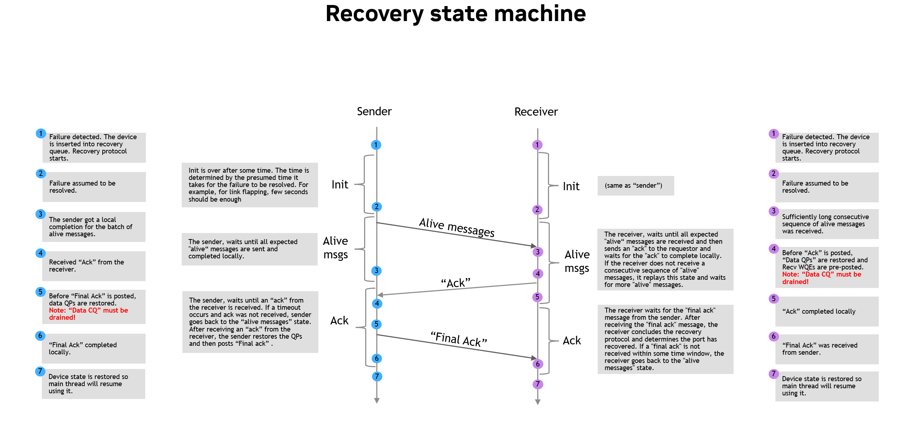
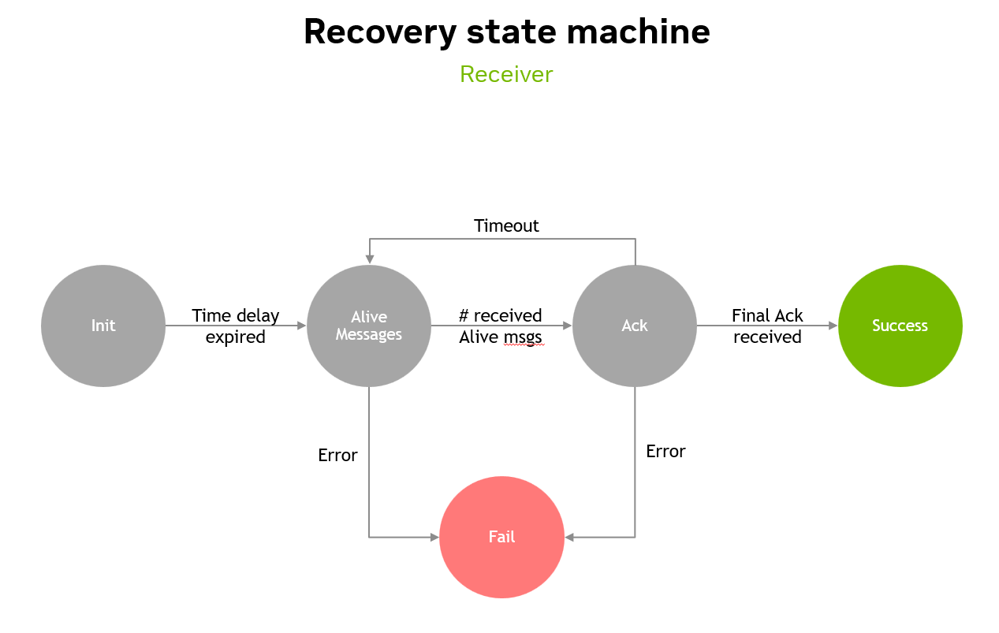
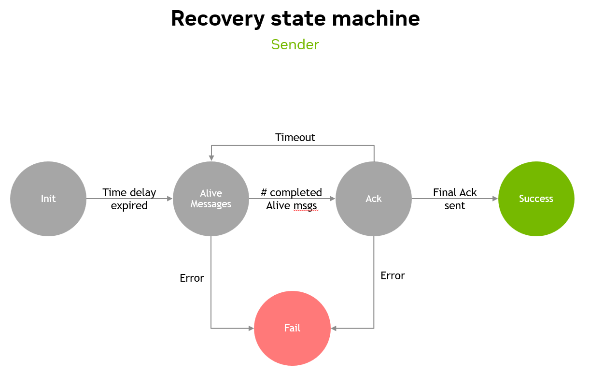

# Port-recovery

## Abstract

The Port-recovery feature is an enhancement to the NCCL IB plugin that enables the restoration of a failed device. While the [Port-failover](../id_4f382c74/Port-failover.md) feature ensures the job continues running despite a failure, the Port-recovery feature monitors the failed device. If the device returns to be operational (for example the failure was only because of a temporary network issue, like link flapping), the recovery feature will allow the NCCL IB plugin to try to restore the usage of the device by initiating a recovery protocol on the device. If the recovery protocol succeeds, the device is restored to an operational state and the IB plugin will be able to use it again, allowing a seamless continuous operation with no side effects, restoring the performance of NCCL to the performance it had before any failure happened.

## Motivation and requirements

In large scale AI and high-performance computing (HPC) workloads, maintaining uninterrupted runtime of the job is crucial due to the potential of significant overall performance degradation and computation loss caused by device failures which can cause the job to abort.

The recovery support is a crucial complementary feature as it allows higher SW stack components to decide if and when to abort the job, perform a checkpoint or wait in case there is a reason to believe that the failure is temporal as NCCL will be able to restore the usage of that port to deliver maximum performance. In addition, recovery support enhances resources utilization without any interruption to the job and other jobs running on the system.

The requirements that the recovery feature is designed to meet are:
* The recovery flow is required to restore operation of devices that encountered some error that caused them to be in some error state and after a certain amount of time, the device is able to recover from the error and be brought back to an operational state.
* The recovery flow must not interfere with the primary data path, or at most have minimal impact on the primary data path.

### NVbugs / Jira Tickets

* [[Feature Request] NCCL Failover Support on CX8 (NVBug #5256433)](https://nvbugspro.nvidia.com/bug/5256433)
* [[Feature Request] Port Recovery (NVBug #5256434)](https://nvbugspro.nvidia.com/bug/5848422)
* [[External][RFC] NCCL Port Failover and Recovery](https://docs.google.com/document/d/1je4sc1DoQpvcZjPOWYBxi5qj5iLXo6oyOTBp2KoWiP4/edit?resourcekey=0-Uth9d3yOXeBKIzjY310vqw&tab=t.0#heading=h.6muo8fckfdp)

### User Experience

To enable the port-recovery feature user should set `NCCL_IB_RESILIENCY_PORT_RECOVERY` to `1`.
It's required to also enable port-failover feature (`NCCL_IB_RESILIENCY_PORT_FAILOVER`).

### Assumptions, constraints and dependencies

The implementation of the port-recovery features is based on the following assumptions:

* Recovery feature assumes that failures are considered bi-directional and eventually be detected by both sides of the connection.
* Recovery feature assumes the availability of a UC QP usage.

### Use Cases

Whenever a system failure may occur and the workload is not too sensitive to peak performance at all times, port-failover and recovery features could be enabled to allow the job to continuously operate on a system which might experience temporal or permanent failures.

### Platform/System requirements

Port-failover and recovery features are implemented in the NCCL IB plugin, so the platform/system requirements are to have an InfiniBand or RDMA over Converged Ethernet (RoCE) network.

## Design and architecture

The port-recovery feature is implemented in the NCCL IB plugin.

### Setup and initialization

The recovery feature is initialized by the plugin when the plugin is initialized. The plugin spawns a dedicated thread for the recovery protocol.

During the connection establishment done for every connection, the plugin creates, on every device used by the connection, a dedicated queue pair (QP) and a dedicated completion queue (CQ) for the recovery protocol.

The dedicated QP used for the recovery protocol's messages is an Unreliable Connected (UC) QP.

> **Note**
>
> Future implementation can consider usage of a UD QP instead of a UC QP, and then a single UD QP can be shared by all connections that are established on the same plugin instance on the same device.

### Recovery protocol

Immediately after the main thread in the plugin detects a failed device, the device is added to a queue of failed devices (unless the device is already in the queue, in which case it's not added again). The separate, dedicated, asynchronous recovery thread handles the recovery protocol for every device that is added to the queue.

The recovery protocol outcome can be either a success or a failure. In case of a success, the device is restored to an operational state and the plugin can use it again. In case of a failure, the device is not restored to an operational state and the plugin will not try to restore it again. The time to restore the device to an operational state is determined by the `NCCL_IB_RESILIENCY_PORT_RECOVERY_TIMEOUT` environment variable. If after this time the device is not restored to an operational state, the plugin will not try to restore it again.

The recovery protocol is based on the sender side to probe the device and its connection to the receiver side, using batches (each batch size is determined by the `IB_PORT_FAILOVER_RECOVERY_NUM_MSGS` environment variable) of "alive" messages that are sent periodically (determined by the `IB_PORT_FAILOVER_RECOVERY_INTERVAL_MSEC` environment variable). When the receiver side receives the "alive" messages, it verifies whether it got the whole batch of the "alive" messages (without any "alive" message being lost), and if so, it acknowledges the "alive" messages by sending a message to the sender side. Upon receiving the acknowledgement message, the sender side concludes the recovery protocol is successfully complete and sends an acknowledgement message to the receiver side, which also concludes the recovery protocol successfully.

> **Note**
>
> The sender side sends each time "batch" of "alive" messages to also test the stability of the connection over the failed device. Sending a single "alive" message that reaches the receiver might falsely indicate that the device can be restored to an operational state.

The recovery protocol is asymmetrical in a sense that only the sender is sending "alive" messages to the receiver side and receiver only acknowledges them.

When the sender and receiver get a successful completion notification for the acknowledgement message (each of them gets a separate, local completion notification), each of them, independently, concludes the protocol and restores the device into operational state.

An example of the recovery protocol message flow (with a single "alive" message being dropped in the network) can be viewed below:

> **Note**
>
> The current recovery protocol assumes that both sides of the connection have the device in their failed devices queue, meaning the recovery protocol assumes that both sides of the connection eventually detect a failed device.
>
> In most cases, it's reasonable to assume that in case of a failure, both sides of the connection will detect it. However, there are cases where one side of the connection might not detect a failure. In this case the recovery protocol will not be able to restore the connection since in the current implementation, only the side that detected the failure will initiate the recovery protocol.
>
> Such an asymmetrical case can be if the failure was temporal and affected only unidirectional traffic, for example from the sender to the receiver.
>
> Such asymmetrical cases can be addressed in future implementations, although trade-offs might be needed to be made. For example, it might be required for the thread responsible for the recovery protocol to poll a CQ to detect messages from the other side of the connection, and not only when a local failure is detected.

### Restoring the device into operational state

Once both sides of the connection conclude the recovery protocol successfully, they restore the device into an operational state.

Restoring the QPs on the recovered device into operational state, must be done after making sure the CQ that is associated with these QPs is drained from any CQEs (note that only CQEs with error might be in that CQ because if the device was declared failed, the CQ had to generate a CQE with error and as soon as one CQE with error was generated, all following CQEs are also guaranteed by HW to be CQEs with error). Having the CQ drained is required to avoid the following scenario where the device is restored to an operational state, but some old CQEs (with error) remained in the CQ and were not polled by SW. Then, when new work requests are posted to the restored QPs and HW wants to complete them by generating a CQE, the HW might encounter a CQ overrun error which would be fatal because there is no way to distinguish between a "real" CQ overrun and a CQ overrun caused by a stale CQE remaining in the CQ from before the device was recovered.

Since the protocol has no explicit synchronization phase between the sender and receiver sides after they both conclude the device is restored, it's important to guarantee that the sender is not initiating any data transfers on the device before the receiver is ready to receive them (since data transfers are using RDMA Write with Immediate that consume Receive Work Requests - if these Receive Work Requests are not pre-posted to the Work Queue, the sender might get RNR errors). This is guaranteed by the fact that the receiver sends the "Ack" message to the sender side only **after** moving all the QP (used for data transfer) to RTR state and pre-posting Receive Work Requests on them.

In addition, it's important to guarantee that the receiver is not sending CTS messages to the sender side before the sender is ready to receive them. This is guaranteed by the fact that the sender moves the QPs used for data transfer to RTR state only **before** sending the "Ack" message to the receiver side and the receiver only sends CTS messages after receiving the "Ack" message from the sender side.

### Environment variables

* `NCCL_IB_RESILIENCY_PORT_RECOVERY`
   * Enables the use of port-recovery feature.
   * Default is 0 (disabled). Set to 1 to enable the use of port-recovery feature.
* `NCCL_IB_RESILIENCY_PORT_RECOVERY_START_DELAY`
   * Time in milliseconds to wait before starting the recovery protocol after a failure is detected. This delay allows the system to stabilize after the failure and can help to avoid false recovery attempts in case of temporal failures.
   * Default is 200 milliseconds.
* `NCCL_IB_RESILIENCY_PORT_RECOVERY_ALIVE_MSG_BATCH_INTERVAL`
   * Interval in milliseconds between consecutive recovery batches.
   * Default is 500.
* `NCCL_IB_RESILIENCY_PORT_RECOVERY_ALIVE_MSG_BATCH_SIZE`
   * Number of "alive" messages to send in each recovery batch.
   * Default is 5.
* `NCCL_IB_RESILIENCY_PORT_RECOVERY_ALIVE_MSG_SEQUENCE_SIZE`
   * Number of messages to send in a recovery batch.
   * Default is 5.
* `NCCL_IB_RESILIENCY_PORT_RECOVERY_ALIVE_MSG_TIMEOUT`
   * Time in milliseconds to wait for the "alive" messages to be acknowledged before considering the recovery attempt as failed.
   * Default is 4000 milliseconds.
* `NCCL_IB_RESILIENCY_PORT_RECOVERY_ACK_TIMEOUT`
   * Time in milliseconds to wait for the acknowledgement message to be acknowledged before considering the recovery attempt as failed.
* `NCCL_IB_RESILIENCY_PORT_RECOVERY_ATTEMPTS_MAX`
   * Maximum number of recovery attempts for a failed device. After this number of attempts, the failed device will not be attempted to be recovered anymore. Note that an attempt is counted during the recovery protocol operation and not after conclusion.
   * Default is 5.

## Coding

Port recovery feature is implemented in the NCCL IB plugin, mainly in the `net_ib/p2p_resiliency_recovery.{h,cc}` files, as part of "resiliency" features and it's complementary to the [port-failover feature](../id_4f382c74/Port-failover.md).

### State machine

The recovery protocol on both sides of the connection is implemented as a state machine.

#### Errors

An error is considered as a failure in the recovery protocol. In different states there might be different types of errors that can occur, for example, in the "Waiting for alive messages" state, if the receiver does not receive the expected "alive" messages within the timeout, it's considered an error. If for a certain mumber of attempts the receiver encounters errors, the recovery protocol is concluded with a failure outcome.

On the sender side, if the sender does not receive the expected acknowledgement message within the timeout, it's considered an error. The sender goes back to the previous state. If after a certain number of attempts, the sender is not able to complete the state it would be considered an error in the recovery protocol, concluded with a failure outcome.

#### Receiver's view

#### Sender's view

### Job termination whilst recovery is in progress

If a connection is being terminated while the recovery protocol is in progress, the recovery thread is being signaled to close any recovery procedures done for that connection. The main thread submits a special "close" request to the recovery thread regarding a specific connection, through a SW queue and the recovery thread terminates the recovery procedures related to that connection gracefully. Note that recovery thread does not wait for all the recovery procedures to complete before terminating them, since the connection is being terminated and there is no need to wait for the recovery protocol to complete for that connection.

### Restoring QPs

In order to restore the QPs on the recovered device into operational state, the same code path that is used during the initial connection establishment is used, to ensure the QPs are restored correctly. In addition, to avoid the need to exchange all the connection information again, the connection information (including the ECE and other connection parameters) is "cached" during the initial connection establishment (in the `struct ncclIbQp` structure) and is reused during the recovery process.

### Error handling

Since recovery protocol inherently deals with a system that experienced failures, error handling is prioritizing job continuation. If for any reason the recovery protocol fails, or any unexpected error occurs on the device that is being recovered, the recovery protocol for the device that experienced an error during recovery is aborted (and the device is considered permanently failed) but such failure does not affect the continuation of recovery for other devices or the continuetion of the main thread.

### Device hand-over upon failure and recovery

The main thread (that runs the data transfers) and the asynchronous recovery thread (that runs the recovery protocol) have a minimal interaction on the data path. The only interaction between the threads is when "device handover" is required to be made. Either when a device is declared as failed by the main thread and then it's being handed over to the recovery thread to run the recovery protocol on it, or when a device is recovered by the recovery thread and then it's being handed over to the main thread to be used for data transfers again.

When the device is declared as failed and is being handed over to the recovery thread, the main thread adds the device to a shared queue (between the main thread and the recovery thread) of failed devices (called the "inbox queue" of the recovery thread) that is protected by a mutex and notifies the recovery thread. The recovery thread is waiting on a condition variable that is signaled when a new device is added to the failed devices queue, and then it wakes up and picks up the device from the queue to run the recovery protocol on it.

> **Note**
>
> The recovery thread implements an "inbox queue" in which it receives all the failed devices that are added by the main thread. Every time the recovery thread is done iterating over its own, non-shared queue of devices that are being recovered, it goes back to the shared inbox queue to pick up any new failed device that might have been added by the main thread while the recovery thread was busy running the recovery protocol on the previous device. This design allows the recovery thread to not miss any failed device that is added by the main thread while it's busy running the recovery protocol on a previous device and also allows the main thread not to be blocked for a long time while the recovery thread is running the recovery protocol on previous devices.

When the recovery thread concludes the recovery protocol and recovers the device, it hands over the device to the main thread by updating the device's state to be "recovered" (using an atomic store operation, without any additional locks). The main thread, when it knows the device is being attempted to be recovered, it is polling on the device's state (using atomic load, without any additional locks) to be updated to "operational" by the recovery thread, and then it starts using the recovered device for data transfers again.

> **Note**
>
> As soon as the main thread detects a device failure, before handing over the device to the recovery thread, it first replaces the QPs.

In case the recovery thread concludes the recovery protocol unsuccessful, it updates the device state accordingly, still using atomic store operation. The main thread, when detecting that recovery failed for that device, it marks the device as permanently failed and decrements the number of outstanding recovery operations.

Decrementing the number of outstanding recovery operations allow more efficient data path implementation and marking the device as permanently failed is required to avoid decrementing the number of outstanding recovery operations multiple times for the same device.

> **Note**
>
> Future implementation may consider trying recovery again after a while even if the first recovery attempt failed, since the failure might be temporal.

### Threading model

The recovery protocol is run in a separate, asynchronous thread that is spawned during the initialization of the plugin (`ncclIbInit()`) and destroyed when the plugin is finalized (`ncclIbFinalize()`).

> **Note**
>
> Unlike IB resources that are created per connection, upon connection establishment, the recovery thread is shared by all connections that are established on the same plugin instance. This is since the recovery protocol is designed to be connection-agnostic and can handle the recovery of any connection/device that is added to the failed devices queue, regardless of which connection is using it.

The recovery thread is responsible for handling the recovery protocol for every device that is added to the failed devices queue. The main thread is responsible for detecting device failures and adding them to the failed devices queue. Then, the main thread waits for the recovery thread to conclude the recovery protocol and update the device state accordingly.

> **Note**
>
> Before the recovery hands back the device to the main thread, the recovery thread restores the QPs on the recovered device into operational state, and also posts receive work requests on the QPs to ensure that the sender side will not get RNR errors when it starts sending data on the recovered device.

The lifecycle of the recovery thread is controlled by two functions — `ncclIbPortRecoveryThreadStart()` and `ncclIbPortRecoveryThreadStop()`, along with an `ncclIbPortRecoveryThreadActive` atomic flag that indicates whether the thread is running or not.

- **`ncclIbPortRecoveryThreadStart()`**: Called from `ncclIbInit()`. Uses a compare-and-swap (CAS) operation on the `ThreadActive` flag (`false` → `true`) so that only the first caller actually starts the thread. If `NCCL_IB_RESILIENCY_PORT_RECOVERY` is disabled, the function doesn't do anything at all. Each call increments an internal reference counter (`ncclIbPortRecoveryRefCount`) to track how many callers are using the thread.

- **`ncclIbPortRecoveryThreadStop()`**: Called from `ncclIbFinalize()`. Decrements the reference counter (`ncclIbPortRecoveryRefCount`) and only stops the thread when the count reaches zero (i.e., the last caller). At that point, it sets `ThreadActive` to `false`, signals the condition variable to wake the thread, and joins it.

The `ThreadActive` flag serves as the exit condition in the recovery thread's main loop: the thread's condition variable predicate and exit check both test `!ThreadActive`, so the thread exits when `ThreadStop()` clears the flag.

Every connection still requires to be aware of the port recovery thread, so `ncclIbPortRecoveryInit()` and `ncclIbPortRecoveryClose()` still exist and are responsible for per-connection marking of whether recovery is enabled (based on the `ThreadActive` flag) and for submitting close requests to the recovery thread, respectively. However, they do not manage the thread lifecycle directly — that is fully encapsulated in `ThreadStart()`/`ThreadStop()`.

When `ncclIbPortRecoveryClose()` is called, it submits a close request and waits for the recovery thread to process it, but does not perform thread shutdown. Thread teardown is handled by `ThreadStop()` in `ncclIbFinalize()`. It's important to call the `ncclIbPortRecoveryClose()` function, because it ensures that all recovery requests are stopped (either completed or just stopped) and then the resources created by the connection (QP, CQ, etc.) can be destroyed safely.

#### Design rationale

1. **Asymmetric start/stop semantics**: `ThreadStart()` uses CAS (`false` → `true`) on `ThreadActive` for "first caller wins" (idempotent start). `ThreadStop()` cannot use a symmetric CAS (`true` → `false`) because the thread must keep running until all connections are done — a CAS would allow the first caller to finalize to stop the thread while others are still active. Instead, `ThreadStop()` uses `ncclIbPortRecoveryRefCount` for "last caller wins" semantics.

2. **Dedicated ref count**: `ThreadStart()`/`ThreadStop()` use their own `ncclIbPortRecoveryRefCount` rather than the existing `netRefCount`.

> **Note**
>
> A dedicated ref counter is necessary because `netRefCount` is managed in `ncclIbInitDevices()`/`ncclIbFinalizeDevices()`, and it's done in this manner because `ncclIbInitDevices()`/`ncclIbFinalizeDevices()` are also called by GPU Initiated Networking (GIN) path directly — bypassing `ncclIbInit()`/`ncclIbFinalize()`. In order to call `ThreadStart()`/`ThreadStop()` in `ncclIbInit()`/`ncclIbFinalize()` (because these are the natural entry points for the plugin lifecycle), it was better to use an additional self-contained ref counter. A self-contained ref count keeps the recovery thread lifecycle fully encapsulated — callers simply call `ThreadStart()`/`ThreadStop()` symmetrically without needing to know about external ref counting or call ordering.

3. **Placement in `ncclIbInit()`/`ncclIbFinalize()`**: `ThreadStart()`/`ThreadStop()` are called from `ncclIbInit()`/`ncclIbFinalize()` rather than `ncclIbInitDevices()`/`ncclIbFinalizeDevices()`, since these are the natural entry points for the plugin lifecycle. The GIN path calls `InitDevices()`/`FinalizeDevices()` directly and does not go through `ncclIbInit()`/`ncclIbFinalize()`, so it does not trigger port recovery thread management.

### Shared state and synchronization

The main thread and the recovery thread manage their interaction using few objects:

**Device State**

As was explained in the section [Device hand-over upon failure and recovery](#device-hand-over-upon-failure-and-recovery), the recovery thread hands over to the main thread a device that finished the recovery protocol (either successfully or not) using a "device state" which is an atomic enum.

**Inbox**

As was explained in the section [Device hand-over upon failure and recovery](#device-hand-over-upon-failure-and-recovery), the main thread hands over a failed device to the recovery thread by inserting the device into a shared inbox queue that is consumed by the recovery thread. This insertion by the main thread and popping by the recovery thread is protected by a mutex.

**Close Request**
When the main thread wants to terminate, it submits a close request to the recovery thread, specifying the exact connection, which allows the recovery thread to terminate any ongoing recovery procedures belonging to that connection. The submission is done in a similar way to the "inbox", but into a different queue which is protected by the same mutex.

### Resource management (creation and cleanup)

When port-recovery is not enabled, the resources used for the recovery protocol (QP, CQ, etc.) are not created at all. When port-recovery is enabled, the resources used for the recovery protocol are created during the connection establishment and destroyed during the connection teardown. The resources that are created for the recovery protocol are separate and independent from the resources used for the main data path, and they are only used for the recovery protocol.

In addition, since the resources of port-recovery are created in stages (similar to how resources are created in stages for the main data path and follow the same stages), at some stage of the resource creation, there might be a failure that would cause the user to abort the creation and call the cleanup functions on partially initialized resources. In order to handle this correctly, the cleanup functions must be able to handle partial cleanup. This is done by checking if the resource that needs to be cleaned up was created/initialized or not before trying to clean it up.

## Testing and Validation

### Objectives and Timeline

Validate that the IB Port-recovery feature is working as expected.

### Validation

#### Where to run?

- Single or multi-node clusters with at least two network devices (NICs or ports) per GPU
- Test environments with capability to simulate device (or link) failures.

#### What to run?

- Run NCCL application (e.g., NCCL test) and configure the plugin to fuse (merge) multiple devices.
- Emulate a link/device failure and after a while restore the link/device back to normal operation.

#### Expected output?

- Jobs continue execution despite link failures
- Performance impact is temporary, occurring only during the recovery period, after which normal performance levels are restored
- No data corruption or loss during recovery

#### Advanced testing scenarios

Test should validate a variety of failure and recovery scenarios, including:
- Temporary link flaps that cause brief failures followed by recovery
- Longer outages that exceed the recovery timeout, ensuring the system correctly gives up on recovery attempts
- Multiple consecutive failures and recoveries to test the robustness of the recovery mechanism

### Performance

#### What is measured?
- Device recovery validation through trace logs showing device state transitions from ERROR to ACTIVE
- Performance restoration to pre-failure levels, confirming successful device recovery

#### Results
After a device failure, when the devices is restored to a working state, performance is restored to the same performance as was before the device had failed.

## Future work

### Usage of a UD QP instead of a UC QP

Future implementation can consider usage of a UD QP instead of a UC QP for recovery protocol.

### Asymmetrical failure detection

Such asymmetrical cases can be addressed in future implementations, although trade-offs might be needed to be made. For example, it might be required for the thread responsible for the recovery protocol to poll a CQ to detect messages from the other side of the connection, and not only when a local failure is detected.

### Affinity

In the current implementation, the recovery-thread is not bound to a specific CPU core. Future implementation can consider binding the recovery thread to a specific core, if it is found that the thread is consuming significant CPU resources and it is desired to have more control over its scheduling.

## Signoff List

Author(s):
  * Rami Nudelman
  * Sreeram Potluri
  * Asaf Schwartz

