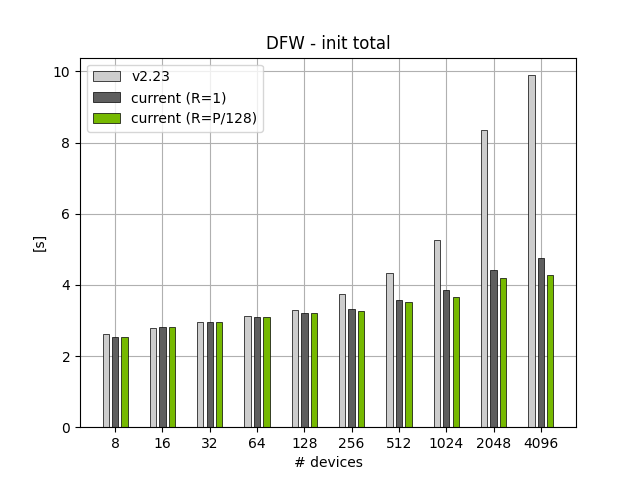
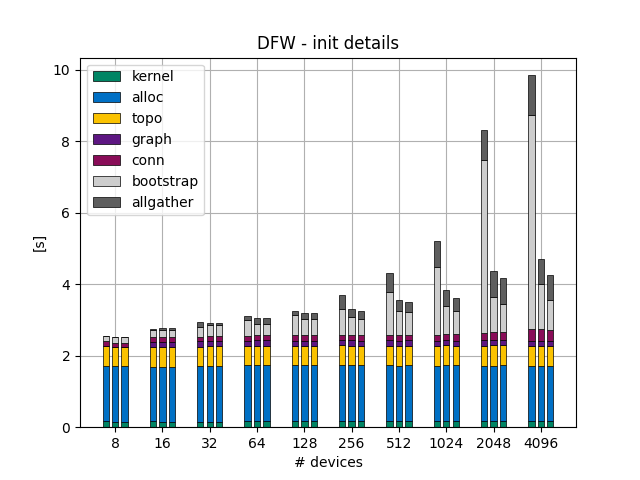
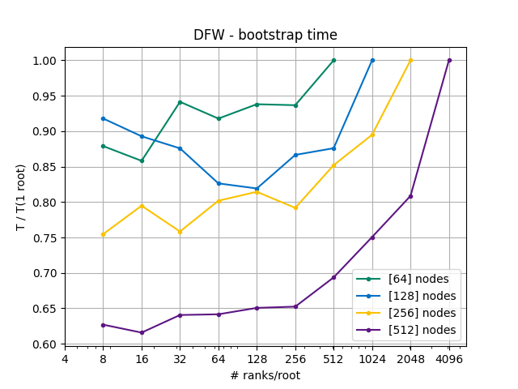

# Fast Bootstrap
<!-- use this template to share the details of your feature. Non-commented sections are strongly encouraged -->

## Abstract
<!-- here detail what the feature is about. A few sentence that can be copy-pasted to external actors -->

Bootstrap provides three important functionalities to NCCL:
- `bootstrapInit`: performs the initial exchange of network address to connect to other peers.
- collective communication: using the exchanged network address during `bootstrapInit`, allows NCCL to use collective operations: `bcast`, `allgather`, and `barrier`
- point-to-point: using the exchanged network address during `bootstrapInit`, allows one peer to communicate with any other peer in the communicator

In the current state (v2.22) the bootstrap suffers from two main issues
- performance: the implementation relies on socket communication which has a low message rate and slow bandwdith
- scalability: the single `ncclUniqueId` provided to the bootstrap is a bottleneck for large scale applicaitons

With this feature we aim to improve the performance and provide a solution to the scalability issue.

<!-- ============================================================================================-->
<details>
<summary><h2>Motivation and requirements</h2></summary>
<!-- ============================================================================================-->

### NVbugs / Jira Tickets

The initialization time is a main issue for clients as they are looking at large scale runs.
Our goal is to deliver a sub-30 sec init time (`ncclCommInitRank`) at 100K GPUs.

- [NVBugs - RFE](https://nvbugspro.nvidia.com/bug/4642364)
- [NVBugs - API extension](https://nvbugspro.nvidia.com/bug/4721377)
- [Jira](https://jirasw.nvidia.com/browse/NCCL-1630)

### Feature context and focus
The `init` time has two categories of operations:

- local: constant time, approx `2.5` sec, which sets up local buffers and perform topology detection
- global: time scales with the size, where we perform the `bootstrapInit` operation (setup the network connections) and some communications `allGather` operations

In this feature, we focus on the global operations such as the `bootstrapInit` and `allGather` communications.

### Existing bootstrap operations

#### BoostrapInit
The `bootstrapInit` uses a root (`ncclUniqueId`) to gather all the connection address of the other processes in the communicator.
At the end of `bootstrapInit`, each rank in the communicator has a local list of the address to be used to communicate with each of the other ranks.

To do this, we proceed in two steps:
1. *handshake*: with the root, where each rank sends its network address to the root. Once all the address are collected the root sens back to each rank the connection information of the next rank
2. *ring*: with the next connection information, each process enters a ring-based allgather to gather the list of all the address

#### point-to-point (p2p)
The p2p interface allows the user to use the `peerAddresses` gathered during the `bootstrapInit` to communicate (send/recv) with a peer

#### collective communication

Collective communications come with two flavors: the communicator-wide one, and the `intraNode` one. The latter differ by the addition of a ranklist that allows a node-local collective.
`bootstrap` provides `(IntraNode)Barrier`, `(IntraNodeNode)Broadcast`, and `(IntraNode)AllGather`. Most of the collectives rely on the `peerAddresses` list exchanged during `bootstrapInit`.

- `AllGather` reuses the ring that has been established during the `bootstrapInit` for performance reasons. The connections of that ring are kept alive untill the user destroys the `bootstrap` state
- `IntraNodeAllGather`, we use the `peerAddresses` to establish the connection with the next rank in the rank list. Then the we perform the local ring
- `(IntraNode)Barrier`, we use the p2p interface to perform a dissemination algorithm.
- `(IntraNode)Broadcast`, we use the p2p interface to broadcast information from the root to the other ranks.

<!-- ### User Experience -->
<!-- ### Assumptions, constraints and dependencies -->
<!-- ### Use Cases -->
<!-- ### Platform Requirements -->
<!-- ### Functional Requirements -->
<!-- ### System Requirements -->
<!-- ### Interface Requirements -->
<!-- ### KPI Requirements -->
<!-- ### Security Requirements -->
<!-- ### Legal and Standards Requirements -->
<!-- ### Telemetry Requirements -->
<!-- ### Backward Compatibility Requirements -->
<!-- ### Virtualization Requirements -->

</details>

<!-- ============================================================================================-->
<details>
<summary><h2>Design</h2></summary>
<!-- ============================================================================================-->

### Proposed improvements

This feature proposes three improvements over the current implementation:
- use more than `1` root to scale the handshake as part of `bootstrapInit` (denoted "many roots")
- use `ncclNet` interface instead of the existing `socket`-based implementation
- gather rings when possible into a single one with packing/unpacking


#### Improvement 1: many roots

commit list (to be updated):
- f712d4365
- c2a24d313
- 9cd1b9782

The first improvement is to use more than a single root for the handshake during the `bootstrapInit`. This will not affect the behavior of the rest of the `init`.
This is done by adding a new function to the API:

```c
ncclResult_t ncclCommInitRankScalable(ncclComm_t* newcomm, int nranks, int myrank, int nId, ncclUniqueId* commIds, ncclConfig_t* config);
```

Note that using `nId=1` is equivalent to using the existing API:
```c
ncclCommInitRankConfig(comm, nranks, ncclId, myrank, config)
// equivalent to
ncclCommInitRankScalable(comm, nranks, myrank, 1, &ncclId, config)
```

**Implementation details**

The list of `ncclUniqueId` is used in the `bootstrapInit` during the handshake between a rank and the root.
Assuming `P` ranks and `R` roots,
- each root `r` will handshake with `P/R + (r < P%R) ? 1 : 0` ranks
- each `rank=p` sends information to its associated root.
- once the root has received the needed connection information it distributes the next peer information to each of its ranks

Because each root has to provide the address of the `next` rank to each of its associated ranks in order to establish the ring, we are missing the right information for the last rank of the root.
To solve this issue, if a rank is the first rank of a root, then it needs to send its connection information to the previous root.
This way, the previous root will be able to send the right address to its last rank, i.e. the address of the first rank of the next root.
This comes at the cost of one added communication per root, which is due to the ring algorithm.
Should we replace the ring algorithm by a tree-based approach, this might change.

However, when a single root is provided by the user, the root receives the connection information of all the ranks.
In that case, the `next` rank of `p=P-1` is `0` and we periodize the access to the connection information.
If more than one root is provided by the user, the first rank of a root has to send its connection information to the previous root.
Then, the last rank of a root will receive the correct connection information.

Lacking the right API to expose that each rank for the moment only needs 2 root information, we have decided to request all the roots from th user.
This keeps the API simple and allows us to change the aglorithms in a later version.

**Note on distribution of the roots/ranks**

The distribution of the ranks accross the roots has to be easily computed and as evenly distributed as possible to ensure good performance.
Considering the example of `7` nodes, here is the distribution of the ranks accross the roots used by the bootstrap:

- `1` root: `P/R=7` and `P%R=0` > `7`
- `2` roots: `P/R=3` and `P%R=1` > `4 3`
- `3` roots: `P/R=2` and `P%R=1` > `3 2 2`
- `4` roots: `P/R=1` and `P%R=3` > `2 2 2 1`
- `5` roots: `P/R=1` and `P%R=2` > `2 2 1 1 1`
- `6` roots: `P/R=1` and `P%R=1` > `2 1 1 1 1 1`
- `7` roots: `P/R=1` and `P%R=0` > `1 1 1 1 1 1 1`

When creating the ncclUniqueIds used by `ncclCommInitRankScalable`, we recommend to use the following implementation to determine if a rank should create a root:

```c
static int rankHasRoot(int rank, int nRanks, int nRoots) {
  int rmr = nRanks % nRoots;
  int rpr = nRanks / nRoots;
  int rlim = rmr * (rpr+1);
  if (rank < rlim) {
    return !(rank % (rpr + 1));
  } else {
    return !((rank - rlim) % rpr);
  }
}
```

This function reverse engineers the distribution used in the bootstrap. Given that the roots are divided in two groups:

1. the first `(nRanks % nRoots)` are associated to `(nRanks / nRoots + 1)` ranks
2. the rest are associated to `(nRanks / nRoots)` ranks

Therefore, the ranks should similarly be divided in two groups:

1. the first where their associated root is tied to `(nRanks / nRoots + 1)` ranks
2. the second where their associated root is tied to `(nRanks / nRoots)` ranks;

The limit between the two groups is given by `(nRanks % nRoots) * (nRanks / nRoots + 1)`

Example: considering `17` ranks and `5` roots, `rmr = 2`, `rpr = 3`, `rlim = 2 * (4 + 1) = 8`:

- rank `0`: `(0 % (3 + 1)) = 0`, returns `1` -> root created
- rank `1`: `(1 % (3 + 1)) = 1`, returns `0`
- rank `2`: `(2 % (3 + 1)) = 2`, returns `0`
- rank `3`: `(3 % (3 + 1)) = 3`, returns `0`
- rank `4`: `(4 % (3 + 1)) = 0`, returns `1` -> root created
- rank `5`: `(5 % (3 + 1)) = 1`, returns `0`
- rank `6`: `(6 % (3 + 1)) = 2`, returns `0`
- rank `7`: `(7 % (3 + 1)) = 3`, returns `0`
- rank `8`: `((8 - 8) % 3) = 0`, returns `1` -> root created
- rank `9`: `((9 - 8) % 3) = 1`, returns `0`
- rank `10`: `((10 - 8) % 3) = 2`, returns `0`
- rank `11`: `((11 - 8) % 3) = 0`, returns `1` -> root created
- rank `12`: `((12 - 8) % 3) = 1`, returns `0`
- rank `13`: `((13 - 8) % 3) = 2`, returns `0`
- rank `14`: `((14 - 8) % 3) = 0`, returns `1` -> root created
- rank `15`: `((15 - 8) % 3) = 1`, returns `0`
- rank `16`: `((16 - 8) % 3) = 2`, returns `0`

The distribution of roots computed this way exactly match the policy used in the bootstrap, where the ranks would be distributed on the roots following `4 4 3 3 3`.

**Advise to users**

In practice, the scalable API has been designed to work well with a ratio of `P/R` relatively high. Using `P/R=1` will lead to a performance degradation.
Further, scaling the number of `ncclUniqueId`s with the number of ranks will provide a constant-time handshake, particularly relevant for large scale applications.

To avoid congestion issues at the root, `NCCL` delays the rank's messages to the root when `P/R > 256`.
Therefore we advise users to avoid this by using `P/R <= 256`.

#### Improvement 2: ncclNet

commit list (to be updated):
- acaf0ea66
- a1072616c

Instead of using the socket-based implementation, we can leverage the `ncclNet` to take advantage of the low-latency and high bandwidth of the network.
To do so, we need to do the following changes:

- additionally to the peer's socket address, each rank will also send the listen handle of `ncclNet` to the root.
- `ncclNet` is a non-blocking API, which requires to change the bootstrap API to be non-blocking as well. We introduce `boostrapIsend` and `bootstrapIrecv` which both return a bootstrap request. The later can then be used to check completion of the operation using `bootstrapWait`.
- most of the `p2p` send call rely on the buffering of the data when sending. To reflect that behavior, we also provide `booststrapBsend` which is similar to `bootstrapIsend` but will copy the data locally before returning. The local copy of the data is then automatically free'd at completion.

Internally, we abstract both the `socket` and the `ncclNet` usage behind the `p2p` API. Therefore we add a new layer of functions, `bootstrapInternal` to do the heavylifting

##### Internal layer

*Network functions* (relies on `ncclNet`)
- `bootstrapInternalNetReg`/`Dereg`: register and deregister memory for `ncclNet`
- `bootstrapInternalNetIsend`/`Irev`/`Send`/`Recv` functions wrap up the `ncclNet` interface in a slightly more convenient way by hiding the `send`/`recv` creation and the `test` function
- `bootstrapInternalNetSendRecv`: executes `Isend` and `Irecv` and returns once both are completed
- `bootstrapInternalNetRingAllGather`: performs an `allGather` operations using the `ncclNet` connections using the ring algorithm
- `bootstrapInternalNetRingConnect`: connect the `ncclNet` comunicator before a ring operation
- `bootstrapInternalNetIConnect`/`IAccept`: async function to connect to/ accept from a peer, matching the peer `rank` and the `tag`
- `bootstrapInternalNetProgress`: progress a `ncclNet`-based request

*Socket functions* (relies on `ncclSocket`)
- `bootstrapInternalSocketSend/Recv/SendRecv`: `send` and `recv` for sockets, with check on the size of message sent
- `bootstrapInternalSocketConnect`/`Accept`: function to connect to/ accept from a peer, matching the peer `rank` and the `tag`
- `bootstrapInternalSocketProgress`: progress a `socket`-based request

*others*
- `bootstrapInternalInitRequest` and `bootstrapInternalFreeRequest`: init and free the request used by the bootstrap p2p API
- `bootstrapInternalCheckAbort`: check the abortion flag, once every `BOOTSTRAP_N_CHECK_ABORT` entries
- `bootstrapInternalUnexpectedEnqueue/Dequeue/Free`: store temporarily unexpected connection information and the associated communicatior

##### API layer

The `internal` layer is then used to implement the following bootstrap API:

- `bootstrapIsend`, `bootstrapBsend`, `bootstrapIrecv`, `bootstrapWait`: `p2p` API to perfrom a send, buffered send (first copy the data), and receive. `bootstrapWait` completes the issued operations.
- `bootstrapAllGather`: communicator-wide all gather using a ring, done using the `ncclNet` connections established at init.
- `bootstrapIntraNodeAllGather`:  rank-list based all gather using a ring, done using `ncclNet` connections established before starting the ring
- `bootstrapBroadcast`, `bootstrapIntraNodeBroadcast`: communicator-wide and rank-list based broadcast collective using the p2p API `bootstrapIsend` and `bootstrapIrecv`;
- `bootstrapBarrier`, and `bootstrapIntraNodeBarrier`: communicator-wide and rank-list based barrier collective, using `ncclSocket`


##### Known limitations: opening/closing connections

connecting/accepting connection with `ncclNet` is expensive and requires the use of socket-based handshake.
Therefore, we should avoid to open and close `ncclNet` connections for each of the point-to-point.
Further, `ncclNet` handles are not made to be reused.

To avoid large overhead, we have implemented the following strategies:
- when opening a new connetion to a peer, we copy locally the peer handle, to allow the original handle to stay available
- we use socket-based connections when there is no payload (such as `bootstrapBarrier`), to avoid the overhead of ncclNet
- the p2p operations are done with sockets
- to be implemented: intraNode collectives could use a lazy initialization of the `ncclNet` comms. There is no guarantee that the ranklist stays the same from one call to another, but it might be beneficial to reuse connections if possible.

#### Improvement 3: single ring

commit list (to be updated):
- 7c44578d2
- 46a60bb68

Merging `bootstrAllGather` calls when possible is an easy improvement over the existing implementation.

#### Improvement 4: early answer from the root

commit list (to be updated):
- 8d83941eb

To reduce the waiting time for the connection information from the root, the root will send the `next` address as soon as it's available.
Upon reception,

- if the previous rank connection information has been received already, the root will directly send the information and not store it.
- if the next rank connection information are available as well, the root will directly reply to the received rank


### Known limitations and issues

#### filesystem
The time at init can be biased by slow filesystem/system calls. This can cause delays in the init of NCCL and can be observed when the ranks sync for the first time, i.e. in the bootstrap.
Specifically, the call to `getpwuid(getuid())` used to determine the user's home directory has been observed to be subject to such delays.

To avoid that issue, we recommend the tests to be run with the environment variable introduced in [MR 522](https://gitlab-master.nvidia.com/nccl/nccl/-/merge_requests/522).

<!-- Example of an image -->
<!--  -->
<!-- note: the following HTML code is also valid -->
<!--  -->
<!-- ### Interface Architecture -->
<!-- ### System KPIs & Metrics -->
<!-- ### Data Architecture -->
<!-- ### Security Design -->
<!-- ### Debugging & Troubleshooting -->
<!-- ### Logging and Instrumentation -->
<!-- ### Operational Considerations -->

</details>

<!-- ============================================================================================-->
<details>
<summary><h2>Coding</h2></summary>
<!-- ============================================================================================-->

### Commit list or MR

commit list can be found in the [Gitlab MR](https://gitlab-master.nvidia.com/nccl/nccl/-/merge_requests/475)

</details>

<!-- ============================================================================================-->
<details>
<summary><h2>Testing and Validation</h2></summary>
<!-- ============================================================================================-->

### Objectives and Timeline

### Validation

#### Where to run?

The feature has been tested on `eos`, `israel-1`, and `dfw`.

#### What to run?

The feature can be tested when using `NCCL` perf test.

- scalability improvements (improvement 1): the new API is used when the option `-I` or `--init_ids` is given by the user. We will create the corresponding number of roots and use them to fasten the bootstrap.
- performance improvements (improvements 2-4): no specific change is needed to benefit from the performance improvements.

To measure performance we recommend to run with `NCCL_DEBUG=INFO NCCL_DEBUG_SUBSYS=INIT` to get the full details on the init times.
If only the time split of the init function is needed, `NCCL_DEBUG_SUBSYS=PROFILE` is enough.

Because init times are very variation sensitive, we recommend to run multiple iterations of the same test to get an accurate picture.
For example

```bash
nmax = 50
out = <my_file>
for i in $(seq 1 ${nmax}); do
  # MPICH MPI is used here
  echo_cmd time `which mpirun` -n ${SLURM_NTASKS} -ppn 8 --bind-to core <test_name> >> ${my_file}.out
  # saving the iter done and extracting init time information
  echo "${i}" > ${my_file}.repeat
  grep "NCCL INFO Init timings" ${my_file}.out > ${my_file}_init.time
  grep "NCCL INFO Root timings" ${my_file}.out > ${my_file}_root.time
  grep "NCCL INFO Bootstrap timings" ${my_file}.out > ${my_file}_boot.time
  grep "NCCL INFO bootstrapAllGather" ${my_file}.out > ${my_file}_allgather.time
  grep "NCCL INFO bootstrapIntraNodeBarrier" ${my_file}.out > ${my_file}_nodebarrier.time
  grep "NCCL INFO netRingAllGather" ${my_file}.out > ${my_file}_ringallgather.time
```

Depsite the repeated iterations, at large scale, the measurements can be noisy.
To remove outsiders from the averaged value, one can use the (one sided in this case) Grubb's test to determine if a value is an outlier with a confidence of `1-alpha`\%.
The following python function removes recursively the max value of a dataset `x` if the value is an outsider and returns once no more outliers are detected.

```python
import numpy as np
import scipy.stats as stats

def grubb_test_max(x,alpha):
    n = len(x)
    mean_x = np.mean(x)
    sd_x = np.std(x)
    max_x = np.max(x)
    numerator = max_x-mean_x
    g_calculated = 0.0
    if(sd_x > 0.0):
        g_calculated = numerator/sd_x
    # two sided: factor = alpha/(2*n)
    factor = alpha/(n)
    t_value_1 = stats.t.ppf(1 - factor, n - 2)
    g_critical = ((n - 1) * np.sqrt(np.square(t_value_1))) / (np.sqrt(n) * np.sqrt(n - 2 + np.square(t_value_1)))
    # test if the max is an outlier
    if(g_calculated > g_critical):
        idx_filter = x != max_x
        print(f"Grubb's test: {max_x:.4f} is an outlier (confidence {100*alpha}%) (mean {mean_x:.4f}, test {g_calculated:.4f} > {g_critical:.4f})")
        return grubb_test_max(x[idx_filter],alpha)
    else:
        print(f"Grubb's test: {max_x:.4f} is no outlier (confidence: {100*alpha}%) (mean {mean_x:.4f}, test {g_calculated:.4f} <= {g_critical:.4f})")
        return x

```

Then, one can read data from the `.time` files using this code sample, where we do the following:

- compute the average time for each iteration `n_warmup` to `n_repeat`
- compute the min and max over each iteration for all the timing independently
- remove the outliers iterations and compute the average over the iterations

```python
def extract_numbers(file_name,n_repeat=1,n_warmup=0,n_cols=N_DATA,format="float"):
    pwd = os.getcwd()
    file_to_open = f"{pwd}/{file_name}"
    # Open the file in read mode
    try:
        with open(file_to_open, 'r') as file:
            print(f"reading {file_to_open}")
            # Read the contents of the file
            content = file.readlines()
            n_data = len(content)
            result = np.zeros([n_data,n_cols])
            c=0
            for line in content:
                if(format == "float"):
                    data = re.findall("\\d+\\.\\d+",line)
                if(format == "int"):
                    data = re.findall("\\d+",line)
                # print(data)
                j=0
                for d in data:
                    result[c,j] = float(d)
                    j=j+1
                c=c+1
            # get the number of lines per repetition and remove the warmups
            assert(n_data%n_repeat == 0)
            l_per_rep = int(len(content)/n_repeat)
            res_avg = np.zeros([(n_repeat-n_warmup),n_cols])
            # remove the warmup iterations
            for i in range(n_warmup,int(n_repeat)):
                idx_min = int(i*l_per_rep)
                idx_max = int((i+1)*l_per_rep)
                n_idx = idx_max - idx_min
                local_res = result[idx_min:idx_max,:]
                # get the average on the current iteration
                res_avg[i-n_warmup,:] = np.sum(local_res,axis=0)/(n_idx)
            # return the max and min in the error format
            res = np.zeros([n_cols])
            min = np.zeros([n_cols])
            max = np.zeros([n_cols])
            for i in range(n_cols):
                fdata = reject_outliers(res_avg[:,i])
                res[i] = np.mean(fdata)
                max[i] = np.max(res_avg[:,i])
                min[i] = np.min(res_avg[:,i])
            #format the max/min as errors for easy plot
            max = max - res
            min = res - min
    except:
        print(f"error when reading {file_name}")
        return np.zeros(N_DATA),np.zeros(N_DATA),np.zeros(N_DATA);

    return res,max,min
```

On DFW (coreweave), the following results have been obtained when measuring the init time of the first communicator:



The time spent in different operations can also be obtained as part of the log. As we measure the creation of the first communicator only, we observe a significant time spent in `alloc`.
This is due to the initialization of datastructures, which is shared by all communicators.
Once created the other communicators will not have to do it again, which will fasten the process.



When using multiple roots, we also reduce the time spent in the `bootstrap` part of the init, as show in the next figure:



<!-- #### Code Coverage Goal Defined -->
<!-- #### KPI Coverage Goals Defined (performance, stress, stability, throughput, latency) -->
<!-- #### Requirement Coverage Goal Defined -->
<!-- #### Quality Thresholds Defined -->
<!-- #### Test Timeline -->
<!-- #### SW Verification and Test Plan -->
<!-- ### Test plan -->
<!-- #### Requirements Tests -->
<!-- #### Interface Tests -->
<!-- #### Fault-injection Tests -->
<!-- #### Resource Usage Tests -->
<!-- #### Design Coverage Testing -->
<!-- #### Boundary Tests -->
<!-- #### Certification Tests -->
<!-- #### Stress Tests -->
<!-- #### Stability Tests -->
<!-- #### Perf and Power KPI Tests -->
<!-- #### Usability & OOBE Tests -->
<!-- #### Manufacturing Diagnostic(Factory) Tests -->

### Performance

#### What is measured?

#### Results


</details>

<!-- ============================================================================================-->
<details>
<summary><h2>Signoff List</h2></summary>
<!-- ============================================================================================-->

Author(s):
  - Thomas Gillis

</details>
