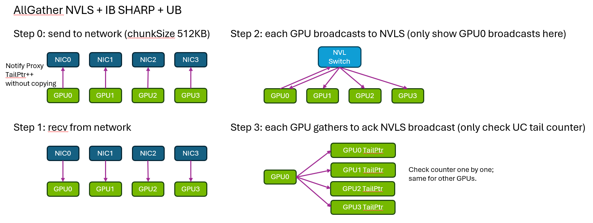
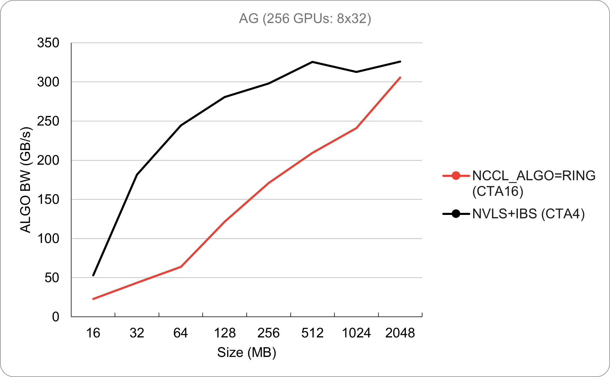
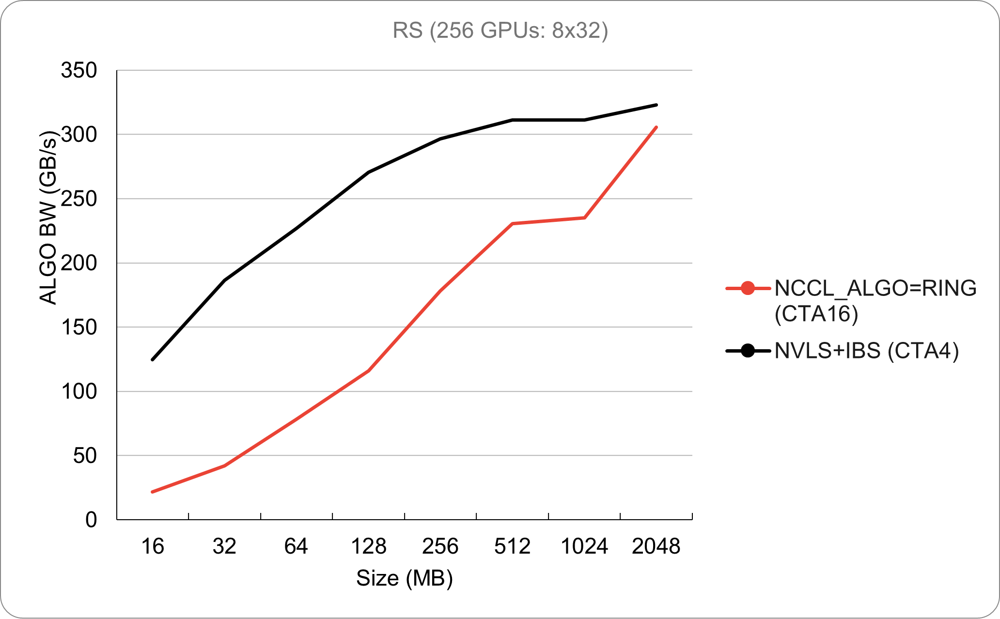

# UB NVLS+IB SHARP for AG and RS
<!-- use this template to share the details of your feature. Non-commented sections are strongly encouraged -->

## Abstract
<!-- here detail what the feature is about. A few sentence that can be copy-pasted to external actors -->

<!-- ============================================================================================-->
<details>
<summary><h2>Motivation and requirements</h2></summary>
<!-- ============================================================================================-->
LLM training now adopts allgather and reducescatter for DP instead of traditional allreduce for better compute and communication overlap. AG and RS in DP involve intra- and inter-node communications which use at least 16 SMs with current NCCL ring implementation. However, when the training scale is too large (e.g. 1000+ GPUs), the ring communication performs poorly with too many SMs consumption. This feature introduces NVLS+IB SHARP algorithm for AG and RS to improve the communication efficiency, which is able to reduce the SMs consumption to 6 and provide better compute and communication overlap performance.

### NVbugs / Jira Tickets
https://nvbugspro.nvidia.com/bug/5089213

### User Experience
Once buffers are registered and set policy to NCCL_CTA_POLICY_EFFICIENCY (or NCCL_CTA_POLICY=1), the feature will automatically select the NVLS+IB SHARP algorithm for AG and RS. It will provide less SMs consumption and better compute and communication overlap performance.

### Assumptions, constraints and dependencies
IB SHARP and NVLink Sharp are enabled in the system.

### Use Cases
Large scale LLM training.

### Platform Requirements

<!-- ### Functional Requirements -->
<!-- ### System Requirements -->
<!-- ### Interface Requirements -->
<!-- ### KPI Requirements -->
<!-- ### Security Requirements -->
<!-- ### Legal and Standards Requirements -->
<!-- ### Telemetry Requirements -->
<!-- ### Backward Compatibility Requirements -->
<!-- ### Virtualization Requirements -->

</details>

<!-- ============================================================================================-->
<details>
<summary><h2>Design</h2></summary>
<!-- ============================================================================================-->

### Proposed Design
CPU side designs:
1. Add a new environment variable NCCL_CTA_POLICY and policy config parameter to let users to enable/disable the feature. When users register buffers, the config is set to 1, and IB SHARP and NVLink Sharp are enabled in the system, the feature will automatically select the NVLS+IB SHARP algorithm for AG and RS to save SMs consumption. The SMs usage is based on the maximal bandwidth the system can sustain (i.e., comm->bandwidths) and empirical performance numbers.

2. Function `ncclNvlsRegResourcesQuery` is the SM tuning function. Currently, we start to consider the #SMs required to saturate NVLS bandwidths or IB bandwidth (depends on which needs smaller number of SMs). If we have 8 GPUs on a node, and in total need 48 SMs to saturate NVLS bandwidths for AG, then we will launch 6 SMs per GPU; the SMs equation would be `ceil(48 / #GPUs)` instead of picking a fixed number like before.

3. New algorithm NCCL_ALGO_NVLS is added for NVLS+IB SHARP AG and RS; when NCCL_ALGO_NVLS is picked, buffers are registered into collnet plugin and multicast group for AG and RS.

GPU side designs:

AG and RS are "reciprocal" operations, so here AG design is used as an example:
1. The main logic follows the collnet direct algorithm of AG. Every head rank of IB SHARP sends the data chunk to its local NIC in the first step (`prims.send`), and then every head rank receives the data from network and performs multicast send to every local ranks (`prims.template process</*Recv=*/1, /*Send=*/1>`). Finally, every local ranks perform gather op (`prims.template process</*Recv=*/1, /*Send=*/0>`).

2. When UB is enabled, `prims.send` will become a nop and proxy will issue network send to the local NIC directly. In addition, gather op will also become a nop and just wait for the broadcast data to be received.

The high-level algorithm is summarized in the following figure:




<!-- note: the following HTML code is also valid -->
<!--  -->

### Interface Architecture

<!-- ### System KPIs & Metrics -->
<!-- ### Data Architecture -->
<!-- ### Security Design -->
<!-- ### Debugging & Troubleshooting -->
<!-- ### Logging and Instrumentation -->
<!-- ### Operational Considerations -->

</details>

<!-- ============================================================================================-->
<details>
<summary><h2>Coding</h2></summary>
<!-- ============================================================================================-->
AG UB NVLS+IB SHARP Kernel Implemenetation Details:

On each node, each GPU belongs to a separate network rail that will be further used for collnet allgather.
For each rail, each GPU notifies the corresponding local NIC the data is ready; then NIC sends the chunk
out to perform IB SHARP allgather. The returned data is sent back to intermediate buffer allocated for
collnet; the intermediate buffer size is by default 4MB (namely 512KB chunkSize with 8 NCCL_STEPS).

For each step, each GPU in the same rail will send min(inputSize, 512KB). If input size is larger than
512KB, then the intermediate buffer slot (512KB) can only hold one chunk from one GPU at a time; in this
case, we need to loop through all GPUs in the same rail until receiving all data chunks from IB SHARP
allgather.

The following code snippet shows how we go through each chunk from every GPU in the same rail:
```
for (ssize_t railGridOffset = 0; railGridOffset < nNodes * countPerRank; railGridOffset += nChannels * chunkCount) {
  ssize_t railAllBeg = railGridOffset + part * chunkCount;
  ssize_t railAllEnd = min(railAllBeg + chunkCount, nNodes * countPerRank);
  ssize_t railOneBeg = ncclShmem.comm.node * countPerRank;
  ssize_t railOneEnd = railOneBeg + countPerRank;
  ssize_t beg = max(railAllBeg, railOneBeg);
  ssize_t end = min(railAllEnd, railOneEnd);
  prims.send(beg - railOneBeg, max(ssize_t(0), end - beg));
}
```

For each received chunk, it will be broadcasted through NVLink switch. However, the NVLink
switch broadcast will directly write into destination buffer without intermediate copies.

If input size is not large enough, and 512KB buffer slot can hold multiple GPU's data at a time, then we should
differentiate the data size in the buffer slot for each GPU in order to broadcast to different destination buffer
offset. `operator()` device function implements all these logics:

`railAllOffset` is used to record how much data we have processed until now. Each time we only process data from
one GPU, and it always points to the data from next GPU in the rail. `delta` is the actual data size we will operate
on for current GPU. `railAllBeg` indicates the current data offset we are at for the whole rail; we should start from
`railAllBeg` and process 512KB data. Each GPU will know where the data is from based on `railOneBeg`. The corresponding
code is:
```
do {
  int node = railAllBeg / countPerRank;
  int railAllOffset = 0;
  while (railAllOffset < railAllSize) {
    ssize_t railOneBeg = node * countPerRank;
    ssize_t railOneEnd = railOneBeg + countPerRank;
    ssize_t railOneOffset = (railAllBeg + railAllOffset) - railOneBeg;
    int delta = min(railAllEnd, railOneEnd) - (railAllBeg + railAllOffset);
    int rank = ncclShmem.comm.collNetDenseToUserRank[node * nRails + rail];
    ssize_t userOneBeg = rank * countPerRank + railOneOffset;
    int outIsDst = (inPlace && rank == ncclShmem.comm.rank) || BcastSendNotRecv || work->regUsed ? 0 : 1;
    if (nSrcs != 0 && outIsDst + nDsts != 0) {
      reduceCopy<ncclCollUnroll(), RedOp, T,
        /*MultimemSrcs,MinSrcs,MaxSrcs=*/MultimemSrcs, 1, 1,
        /*MultimemDsts=*/MultimemDsts, 0 + MultimemDsts + MinDsts, 1 + MaxDsts,
        /*PreOpSrcs=*/0>
        (tid, tn, 0, nullptr, false,
          /*nSrcs=*/1, [=]__device__(int s/*==0*/) -> void* {
        return (char*)srcPtrs[src] + railAllOffset;
      },
          /*nDsts=*/outIsDst + nDsts, [=]__device__(int d) -> void* {
        return d < outIsDst ? outbuf + userOneBeg
          : work->regUsed ? (char*)dstPtrs[d - outIsDst] + userOneBeg
          : (char*)dstPtrs[d - outIsDst] + railAllOffset;
      }, delta);
    }
    railAllOffset += delta;
    node += 1;
  }
  rail += 1;
  src += 1;
} while (!BcastSendNotRecv && src < nRails);
```


### Commit list or MR
https://gitlab-master.nvidia.com/nccl/nccl/-/merge_requests/809

</details>

<!-- ============================================================================================-->
<details>
<summary><h2>Testing and Validation</h2></summary>
<!-- ============================================================================================-->

### Objectives and Timeline

### Validation

#### Where to run?

#### What to run?

#### Expected output?

<!-- #### Code Coverage Goal Defined -->
<!-- #### KPI Coverage Goals Defined (performance, stress, stability, throughput, latency) -->
<!-- #### Requirement Coverage Goal Defined -->
<!-- #### Quality Thresholds Defined -->
<!-- #### Test Timeline -->
<!-- #### SW Verification and Test Plan -->
<!-- ### Test plan -->
<!-- #### Requirements Tests -->
<!-- #### Interface Tests -->
<!-- #### Fault-injection Tests -->
<!-- #### Resource Usage Tests -->
<!-- #### Design Coverage Testing -->
<!-- #### Boundary Tests -->
<!-- #### Certification Tests -->
<!-- #### Stress Tests -->
<!-- #### Stability Tests -->
<!-- #### Perf and Power KPI Tests -->
<!-- #### Usability & OOBE Tests -->
<!-- #### Manufacturing Diagnostic(Factory) Tests -->

### Performance



#### What is measured?

#### Results


</details>

<!-- ============================================================================================-->
<details>
<summary><h2>Signoff List</h2></summary>
<!-- ============================================================================================-->

Author(s):
  - Kaiming Ouyang

</details>
