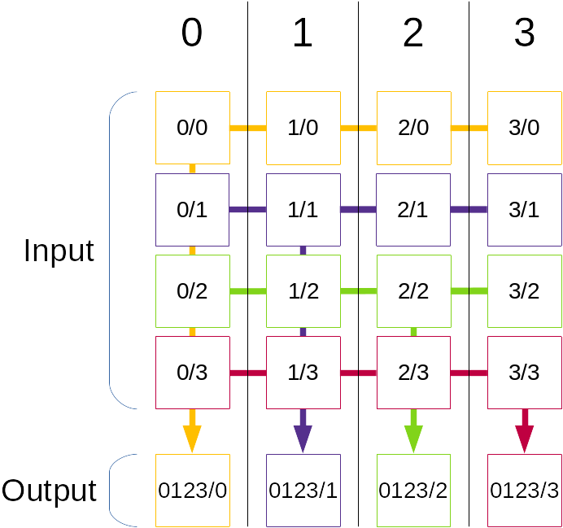
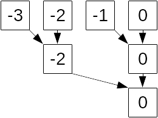
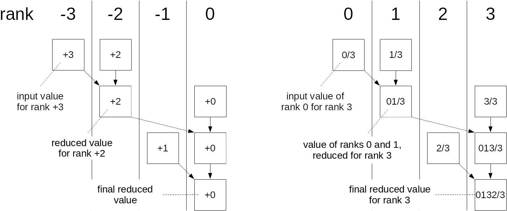
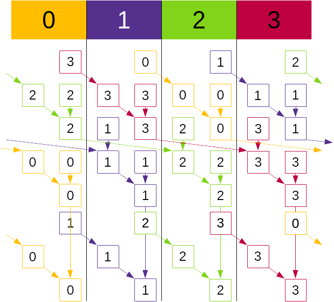
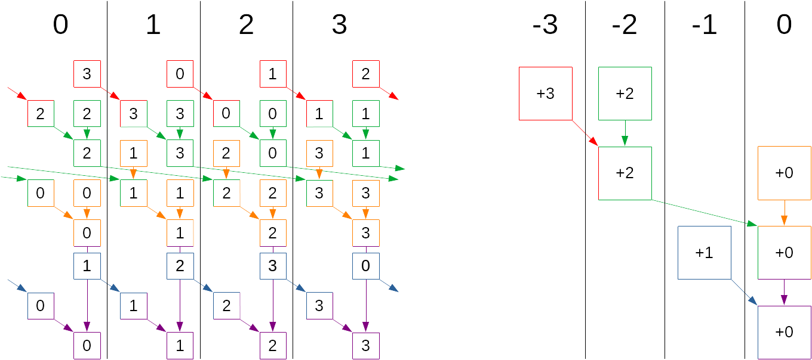
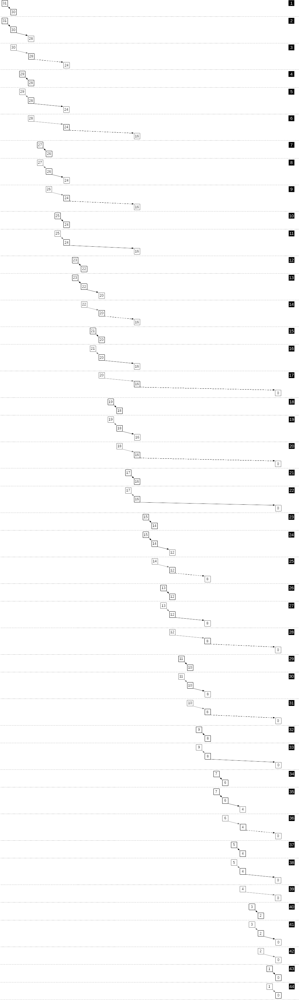
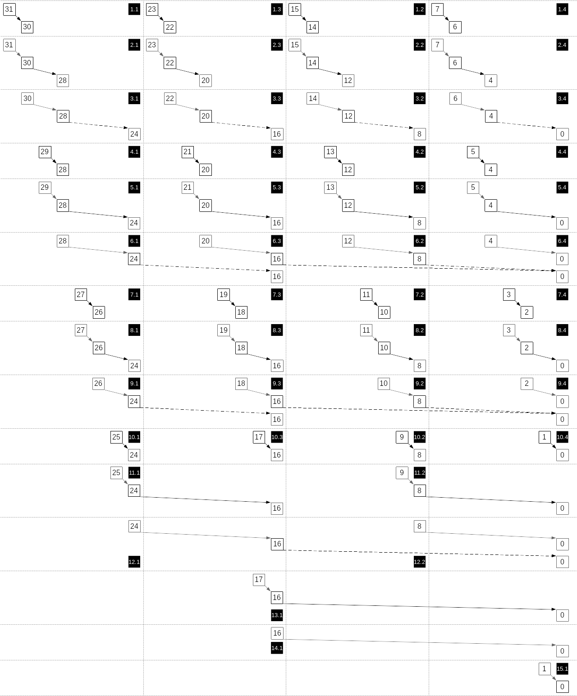

# Log algorithms for Allgather ReduceScatter
<!-- use this template to share the details of your feature. Non-commented sections are strongly encouraged -->

## Abstract
<!-- here detail what the feature is about. A few sentence that can be copy-pasted to external actors -->

<!-- ============================================================================================-->

<h2>Motivation and requirements</h2>

<!-- ============================================================================================-->

### NVbugs / Jira Tickets
[NVBug 4642351](https://nvbugs.nvidia.com/4642351)

[JIRA NCCL-1628](https://jirasw.nvidia.com/browse/NCCL-1628)

### User Experience
No change to user experience. This feature accelerates already existing operations.

### Assumptions, constraints and dependencies
This is focusing on the case of 1 GPU per node, large scale operations. Allgather and ReduceScatter
operations using more than one GPU per node will be handled by next NCCL versions.

### Use Cases
The case of 1 PPN allgather/reduce scatter is important for LLM training where we use pipeline
parallelism and tensor parallelism in dimensions which are orthogonal to data parallelism. The
tensor parallelism dimension is usually aligned to the intra-node NVLink connectivity, meaning
that other dimensions will only have one GPU per node.

### Platform Requirements
This is optimizing DGX systems with 8 GPUs per node. While it would also apply to larger NVLink
domains, the way it will be applied to those systems may be different.

<!-- ### Functional Requirements -->
<!-- ### System Requirements -->
<!-- ### Interface Requirements -->
<!-- ### KPI Requirements -->
<!-- ### Security Requirements -->
<!-- ### Legal and Standards Requirements -->
<!-- ### Telemetry Requirements -->
<!-- ### Backward Compatibility Requirements -->
<!-- ### Virtualization Requirements -->

<!-- ============================================================================================-->

<h2>Design</h2>

<!-- ============================================================================================-->

### Proposed Design

We base our implementation on the Brucks algorithm, adapted to allgather and reduce scatter. This
algorithm is equivalent to a binomial tree shifted for each rank. Its advantage compared to similar
algorithms like recursive doubling is that it works on any number of ranks and does not require a
power of two.

For the reduce scatter operation, we consider that each rank starts with an input buffer which
contains the values for each rank to be summed, and each rank ends up with the sum of values for
its rank.

Rank 0 will receive in its output buffer the reduction (e.g. the sum) or all values for the first
quarter of the buffer, rank 1 will receive the reduction of the second quarter, etc.

The algorithm will reduce values following a binomial tree for each rank, looking like:

The tree will be executed with the following steps:

1. rank -3 (which means our rank minus 3 modulo nranks) sends data to rank -2
2. rank -2 reduces its own value with the one it received from -3, and sends the result to rank 0
(our rank).
3. rank -1 sends data to rank 0 (our rank)
4. we reduce values coming from rank -2 and -1 with our own value to find the final output value.

In practice, we will reorganize the tree a little, so that for example on Rank 3, it looks like:

Each rank will have the same similar tree, and they will all execute concurrently, so that the
final complete communication pattern looks like:

In practice, each rank will execute the same part of the tree at the same time, thereby ensuring
there is always concurrent communication:

The algorithm will therefore compute a series of steps, and for each step determine the dimension
we receive from (rank - 2 ^ recvDim), the dimension we send to (rank + 2 ^ sendDim) and the offset
in the input buffer, i.e. which rank's data we're manipulating.

For this example, here are the different steps the algorithm is computing. A dimension of -1 means
we don't send or receive from that dimension.

| Step         | recvDim | sendDim | offset |
|--------------|---------|---------|--------|
| 0 (red)      | -1      | 0       | +3     |
| 1 (green)    | 0       | 1       | +2     |
| 2 (orange)   | 1       | -1      | +0     |
| 3 (blue)     | -1      | 0       | +1     |
| 4 (purple)   | 0       | -1      | +0     |

At this point, we have designed an algorithm which manipulates one chunk at a time, and therefore
doesn't need a lot of buffering; only log2(n) buffers. The problem is that this is still linear; we
did implement a binomial tree algorithm, but in a linear number of steps.

And if the size per rank is equal to the amount of buffering we have between two peers, it is not
a problem performance wise, given we will always send full chunks, and we are in the range where
the ring algorithm would perform well.

Now if the size per rank is smaller than the buffer size between ranks, we can execute in parallel
some parts of the tree to make the tree much shorter.

Here is the complete schedule for 32 ranks, with no folding:

The tree has many similarities and sub-parts of the binomial tree can superpose. We therefore
compute how many times we can fit the size within our buffer size (rounded down to a power of two),
then we fold the tree to execute in parallel many sub-branches, which we'll reconnect only at the
top of the tree.

Here is what the algorithm would look like for 32 ranks, where the size per rank is at least 4
times smaller than the buffer size, i.e. we can fit 4 times the size into our buffer. In that
case, we will fold 4 similar branches, then connect them at the top:

For small sizes, we end up completely folding the tree and we have a logarithmic number of steps.
As sizes grow, we will decrease the folding of the tree, but we will ensure that we always send
large amounts of data to other GPUs. We therefore go progressively from logarithmic to linear as
sizes increase.

### Implementation

This feature adds new code in 5 places.

#### Main algorithm

The main algorithm is in `src/include/collectives.h`. It is implemented both for device and host
code.

#### AllGather/ReduceScatter algorithms

The "Tree" algorithm has been added in `src/device/allgather.h` and `src/device/reduce\_scatter.h`.
It executes the main algorithm and propagates the result directly to the lower layer (prims/Simple).

#### Prims / Simple

Only the Simple protocol is implemented at this point. We added two new `logReduce` and `logBcast`
functions, as well as a new mode to create the primitives. In this new mode, instead of connecting
to a list of peers, we will connect to all peers we will talk to in log algorithms. Those peers are
rank  +/- 2^n, and with 32 threads, we can go up to 2^32 = 4G ranks.

In the logReduce and logBcast functions, each thread managing a peer (with a rank equal to our rank
+/- 2^n) will be responsible for remembering where we are on each peer and adjust the behavior
baed on that.

For example for ReduceScatter, we need to know what we already received and accumulate into it, or
if it is the first time we receive data for that offset, simply copy the data, and also sum our
local value which needs to be added at some point and only once.

For AllGather, we need to know when we receive data for the first time, and at that point copy the
data to our output buffer.

In both cases, for each chunk of data we prepare (ReduceScatter) or receive (AllGather) and before
we finally send it (ReduceScatter) or ack the receive (AllGather), we keep an "accSize" field which
will tell us what has been already received or not. When we execute multiple folded trees in
parallel, this size will show the frontier between what was already received or not; for that
reason, we need to always receive at increasing offsets as this size separates buffers in different
states.

#### Proxy code

The proxy code has been modified to have two new patterns ncclPatternTreeLogUp (ReduceScatter) and
ncclPatternTreeLogDown (allGather), and also run the algorithm on the CPU side to determine how many
steps to communicate with each peer.

#### Connect code

The connect code also has a new function to connect peers for those algorithms, i.e. connect to our
rank +/- 2^n.

<!-- ### System KPIs & Metrics -->
<!-- ### Data Architecture -->
<!-- ### Security Design -->
<!-- ### Debugging & Troubleshooting -->
<!-- ### Logging and Instrumentation -->
<!-- ### Operational Considerations -->

<!-- ============================================================================================-->

<h2>Coding</h2>

<!-- ============================================================================================-->

### Commit list or MR
Branch v2.23\_allgather\_rd

<!-- ============================================================================================-->

<h2>Testing and Validation</h2>

<!-- ============================================================================================-->

### Objectives and Timeline
Test allgather/reducescatter performance at various scales; ensure no regression, no data corruption.

### Validation

#### Where to run?
DGX H100 is the main target and is where the feature has been developed, but QA should ensure that
other platforms did not see regressions or issues.

#### What to run?
The usual test plan with everything related to all\_gather\_perf and reduce\_scatter\_perf.

#### Expected output?
No errors.

<!-- #### Code Coverage Goal Defined -->
<!-- #### KPI Coverage Goals Defined (performance, stress, stability, throughput, latency) -->
<!-- #### Requirement Coverage Goal Defined -->
<!-- #### Quality Thresholds Defined -->
<!-- #### Test Timeline -->
<!-- #### SW Verification and Test Plan -->
<!-- ### Test plan -->
<!-- #### Requirements Tests -->
<!-- #### Interface Tests -->
<!-- #### Fault-injection Tests -->
<!-- #### Resource Usage Tests -->
<!-- #### Design Coverage Testing -->
<!-- #### Boundary Tests -->
<!-- #### Certification Tests -->
<!-- #### Stress Tests -->
<!-- #### Stability Tests -->
<!-- #### Perf and Power KPI Tests -->
<!-- #### Usability & OOBE Tests -->
<!-- #### Manufacturing Diagnostic(Factory) Tests -->

### Performance

#### What is measured?
NCCL perf tests results at large sizes should not degrade.
We may add a test at medium sizes to see the performance improvement.

#### Results
Performance on medium sizes and at large scale should be significantly improved.

<!-- ============================================================================================-->

<h2>Signoff List</h2>

<!-- ============================================================================================-->

Author(s):
  - Sylvain Jeaugey <sjeaugey@nvidia.com>

