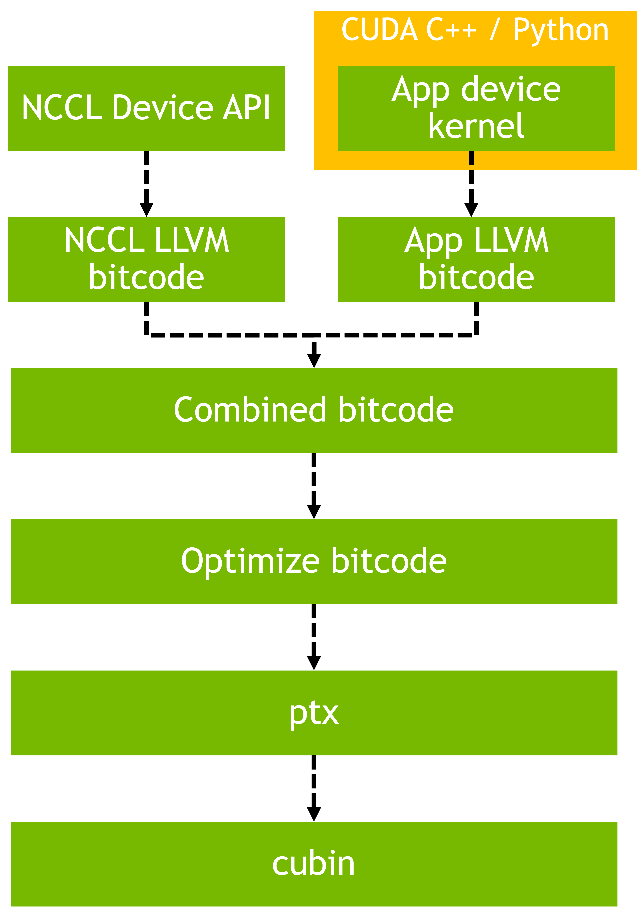

# LLVM IR for NCCL Device APIs
<!-- use this template to share the details of your feature. Non-commented sections are strongly encouraged -->
This project exposes NCCL Device APIs through LLVM intermediate representation to enable consumption by diverse code generation systems, including high-level languages, Just-In-Time (JIT) compilers, and domain-specific languages(DSL).

## Abstract
<!-- here detail what the feature is about. A few sentence that can be copy-pasted to external actors -->
NCCL Device API exposes fine-grained device initiated communication primitives which acts as a building block for custom collective algorithms and optimized communication patterns, but are accessible only through CUDA C++ kernel development. This creates barriers for emerging compiler technologies, high-level languages, and domain-specific systems that cannot directly consume C++ templates and object-oriented interfaces. This project exposes NCCL Device APIs through LLVM IR with an ABI-compatible procedural interface. The resulting language-agnostic interface enables direct integration with diverse consumers—including JIT compilation systems, DSLs, and custom compiler toolchains—allowing developers to build fused computation-communication kernels, implement custom communication patterns with communication computation overlap, and dynamically compose fine-grained communication operations without requiring monolithic pre-compiled C++ kernels.

<!-- ============================================================================================-->

<h2>Motivation and requirements</h2>

<!-- ============================================================================================-->

## Motivation
Modern compiler technologies and code generation frameworks—including JIT compilation systems, domain-specific languages, and high-level language runtimes—have transformed how developers interact with computational primitives, enabling expression of complex algorithms through high-level constructs while maintaining performance. Extending this capability to GPU communication primitives presents an opportunity to achieve similar benefits for distributed computing applications. NCCL's fine-grained device APIs provide powerful primitives for custom collective algorithms, one-sided operations, and synchronization mechanisms. By exposing these APIs through LLVM IR with an ABI-compatible procedural interface, this project enables direct integration with diverse code generation systems, allowing JIT compilers, DSLs, and custom compiler toolchains to compose fine-grained communication operations dynamically. This brings communication primitives into the same ecosystem as computational primitives, enabling developers to build fused computation-communication kernels from high-level languages, implement custom communication patterns with explicit overlap control for fine-grained performance optimization, and leverage familiar high-level tools for rapid distributed algorithm development and exploration.

## Requirements
NCCL's device APIs are implemented as heavily templated C++ code with object-oriented design patterns. To enable seamless integration with diverse IR consumers (languages, DSLs, frameworks, compilers), the IR exposure must satisfy the following requirements:

**API Exposure**: The exposed API surface must be minimal while providing comprehensive coverage of NCCL device functionality. Convenience wrapper functions and syntactic sugars must be excluded to minimize the interface footprint. Only fundamental operations required for building communication patterns should be exposed.

**ABI Compatibility**: IR consumers cannot directly consume C++ name-mangled symbols. The interface must provide C-compatible linkage with stable, predictable symbol names. This requires a mechanism to conditionally enable C linkage during LLVM bitcode compilation without affecting the standard CUDA build path, ensuring ABI stability across compilation units while maintaining compatibility with existing NCCL builds.

**Maintainability and Extensibility**: Direct instantiation of all template parameter combinations would cause combinatorial explosion in binary size and maintenance burden. The interface must avoid forced template instantiation while maintaining functionality. Two key challenges must be addressed: (1) **Cooperative group abstraction**: the templated cooperative group types (thread, warp, CTA, etc.) must be unified into a single type-erased representation that supports runtime polymorphism without template explosion, and (2) **Runtime parameterization**: compile-time template parameters (such as backend selection, action types, and configuration options) must be replaced with runtime-configurable alternatives to enable incremental extensibility without exponential binary growth.

**Procedural Interface**: IR consumers expect deterministic function names and cannot efficiently handle C++ object-oriented patterns in generated device code. The interface must provide a C-style procedural design where: (1) class member functions are transformed into standalone functions with explicit context parameters, (2) template-based optional actions and configurations are flattened into explicit primitive-type parameters whenever required, and (3) object initialization is handled through explicit initialization functions rather than constructors. This ensures direct function invocation by name while preserving the semantics and performance characteristics of the underlying C++ implementation.

### NVbugs / Jira Tickets
* [JIRA-GP-468](https://jirasw.nvidia.com/browse/GP-468)
* [NVBUG-5445668](https://nvbugspro.nvidia.com/bug/5445668)

### User Experience

### Assumptions, constraints and dependencies

### Use Cases

### Platform Requirements

<!-- ### Functional Requirements -->
<!-- ### System Requirements -->
<!-- ### Interface Requirements -->
<!-- ### KPI Requirements -->
<!-- ### Security Requirements -->
<!-- ### Legal and Standards Requirements -->
<!-- ### Telemetry Requirements -->
<!-- ### Backward Compatibility Requirements -->
<!-- ### Virtualization Requirements -->

<!-- ============================================================================================-->

<h2>Design</h2>

<!-- ============================================================================================-->

### Proposed Design

<!-- note: the following HTML code is also valid -->

The LLVM IR exposure implements a parallel C-style interface layer alongside the existing templated C++ device APIs. This design addresses the requirements through selective API exposure, conditional compilation, type erasure, and runtime parameterization.

#### Core APIs

All core APIs are exposed (team management, rank translation, window pointer access, resource buffer access) with conditional C-linkage that activates exclusively during LLVM bitcode compilation.

#### Cooperative Group Abstraction (Coop)

The templated cooperative group hierarchy is unified through type erasure using vtable-based runtime polymorphism. A single wrapper type replaces all current template variants (thread, warp, CTA, etc.), exposing only the essential interface (rank, size, sync) through function pointer dispatch. This eliminates combinatorial template instantiation while maintaining full functionality and extensibility. Initialization is handled through explicit functions for each cooperative group variant.

#### Barrier Sessions

Three barrier session types are exposed: generic barriers (LSA+GIN hybrid), LSA barriers (intra-node shared memory), and GIN barriers (inter-node network-based). Each is implemented as a wrapper containing a single instantiation of the templated barrier with the type-erased cooperative group type. Session lifecycle (initialization) and operations (arrive, wait, sync) are exposed as procedural functions.

#### GIN Communication

GIN network communication replaces compile-time backend selection with runtime parameterization through explicit backend mask members. Communication primitives (put, signal, flush, counter/signal operations) are exposed as standalone functions. The templated optional action system is flattened: template-based action types are replaced with explicit boolean flags and primitive parameters, enabling dynamic configuration without template instantiation.

#### What's Excluded

- Symmetric pointer abstractions
- Convenience function overloads
- Template-based helper utilities
- LLA2A primitives
- Host-only APIs

<!-- ### System KPIs & Metrics -->
<!-- ### Data Architecture -->
<!-- ### Security Design -->
<!-- ### Debugging & Troubleshooting -->
<!-- ### Logging and Instrumentation -->
<!-- ### Operational Considerations -->

<!-- ============================================================================================-->

<h2>Coding</h2>

<!-- ============================================================================================-->

### Commit list or MR

<!-- ============================================================================================-->

<h2>Testing and Validation</h2>

<!-- ============================================================================================-->

### Objectives and Timeline

### Validation

#### IR Test Suite

IR-related test cases have been introduced in `test/unit/` to validate the LLVM IR exposure of NCCL Device APIs:

- `devapi_barrier_lsa_ir`
- `devapi_barrier_gin_ir`
- `devapi_data_ring_ir`
- `devapi_data_ring2_ir`
- `devapi_signal_ring_ir`

**Test Design:**

The tests employ a dual-compilation strategy where each test contains a single kernel implementation compiled through two paths:
- **Existing CUDA Path** (default): Standard NVCC compilation with templated C++ APIs
- **IR Path** (`USE_IR` flag): LLVM toolchain producing cubin loaded via CUDA Module Management API

This validates functional equivalence between template-based C++ implementations and IR interface.

<!-- #### Code Coverage Goal Defined -->
<!-- #### KPI Coverage Goals Defined (performance, stress, stability, throughput, latency) -->
<!-- #### Requirement Coverage Goal Defined -->
<!-- #### Quality Thresholds Defined -->
<!-- #### Test Timeline -->
<!-- #### SW Verification and Test Plan -->
<!-- ### Test plan -->
<!-- #### Requirements Tests -->
<!-- #### Interface Tests -->
<!-- #### Fault-injection Tests -->
<!-- #### Resource Usage Tests -->
<!-- #### Design Coverage Testing -->
<!-- #### Boundary Tests -->
<!-- #### Certification Tests -->
<!-- #### Stress Tests -->
<!-- #### Stability Tests -->
<!-- #### Perf and Power KPI Tests -->
<!-- #### Usability & OOBE Tests -->
<!-- #### Manufacturing Diagnostic(Factory) Tests -->

### Performance

#### What is measured?

#### Results

<!-- ============================================================================================-->

<h2>Signoff List</h2>

<!-- ============================================================================================-->

Author(s):
  - Subhadeep Bhattacharya <subhadeepb@nvidia.com>

