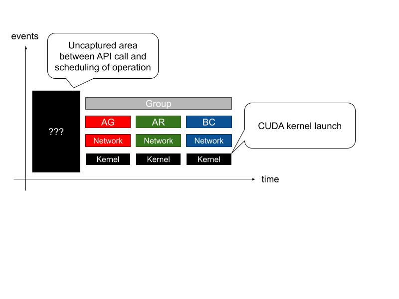
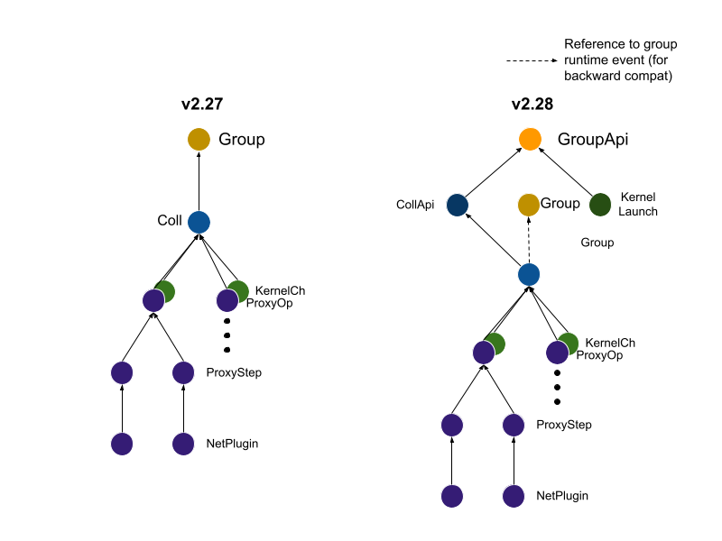
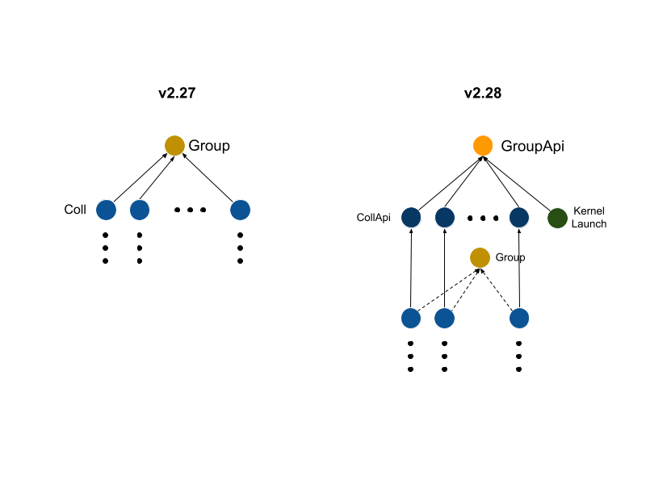
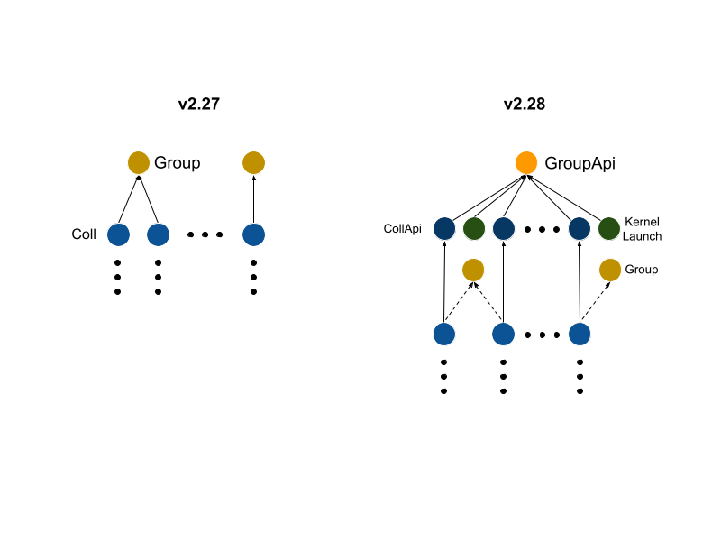
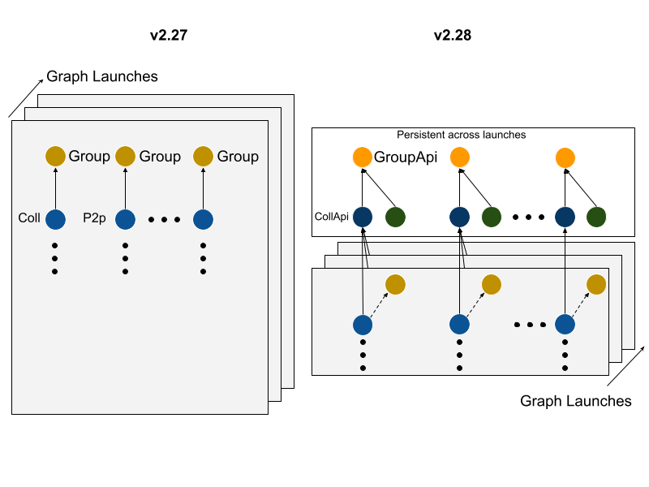
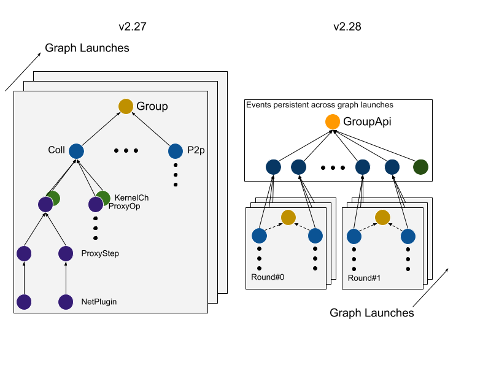

# Profiler API Events
<!-- use this template to share the details of your feature. Non-commented sections are strongly encouraged -->

## Abstract
The NCCL profiler plugin interface currently does not define NCCL API calls and CUDA kernel launch events. As a consequence, the profiler is unable to correlate CUDA kernel launches and NCCL API calls. Moreover, the profiler plugin has no information about the time that elapses between the API call and the scheduling of the operation, nor the time between the CUDA kernel launch and the execution of the operation in the GPU.



The reason API call events are not supported is that NCCL needs to work with CUDA graph capturing. During graph capturing NCCL generates work items for the GPU kernel and the network proxy thread (if any network transfer is required). These work items are recorded in a CUDA graph but not executed immediately. Only when the CUDA graph is launched, these work items are scheduled (either to the GPU or to the network proxy thread) for execution.

Support for NCCL API call and CUDA kernel launch events enables the following:

1. Present API events in user order. The API call order might be different from the order in which operations are scheduled by NCCL, if the operations are grouped using ncclGroupStart/ncclGroupEnd
2. Capture NCCL operation overhead in the CPU (i.e., how much time it takes for NCCL to schedule the operation since the API call was made by the user)
3. Correlate CUDA kernel launches to the originating NCCL API call

<!-- here detail what the feature is about. A few sentence that can be copy-pasted to external actors -->

<!-- ============================================================================================-->
<details>
<summary><h2>Motivation and requirements</h2></summary>
<!-- ============================================================================================-->

### NVbugs / Jira Tickets
[Jira-1944](https://jirasw.nvidia.com/browse/NCCL-1944)

[NVBUG-5190784](https://nvbugspro.nvidia.com/bug/5190784)

### User Experience

### Assumptions, constraints and dependencies
The API and CUDA kernel launch events have different semantics depending on the execution model: CUDA graph vs standard and group vs non-group.
For example, CUDA kernel launch events support require instrumenting ``ncclLaunchKernel``. This NCCL function is surrounded by callbacks to the profiler plugin start/stop event. Such callbacks are not replayed during graph launch, resulting in loss of information for the profiler. Replaying them in the graph would require NCCL to add two CPU nodes, one before and one after the kernel launch. However, CPU nodes have a high overhead in CUDA (~15us per node, plus operation). Similarly, API calls are no replayed during graph launch. Therefore, profiler must detect if the NCCL stream is graph captured and make sure API events are persisted across graph launches, so that all following runtime events are linked to the parent API call.

<!-- ### Use Cases -->
<!-- ### Platform Requirements -->

### Functional Requirements

#### Base Case
Single NCCL operation (no _ncclGroupStart_/_ncclGroupEnd_, no CUDA graph capture/launch)



* Group, Collective and P2p API calls emit new events (e.g., _ncclProfileGroupApi_, _ncclProfilerCollApi_ and _ncclProfileP2pApi, respectively)
* Every CUDA kernel launch emits a new event (e.g., _ncclProfileKernelLaunch_)
* A group API event parents a collective (or p2p) API event and one CUDA kernel launch event
* A collective (or p2p) needs to parent one collective (or p2p) runtime event
* The profiler plugin must correlate CUDA kernel launches to the originating collective (or p2p) API call. Trivial in this case as every group API event parents only one collective (or p2p) API event and one CUDA kernel launch event
* The new event hierarchy must be backward compatible. This means that the old _ncclProfileGroup_ event must be emitted and the runtime collective (or p2p) event must to reference it.

#### NCCL Group Single-Round
_ncclGroupStart_/_ncclGroupEnd_ with multiple collective (and/or p2p) operations and only one CUDA kernel launch (round) serving them



* A group API event parents can parent multiple collective (and/or p2p) API events and one CUDA kernel launch event
* A collective (or p2p) API event parents only one collective (or p2p) runtime event
* The profiler plugin must correlate CUDA kernel launch events to the first collective (or p2p) API call that is scheduled for execution in the group

#### NCCL Group Multi-Round
_ncclGroupStart_/_ncclGroupEnd_ with multiple collective (and/or p2p) operations and multple kernel launches (one per round) serving them



* A group API event parents multiple collective (and/or p2p) API events (one for every NCCL operation in the group) and multiple CUDA kernel launch events (one for every round)
* A collective (or p2p) API event parents only one collective (or p2p) runtime event
* The profiler plugin must correlate each CUDA kernel launch to the first collective (or p2p) API call that is scheduled for execution in the round

#### CUDA Graph

Individual (or multiple) NCCL operations recorded in CUDA graph (no _ncclGroupStart_/_ncclGroupEnd_ calls)



* A group API event parents only one collective (or p2p) API event and one CUDA kernel launch event
* A collective (or p2p) event can parent multiple collective (or p2p) runtime events (one for every graph launch)
* The profiler plugin must correlate the CUDA kernel launch to the originating collective (or p2p) API call. (Due to lack of CUDA and CUPTI support this is currently impossible)

#### CUDA Graph + NCCL Groups

Multiple NCCL operations grouped together and captured in a CUDA graph



* A group API event can parent multiple collective (and/or p2p) API events and multiple CUDA kernel launch events (one per round)
* A collective (or p2p) API event can parent multiple collective (or p2p) runtime events (one per graph launch)
* The profiler plugin must correlate the CUDA kernel launch for the individual graph laucnh to the corresponding collective (or p2p) operation in the graph. (Due to lack of CUDA and CUPTI support this is currently impossible)


<!-- ### System Requirements -->
### Interface Requirements
The new profiler plugin API must be backward compatible with version 4 (NCCL v2.27.x). This means that old events should be emitted as usual when running with older profiler versions.

<!-- ### KPI Requirements -->
<!-- ### Security Requirements -->
<!-- ### Legal and Standards Requirements -->
<!-- ### Telemetry Requirements -->
<!-- ### Backward Compatibility Requirements -->
<!-- ### Virtualization Requirements -->

</details>

<!-- ============================================================================================-->
<details>
<summary><h2>Design</h2></summary>
<!-- ============================================================================================-->

### Proposed Design

The NCCL profiler plugin interface v5 is extended with four new events: _ncclProfileGroupApi_, _ncclProfileCollApi_, _ncclProfileP2pApi_ and _ncclProfileKernelLaunch_. Two event states (ncclProfilerGroupStartApiStop and ncclProfilerGroupEndApiStart) have been added so that calls to recordEventState can record the end of a ncclGroupStart() or the start of a ncclGroupEnd(), respectively. GroupApi events are emitted once per upper level group call and ignore nested groups, since the current NCCL design treats nested groups as one. A groupDepth variable is added to distinguish between groups that users start/end (using calls to ncclGroup*) and groups that NCCL implicitly creates (in cases where users do not make a call to ncclGroup* before NCCL p2p/collective calls).

<!-- note: the following HTML code is also valid -->
<!--  -->

### Interface Architecture

#### NCCL Events
```C
enum {
+ ncclProfileGroupApi     = (1 <<  8),
+ ncclProfileCollApi      = (1 <<  9),
+ ncclProfileP2pApi       = (1 << 10),
  ncclProfileGroup        = (1 <<  0),
  ncclProfileColl         = (1 <<  1),
  ncclProfileP2p          = (1 <<  2),
  ncclProfileProxyOp      = (1 <<  3),
  ncclProfileProxyStep    = (1 <<  4),
  ncclProfileProxyCtrl    = (1 <<  5),
+ ncclProfileKernelLaunch = (1 << 11),
  ncclProfileKernelCh     = (1 <<  6),
  ncclProfileNetPlugin    = (1 <<  7),
};
```

#### NCCL Event Descriptor
```C
typedef struct {
-  uint8_t type;
+  uint64_t type;
  void* parentObj;
  int rank;
  union {
+   struct {
+     bool graphCaptured;
+     int groupDepth;
+   } groupApi;
+
+   struct {
+     const char* func;
+     size_t count;
+     const char* datatype;
+     int root;
+     void* stream;
+     bool graphCaptured;
+   } collApi;
+
+   struct {
+     const char* func;
+     size_t count;
+     const char* datatype;
+     void* stream;
+     bool graphCaptured;
+   } p2pApi;
+
+   struct {
+     void* stream;
+   } kernelLaunch;

    struct {
      uint64_t seqNumber;
      const char* func;
      void const* sendBuff;
      void* recvBuff;
      size_t count;
      int root;
      const char* datatype;
      uint8_t nChannels;
      uint8_t nWarps;
      const char* algo;
      const char* proto;
+     void* parentGroup; // for backward compatibility with v4
    } coll;

    struct {
      const char* func;
      void* buff;
      const char* datatype;
      size_t count;
      int peer;
      uint8_t nChannels;
+     void* parentGroup; // for backward compatibility with v4
    } p2p;

    struct {
      pid_t pid;
      uint8_t channelId;
      int peer;
      int nSteps;
      int chunkSize;
      int isSend;
    } proxyOp;

    struct {
      int step;
    } proxyStep;

    struct {
      uint8_t channelId;
      uint64_t pTimer;
    } kernelCh;

    struct {
      int64_t id;
      void* data;
    } netPlugin;
  };
} ncclProfilerEventDescr_v5_t;
```

<!-- ### System KPIs & Metrics -->
<!-- ### Data Architecture -->
<!-- ### Security Design -->
<!-- ### Debugging & Troubleshooting -->
<!-- ### Logging and Instrumentation -->
<!-- ### Operational Considerations -->

</details>

<!-- ============================================================================================-->
<details>
<summary><h2>Coding</h2></summary>
<!-- ============================================================================================-->

### Commit list or MR

</details>

<!-- ============================================================================================-->
<details>
<summary><h2>Testing and Validation</h2></summary>
<!-- ============================================================================================-->

### Objectives and Timeline

### Validation

#### Where to run?

#### What to run?

#### Expected output?

<!-- #### Code Coverage Goal Defined -->
<!-- #### KPI Coverage Goals Defined (performance, stress, stability, throughput, latency) -->
<!-- #### Requirement Coverage Goal Defined -->
<!-- #### Quality Thresholds Defined -->
<!-- #### Test Timeline -->
<!-- #### SW Verification and Test Plan -->
<!-- ### Test plan -->
<!-- #### Requirements Tests -->
<!-- #### Interface Tests -->
<!-- #### Fault-injection Tests -->
<!-- #### Resource Usage Tests -->
<!-- #### Design Coverage Testing -->
<!-- #### Boundary Tests -->
<!-- #### Certification Tests -->
<!-- #### Stress Tests -->
<!-- #### Stability Tests -->
<!-- #### Perf and Power KPI Tests -->
<!-- #### Usability & OOBE Tests -->
<!-- #### Manufacturing Diagnostic(Factory) Tests -->

### Performance

#### What is measured?

#### Results


</details>

<!-- ============================================================================================-->
<details>
<summary><h2>Signoff List</h2></summary>
<!-- ============================================================================================-->

Author(s):
  - Giuseppe Congiu <gcongiu@nvidia.com>
  - Bharath Ramesh <bhramesh@nvidia.com>

</details>
