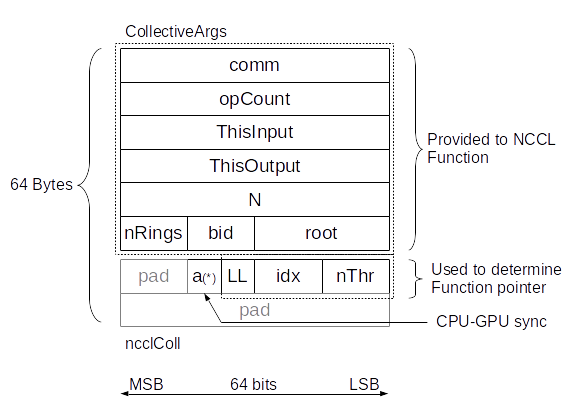
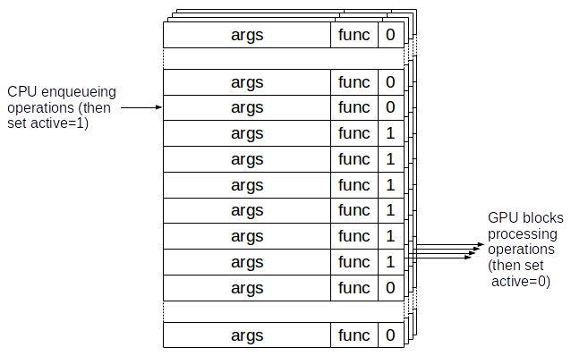

# Aggregated Collectives

<h2>Requirements</h2>

 
### Project Context and Purpose

NCCL provides fast inter-GPU communication for parallel applications.

### NVbugs / Jira Tickets

[NVBug 1983062](http://nvbugs.nvidia.com/1983062)

[NVBug 1988102](http://nvbugs.nvidia.com/1988102)

[Jira NCCL-372](https://jirasw.nvidia.com/browse/NCCL-372)

### User Experience

NCCL is used through deep learning frameworks or other HPC applications
to accelerate GPU-to-GPU communication. It is supposed to be transparent
to the user.

### Assumptions, constraints and dependencies

None.

### Use Cases

#### DL inter-layer aggregation

Improve DL framework performance when using multiple GPUs. In
particular, accelerate the reductions of small operations, like the
hundreds performed by ResNet50 during backward propagation.

Frameworks like MXNet and Caffe2 do not currently aggregate reductions
of different layers, launching many small reductions in NCCL which is
very inefficient. Application driven aggregation is usually the best
approach but can be tricky to implement inside DL frameworks and is
overall a significant amount of work.

NCCL providing a simple aggregation interface would help applications
which want to improve the performance of multiple small operations.

#### Other collectives

Many collective operations which are not supported by NCCL yet can be
described as an aggreagation of other collectives. Allgatherv can be
seen as many small broadcasts, Reducescatterv as many small reduce
operations, each time with a different root. It is already relatively
easy to implement those operations with NCCL \< 2.2, but it may be very
slow as well. The aggregation interface makes it more efficient, even if
at this point, we're not aiming for the same performance between
ReduceScatter and ReduceScatterv on all sizes.

Looking forward, aggregation would also permit to easily implement
scatter\[v\], gather\[v\], alltoall\[v\], or any other pattern with just
the addition of two functions : send and receive.

### Functional Requirements

Provide a way for applications to define which NCCL operations to be
aggregated, to achieve better performance.

It should be permitted to aggregate any type of operation, with
different data types, reduction operations, roots, ...

### System Requirements

None.

### Interface Requirements

New verbs can be added to provide this functionality, or current verbs
behavior can be extended.

### KPI Requirements

Improve the time per NCCL operation by a significant factor (2 at least,
10 desired).

### Platform Requirements

N/A

### Security Requirements

NCCL is a user library and benefits from the user-mode security.

### Legal and Standards Requirements

N/A

### Telemetry Requirements

N/A

### Backward Compatibility Requirements

Changes do not need to be backward compatible.

### Virtualization Requirements

N/A

### Signoff list

Author : Sylvain Jeaugey

Reviewer : Ke Wen

 

<h2>Design</h2>

 
### Proposed Design

#### High level design

NCCL kernels are replaced by a single multi-operation kernel. This
kernel can execute any NCCL operation (collectives/datatypes/reductions)
and will only return when all operations are complete.

Different rings are able to perform different operations, which means
that having multiple rings will increase the number of operations per
second by as many rings as there are.

The CPU enqueues operations to perform in a FIFO shared with the GPU.
The FIFO size is set to 2048, which is the maximum number of aggregated
operations per kernel.

We extend the ncclGroupStart/ncclGroupEnd verbs to define which
operations to aggregate. Within a Start/End section, the CPU will only
enqueue operations in the FIFO ; ncclGroupEnd will finally launch the
NCCL CUDA kernel which will process all operations.

Since the multi-op kernel has a higher latency, we generate a
single-operation kernel for every LL operation which will be used
instead of the multi-op kernel when only one operation has been
enqueued.

#### Low level design

Instead of generating CUDA kernels for all cases, we generate device
functions, and we store the device function pointers in an array which
is used by the multi-op kernel. For each operation in the FIFO, we
retain the index of the function in the table, indexing the function
based on : collective operation, reduction operation, datatype and
number of threads.

Functions names look like ncclAllReduce_sum_f32_128 for an Allreduce
doing a sum of floats (32 bits) with 128 threads.

The GPU-CPU fifo is a 2048 entries FIFO with three parts : the
Collective Args as we had before, the operation information (ignored if
we launch a single-operation kernel) and an "active" flag, used to sync
between the CPU and GPU blocks.

To make sure we can efficiently load operations from the GPU, the
structure is rounded to 64 bytes.

The active field is used to keep track of which operations have been
performed. It makes sure we fail when the user tries to aggregate more
than 2048 operations and also limits to 2048 outstanding operations (the
CPU waits when it wants to enqueue a 2049th one). There is one FIFO per
ring. When an operation is large enough to require multiple rings, one
entry is enqueued in each FIFO. The "bid" field is used to let each ring
play the role of any block (so that multiple blocks can perform
different operations in parallel as bid "0") or a multi-block operation
as their block Id (or even another any block).

To reduce the binary size, and aside from generating single-operation
kernels only for LL operations, we only generate copy/int8 code for
Broadcast and Allgather. All Broadcast/AllGather calls on non-int8
datatypes are converted into int8 operations, multiplying the count by
the size of the datatype.

#### Environment Variables

A new NCCL_MIN_NRINGS variable is added to increase the number of GPU
resources used to process aggregated collectives. This makes a
significant difference on systems where by default, the topology
detection would create a single ring.

### Interface Architecture

Users only need to extend the scope of the ncclGroupStart/ncclGroupEnd
operations to aggregate operations performed by each GPU.

Typical code would look like :

      ncclGroupStart();
      for (int i=0; i<num_ops; i++) {
        ncclAllReduce(sendbuffs[i], recvbuffs[i], counts[i], ncclFloat, ncclSum, 
        nccl_comm, stream);
      }
      ncclGroupEnd();
      cudaStreamSynchronize(stream);

### System KPIs & Metrics

Per-operation latency is down to 1us per operation (compared to 10 for 8
GPUs), highly depending on the number of rings used (hence number of
operations we can process concurrently).

### Data Architecture

N/A

### Security Design

N/A

### Debugging & Troubleshooting

None.

### Logging and Instrumentation

None.

### Operational Considerations

None.

### Signoff list

Author : Sylvain Jeaugey

Reviewer : Ke Wen

 

<h2>Coding</h2>

 

- nccl@a507a4349462250944995142422c709dbb2e703a
- nccl@015f6fa1d4ba08dc6dc9d636fd28cba8f0e4ed3d
- nccl@ca3710a93e658457b6d26aaeb4febe93991d42ab
- nccl@9cba372d1f291805293ed11fc5ccd26cd8278ae3
- nccl@29438e9fa3dadb5536b6299abda6d43f7e0e7ca0
- nccl@8cb093e38f347320f651c5e0e15a17e4312fd72f
- nccl@7edb6c05f667b93c1a2099308e7d7c879ed410d0
- nccl@772a99fa19cd98264e4b3975a722d6189a8d01bb
- nccl@b3519173d3e19ad5fd1b574fcda2cf1a5fb0c1dc
- nccl@5927870a1776257ebbde2f4d7dcdefd5d7d72fde
- nccl@fe654fce5806b87f19cf0bcd3e1aa6dbcebe5a84
- nccl@a8f848e9d22b85a92a4b1a09eb0e862c08302c58
- nccl@194920203ea63e9c873682b9e1388bbc680397eb
- nccl@726b8cc9eb85f71c221175ba56ec564b227ea4cf
- nccl@e54742221f25eeabcfb978baf038227ed896578b
- nccl@44d8457ca915207fd937d9571f94946b8d024652
- nccl@30c6e15ab4742764ece74c37d598fbb0665a74bc
- nccl@6a389598247086ea322570204b6a796f7549bc48
- nccl@06a6b005fe1f4c0f5e50dca7193079cb686c389a
- nccl@06d2ff8ffdcb597933f8e75acbc6983dd155e6d7
- nccl@8c8aef8495f1adb8cd8f4387bfc86dcbf2ae5281
- nccl@d06cb4510babd81f09afed7ba8e883a853bd61d5
- nccl@ac27f8047f2a045443dfa8747f0a741a4f37cbf0
- nccl@fc7c6cf75994b3ef36d0ae679ef46093e5a2c5d3
- nccl@25b3c609b1d22bc43351c6979c2271f97a8a8281
- nccl@bf77acfe6bf6c1852be9d5b20f0b9014f7b88d77
- nccl@3c517489fa0442dbf86d6e90c8b6885523019ba0
- nccl@8d39704a3b49082347ee62885139fec3c296c35a
- nccl@af821abf4ebd4a5a5264cec4607fc530d3c4686f
- nccl@55365d9bcee505eb7ce497dd79e9381ea3a7f2e8
- nccl@f8fcd99d935f15d05cc02dba2c4fce5b786baa53
- nccl@b8147787b1cb5aefc07fd9fbe0dc4438a397195d
- nccl@793cb1ea2153271d171a6bded1ac09f9e6b4e274
- nccl@97b2fe0e16b34444895382ce987c551222c23e62
- nccl@ff956a5c728e1b3179350cd2f72c39469338df75
- nccl@760f7d0012aba7bb3477f736f51ccd5c60c9d905
- nccl@026f58c603c8c1bc4aa1e81ac753e83d83f58b83
- nccl@457576856776d03a21539add2220c290a986af72
- nccl@c451cb9ec2bb502dd03179d2e41b3b48a6714503
- nccl@a9f74d87e9c29370d8b7d2f245a1ef4144375ec2
- nccl@84be087d4e6611eed8c5d8d49b67db58152b1553
- nccl@5421cab560830cf8b876d7d433d997db5084e84c
- nccl@efaf71e250f9afcfbe6dfa637174cdd266cc6ab4
- nccl@8700409b76a13ef81a54f96c451b78375b0d4da5
- nccl@e5a83ba1d10c2e07d716889e7ea81a67de6ce3e4
- nccl@efbeb86fe05f9254969482475e8e29a4f7b2aa76
- nccl@de8af9156a1500b6094944481e61e9b37513cf8a

 

<h2>Testing</h2>

 
### Objectives and Timeline

#### Code Coverage Goal Defined

None.

#### KPI Coverage Goals Defined (performance, stress, stability, throughput, latency)

No change.

#### Requirement Coverage Goal Defined

Add testing for aggregated collectives.

#### Quality Thresholds Defined

No error.

#### Test Timeline

#### SW Verification and Test Plan

### Test plan

#### Requirements Tests

Two new tests were added to the performance tests :

    reduce_scatterv_perf

and

    all_gatherv_perf

.

#### Interface Tests

A new test has been added to the API tests for each collective, using
aggregation. The new test aggregates over difference cases, including
iterations (i.e. data space), operations, data types, roots, etc.

#### Fault-injection Tests

None.

#### Resource Usage Tests

None.

#### Design Coverage Testing

None.

#### Boundary Tests

None.

#### Certification Tests

None.

#### Stress Tests

None.

#### Stability Tests

None.

#### Perf and Power KPI Tests

Performance of aggregated collectives can be tested with "-m" option
specifying the aggregation factor and compared to the non-aggregated
case.

#### Usability & OOBE Tests

None.

#### Manufacturing Diagnostic(Factory) Tests

None.

### Signoff list

Author : Sylvain Jeaugey Reviewer : Ke Wen

 
