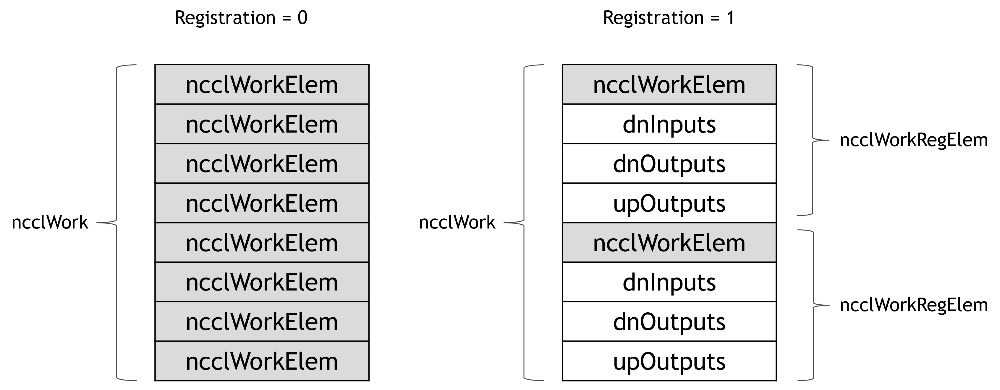

# User buffer registration

<h2>Requirements</h2>

 
### Project Context and Purpose

NCCL provides fast inter-GPU communication for parallel applications.

### NVbugs / Jira Tickets

[Jira NCCL-939](https://jirasw.nvidia.com/browse/NCCL-939)

### User Experience

NCCL is used through deep learning frameworks or other HPC applications
to accelerate GPU-to-GPU communication. It is supposed to be transparent
to the user.

### Assumptions, constraints and dependencies

In CUDA Graph mode

For CollNet only

For 1-GPU-per-process case only

All GPUs on a node can P2P each other

### Use Cases

When users use the CollNet algorithm in CUDA Graph mode, NCCL will
automatically register user buffers for IPC functionality, so that GPUs
can directly read/write remote user buffers, hence saving an extra copy
and DRAM bandwidth.

### Functional Requirements

None/\$TBD -- new functionalities

### System Requirements

All GPUs on a node can P2P each other

### Interface Requirements

None

### KPI Requirements

Improved AllReduce performance for DL relevant sizes

### Platform Requirements

N/A

### Security Requirements

NCCL is a user library and benefits from the user-mode security.

### Legal and Standards Requirements

N/A

### Telemetry Requirements

N/A

### Backward Compatibility Requirements

Changes do not need to be backward compatible.

### Virtualization Requirements

N/A

### Signoff list

Author : Ke Wen

 

<h2>Design</h2>

 
### Proposed Design

Algorithms like CollNet have few steps. In multi-process case, a copy
from user buffer to intermediate buffer can acount for a large portion
of latency of the entire operation.

One solution is to allow processes to directly access the user buffers
of a remote process. This requires user buffer registration. Further, in
intra-node context, this refers to enabling IPC connectivity between
processes.

In general, user buffer registration implies persistency of collective
operations. Currently, a persistent collective operation can be captured
by a CUDA Graph. Thus, it becomes natural to implement user buffer
registration under the umbrella of CUDA Graphs, saving the need for new
APIs.

The new feature can be decomposed into three phases:

\(I\) Capturing phase:

i.a Enable IPC on user buffers

i.b Exchange IPC handles

\(II\) Enqueuing phase:

ii.a Fill buffer addresses into work elements

\(III\) CUDA kernel:

iii.a Read corresponding remote buffer addresses by corresponding thread
groups

iii.b Void the scatter operation and have reducer directly pull from
remote input buffer

iii.c Void the gather operation (direct push) or have gatherer directly
pull from remote output buffer

\(IV\) De-registration:

iv.a Close IPC handles during CUDA Graph tear-down

Below are the details:

\(I\) Capturing phase

The registration occurs at the Graph capture phase. Each process will
export an IPC handle for its input/output buffers. Then they exchange
the handles via an intra-node all-gather. At last they open those
handles from peer processes to get address pointers to those remote
buffers. These address pointers will be stored at the Graph argument
space.

\(II\) Enqueuing phase

When enqueuing the operation, the address pointers need to be filled
into the work element arguments and passed to the CUDA kernel.
Currently, a ncclWork contains 8 ncclWorkElem's, each of which is 64
bytes. An address pointer takes 8 bytes, so a ncclWorkElem can be
converted into a space to fit 8 address pointers, which happens to
correspond to 8 GPUs intra-node. We also need to account for the
following three direct access scenarios:

\(i\) direct fetch from remote input buffers -- during scatter;

\(ii\) direct write into remote output buffers -- during broadcast;

\(iii\) direct pull from remote output buffers -- during gather.

Thus, we need a total of 3 ncclWorkElem's to fit these three sets of
address pointers.

\(III\) CUDA kernel

In function setDataPtrs(...), we do not need to rely on inter-GPU buffer
address exchange as before, because these addresses are now directly
readable from ncclWorkRegElem. But we need to identify the address
"provider" and "acceptor" roles based on the "direct" directions. For
example:

Receiver -- Direct write -- Provider of output buffer

Sender -- Direct write -- Acceptor of output buffer

Sender -- Direct read -- (Scatter) provider of input buffer, or
(Broadcast) provider of output buffer

Receiver -- Direct read -- (Reduce) Acceptor of input buffer, or
(Gather) acceptor of output buffer

The new waitPeer(...) function will now provide 4 types of offset
pointers:

\(i\) Pointer to shared network buffer;

\(ii\) Pointer to direct buffer if send/recv role matches direct
read/write direction, e.g. send + write, or recv + read;

\(iii\) Null pointer if send/recv role does not match direct read/write
direction, e.g. send + read, or recv + write

\(iv\) Pointer to intermediate buffer if direct is not enabled.

With the above change, whether the buffer is a remote buffer or a local
intermediate buffer becomes transparent to the ReduceOrCopyMulti
operation.

Corner case:

In order to support PreMulSum, where each rank can have a different
scaler of their own, we also need to exchange the scalers at the
beginning of the CUDA kernel. This is implemented in setDataPtrs(), by
an LL-style (scaler + flag) exchange.

\(IV\) De-registration

We need to close IPC handles at the importers as soon as the CUDA Graph
is being destroyed, because, if this is done after the exporter calls
cudaFree() on the user buffers, a memory leak may occur.

Currently, the destroy function of cudaUserObject_t does not allow CUDA
calls inside. Thus, we need to push those buffer addresses to a helper
thread, and wake up the helper thread to close those handles for us.

Environment variable:

NCCL_GRAPH_REGISTER has been added. Set to 1 to enable this feature.

### Interface Architecture

ncclWork has a new ncclWorkRegElem sub-format which conveys remote
buffer addresses to CUDA kernels.

### System KPIs & Metrics

### Data Architecture

N/A

### Security Design

N/A

### Debugging & Troubleshooting

None.

### Logging and Instrumentation

None.

### Operational Considerations

None.

### Signoff list

Author : Ke Wen

 

<h2>Coding</h2>

 
Merge request !42 : CollNet with buffer registration

Merge request !44 : CollNet: support registration in avg or pre-scale
operations

 

<h2>Testing</h2>

 
### Objectives and Timeline

#### Code Coverage Goal Defined

None.

#### KPI Coverage Goals Defined (performance, stress, stability, throughput, latency)

No change.

#### Requirement Coverage Goal Defined

No change.

#### Quality Thresholds Defined

No error.

#### Test Timeline

Part of NCCL multi-node testing for MLPerf 1.1

#### SW Verification and Test Plan

Part of NCCL multi-node testing for MLPerf 1.1

### Test plan

NCCL multi-node test plan for MLPerf 1.1

#### Requirements Tests

TBD

#### Interface Tests

TBD

#### Fault-injection Tests

None.

#### Resource Usage Tests

None.

#### Design Coverage Testing

None.

#### Boundary Tests

None.

#### Certification Tests

None.

#### Stress Tests

None.

#### Stability Tests

None.

#### Perf and Power KPI Tests

None.

#### Usability & OOBE Tests

None.

#### Manufacturing Diagnostic(Factory) Tests

None.

### Signoff list

Author : Ke Wen

 
