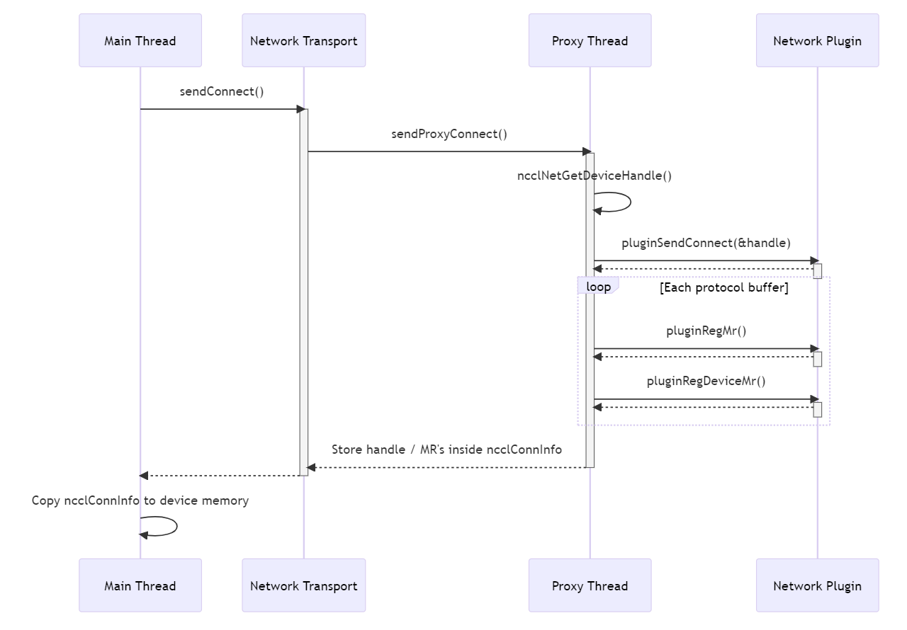

# Network Device Plugins

<h2>Requirements</h2>

 
### Project Context and Purpose

The primary motivation of implementing network device plugins in NCCL is
to enable novel networking use cases to increase performance. We hope to
work with plugins from both NCCL partners such as Google's unpack plugin
in this change as well as internal plugins. Unpack is critical to the
success of Google's next generation of ML infrastructure, enabling
AllReduce to reach close to peak BusBW of Google's FastSocket NICs.
Beyond this immediate benefit, the infrastructure to bring network
plugin metadata can enable other performance benefits as the need
arises.

### NVbugs / Jira Tickets

[NVBug 12345](http://nvbugs.nvidia.com/12345)

[Jira NCCL-12345](https://jirasw.nvidia.com/browse/NCCL-12345)

### User Experience

The device handle is automatically tested and copied into the kernel if
one is exposed correctly by the plugin. All device plugins will be built
into NCCL's official releases and therefore no changes to NCCL itself
will be needed by customers.

### Assumptions, constraints and dependencies

None/\$TBD

### Use Cases

\$TBD

### Functional Requirements

None/\$TBD -- new functionalities

### System Requirements

None/\$TBD -- perf, scalability

### Interface Requirements

None/\$TBD -- specific API

### KPI Requirements

None/\$TBD -- perf

### Platform Requirements

N/A

### Security Requirements

NCCL is a user library and benefits from the user-mode security.

### Legal and Standards Requirements

N/A

### Telemetry Requirements

N/A

### Backward Compatibility Requirements

Changes do not need to be backward compatible.

### Virtualization Requirements

N/A

### Signoff list

 

<h2>Design</h2>

 
### Proposed Design

NCCL network device plugins are a new feature which allow both internal
and external partner teams to introduce communication steps, custom
computation, or full network offload within the NCCL kernel from an
external network plugin. The design encompasses five major changes to
NCCL:

1.  Addition of several new network plugin APIs introduced in
    ncclNetPlugin_v7, including most importantly a new API exposing a
    network device handle object
2.  Plumbing of this device handle down to the kernel through the proxy
    and network connection layers
3.  Making the proxy thread now optional on network connections
4.  Code organization (hardcoding) within the NCCL kernel to handle the
    different types of supported device plugins at proper points in the
    data pipeline
5.  Compatibility checking of the device plugin type and version before
    loading

#### ncclNetPlugin_v7 new APIs

The follow network plugin APIs are introduced in ncclNetPlugin_v7 with
this feature, including most importantly a new API exposing a network
device handle object:

        // Accept an optional ncclNetDeviceHandle_t object
        // If *sendDevComm or *recvDevComm point to a valid object, then NCCL is requesting device offload for this connection
        ncclResult_t (*connect)(int dev, void* handle, void** sendComm, ncclNetDeviceHandle_t** sendDevComm);
        ncclResult_t (*accept)(void* listenComm, void** recvComm, ncclNetDeviceHandle_t** recvDevComm);

        // Copy the given mhandle to a dptr in a format usable by this plugin's device code
        ncclResult_t (*getDeviceMr)(void* comm, void* mhandle, void** dptr_mhandle);

        // Notify the plugin that a recv has completed by the device
        ncclResult_t (*irecvConsumed)(void* recvComm, int n, void* request);

#### The Network Device Handle Object

The device handle is the primary piece of data for this whole feature,
handed down from the plugin to the device kernel. It is a wrapper around
an opaque piece of memory that must be defined in both the plugin CPU
code as well as GPU code. The ncclNetDeviceType enum lets the plugin
tell NCCL which device offload path to choose (each officially
integrated plugin will be assigned it's own enum value.) Version is used
to ensure a matching NCCL build is being used with a given handle
object.

      typedef struct {
        ncclNetDeviceType netDeviceType; // Network offload type
        int netDeviceVersion;            // Version number for network offload
        void* handle;
        size_t size;
        int needsProxyProgress;
      } ncclNetDeviceHandle_v7_t;

#### Determing if a device handle should be requested or not

NCCL invokes ncclNetGetDeviceHandle() with several relevant pieces of
metadata regarding a connection as well the capability advertised by the
plugin. This determines, within sendProxyConnect() / recvProxyConnect(),
if a deviceHandle should be allocated or not.

    // This function embeds plugin-specific rules given the current versions
    static ncclResult_t ncclNetGetDeviceHandle(ncclNetDeviceType type, int version, int p2p, bool isRecv, ncclNetDeviceHandle_t** handle) {
      bool needsDeviceHandle  = false;

      if (type == NCCL_NET_DEVICE_UNPACK) {
        if (version == NCCL_NET_DEVICE_UNPACK_VERSION && isRecv) {
          needsDeviceHandle  = true;
        }
      }

      // Don't re-alloc netDeviceHandles
      if (needsDeviceHandle && (*handle == NULL)) {
        NCCLCHECK(ncclCalloc(handle, 1));
        (*handle)->netDeviceType = type;
        (*handle)->netDeviceVersion = version;
      } else if (!needsDeviceHandle) {
        *handle = NULL;
      }

      return ncclSuccess;
    }

#### Plumbing the handle from the plugin to NCCL

ncclNet-\>getDeviceHandle(...) is invoked within sendProxyConnect() and
stored within the ncclProxyConnection object. This handle will
ultimately be stored within a ncclConnInfo object, which is already
being copied down to NCCL kernel-accessible memory. One device handle is
associated with a single connection.

 The ncclConnInfo structure now
stores a deviceHandle like so:

    struct ncclConnInfo {
      ...
      struct ncclNetDeviceHandle_t netDeviceHandle;
    };

#### Kernel-side usage of the device handle

The device handle is initially presented to the kernel via the
ncclDevChannelPeer-\>ncclConnInfo structure that was copied into in the
prior step. The correct device handle is acquired by the kernel like so:

        void loadRecvConn(ncclDevChannelPeer *peer, int connIndex, struct ncclWorkElem* e) {
        ...
        auto *conn = &peer->recv[connIndex];
          if (conn->netDeviceHandle.netDeviceType == NCCL_NET_DEVICE_UNPACK) {
            // handle must be a device ptr
            netDeviceHandle = conn->netDeviceHandle.handle;
            ncclNetDeviceUnpackSetup(netDeviceHandle, group, index);
            ...
          }

Any relevant properties from the handle can be copied into
ncclShmemData, which is a global shared memory data structure accessible
to the NCCL kernel. This is going to be faster for frequently accessed
fields within the plugin than going to global device memory. Currently,
each type of device plugin is accessed within a union like so:

    struct ncclShmemData {
      ...
      alignas(16) union {
        unpackShmem    unpack;
        myPluginShmem  myPlugin;
        ...
      } devicePlugin;
    };

Additionally, any per-group storage is defined within a second union
inside ncclShmemGroup, like so:

    struct ncclShmemGroup {
      ...
      union {
        unpackGroupShmem unpack;
      } devicePlugin;
    };

The kernel then sets flags denoting that this particular plugin is
active, and then proceeds as normal, calling into plugin-specific
codepaths:

    // Inside prims_simple genericOp(), on every iteration of data
    if (flags & AnyNetDeviceUnpack) {
        int mask = ncclShmem.groups[group].devicePlugin.unpack.unpackNetDeviceIndexMask;

        while (mask != 0) {
            int ix = __ffs(mask)-1; // Get the first set bit of the mask (this should correlate to a peer index)
            mask &= mask-1; // Drop the first set bit of the mask

            // Pack data from the internal iovec to the supplied flat srcs buffer using all the threads
            // + Src is necessary in the case of accessing the user buffer directly
            ncclNetDeviceUnpack(tid, nworkers, group /* in case they need to use split warps shared memory partitioning*/,
                ix, ncclShmem.groups[group].srcs[ix + Src], workSize, ncclShmem.groups[group].devicePlugin.unpack.head);
        }
    }

#### Device Handle Version Checking

The version numbers and handle structs are all currenly defined within
nccl_net.h. The benefit of all these being within nccl_net is that this
is exported when NCCL is built and can be easily consumed by an external
network plugin's build flow. Each plugin must expose its device type as
well as device version number with its implementation of
getProperties(). NCCL will compare the device type and version number
with its own compatibility list inside
net.cc::ncclNetCheckDeviceVersion()

    ncclResult_t ncclNetCheckDeviceVersion(struct ncclComm* comm, ncclNet_t* net, int dev) {
      ncclNetProperties_t props;

      NCCLCHECK(net->getProperties(dev, &props));
      ncclNetDeviceType type = props.netDeviceType;
      if (type) switch (type) {
        case NCCL_NET_DEVICE_UNPACK:
          if (props.netDeviceVersion == NCCL_NET_DEVICE_UNPACK_VERSION) {
            INFO(NCCL_INIT, "Using NCCL_NET_DEVICE_UNPACK net plugin version %d",
              props.netDeviceVersion);
            return ncclSuccess;
          } else {
            WARN("NCCL_DEVICE_UNPACK plugin has incompatible version %d, this NCCL build is compatible with %d, not using it",
              props.netDeviceVersion, NCCL_NET_DEVICE_UNPACK_VERSION);
            return ncclInternalError;
          }
        default:
          WARN("Unknown device code index");
          return ncclInternalError;
      }

      INFO(NCCL_INIT, "Using non-device net plugin version %d",
        props.netDeviceVersion);
      return ncclSuccess;
    }

#### Code organization and integration of partner device plugins

We want to be careful in incorporating external code into NCCL core. If
we have multiple plugins all being actively contributed to, it could
quickly turn to spaghetti. While NCCL core simply treats
netDeviceHandles as opaque blobs, at a certain point the implementation
must be loaded and ran. It is important to clearly define what
definitions are necessary to co-develop both the host side network
plugin as well as device functionality, and keep both in lock-step. We
can then define an organization and workflow to efficiently manage
changes. The definitions that must be kept synchronized are: 1. Each
netDeviceType's most updated version number 2. Each netDeviceType's
handle struct 3. Each netDeviceType's CUDA functions and supporting
definitions For device-only code, the functions themselves and
supporting headers, each device plugin should create a subdirectory
within nccl/src/device/network. This directory should contain everything
the device code needs to use the plugin. It's recommended to have one
file with implementations of all device functions for this plugin, and
another can with supporting definitions, like so:

- nccl/src/device/network/unpack/unpack.h
- nccl/src/device/network/unpack/unpack_defs.h

These files can then be imported within prims_simple, or any other
device code location that needs to invoke them.

#### irecvConsumed() API

There is an additional network API introduced with this change, not
directly relevant to device plugins in general. This API has the
proxyProgress thread notify the network plugin that all sub-operations
of a proxyOp have completed, and all outstanding resources of that
operation can be freed. This API is necessary for good performance for
our very first device plugin, Google Unpack, because resources for each
operation are NIC-allocated, not user-allocated like in the InfiniBand
transport. Because of this, a lazy-freeing page scheme like in the
infiniband transport results in worse perfomance. If this API is null,
it is skipped over by the proxy for practically zero overhead.

#### Option for full offload of the proxyProgress thread for network connections

With this new feature, it's possible a network connection doesn't
require a proxyProgress thread (it's fully offloaded to the GPU.) If
this is the case, NCCL won't create this thread and will skip over
proxyOp enqueueing. NCCL formerly checked if the transportComm object
had a proxyProgress defined, which can be thought of as a static
property for all transports of a certain type. NCCL now checks if the
ncclProxyConnector object has a proxyProgress defined, which is based
off each individual connection. This is set within
net.cc::sendConnect()/recvConnect() based on the results of
sendProxyConnect()/recvProxyConnect().

    // sendProxyConnect()
    ...
    // If the network plugin supports device-initiated communication, get the netDeviceHandle here
    // netDeviceHandle->handle must be a device ptr!
    if (resources->netDeviceType != NCCL_NET_DEVICE_HOST) {
      NCCLCHECK(ncclCalloc(&connection->netDeviceHandle, 1));
      NCCLCHECK(proxyState->ncclNet->getDeviceHandle(resources->netSendComm, resources->tpRemoteRank, connection->netDeviceHandle, &connection->needsProxyProgress));
    } else {
      connection->needsProxyProgress = 1;
    }

    // sendConnect(), after sendProxyConnect() has completed
    ...
    if (send->proxyConn.connection->needsProxyProgress) {
      send->proxyConn.proxyProgress = sendProxyProgress;
    } else {
      send->proxyConn.proxyProgress = NULL;
    }

      // Inside SaveProxy(), checking if proxyConn has proxyProgress defined before enqueueing a proxyOp
      if (connector->proxyConn.proxyProgress == NULL) return ncclSuccess;

      // Inside proxyConnInit(), checking if *connection has needsProxyProgress set to 1 before starting the progress thread
      (*connection)->tcomm = (*connection)->send ? &ncclTransports[(*connection)->transport]->send : &ncclTransports[(*connection)->transport]->recv;
      // If we need proxy progress, let's allocate ops and start the thread
      if ((*connection)->tcomm->proxyProgress && (*connection)->needsProxyProgress) {
        NCCLCHECK(proxyProgressInit(proxyState));
        ...
      }

#### Compatibility checking of the device handle

Every device handle object comes with a type enum and a version number.
The type and version number must match the NCCL build's internal numbers
to load. It is expected that NCCL's external partners provide an updated
version number with each change to device functionality or structure
layout. This is checked within ncclNetCheckDeviceVersion() during
network initialization, and allows for failing back to a different
network.

#### Pros and Cons of the current design

The biggest drawback of the current implementation is the need to
hardcode every case of each device plugin within the NCCL kernel. This
results in an increase in kernel binary size as well as ever-increasing
complexity of the kernel state machine. This is primarily because
runtime loading of CUDA functions isn't officially supported nor is it
performant, and therefore continues to be a non-viable option. In the
future this may change. The upside is an ease of use by NCCL's
customers - NCCL comes built with support for their plugin and
repeatable high performance. In the future, I plan to implement a
further abstraction layer between the core NCCL kernel and plugin
functionality as a greater diversity of use cases present themseves.

#### Using an old plugin with the new v7 API

If NCCL detects a plugin with v6 or older API, it will automatically set
the net device type to HOST and the net device version to INVALID. This
prevents NCCL from using any of the new fields or invoking any of the
new plugin API's for this feature. NCCL will additionally call into the
network compatibility layer.

### Interface Architecture

### System KPIs & Metrics

### Data Architecture

N/A

### Security Design

N/A

### Debugging & Troubleshooting

None.

### Logging and Instrumentation

None.

### Operational Considerations

None.

### Signoff list

 

<h2>Coding</h2>

 
\* commit 02e19ee29a50716b92610fcb0e8713fe560e281e \| Author: Ben
Williams \| Date: Wed Jun 28 12:51:21 2023 -0700 \| \| PLC design
updates \| \* commit 6ad7be8dc3b285243729c55f7ea9a9371039ebb3 \| Author:
Ben Williams \| Date: Wed Jun 28 12:32:22 2023 -0700 \| \| Implemented
optional proxyProgress threads with the network transport. Added a new
field to ncclProxyConnection to signify if a proxyConn is necessary \|
\* commit 04672e2059c5fda6b576e8a1e51f1e4d5f0792c1 \| Author: Ben
Williams \| Date: Wed Jun 28 09:46:28 2023 -0700 \| \| Changed file
layout, updated PLC \| \* commit
8a11562344fa2db15fa63fcec8d20ac9b4a46520 \| Author: Ben Williams \|
Date: Tue Jun 27 07:39:43 2023 -0700 \| \| Removed unpack from
loadSendConn path \| \* commit 4660caa145a591fd1612231a525b567cc5506aaa
\| Author: Ben Williams \| Date: Tue Jun 27 07:01:08 2023 -0700 \| \|
use ncclScratchForWarp() instead of unpack.meta, change g_meta to be
per-group \| \* commit 570639579396213c35e07ded7ba80d78af6402f5 \|
Author: Ben Williams \| Date: Mon Jun 26 14:06:00 2023 -0700 \| \|
Removed proxyThread property from v7, updated the example plugin to have
v7 net headers \| \* commit 362716d562cdf86201ac40df55c53622ca5e728f
\|\\ Merge: d11abdcd 7b200007 \| \| Author: Ben Williams \| \| Date: Mon
Jun 26 09:49:01 2023 -0700 \| \| \| \| Merged origin next including
resolving merge conflicts with device build system refactor \| \| ... \|
\| \| \* \| \| commit d11abdcd0a2a609b30006a8bca2dd96da6a101e6 \| \| \|
Author: Ben Williams \| \| \| Date: Sun Jun 25 13:48:00 2023 -0700 \| \|
\| \| \| \| Updated code organization to discuss source file management
and organization \| \| \| \* \| \| commit
e3821d250cb082fee3182c49025083bf4f5f90e1 \| \| \| Author: Ben Williams
\| \| \| Date: Sun Jun 25 13:11:19 2023 -0700 \| \| \| \| \| \|
Beginning of PLC \| \| \| \* \| \| commit
f8c4bf77f75762fb10016b442e4296e506d2b1d8 \| \| \| Author: Ben Williams
\| \| \| Date: Thu Jun 22 10:13:07 2023 -0700 \| \| \| \| \| \| Moved
legal info out of this repo \| \| \| \* \| \| commit
f00c5c08f5d75fee3d11efd58a2ecaf501ede518 \| \| \| Author: Ben Williams
\| \| \| Date: Thu Jun 22 10:00:32 2023 -0700 \| \| \| \| \| \| Added
README for the legal subfolder as well as proper file headers \| \| \|
\* \| \| commit b79be06e04884b42edfe428c882eebc544cf70a7 \| \| \|
Author: Ben Williams \| \| \| Date: Thu Jun 22 09:42:58 2023 -0700 \| \|
\| \| \| \| legal/unpack, incorporated signed CLA \| \| \| \* \| \|
commit 109b2f2d47aee02518ceed7154670b2d73b1a9b5 \| \| \| Author: Ben
Williams \| \| \| Date: Thu Jun 8 10:35:44 2023 -0700 \| \| \| \| \| \|
Cleanup - removal of printfs, fix 2-space indent, delete debug comments,
include file, deleted duplicate unpack definition \| \| \| \* \| \|
commit 049cdb536e1c479128eabb8da4cd604a5c9e575e \| \| \| Author: Ben
Williams \| \| \| Date: Thu Jun 8 08:45:20 2023 -0700 \| \| \| \| \| \|
Applied relaxed op128 patch \| \| \| \* \| \| commit
ad121994e29256625c15c9be7b85b96fb4eb976f \| \| \| Author: Ben Williams
\| \| \| Date: Thu Jun 8 08:37:40 2023 -0700 \| \| \| \| \| \| Revert
"Partially edited op128" \| \| \| \| \| \| This reverts commit
5e0e3ce3515b99a3ce6b76d0aad0972178dcc391. \| \| \| \* \| \| commit
5e0e3ce3515b99a3ce6b76d0aad0972178dcc391 \| \| \| Author: Ben Williams
\| \| \| Date: Wed Jun 7 12:42:53 2023 -0700 \| \| \| \| \| \| Partially
edited op128 \| \| \| \* \| \| commit
bed9f2e3cf675b1fab2c48b076cceb5e315bd596 \| \| \| Author: Ben Williams
\| \| \| Date: Tue Jun 6 15:35:46 2023 -0700 \| \| \| \| \| \| Manually
applied unpack_v4 patch \| \| \| \* \| \| commit
4a82a118ef1eebca037d27a8a4f78e6876fe7192 \| \| \| Author: Ben Williams
\| \| \| Date: Tue May 16 12:17:06 2023 -0700 \| \| \| \| \| \| Removed
todo \| \| \| \* \| \| commit b5d722df12468c403425e4c00fa0c7ecfb1a8447
\|\\ \\ \\ Merge: 9d3e35b0 a3da8dd9 \| \| \|/ Author: Ben Williams \|
\|/\| Date: Mon May 15 09:40:19 2023 -0700 \| \| \| \| \| \| Merge
branch 'next' of ssh://gitlab-master.nvidia.com:12051/nccl/nccl into
bewilliams/net-device-plugin \| \| \| \* \| \| commit
9ff15f1e8ac4ed81ebdac598a59198c0a82b52a7 \| \| \| Author: Ben Williams
\| \| \| Date: Sat May 13 15:38:04 2023 -0700 \| \| \| \| \| \| Fixed
renaming, re-added irecvConsumeD \| \| \| \* \| \| commit
9451dd3201679778f90aaf0ee265a081c242e7b3 \| \| \| Author: Ben Williams
\| \| \| Date: Sat May 13 15:24:49 2023 -0700 \| \| \| \| \| \| Renamed
to unpack \| \| \| \* \| \| commit
c7142cf2007f4b3dba6faf472d8aa4a582c61b2a \| \| \| Author: Ben Williams
\| \| \| Date: Fri May 12 09:40:01 2023 -0700 \| \| \| \| \| \| Gating
based off same process \| \| \| \* \| \| commit
8cd8b2d5b862aa140c31e80ee4ca10698a44b8fa \| \| \| Author: Ben Williams
\| \| \| Date: Fri May 12 07:44:42 2023 -0700 \| \| \| \| \| \| Only
dereference send/recv proxyConn.connection objects if they exist \| \|
\| \* \| \| commit c76a193ff419dd17fa8696bd21c44e4cd8f44047 \| \| \|
Author: Ben Williams \| \| \| Date: Thu May 11 15:58:11 2023 -0700 \| \|
\| \| \| \| Fixing stepSize calculation in prims_simple, coll_net
cleanup \| \| \| \* \| \| commit
f46fd627f0ff304837a978f0c98e10cce5adb5b0 \| \| \| Author: Ben Williams
\| \| \| Date: Tue May 9 15:29:13 2023 -0700 \| \| \| \| \| \|
Compiling, todo on legal handling of source code \| \| \| \* \| \|
commit def91affea3b4f3951b0dcf1ed904371ba85255e \| \| \| Author: Ben
Williams \| \| \| Date: Tue May 9 15:24:28 2023 -0700 \| \| \| \| \| \|
Code review \| \| \| \* \| \| commit
6e664b2bee73233e3201826fb01275c1a3c08559 \| \| \| Author: Ben Williams
\| \| \| Date: Tue May 9 13:27:02 2023 -0700 \| \| \| \| \| \| Working
through linking problems \| \| \| \* \| \| commit
2531660c791dd61638edac3acbe332af790f4620 \| \| \| Author: Ben Williams
\| \| \| Date: Tue May 9 12:34:54 2023 -0700 \| \| \| \| \| \| Mostly
fixed compile \| \| \| \* \| \| commit
2f7008f7aa8b0437016756a89e4b7450f27c7338 \| \| \| Author: Ben Williams
\| \| \| Date: Tue May 9 09:47:22 2023 -0700 \| \| \| \| \| \| Fixing
compilation errors \| \| \| \* \| \| commit
273bf9edcd9c865a902d7e94cc8c5b038cd5e3a1 \|/ / Author: Ben Williams \|
\| Date: Tue May 9 09:33:11 2023 -0700 \| \| \| \| Preliminary net
nevice plugin changes \| \|

 

<h2>Testing</h2>

 
### Objectives and Timeline

#### Code Coverage Goal Defined

None.

#### KPI Coverage Goals Defined (performance, stress, stability, throughput, latency)

No change.

#### Requirement Coverage Goal Defined

TBD.

#### Quality Thresholds Defined

No error.

#### Test Timeline

#### SW Verification and Test Plan

The biggest requirement for testing this is access to the FastSocket
plugin as well as Google's new Hopper AI instances in GCP. Confirming
both reliability of the infrastructure (no crashes or hangs after
several iterations) as well as performance.

### Test plan

#### Requirements Tests

TBD

#### Interface Tests

TBD

#### Fault-injection Tests

None.

#### Resource Usage Tests

None.

#### Design Coverage Testing

None.

#### Boundary Tests

None.

#### Certification Tests

None.

#### Stress Tests

None.

#### Stability Tests

None.

#### Perf and Power KPI Tests

None.

#### Usability & OOBE Tests

None.

#### Manufacturing Diagnostic(Factory) Tests

None.

### Signoff list

 
