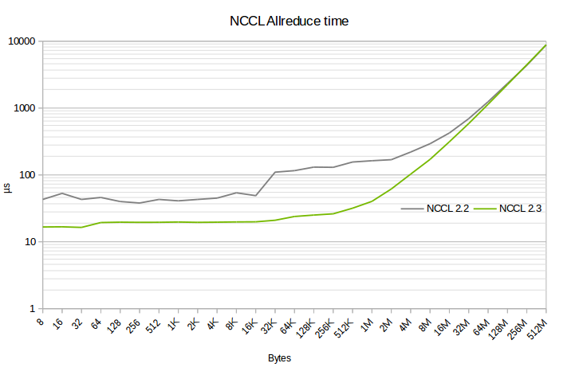

# Direct algorithms (canceled)

<h2>Requirements</h2>

 
### Project Context and Purpose

NCCL provides fast inter-GPU communication for parallel applications.

### NVbugs / Jira Tickets

[Jira NCCL-465](https://jirasw.nvidia.com/browse/NCCL-465)

### User Experience

NCCL is used through deep learning frameworks or other HPC applications
to accelerate GPU-to-GPU communication. It is supposed to be transparent
to the user.

### Assumptions, constraints and dependencies

None

### Use Cases

Accelerate allreduce operations on DGX2 (for faster deep learning
training).

### Functional Requirements

No change.

### System Requirements

DGX2 intra-node only.

### Interface Requirements

No change.

### KPI Requirements

Provide 5x the performance on DGX2 at 16 GPUs for small/medium sizes
(32k-512k), that advantage decreasing progressively as size increases,
but no less than 0.95x (no more than 5% performance degradation for very
large sizes).

This performance improvement is illustrated by the comparison below.

Multi-node communication performance should remain the same as before.

### Platform Requirements

DGX2.

### Security Requirements

NCCL is a user library and benefits from the user-mode security.

### Legal and Standards Requirements

N/A

### Telemetry Requirements

N/A

### Backward Compatibility Requirements

Changes do not need to be backward compatible.

### Virtualization Requirements

N/A

### Signoff list

Author : Sylvain Jeaugey

 

<h2>Design</h2>

 
### Proposed Design

#### Overview

We add a new set of so-called "Direct" algorithms which do not use rings
and have better latency, but only work when we have direct all-to-all
access between all GPUs in the NCCL communicator, i.e. on DGX2
intra-node.

Those algorithms might only be enabled on 8 or 16 GPUs ; performance at
4 or 2 GPUs might be better with rings.

Inter-node still uses rings.

#### Detailed design

We define a new set of CUDA kernels and functions. As we used to have a
single array for kernels and functions, we duplicate them to have a set
for ring algorithms and another one for direct algorithms.

During ncclCommInit functions, if we detect that all GPUs are connected
through the P2P transport, through NVswitch, and we have more than 8
GPUs, we set the algorithm table to point to the direct algorithms
instead of the default ring algorithms.

Whether we'll enable direct algorithms for NVLink connected GPUs or on
less than 8 GPUs is still to be determined and will depend on the
observed performance.

Whether we will need to keep both sets of algorithms and use rings or
direct based on the size is still to be determined and will depend on
the performance we can achieve with direct algorithms at large sizes.

### Interface Architecture

A new environment variable should be added to disable the usage of
direct algorithms.

If we use both direct and rings depending on the size, an enviromnent
variable should control the size at which we switch from one algorithm
to another.

### System KPIs & Metrics

### Data Architecture

N/A

### Security Design

N/A

### Debugging & Troubleshooting

None.

### Logging and Instrumentation

None.

### Operational Considerations

None.

### Signoff list

Author : Sylvain Jeaugey

 

<h2>Coding</h2>

 

- nccl@18ce724bf51c3e480ce2da4e251c80b3176b38ef
- nccl@0818f0763985ab4d0c112eea574dd82aba304b20
- nccl@a51c4b00ad87fe58500995d3b2b978175d730ff1
- nccl@5ddc91f94dc57aa3090fea31146cdd38ec27eaea
- nccl@bdc33e951b8c78ea7e58238005954d5ba48ee5af
- nccl@b34166bd8bc223362f255f32ffa6a2ea0cd35c36
- nccl@1a24591731079cddfd31470fc507d1625067f635
- nccl@95a3c01eee016952e73169f04db70506b0ee660e
- nccl@da9057ac3ba4e06dcc8bb3f000dbd5d861629f0c
- nccl@99ecc8379383a2a3acf2749da7d7fee0dcec4c84
- nccl@bd25e25c0c5045fff71606a661a4466fd75abcc2
- nccl@0d5253158c13cae7fc73574dd217ec80d11ffc3a
- nccl@f6761c446ec38204be4affd96663dd4d2b69d2f7

 

<h2>Testing</h2>

 
### Objectives and Timeline

#### Code Coverage Goal Defined

None.

#### KPI Coverage Goals Defined (performance, stress, stability, throughput, latency)

Performance on 16 GPUs on DGX2 should be 5x better on medium sizes
(32K-512K) compared to NCCL 2.2 then the difference should decrease
progressively down to no less than 0.95x.

That only concerns the allReduce, reduceScatter and allGather operations
on 16 GPUs.

Other cases should not be worse than 0.95 the performance of NCCL 2.2

#### Requirement Coverage Goal Defined

#### Quality Thresholds Defined

No error.

#### Test Timeline

Usual NCCL tests.

#### SW Verification and Test Plan

Usual NCCL tests.

### Test plan

#### Requirements Tests

Usual NCCL tests.

#### Interface Tests

No change.

#### Fault-injection Tests

None.

#### Resource Usage Tests

None.

#### Design Coverage Testing

None.

#### Boundary Tests

None.

#### Certification Tests

None.

#### Stress Tests

None.

#### Stability Tests

None.

#### Perf and Power KPI Tests

None.

#### Usability & OOBE Tests

None.

#### Manufacturing Diagnostic(Factory) Tests

None.

### Signoff list

Author : Sylvain Jeaugey

 
