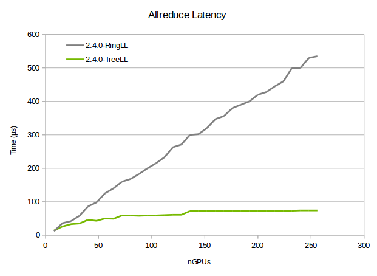
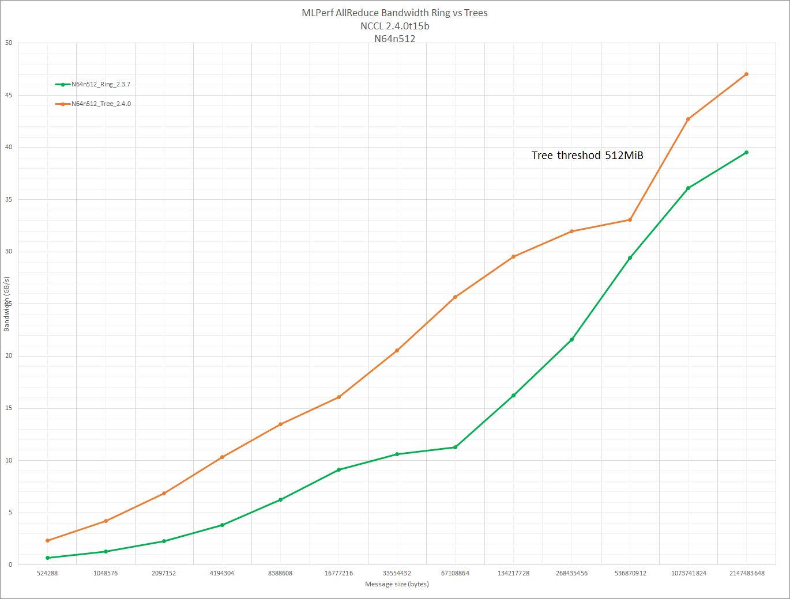

# Tree algorithms

<h2>Requirements</h2>

 
### Project Context and Purpose

NCCL provides fast inter-GPU communication for parallel applications.

### NVbugs / Jira Tickets

[Jira NCCL-660](https://jirasw.nvidia.com/browse/NCCL-660)

### User Experience

NCCL is used through deep learning frameworks or other HPC applications
to accelerate GPU-to-GPU communication. It is supposed to be transparent
to the user.

### Assumptions, constraints and dependencies

None

### Use Cases

Customers are now building large clusters of GPUs, well above the
initial target for NCCL of 256.

Among the most important ones are :

- Summit, with 24,000 GPUs
- AIST, with 4,352 GPUs
- Our internal clusters

### Functional Requirements

No new functional requirement.

### System Requirements

Large clusters featuring at least hundreds of GPUs.

### Interface Requirements

No new API.

### KPI Requirements

NCCL was traditionally using rings, which provide good bandwidth but
poor latency at scale, as the latency is linear with the number of
ranks.

The goal is to still get full bandwidth but at smaller scale, and a
latency scaling with the log of the number of ranks.

### Platform Requirements

N/A

### Security Requirements

NCCL is a user library and benefits from the user-mode security.

### Legal and Standards Requirements

N/A

### Telemetry Requirements

N/A

### Backward Compatibility Requirements

Changes do not need to be backward compatible.

### Virtualization Requirements

N/A

### Signoff list

Author : Sylvain Jeaugey

 

<h2>Design</h2>

 
### Proposed Design

#### Trees

##### Principle, (double) binary trees

We implement binary trees instead of rings to achieve log latency.
Binary trees have half bandwidth, meaning they can only achieve half of
the peak bandwidth.

On PCI architectures, trees cannot achieve full bandwidth since the PCI
bus is used both for receiving data from the internal ring and for
receiving data from the network. Because of that limitation, trees are
only use to improve latency, using a single binary tree.

On NVLink architectures, since internal communication uses NVLink, we
can get full bandwidth. We therefore use double binary trees in that
case.

Double binary trees are a technique combining two binary trees, where
the leaves of one tree is the nodes of the other and vice-versa.

Below is an illustration with 12/13 ranks, from the source code.

     Build a double binary tree. Take the previous tree for the first tree.
     For the second tree, we use a mirror tree (if nranks is odd)

                     8---------0---------5
              ______/ \______      _____/ \______
             4               12   1              9
           /   \            /      \           /   \
         2       6       10          3       7      10
        / \     / \     /  \        / \     / \    /  \
       1   3   5   7   9   11      2   4   6   8  11  12

     or shift it by one rank (if nranks is even)

                     8---------0--------------9
              ______/ \                ______/ \
             4         \              5         \
           /   \        \           /   \        \
         2       6       10       3       7       11
        / \     / \     /  \     / \     / \     /  \
       1   3   5   7   9   11   2   4   6   8   10   1

##### Tree creation

We reuse the ring creation system to benefit from the topology
detection. During the network ring creation phase, we store the GPUs
where data enters the node. Those GPUs are supposed to be close to NICs.

We designate those GPUs as performing the tree inter-node reduction.

Other GPUs still form a chain inside the node, to continue to use
NVLinks and get full bandwidth inside the node. The intra-node chain is
following the rings as well, and connects to the network-head GPU.

If we consider the global (intra+inter node) tree, it is in fact a
ternary tree since network-head ranks may receive from up to 2 ranks
from the network, plus one rank from the node. PCI configuration are
therefore limited to 2/3 of the peak bandwidth, while NVLink systems can
get full bandwidth since the intra-node data flow (using NVLink) is
independent from the inter-node flow (using PCI).

Contrary to rings which always flow in the same direction, trees use the
same structure both for reductions (going up the tree) and broadcasts
(going down the tree). That means we connect ranks in both directions
and the same GPU communicates with the network card in both directions.

##### The special case of 2 nodes

In the special case of two nodes with NVLink, using trees can actually
outperform rings by a factor two.

An allreduce operations on G GPUs consists in 2×(G-1) operations, which
also means 2×(G-1) transfers between GPUs. Rings balance those
operations evenly on the links, so that 2×1/G of the data will not be
transfered between GPU A and GPU (A+1)%G. Therefore, all links see
2×(G-1)/G of the total data.

With a tree featuring 2 nodes, and because we build them along then node
topology, data is balanced unevenly, using intra-node more and
inter-node less. All intra-node links see 2 time the total data instead
of 2×(G-1)/G, while data transfered between the nodes is only 1 (in one
direction) and 1 (in the other direction).

On NVLink systems where intra-node speed is faster than inter-node
speed, we can easily absorb the extra 1/G of data. We currently see 60
GB/s instead of 40 GB/s on two DGX1, which we assume is due to some
other bottleneck (we should be able to achieve 80 GB/s).

On PCI systems, the same technique would decrease the bandwidth by 1/G
since PCI would be the bottleneck, on top of being used both for intra-
and inter- node communication. It could be useful however for slow
network, although only interesting with 2 nodes.

##### Bandwidth limitation

Because we send and receive from the same GPU, GPU Direct RDMA can only
achieve 10.8 GB/s in both directions (compared to 11.8 GB/s when
sending/receiving from different GPUs). Therefore, trees are slightly
slower than rings for large enough sizes. On a DGX-1, we see a maximum
speed of 42 GB/s for trees versus 47 GB/s for rings.

Additionally, as we scale to larger number of nodes and use top-of-rack
Infiniband switches, performance drops further with trees. This is
likely because trees feature more flows between leaf switches (up to 6
flows instead of 2 per NIC) which can cause static routing aliasing on
Infiniband, i.e. having two of those 4x6 flows being routed on the same
link.

Finally, our work on trees has revealed that we could achieve 47GB/s on
rings, compared to 42GB/s on previous versions.

For all these reasons, we switch back to rings for large enough sizes.

#### Kernel code

Kernels have been rewritten to permit arbitrary numbers of sources and
destinations. Rings only use one source and one destination. The code is
specifically optimized for that case where no loop should happen and the
0-or-1 cases should be unrolled.

LL and non-LL primitives have been merged as much as possible (although
they are still different classes) and now manage all head/tail index
management.

Each peer has now independent head/tail indexes which are no longer
reset to 0 at the end of a collective but continuously get incremented.

Collective operations can therefore only call send() or recv() which
simplifies greatly the collective code.

#### Connections

Since communication with each peer is now independent, connections can
be established at any time and the communicator has a full array of peer
connections, although most of them are not established unless needed.

#### Network proxy threads

Binary trees need to receive from two sources and send to two
destinations. The former design caused a significant increase in CPU
usage since it meant multiplying the number of proxies. All network
proxies have therefore been merged and a single proxy thread performs
all network communication for a given rank/communicator.

Because of that, network calls have to be non-blocking to permit fluid
progression of all communication with different peers. It also improves
overall performance since there is no noise due to thread scheduling.

### Interface Architecture

No new API.

### System KPIs & Metrics

Latency is now increasing as a log of the number of nodes.

Bandwidth is much higher for small-medium sizes, especially for large
number of GPUs.

### Data Architecture

N/A

### Security Design

N/A

### Debugging & Troubleshooting

None.

### Logging and Instrumentation

None.

### Operational Considerations

None.

### Signoff list

Author : Sylvain Jeaugey

 

<h2>Coding</h2>

 

 

<h2>Testing</h2>

 
### Objectives and Timeline

#### Code Coverage Goal Defined

None.

#### KPI Coverage Goals Defined (performance, stress, stability, throughput, latency)

Latency and bandwidth should be better for 16+ GPUs. Other performance
should be unchanged.

#### Requirement Coverage Goal Defined

No change.

#### Quality Thresholds Defined

No error.

#### Test Timeline

12/24/18 : 2.4.0 availability

1/4/18 : QA complete

1/22/18 : Release

#### SW Verification and Test Plan

No change.

### Test plan

#### Requirements Tests

No change.

#### Interface Tests

No change.

#### Fault-injection Tests

None.

#### Resource Usage Tests

None.

#### Design Coverage Testing

None.

#### Boundary Tests

None.

#### Certification Tests

None.

#### Stress Tests

None.

#### Stability Tests

None.

#### Perf and Power KPI Tests

None.

#### Usability & OOBE Tests

None.

#### Manufacturing Diagnostic(Factory) Tests

None.

### Signoff list

Author : Sylvain Jeaugey

 
