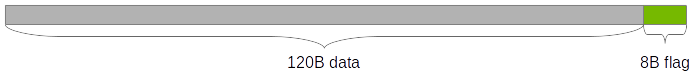
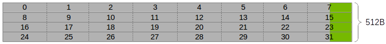
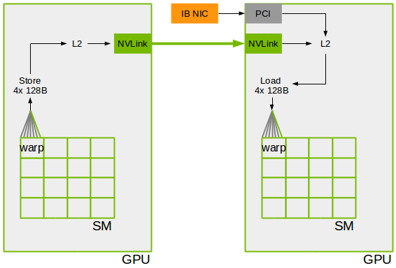

# LL128

<h2>Requirements</h2>

 
### Project Context and Purpose

NCCL provides fast inter-GPU communication for parallel applications.

### NVbugs / Jira Tickets

[NVBug 2512165](http://nvbugs.nvidia.com/2512165)

[Jira NCCL-804](https://jirasw.nvidia.com/browse/NCCL-804)

### User Experience

NCCL is used through deep learning frameworks or other HPC applications
to accelerate GPU-to-GPU communication. It is supposed to be transparent
to the user.

### Assumptions, constraints and dependencies

None

### Use Cases

DL training on large number of GPUs.

### Functional Requirements

None

### System Requirements

None

### Interface Requirements

No new API.

### KPI Requirements

Improved performance on large numbers of GPUs for medium sizes.

### Platform Requirements

N/A

### Security Requirements

NCCL is a user library and benefits from the user-mode security.

### Legal and Standards Requirements

N/A

### Telemetry Requirements

N/A

### Backward Compatibility Requirements

Changes do not need to be backward compatible.

### Virtualization Requirements

N/A

### Signoff list

Author : Sylvain Jeaugey

 

<h2>Design</h2>

 
### Proposed Design

#### Overview

To communicate between GPUs, NCCL implements CUDA code running on GPU
SMs.

The new protocol for inter-SM communication, LL128, uses the same
technique as the current LL protocol, but assuming atomicity on 128B
lines instead of 8B.

Bundling a flag together with the data removes the need to fence memory
operations and set a separate flag, improving latency at the expense of
some bandwidth used to write flags.

#### General communication

When writing data to a remote buffer, each CUDA warp writes at least 120
bytes of data and 8 bytes of flag, which should be aggregated as a
single 128B store.

This store is observed by the receiver which will consider data is valid
whenever the last 8 bytes have the correct value as flag.

For efficiency reasons, each thread writes 16B of data, hence a warp of
32 threads will write 512B in total, i.e. 4 lines of 128B.

Each warp is polling on different 128B lines, and progress
independently. Because of this polling by all CUDA threads, LL128 is to
be only enabled when the buffer is in GPU memory, i.e. when we receive
data through GPU Direct P2P or GPU Direct RDMA.

Sending data is implemented with 16B stores using the following inline
assembly :

    inline __device__ void store128(uint64_t* ptr, uint64_t v0, uint64_t v1) {
      asm volatile("st.volatile.global.v2.u64 [%2], {%0,%1};"
          :: "l"(v0), "l"(v1), "l"(ptr));
    }

The store128 function is always called by all the threads of a warp on
contiguous and 128B-aligned data, using this code (flagThread is true
only for threads 7, 15, 23 and 31) :

    #pragma unroll
    for (int u=0; u<ELEMS_PER_THREAD; u+=2) {
      store128(ptr+u*WARP_SIZE, v[u], flagThread ? flag : v[u+1]);
    }

Receiving data is using similar 16B reads :

    inline __device__ void load128(const uint64_t* ptr, uint64_t &v0, uint64_t &v1) {
      asm volatile("ld.volatile.global.v2.u64 {%0,%1}, [%2];"
          : "=l"(v0), "=l"(v1) : "l"(ptr));
    }

Loads are used twice. The first time, we only load data in L1 cache and
check flags, the second time we re-read data and process it (through
MULTI).

    do {
      needReload = false;
      #pragma unroll
      for (int u=0; u<ELEMS_PER_THREAD; u+=2) {
        load128(ptr+u*WARP_SIZE, v0, v1);
        needReload |= flagThread && (v1 != flag);
      }
    } while (__any_sync(WARP_MASK, needReload) && checkAbort(0, 0) == 0);
    #pragma unroll
    for (int u=0; u<ELEMS_PER_THREAD; u+=2) {
      load128(ptr+u*WARP_SIZE, v0, v1);
      v[u] = SRC ? MULTI<FUNC, T>()(v0, v[u]) : v0;
      v[u+1] = SRC ? MULTI<FUNC, T>()(v1, v[u+1]) : v1;
    }

#### Network communication

On the sender side, we copy the data to a local buffer which we fence
with threadfence() (MEMBAR.GL), then initiate an IB transfer from that
GPU memory to the destination GPU memory. It is not very different from
the *Simple* protocol aside from the fence being only local i.e. not
having the system scope.

On the receiver side, we receive directly to GPU memory and the GPU
polls immediately on data, making the protocol similar to the *LL*
protocol. This also avoids the large overhead we have with the *Simple*
protocol on the receiver side, where the path is :

1.  NIC sends IB completion to the CPU
2.  CPU flushes writes from NIC to GPU using a read to GPU through IB
    loopback
3.  CPU sets a flag in system memory on which one thread from the GPU is
    polling
4.  GPU threads synchronize

The receiving GPU does not know it is receiving from the network; it is
polling on its local memory.

#### Limitations, risks, and scope

##### 128B atomicity

This protocol relies on 128B stores not being observed in a reverse
order by the next GPU. This needs to work all the way from one GPU to
another :

1.  SMs must consistently aggregate aligned, contiguous stores at the SM
    level into 128B stores.
2.  Stores in transit through NVLink must not be broken down.
3.  SMs receiving data need to observe stores to their local memory in
    order. We do not rely on aggregation in this phase, i.e. we first
    observe the flag, then read the data.

The first release of NCCL 2.5 intends to enable LL128 on :

- Volta+NVLink for intra-node communication.
- Mellanox CX-5 (and later) + PCI switch for inter-node communication.

On the network side, there is no risk on the sender side since we use a
memory fence. On the receiver side however, we need to ensure PCI stores
from the NIC to the GPU do not get split and reordered.

In all cases, the intermediate buffer is located in GPU memory on the
receiver side. We therefore always consider in the LL128 atomicity
problem that stores are remote and reads are local.

*Notes*

GPUs prior to Volta have issues with step 3 where changes were not
always observed in the right order when doing a single aggregated read,
even on local data. Reading the data after reading the flag (instead of
reading all data as a single aggregated load) seems to get rid of the
problem. This behavior was never observed on Volta, so we might be able
to improve performance a bit by leveraging aggregation also on loads.

PCI transfers are known to be split by Intel CPUs into two 64B TLPs but
message reordering has never been observed. Some PCI configuration might
affect that functionality however, for example relaxed ordering.

##### Network memory fence

Unrelated to the 128B atomicity issue, the network send is using
MEMBAR.GL instead of MEMBAR.SYS. This has the effect of flushing data up
to L2 cache, which, on current GPUs, guarantees that further reads from
PCI will see the correct data. The CUDA model however, defines
target-scope synchronization; since the reader is the NIC, it is outside
the GPU, and therefore MEMBAR.SYS should be used.

### Interface Architecture

Not applicable since the API is unchanged.

### System KPIs & Metrics

LL128 gets 95% of the peak bandwidth (compared to 50% with LL) with only
2x the latency of LL (or 3x faster than Simple).

### Signoff list

Author: Sylvain Jeaugey

Reviewer : NCCL Team /

Reviewer : NCCL Team /

Reviewer : GPU Arch /

Reviewer : GPU Design /

Reviewer : Compiler Arch /

Reviewer : System Arch /

 

<h2>Coding</h2>

 

- nccl@3934bb7b0556d37b5a6ce34bdda02f7647e495df
- nccl@6f1fbfa63d7b59e01b5cf272b62520e72b0d4462
- nccl@03d3e622f887dbe9531a3e581fab0fd3070024a2
- nccl@be945f6e4347f6dec48859fe147ec7a14fbb026d
- nccl@b7800adbdd6a7dad6b2e4ee1caa6dc15bc0475ec
- nccl@758252b098041615fe361556f6e75924d63d6f25
- nccl@0d7482fd1b9a876911675fda6f9c546c9e9ec8b4
- nccl@2d0ee48e5217e381dffac4e6c5a00ebc80c21b66
- nccl@c3f35ce4f087e582725693411728a5ece63282bc
- nccl@a62b4dbbfbc5409099bcdc27027a455e00a7bef6
- nccl@fe86154447577a6b1bb9fb24f6e8b85f95a23bcf
- nccl@b8bbb8803c94d1011c5df85f1e69948cec15fd5b
- nccl@c12617f2a16f6b969030c225b827189e8ac69055
- nccl@d04a62c6b279166d65648d9f2e8be1fa443ee250
- nccl@b3139729e1748f6102e3408f815baa3ef7ba1945
- nccl@e7476ad5080942cd032149dfd4a8a62d678d359a

 

<h2>Testing</h2>

 
### Objectives and Timeline

#### Code Coverage Goal Defined

None.

#### KPI Coverage Goals Defined (performance, stress, stability, throughput, latency)

Micro benchmarks and DL framework performance to be better or equal.

#### Requirement Coverage Goal Defined

LL128 is only enabled on DGX systems.

#### Quality Thresholds Defined

No error.

#### Test Timeline

Timeline tied to NCCL 2.5 schedule.

#### SW Verification and Test Plan

Since this feature only affects performance of existing operations, plan
is unchanged from normal testing.

### Test plan

Part of NCCL 2.5 normal testing.

#### Requirements Tests

None.

#### Interface Tests

No new interface.

#### Fault-injection Tests

None.

#### Resource Usage Tests

None.

#### Design Coverage Testing

None.

#### Boundary Tests

None.

#### Certification Tests

None.

#### Stress Tests

DL frameworks testing.

#### Stability Tests

None.

#### Perf and Power KPI Tests

None.

#### Usability & OOBE Tests

None.

#### Manufacturing Diagnostic(Factory) Tests

None.

### Signoff list

Author : Sylvain Jeaugey

 
