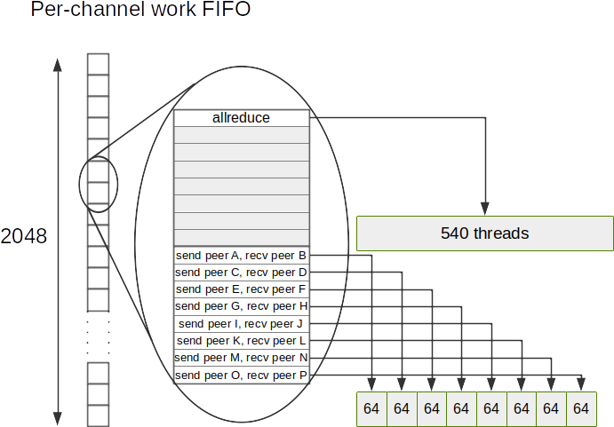

# Channel split for point-to-point communication

<h2>Requirements</h2>

 
### Project Context and Purpose

NCCL provides fast inter-GPU communication for parallel applications.

### NVbugs / Jira Tickets

Facebook request, no nvbug tracking.

[Jira NCCL-948](https://jirasw.nvidia.com/browse/NCCL-948)

### User Experience

NCCL is used through deep learning frameworks or other HPC applications
to accelerate GPU-to-GPU communication. It is supposed to be transparent
to the user.

### Assumptions, constraints and dependencies

None.

### Use Cases

Large scale all-to-all operations.

### Functional Requirements

None.

### System Requirements

Performance of all-to-all at scale should match the current state of the
art, i.e. MPI.

### Interface Requirements

None.

### KPI Requirements

All-to-all latency at 64 GPUs should come close to MPI latency, i.e.
decrease from 1000+us to less than 400us. Bandwidth at 64 GPUs should be
close to SOL (24 GB/s) instead of 16 GB/s with NCCL 2.7.

### Platform Requirements

N/A

### Security Requirements

NCCL is a user library and benefits from the user-mode security.

### Legal and Standards Requirements

N/A

### Telemetry Requirements

N/A

### Backward Compatibility Requirements

Changes do not need to be backward compatible.

### Virtualization Requirements

N/A

### Signoff list

Author : Sylvain Jeaugey

 

<h2>Design</h2>

 
### Proposed Design

The high alltoall latency comes from the serialization of operations.
NCCL 2.7 can only process concurrently as many operations as there are
channels, i.e. 16 on a DGX A100 or 32 on a DGX-2.

To improve this number of operations per second, we subdivide each
channel into up to 8 groups each doing a different send/receive
operation for a different peer. Each group is then divided into 2
sub-groups, one doing the send and one doing the receive operation.

During the scheduling, we first load balance the operations onto
different channels, then as we run out of channels, we try to pack up to
8 operations per block. When all 8 operations are used, we move to a
different work block on the channel.

In practice, depending on the number of peers we need to communicate
with, we can end up with different configurations :

| Operations | Receive threads | Send threads    | Total threads per channel |
|------------|-----------------|-----------------|---------------------------|
| 1          | 256             | 256 + 32 (sync) | (256+256+32)x1=**540**    |
| 2          | 128             | 128 + 32 (sync) | (128+128+32)x2=**576**    |
| 3,4        | 64              | 64 + 32 (sync)  | (64+64+32)x4=**640**      |
| 5,6,7,8    | 32              | 32              | (32+32)x8=**512**         |

The work queue has been reworked, and each element is now a group of 8
operations, hence is 8 times larger. Collective operations only use the
first operation however, so their size didn't change. We still inline
the first operation as argument of the CUDA kernel, but not the whole
group of 8 since it was causing latency regressions.

Since work FIFOs have 2048 work slots, they may now use up to 32
channels x 2048 x 8 x 64B = 32MB of CPU memory.

### Interface Architecture

No change.

### System KPIs & Metrics

Performance is now on par with MPI on DGX A100 at 64 GPUs both with
respect to latency and bandwidth.

### Data Architecture

N/A

### Security Design

N/A

### Debugging & Troubleshooting

None.

### Logging and Instrumentation

None.

### Operational Considerations

None.

### Signoff list

Author : Sylvain Jeaugey

 

<h2>Coding</h2>

 

- nccl@e8c2c70152ab182f5c77e013c79d2608bc987e8c
- nccl@99ec5f1ea3426e46190398c5c3f7cb5636144b84
- nccl@8c117132538c029f32b1c1e0f29624366d4ba0a9
- nccl@cb2896ccc4b65622b5c3afb58af916a7f3b55ece
- nccl@abcd43da9b00292d56c79f54b82e091fbaeed02d
- nccl@9db06d7431ae52073106a994da36dd6fdfe69587
- nccl@5b0fd9109ef6955faa5479f25748febdbe04f8f4
- nccl@fa32a60b1dae8596c71365d5a3e0d929f4987c4c
- nccl@f0c718b0e768611dc74734503b4399da5eae2853
- nccl@b4512ec21fa9bc28a874e7868d9cde3f21ebdab8
- nccl@8c0bbe05a506a41e849a649b11259f694d7153c0
- nccl@abbcb0e652093d93cf6e73fdb6c5673b811f985a
- nccl@478039a1c70be76d22e1d0b6e520386b0099d767
- nccl@dc1f95400b5eaa183024282796f41cc4a631cb70
- nccl@cf16affec6bfdbd06ba17eb8c4ea3f8d961de95a
- nccl@929354ea084d0dc87199740c5dbd553c51841105
- nccl@8a8806efd38ad6a9f1297d47cf6b4f9dade672a7
- nccl@23d09f86f558be43eada9d6fbb52ed22809b5741
- nccl@928a3206b14ce5c28e4c76f2fa05b90939609d1d
- nccl@8bdb9bb46123a1386c8a0f6220dbb5cd99fa8624
- nccl@80af06ba9083b45fa1f3a5c354cf5bdf1055c08f
- nccl@524f7ae2d749e6c7848f71d33d65dcf144bc2960
- nccl@acb0555ac32e8902856cfe2c2b96662e5bd09de2
- nccl@a2d126aadc3f548afee431f0ca9d5b3f1a571b7a
- nccl@43550d975ce70092a924ab6eb0c1b34e862f9cfc
- nccl@a1d4a000bfdda809ee76bc52e5c8bf850d3d4a32
- nccl@8dc40330dbbb14e7d36886c9bbc1c2dace67989e
- nccl@80b29b8ae259c77880602a2f090ef300c250ee66
- nccl@b770b3e3a3ef86d7d8b8dd7f41b9e117bd627c41

 

<h2>Testing</h2>

 
### Objectives and Timeline

#### Code Coverage Goal Defined

None.

#### KPI Coverage Goals Defined (performance, stress, stability, throughput, latency)

No change.

#### Requirement Coverage Goal Defined

No change.

#### Quality Thresholds Defined

No error.

#### Test Timeline

Part of NCCL 2.8 QA.

#### SW Verification and Test Plan

Part of NCCL 2.8 QA.

### Test plan

NCCL 2.8 test plan.

#### Requirements Tests

No new test.

#### Interface Tests

No new interface.

#### Fault-injection Tests

None.

#### Resource Usage Tests

None.

#### Design Coverage Testing

None.

#### Boundary Tests

None.

#### Certification Tests

None.

#### Stress Tests

None.

#### Stability Tests

None.

#### Perf and Power KPI Tests

None.

#### Usability & OOBE Tests

None.

#### Manufacturing Diagnostic(Factory) Tests

None.

### Signoff list

Author : Sylvain Jeaugey

 
