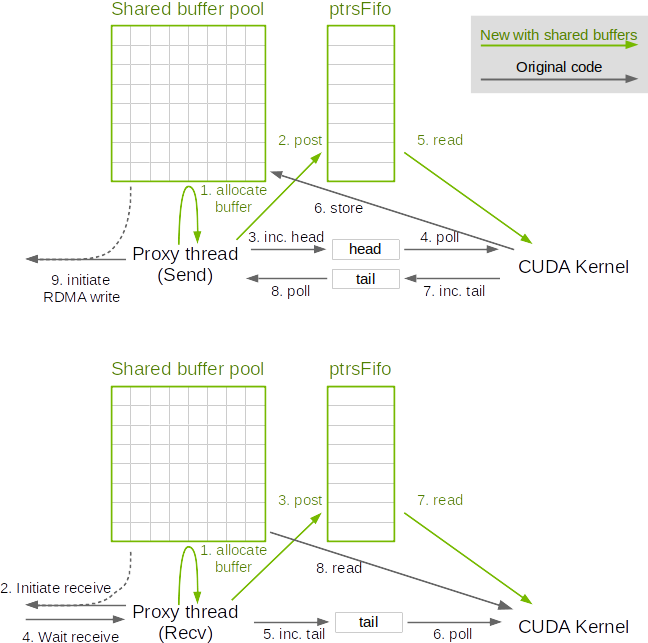

# Shared buffers for network communication

<h2>Requirements</h2>

 
### Project Context and Purpose

NCCL provides fast inter-GPU communication for parallel applications.

### NVbugs / Jira Tickets

[NVBug 12345](http://nvbugs.nvidia.com/12345)

[Jira NCCL-12345](https://jirasw.nvidia.com/browse/NCCL-12345)

### User Experience

NCCL is used through deep learning frameworks or other HPC applications
to accelerate GPU-to-GPU communication. It is supposed to be transparent
to the user.

### Assumptions, constraints and dependencies

None.

### Use Cases

As we scale, NCCL allocates a distinct 4MB FIFO for each peer it needs
to communicate with. This can become a problem for alltoall on 64-1024
GPUs (or more).

### Functional Requirements

None.

### System Requirements

GPU Memory usage needs to be capped as we scale.

### Interface Requirements

None.

### KPI Requirements

None.

### Platform Requirements

N/A

### Security Requirements

NCCL is a user library and benefits from the user-mode security.

### Legal and Standards Requirements

N/A

### Telemetry Requirements

N/A

### Backward Compatibility Requirements

Changes do not need to be backward compatible.

### Virtualization Requirements

N/A

### Signoff list

 

<h2>Design</h2>

 
### Proposed Design

As we scale, we will have more peers than we can process in parallel.
Therefore we will not use all buffers concurrently. For peers which we
communicate to and which we didn't allocate a FIFO for collective
operations (e.g. allreduce), we do not allocate additional memory, but
instead allocate a pool of network buffers.

This is only true for network communication; we still allocate buffers
normally for intra-node communication.

When a communication operation occurs, the CPU proxy thread will
allocate a buffer from the pool, and pass it to the CUDA kernel through
a new "ptrsFifo".

When sending data, the sender proxy will start with a negative head
(=credit) so that the GPU will have to wait until the proxy thread
allocates data, writes the pointer to the fifo, then increases the head
(returns one credit) to unblock the GPU.

On the receiving side, the receiving proxy will write allocate a buffer,
receive data into it, and write that pointer to the fifo before
increasing the tail.

Note this is adding an extra step in the protocol, meaning GPUs cannot
start sending right away as they need to wait for the send proxy to
provide a buffer. However, performance degradation was never observed
when using shared buffers, which tends to indicate that by the time the
CUDA kernel starts, proxy threads had enough time to post buffers. Also
reading the pointer from sysmem could cause a latency increase. This is
only for the Simple protocol however which already has a significant
latency.

### Interface Architecture

Connection have a new ptrsFifo field which CUDA kernels may use in
send/receive operations.

### System KPIs & Metrics

Memory is now allocated only once and using a constant size.

### Data Architecture

N/A

### Security Design

N/A

### Debugging & Troubleshooting

None.

### Logging and Instrumentation

None.

### Operational Considerations

None.

### Signoff list

Author : Sylvain Jeaugey

 

<h2>Coding</h2>

 

- nccl@34d415f426484e7cd876a0e4eb365cf247bb9aff
- nccl@2c1b576ad1d8d168b4245c258bde08a99154f712
- nccl@812969098c464c1422ef359a44b0d6ecdf1ff2c2
- nccl@6116a7ee169f1ff3d1f191732fe4662918afef34
- nccl@fee93c1dd535f646ad5db41709758d61c6627968
- nccl@405fa0ca99caf41bc49cfa8828a44d883510c1de
- nccl@60d1154bc7798b4fa35e75237b3affddb176b086

 

<h2>Testing</h2>

 
### Objectives and Timeline

#### Code Coverage Goal Defined

None.

#### KPI Coverage Goals Defined (performance, stress, stability, throughput, latency)

No change.

#### Requirement Coverage Goal Defined

No change.

#### Quality Thresholds Defined

No error.

#### Test Timeline

Part of NCCL 2.8 QA.

#### SW Verification and Test Plan

Part of NCCL 2.8 QA

### Test plan

NCCL 2.8 Test plan.

#### Requirements Tests

TBD

#### Interface Tests

TBD

#### Fault-injection Tests

None.

#### Resource Usage Tests

None.

#### Design Coverage Testing

None.

#### Boundary Tests

None.

#### Certification Tests

None.

#### Stress Tests

None.

#### Stability Tests

None.

#### Perf and Power KPI Tests

None.

#### Usability & OOBE Tests

None.

#### Manufacturing Diagnostic(Factory) Tests

None.

### Signoff list

Author : Sylvain Jeaugey

 
