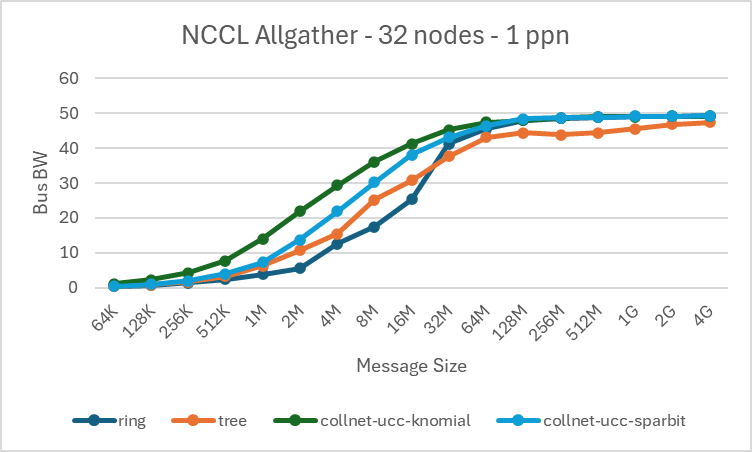

# dynamically query collnet limits
<!-- use this template to share the details of your feature. Non-commented sections are strongly encouraged -->

## Abstract

NCCL Plugin API changes and core changes to dynamically query and use message size limits
of Net and CollNet plugins.

<!-- here detail what the feature is about. A few sentence that can be copy-pasted to external actors -->

<!-- ============================================================================================-->

<h2>Motivation and requirements</h2>

<!-- ============================================================================================-->
 
### NVbugs / Jira Tickets

https://nvbugspro.nvidia.com/bug/4713708
https://nvbugspro.nvidia.com/bug/4454419

### User Experience

Up and until 2.23, NCCL automatically limited the size of data handled by a
single call to the collnet plugin to 512MB. This was to work around a limitation
in older versions of LibSHARP that could handle collectives only upto that limit.

The feature captured in this PLC allows NCCL to dynamically query the largest buffer
size the network plugin can handle in a single operation. It uses this information to
offload the full collective operation to the plugin in a single API call where possible.

### Assumptions, constraints and dependencies

This capability is only relevant when user buffer registration is used. Pre-registration
of buffers is required for NCCL to avoid pipelining copies and issue the full collective as a
single call to the Collnet Plugin. Collnet plugin cannot do these copies or register
buffers on-demand due to concerns of deadlock and memory leaks.

### Use Cases

Offloading a full allgather as a single collnet API call allows the plugin to implement
the collective efficiently over the network using a broader set of algorithms. This provides
a noticeable performance boost for data parallel collectives found in LLM workloads while
reducing the number of SMs used to one (only used for control).

### Platform Requirements

<!-- ### Functional Requirements -->
<!-- ### System Requirements -->
<!-- ### Interface Requirements -->
<!-- ### KPI Requirements -->
<!-- ### Security Requirements -->
<!-- ### Legal and Standards Requirements -->
<!-- ### Telemetry Requirements -->
<!-- ### Backward Compatibility Requirements -->
<!-- ### Virtualization Requirements -->

 
<!-- ============================================================================================-->

<h2>Design</h2>

<!-- ============================================================================================-->

The change adds two new plugin properties: maxP2pBytes and maxCollBytes. It
also defines a constant NCCL\_MAX\_NET\_SIZE\_BYTES that declares the max
size that NCCL core can support. Operation splitting logic in NCCL core takes
the dynamically queried max bytes into account instead of predefined
constants.
 
### Proposed Design

### Interface Architecture

<!-- ### System KPIs & Metrics -->
<!-- ### Data Architecture -->
<!-- ### Security Design -->
<!-- ### Debugging & Troubleshooting -->
<!-- ### Logging and Instrumentation -->
<!-- ### Operational Considerations -->

 
<!-- ============================================================================================-->

<h2>Coding</h2>

<!-- ============================================================================================-->

https://gitlab-master.nvidia.com/nccl/nccl/-/merge\_requests/586
 

 
<!-- ============================================================================================-->

<h2>Testing and Validation</h2>

<!-- ============================================================================================-->

### Objectives and Timeline

### Validation

#### Where to run?

#### What to run?

#### Expected output?
 
<!-- #### Code Coverage Goal Defined -->
<!-- #### KPI Coverage Goals Defined (performance, stress, stability, throughput, latency) -->
<!-- #### Requirement Coverage Goal Defined -->
<!-- #### Quality Thresholds Defined -->
<!-- #### Test Timeline -->
<!-- #### SW Verification and Test Plan -->
<!-- ### Test plan -->
<!-- #### Requirements Tests -->
<!-- #### Interface Tests -->
<!-- #### Fault-injection Tests -->
<!-- #### Resource Usage Tests -->
<!-- #### Design Coverage Testing -->
<!-- #### Boundary Tests -->
<!-- #### Certification Tests -->
<!-- #### Stress Tests -->
<!-- #### Stability Tests -->
<!-- #### Perf and Power KPI Tests -->
<!-- #### Usability & OOBE Tests -->
<!-- #### Manufacturing Diagnostic(Factory) Tests -->

### Performance

#### What is measured?

#### Results

 
<!-- ============================================================================================-->

<h2>Signoff List</h2>

<!-- ============================================================================================-->

Author(s):
  - Sreeram Potluri

