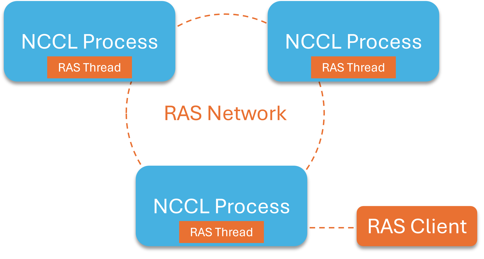

# RAS
<!-- use this template to share the details of your feature. Non-commented sections are strongly encouraged -->

## Abstract
<!-- here detail what the feature is about. A few sentence that can be copy-pasted to external actors -->

The RAS (Reliability, Availability, and Serviceability) subsystem of NCCL is
meant to help users with the diagnosing of applications' crashes and hangs.  At
large scale, identifying the root cause of an application's lack of progress
can be challenging to users not intimately familiar with NCCL's internals.  RAS
is a low-overhead infrastructure that users and developers can query
interactively *[interactive support planned after 2.24]* while the application is running.  It can provide a global view
of the state of the running application and can aide in the detection of
outliers such as unresponsive nodes or individual application processes lagging
behind their peers.  With that information, users can then narrow down on the
suspected root cause(s) through other techniques such as interactive debugging,
system log analysis, etc.

<!-- ============================================================================================-->

<h2>Motivation and requirements</h2>

<!-- ============================================================================================-->

### NVbugs / Jira Tickets

https://nvbugspro.nvidia.com/bug/4641445 [RFE] NCCL RAS - detect disappearing/stuck/slow ranks

### User Experience

### Assumptions, constraints and dependencies

RAS is part of NCCL.  It is always compiled in and is on by default, even in
production, though it can be deactivated at application startup by providing
the `NCCL_RAS_ENABLE=0` environment variable.  When running,
it consists of a set of RAS threads (one per NCCL process) maintaining
connections with one another using an out-of-band network.  Its initialization
and execution overheads, as well as utilization of resources (CPUs, GPUs,
network, memory, etc.) during regular execution need to be minimal so as not to
negatively affect the running application.  Effectively, RAS should be close to
dormant until a user issues a query or until an event of interest takes place.

The interactive RAS client introduces an additional (optional) dependency on
Readline to ensure a comfortable interactive experience meeting end users'
expectations.  This dependency _does not extend_ to NCCL header files and
libraries that the application is compiled/linked with. *[interactive support
planned after 2.24; for now, only one command is supported and the client outputs
the information supplied by NCCL and terminates]*

### Use Cases

The primary identified use cases are:

**Crashes**: an application process abruptly terminates due to a critical error,
or the whole node crashes/becomes unresponsive, affecting potentially multiple
application processes running on it.  RAS should:

* autonomously and in a timely fashion detect processes or other resources
  going offline,

* remain operational, though possibly in a temporarily degraded mode,

* record any potentially relevant information about the event, the state of the
  application, and the system so that during analysis (be it online or
  post-mortem), the origin (the root cause) can be distinguished from any
  subsequent potential cascading failures, *[event logging planned after 2.24]*

* autonomously heal its own out-of-band network, routing around the offline
  resources, to bring itself out of the degraded mode,

* possibly propagate the information about the crash to
  the relevant application processes (i.e., the peers sharing the
  communicator(s) with the crashed process) to facilitate an orderly recovery.
  This capability will be further explored after the basic RAS system has been
  implemented, with the focus on usefulness, reliability, and any potential new
  APIs needed. *[propagation planned after 2.24]*

**Hangs**: a not immediately critical error (be it in the software or hardware)
results in the application threads getting "stuck", indefinitely waiting for
each other, unaware that no forward progress is possible under the
circumstances.  In general, _RAS cannot reliably detect hangs on its own_;
instead, it is dependent on the user initiating an investigation (e.g., when
a lack of application progress is detected through external means, such as
the monitoring of the application output).  RAS should:

* remain fully operational in spite of the application threads being "stuck",

* make it possible for the user to connect to the RAS infrastructure using the
  interactive RAS client,

* provide access to any relevant NCCL state information, communicating between
  the RAS threads as needed to gather the global state of the system,

* reduce by default the amount of data communicated to the user so as not to
  overwhelm them with excessively verbose output,

* in particular, expose the internal state of communicators to help identify
  "stragglers" lagging behind their peers (e.g., a process "stuck" on a previous
  collective operation while all the peers have moved on to the next one),

* possibly provide a mechanism for the user to get the application unstuck.
  It's unclear, however, what RAS could do beyond simply terminating the
  process identified by the user as "stuck" (triggering an application-level
  recovery), which the user could do just as easily themselves using the shell
  `kill` command.  Perhaps in some cases explicitly terminating a communicator
  could get a process unstuck without killing it; this is something that should
  be further explored after the basic RAS system has been implemented.
  *[recovery planned after 2.24]*

### Platform Requirements

Multithreading, TCP/IP sockets (both already required by NCCL).

<!-- ### Functional Requirements -->
<!-- ### System Requirements -->
<!-- ### Interface Requirements -->
<!-- ### KPI Requirements -->
<!-- ### Security Requirements -->
<!-- ### Legal and Standards Requirements -->
<!-- ### Telemetry Requirements -->
<!-- ### Backward Compatibility Requirements -->
<!-- ### Virtualization Requirements -->

<!-- ============================================================================================-->

<h2>Design</h2>

<!-- ============================================================================================-->

### Proposed Design

<!-- note: the following HTML code is also valid -->
<!--  -->

As outlined in the image above, the RAS subsystem consists of three parts:

**RAS Threads**:

* Dedicated threads (one in every NCCL process), mostly-dormant, that form the
  backbone of the RAS subsystem.  Keeping the RAS functionality separate from
  existing NCCL service threads minimizes the chances of it being affected by
  deadlocks in other components.

* The threads maintain the state of the NCCL application (primarily the
  location of all application processes).  The threads can also access internal
  NCCL data structures on demand (such as the state of communicators).

* The threads are launched as part of the NCCL bootstrap; they terminate when the
  process exits or when the last NCCL communicator is destroyed. *[for 2.24,
  the threads do not terminate with the last NCCL communicator because I'm concerned
  by a scenario where a user terminates all NCCL communicators only to then
  create some new ones -- restarting a RAS thread is untested, and in particular,
  with the current design, a restarted thread would be seen as a new RAS peer.]*

**RAS Network**:

* A dedicated out-of-band network connecting all the RAS threads.  The network
  should preferably be separate from high-performance NCCL communication to
  avoid mutual interference, with regular TCP/IP sockets being used due to
  their ubiquity.

* The network is used to maintain a replicated global state of the NCCL
  application.  It also acts as a watchdog, with crashes of NCCL processes
  being immediately relayed to the peers in the form of closed socket
  connection notifications.  Node hangs, network issues, etc., can also be identified
  with the help of explicit keep-alive messages regularly
  exchanged between the neighbors.

* While the above image depicts a single ring, other topologies may be
  preferable when it comes to scalability and fault tolerance, and will be
  explored during initial implementation and testing. *[more complex topologies
  planned after 2.24; the easiest would be to increase the dimensionality,
  turning a ring into a mesh/torus]*

* Since individual NCCL processes learn about each other only when they set up
  a common communicator &ndash; an action that could be arbitrarily delayed &ndash; the
  network needs to be capable of merging with existing peer networks at run time.

**RAS Client**:

* A command-line executable that can be used in scripts (RAS commands passed as
  arguments) or interactively (if no RAS commands provided, launches an interactive
  RAS console).  The latter should support Readline for comfortable interaction.
  *[interactive support planned after 2.24]*

* The RAS client connects over a TCP/IP socket to one of the RAS threads: either a
  local one or one specified by the user via address/port (the port is shared by all
  the NCCL processes running on a node, though, should there be multiple independent
  NCCL jobs runnning, a different address/port combinarion can be specified via the
  `NCCL_RAS_ADDR` environment variable).  The client
  connects to just one RAS thread; any non-local requests can be transparently
  fulfilled by the RAS threads communicating with each other behind the scenes.

* The default output is optimized to provide meaningful summaries that aide
  in outlier detection, with more verbose output available on demand.
  *[finer-grained control over output verbosity planned after 2.24]*

### Interface Architecture

Users can disable RAS by launching a NCCL application with `NCCL_RAS_ENABLE=0`
environment variable set.

No new APIs are currently being proposed, as RAS is meant to be transparent
to the applications.  However, several cases were identified above where RAS
could potentially
improve NCCL's fault tolerance by reliably propagating error notifications
among peer processes.  Whether the existing
`ncclCommGetAsyncError` call would be sufficient for these purposes, or whether
new APIs would be needed, will be a subject of future explorations. *[propagation
planned after 2.24]*

The RAS client will present a new user interface.  An
outline of the planned RAS commands is provided below and is subject to change:

* `list` _&lt;type&gt;_ _[scope]_: list resources of a specified type (which could
  be, e.g., `gpus`, `processes`, `nodes`, `communicators`), optionally limiting
  the output to a particular scope (which could be, e.g., `global` (the default),
  `node` _&lt;n&gt;_, `process` _&lt;p&gt;_, etc.).

* `info` _&lt;scope&gt;_ _[type]_: provide detailed information about a specified
  resource.  _type_ is a resource-specific type of information to display.

* `verbose` _[command]_: run the specified command at an increased verbosity
  level, or increase the global verbosity level if no command was
  provided.  By default the minimum verbosity level is being used.

* `abbreviate` _[command]_: the opposite of `verbose`.

* `printlog` _[type]_ _[limit]_: dump important past events, optionally
  filtering by event type (which could be, e.g., new peers being added, fault
  events, recovery events) and limiting the output to, e.g., `last 5` events.

* `monitor` _[type]_: switch to non-interactive monitoring mode where new
  events are being printed as they occur.

* `ping` _[destination]_: verify connectivity with the rest of the RAS system
  or with a particular destination.

* `help` _[command]_: self-explanatory.

* `exit`, `quit`: self-explanatory.

*[The above user interface is planned after 2.24]*

<!-- ### System KPIs & Metrics -->
<!-- ### Data Architecture -->
<!-- ### Security Design -->
<!-- ### Debugging & Troubleshooting -->
<!-- ### Logging and Instrumentation -->
<!-- ### Operational Considerations -->

<!-- ============================================================================================-->

<h2>Coding</h2>

<!-- ============================================================================================-->

### Implementation overview

**Initialization and termination**

RAS is launched from `boostrapInit` by invoking `ncclRasCommInit`.

On its first invocation, this function opens two listening sockets: one (on the
bootstrap (OOB) interface using an ephemeral port) for the RAS network
connections between RAS threads, the other on `localhost` using port
number 28028 for the RAS client connections (the latter's interface and port
number can be overridden using `NCCL_RAS_ADDR`).
It then creates a pipe that NCCL threads can use to semi-asynchronously send
notifications to the RAS thread, and finally it launches the RAS thread (which
promptly enters its infinite event handling loop).

On every invocation of `ncclRasCommInit`, the address of the new communicator
is registered in the `ncclComms` array so that the RAS thread can check on
the state of communicators when requested.  Modifications to that array are
protected by the `ncclCommsMutex`, and the RAS thread also acquires that
mutex when reading the array.  Regular NCCL threads can modify the
communicators as usual without holding the mutex, with the exception of
communicator termination, when `ncclRasCommFini` is invoked by `commFree`.
That function will lock the mutex before removing the address of the
communicator from the `ncclComms` array.

For new communicators, the NCCL bootstrap code performs an allgather across
all the ranks to get the addresses of their RAS network listening sockets
along with the process ID and the GPU device numbers (both CUDA and NVML),
and passes them (in an array of `rasRankInit` structures) to the
`ncclRasAddRanks` function, which registers newly discovered processes with
RAS.  That function is not invoked for communicators created using
`ncclCommSplit`, because they consist exclusively of already known
processes, so there's nothing to register.

`ncclRasCommInit` and `ncclRasCommFini` functions maintain a reference
counter.  While the intention behind it was to release all RAS resources
when the last communicator is terminated, currently that is not the case
until the whole process is about to terminate, when a previously registered
`atexit` counter is invoked. *[to be revisited after 2.24]*

**Maintaining the list of NCCL processes**

RAS pays virtually no attention to NCCL communicators and ranks, instead
focusing on NCCL processes, internally referred to as _peers_.  Central to
that is the global `rasPeers` array of `rasPeerInfo` structures containing,
for each peer, the RAS network socket address, process ID, and the list of
GPUs managed by that peer (kept as a bitmask).  The RAS network socket
address (of `ncclSocketAddress` type) is different for each peer and is
frequently used internally as a unique identifier of a peer.  The
`rasPeers` array elements are in fact sorted by these addresses (using the
`ncclSocketsCompare` sorting function), enabling quick lookup using binary
search.  The ordering used facilitates locality, with peers running on the
same node being stored right next to each other.  Assuming a sane network
addressing scheme, peers on physically proximate nodes should be stored
close to each other as well.

New processes can be added to the `rasPeers` array at any time, by being
part of newly created communicators; given the array sorting criteria, the
indexes of existing entries can change when new ones are added, and the whole
array may need to be reallocated if it runs out of space.  Hence, referring
to particular array elements using pointers or even indexes is best avoided
beyond a function scope.  One exception to that is the global `myPeerIdx`
variable (holding the index to the entry describing the local process),
which is automatically updated when the `rasPeers` array is modified.

Once added to the `rasPeers` array, the processes are never removed.  Peers
declared dead (more on that later) are kept in as well, but their addresses
are added to a separate global `rasDeadPeers` array.  Both arrays are
replicated, with every peer holding an identical copy of each.
`rasPeersHash` and `rasDeadPeersHash` hold the checksums of the two arrays,
and the checksums are regularly exchanged between the peers over the RAS
network to ensure that all peers are up to date.

If a new communicator is being created and the local process participates
in it, the bootstrap will, as discussed earlier, provide the local RAS
thread with an array of `rasRankInit` structures, one for each communicator
rank; the `rasLocalHandleAddRanks` function deals with that.  It converts
(`rasRanksConvertToPeers`) `rasRankInit` structures to `rasPeerInfo`
structures and merges them (`rasPeersUpdate`) into the `rasPeers` array, in
the process filtering out any duplicates of existing entries.  Whatever
incremental update remains, it is propagated to other peers (`rasNetUpdatePeers`,
`rasLinkPropagateUpdate`, `rasConnPropagateUpdate`,
`rasConnSendPeersUpdate`) via established RAS network connections.
Propagation can be avoided if the destination peer is also
part of the new communicator (as it will have already gone through the same
process).  As a final step, given that the set of peers just changed, the
peers that this peer connects with on the RAS network may need to change
(more on that later).

Existing peers that do _not_ participate in the new communicator learn of
the new peers via the propagated update; the `rasMsgHandlePeersUpdate`
deals with that.  It performs the already familiar process of merging the
incremental update (`rasPeersUpdate`) into the `rasPeers` array,
propagating it (`rasNetUpdatePeers`, et al.) further down the RAS network,
and possibly adjusting its own set of connections on the RAS network.

To ensure that the update propagation process doesn't run forever, the
updated `rasPeersHash` and `rasDeadPeersHash` checksums are sent with every
update.  For every RAS network connection, the peer keeps track of the
checksums it had sent to the remote peer with the previous update, and also
of the checksums it last received from that peer.  If either matches the
locally calculated updated checksums, the destination is already up to date
and the update does not need to be sent.

It's also possible for the update propagation process to require a
follow-up.  Consider two established communicators running on
non-overlapping resources.  Initially, the peers from the two communicators
will thus be unaware of each other and will form two separate RAS networks.
If a third communicator is then created that includes some processes from
both existing communicators (say, just two processes -- one from each
communicator), the propagation process described above will execute,
resulting in the dissemination of the information about the new
(two-process) communicator among the ranks of the two existing
communicators.  However, at the end of this process the remaining ranks of
the two existing communicators would still not know about each other, even
though there's now a "bridge" connecting them.  To prevent that, after the
incremental update is applied, the peers compare the locally computed
checksums with the values sent with the updates.  If they don't match, the
peers then exchange their complete `rasPeers` arrays (rather than just the
incremental updates), and propagate the results to their peers, which will
ensure a consistent result on all peers.

**RAS network abstractions**

The RAS network consists of the following nested list of abstractions (top
to bottom):

- RAS network: a redundant, resilient network through which all RAS peers
connect with each other. In the current implementation, the network has a
(1-D) ring topology.

- RAS links: every peer features a fixed number of links over which it
connects with the rest of the RAS network.  A link is described by the
`rasLink` structure and is primarily an abstraction focusing on a
_direction_ rather than on a particular connection target.  In the current
implementation with a 1-D ring topology, each peer has two links: `prevLink`
and `nextLink` (they are global variables), but the code should be
trivially expandable to more.  In 2-D topology, it would be
Up/Down/Left/Right.  An operational link has at least one active connection
but, during fault events, the destination peer may change and the number of
connections may temporarily increase (more on that later).

- RAS connections: described by the `rasConnection` structure; there is a
global list `rasConnsHead` that holds them all.  A connection targets a
particular destination peer (the destination address is one of the key
elements).  It's an abstraction over a socket, because a socket can, due to
transient failures, end up getting closed and re-created, while a
connection structure remains persistent.  The sent/received (dead) peers'
checksums discussed earlier are stored inside connections, as are various
timers, counters, and flags.

- RAS sockets: described by the `rasSocket` structure; there is a global
list `rasSocketsHead` that holds them all.
This is an extension of the `ncclSocket` structure (which is actually its
first element).  It stores references to other associated structures (such
as a pointer to the RAS connection that this socket is part of), the
timestamps keeping track of its most recent usage, the data about the
message currently being received, etc.  RAS sockets are always
non-blocking.

**RAS network operation**

RAS network connections are normally established while handling an update
to the `rasPeers` array.  `rasNetUpdatePeers` invokes `rasLinkReinitConns`
for each link, which selects (`rasLinkCalculatePeer`) the primary
destination peer for the link and creates (`rasConnCreate`) a connection to
it.  `rasConnCreate` invokes `rasConnOpen`, which in turn creates a NCCL
socket and initiates the socket connection.  Given the non-blocking nature
of RAS sockets, the completion of the socket connection establishment is
handled asynchronously, from within the main RAS event loop.

Initially, RAS sockets have a status of `RAS_SOCK_CONNECTING`; when an
underlying NCCL socket connection is established, that status changes to
`RAS_SOCK_HANDSHAKE`.  RAS sockets have an additional two-way handshake to
ensure that both sides are responsive.  The connecting side sends
(`rasConnPrepare`) a `RAS_MSG_CONNINIT`-type message which contains, among
other things, the address of the connecting peer, so that the destination
peer knows who just connected to it.  When the destination peer responds
with a `RAS_MSG_CONNINITACK` message, the initiator of the connection can
finally mark it (`rasMsgHandleConnInitAck`) as fully established
(`RAS_SOCK_READY` status).

On the destination side, RAS accepts any new socket connection
(`rasNetAcceptNewSocket`) and allocates a new RAS socket for it.  It
doesn't yet know the identity of the source, because the socket has a
random source port number, not the number stored in `rasPeers`.  Once the
`RAS_MSG_CONNINIT` handshake message arrives, it contains that information
in the payload, so a corresponding RAS connection can be created and the
socket status changes to `RAS_SOCK_READY`.

RAS keeps at most one bi-directional connection between any two peers.  To
avoid creating duplicate connections initiated nearly simultaneously from
both sides, RAS normally does not initiate connections from the peer with a
"higher" address than the destination (as determined by
`ncclSocketsCompare`); it simply waits for the other side to initiate (the
assumption being that both sides are deterministic and symmetrical in their
choice of the destination for RAS links).

When a peer wants to send a message to another peer that it's connected to,
it calculates the message length (`rasMsgLength`) and allocates a buffer
using `rasMsgAlloc` (the use of the latter is mandatory, as it allocates
hidden metadata
needed to track the progress of sending the message).  The message is then
enqueued (`rasConnEnqueueMsg`) at the requested RAS connection.  The
message is actually sent out (`rasMsgSend`) once `poll` confirms that the OS
kernel is ready for it, typically within the next iteration of the main RAS
event loop.

On the receiving end, once `poll` indicates incoming data, `rasMsgRecv` is
invoked to receive it.  Partial receives are kept track of within the RAS
socket structure.  Once received, the message is dispatched
(`rasMsgHandle`) to a message-type-specific handler function.

**RAS collectives**

Collective RAS operations are implemented on top of the regular
send/receive, though with additional support infrastructure in place.  A
unique collective request ID needs to be obtained (`rasCollReqInit`)
first.  Once the collective request data structure `rasCollRequest` is
filled in, it can be dispatched using `rasNetSendCollReq`, which calls into
`rasLinkSendCollReq` and `rasConnSendCollReq` to send the message via all
fully established and operational link connections.

For broadcasts, which require no response, the request ID is immediately
added to the global `rasCollHistory` array to indicate that that particular
message has already been handled, so that should it bounce back, it can
simply be dropped.  For more complicated collectives, a `rasCollective`
structure is allocated instead, that keeps track of the operation's progress
from the point of view of the current peer (there is a global list
`rasCollectivesHead` that holds all these structures).  It keeps track of a list of
connections that the peer sent the collective request over and of the counts
of the messages sent and the responses received; once the latter two are equal,
the local processing of a given collective operation is complete.  The
structure also holds the operation-specific data buffer that accumulates
the individual responses (it is initialized with the local response
first from within `rasNetSendCollReq`), as well as the addresses of all the
peers that responded (be it directly or via another peer).

On the receiver side, the collective requests are handled by
`rasMsgHandleCollReq`, which first checks if the request is a duplicate; if
so, an empty response is immediately returned to the sender
(`rasConnSendCollResp`) and no further action is taken.  Given the
redundant connections of the RAS network and the fact that collective
requests are sent over every possible channel, duplicates are normal and
expected (we trade off performance for reliability).  If the request is
_not_ a duplicate, it is handled locally by a collective-specific code and
is forwarded (`rasNetSendCollReq` again) over all established connections
with the exception of the one it came from.

The process repeats recursively on new nodes until all the nodes have been
contacted; in a way, it leads to the dynamic creation of a temporary
spanning tree
that the collective responses then travel back on.  The collective
responses are handled by `rasMsgHandleCollResp`, which finds the correct
`rasCollective` structure based on the unique id sent with the response.  A
collective-specific function is invoked that accumulates the received
response with the data held in the `rasCollective`.  Once all the responses
have been received, the accumulated response can be sent back up to the
sender (`rasCollReadyResp`).  The local `rasCollective` structure is then
replaced by an entry in the global `rasCollHistory` so that, should a late
duplicate request still arrive, an empty response can be returned (empty
responses are important so that the sender can account for all the
collective requests it sent.

**Fault detection and recovery**

To minimize the possibility of a deadlock, all network operations are
handled asynchronously from the main event loop of the RAS thread, with the
state of various operations being tracked within the `rasMsgMeta`,
`rasCollective`, `rasSocket`, `rasConnection`, and `rasClient` structures.
Those structures also have multiple timeouts associated with them to ensure
that the asynchronous operations have finite lifespans, even in the event
of faults.

To confirm that the RAS network remains operational, peers send short
keep-alive messages (`rasConnHandleNetTimeouts`) down every connection
that's part of a RAS link, one second after the last message was sent.  On
the receiver side, these are handled by `rasMsgHandleKeepAlive`.  These
messages carry the checksums of the `rasPeers` and `rasDeadPeers` arrays to
ensure that these critical structures remain consistent across all peers.

_Timeouts_

If no message arrives over a particular connection for five seconds, a
_keep-alive timeout warning_ condition gets triggered
(`rasConnHandleNetTimeouts`).  The connection is flagged as suspect
(`experiencingDelays`); such connections are excluded from, e.g.,
propagating collective requests.  If this was the only operational
connection of a RAS link (as would typically be the case in the absence of
any prior problems) then RAS will, as a precaution, initiate a fallback
connection (`rasLinkAddFallback`) to a neighbor of the non-responding peer.

Failure to receive a message for 20 seconds triggers a _keep-alive timeout
error_.  The underlying RAS socket is forcefully terminated
(`rasSocketTerminate`), which activates the RAS connection's retry timer
(`startRetryTime`).  RAS will continue making attempts to reestablish
contact with the remote peer by opening a new socket connection
(`rasConnOpen`) from within the `rasConnsHandleTimeouts` function.

New socket connection attempts can experience a variety of problems as
well, from _connection refused_ (RAS will retry once a second) to a
connection getting _stuck_ later in the process (after 5 seconds RAS will
try another fallback connection and after 20 seconds it will terminate the
socket and retry again, as described above).

Attempts to reconnect will continue until the RAS connection's retry timer
hits 60 seconds.  At that point RAS gives up, flags the peer as dead
(`rasPeerDeclareDead`) by adding its address to the `rasDeadPeers` array,
drops the connection from the RAS link(s) (`rasLinkConnDrop`), broadcasts
the information about the dead peer (`RAS_BC_DEADPEER`) throughout the rest
of the RAS network, and finally terminates the RAS connection
(`rasConnTerminate`).  This action is irreversible; should the remote peer
somehow rematerialize at a later time, its connection attempts will be
rejected during the RAS handshake (a `RAS_MSG_CONNINITACK` response with
the `nack` flag set will be sent back, indicating that no further attempts
to connect should be made).

If, on the other hand, the problem turns out to be transient, and a
functional RAS connection with the peer is successfully reestablished,
`rasConnResume` is invoked to clear any warning flags, retry timers, etc.

As discussed earlier, for efficiency reasons RAS has a rule that the peer
with a lower address is the one initiating a connection and the other peer
should simply wait.  This behavior is also guarded by a timeout: if the
"lower" peer fails to initiate within five seconds, the "higher" peer will
give it a try.

Collective operations have two timeouts of their own.  The leg (soft)
timeout gets triggered if a response to a sent collective request fails to
arrive within (by default) five seconds (the RAS client can request a
different timeout, as discussed later).  The status of the outstanding connections gets
checked and if any of them are flagged as delayed, the request sent via that
connection is
considered lost and RAS gives up waiting for a response to it.
If that completes the local handling of that particular
collective request, a collective response is sent back to the sender; such
responses are clearly marked as providing only partial data.  Peers that
don't have any delayed connections simply keep waiting, with the
expectation that the (possibly partial) response will arrive soon after the
soft timeout expires.  However, if multiple connections are
experiencing cascading failures, the delay may end up being longer.  For
that reason, collective operations have a second, hard timeout of five seconds
beyond the first timeout (10
seconds by default); any peer that waits that long will give up and send a
partial response right away.  Unfortunately, the peer that the RAS client is
connected to will in all likelihood time out first, so at that point any
delayed responses that eventually arrive are likely to be too late and
will end up being dropped...

Finally, the _idle_ timeout gets triggered (`rasSocksHandleTimeouts`) when
an otherwise healthy connection has not been used for 60 seconds.  That
should never be the case for connections that are part of the RAS links, as
those exchange keep-alive messages once a second, but it's possible for RAS
connections to exist outside of RAS links.  Currently that can happen,
e.g., if the set of RAS peers gets expanded through the creation of a new
communicator that includes new peers -- the RAS network gets reconfigured
to include these peers and some of the previously used connections end up
being no longer needed.  Such connections are initially kept around "just
in case" but after the idle timer expires they get terminated.

If, instead of hanging, a peer crashes, the same recovery mechanism is
initiated, the only difference being that instead of waiting for five
seconds for a keep-alive timeout, RAS gets an immediate notification from the
OS kernel about a socket getting closed.  As RAS has no means of
distinguishing a crashed peer from a networking issue, it will still try to
reconnect to the peer for 60 seconds before declaring it dead (with
fallback connections getting initiated after the first 5 seconds).

Finally, the current recovery mechanism makes no attempts to retransmit
messages potentially lost when a socket is terminated and recreated.
`rasMsgSend` will dequeue and free any message accepted by the OS kernel,
even though in general that means only that the message has been buffered
locally, with no guarantee as to if and when it will be transmitted.  This
could be addressed by keeping the messages around at the sender until a
user-level message acknowledgment arrives from the receiver (possibly even
as part of the existing keep-alive messages).  However, this is unnecessary
because no currently supported RAS message type is considered
critical/irreplaceable.  Handshake or keep-alive messages carry no critical
information.  Lost updates to the `rasPeers` or `rasDeadPeers` arrays will
be recovered from when the checksums get exchanged during the initial
handshake or the first keep-alive.  Lost collective requests/responses will
result in a timeout and partial data being returned to the client, which,
while unfortunate, is clearly indicated, and the client can always reissue
the collective.

The environment variable `NCCL_RAS_TIMEOUT_FACTOR` can be used to uniformly
scale all the aforementioned RAS timeouts by a specified integer factor.  This
will make RAS more tolerant of unexpected slowdowns, and may be necessary to
keep RAS operational if NCCL processes are subject to external, high-overhead
debugging/tracing/monitoring.

_Fallbacks_

The handling of fallback connections is probably the most complex aspect of
the RAS fault recovery mechanism.  _Fallback_ is a concept specific to RAS
links, which can host multiple RAS connections, held in the `conns` list.
The first entry is the _primary_ connection, and under regular
circumstances it should be the only one.  Additional entries -- fallbacks
-- can be added when the RAS network is experiencing connection issues,
forming a chain of sorts, with the more preferred fallbacks closer to the
head of the list.  Entries can be added through a local decision or through an
external request (from another peer) -- the latter are referred to as
_external fallbacks_.

Local decisions are driven by `rasLinkAddFallback`, invoked when RAS
decides that an existing connection is under some form of stress.  If there
are no other healthy connections within
the link's `conns` list, `rasLinkAddFallback` attempts to initiate a new
one.  `rasLinkCalculatePeer` is used to select the peer that the new
fallback should connect to.  Typically, for a fallback to a primary
connection, that will be "the next peer over" beyond the primary peer.  For
fallbacks to fallbacks, however, we are more conservative, because we want
to avoid a situation where a node with 8 GPUs goes down and we end up
trying to connect to each of the 8 processes in turn, wasting valuable
time.  So for fallbacks to fallbacks, unless we have persuasive evidence
that the node is fine (e.g., we have other connections to that node that
remain operational, or it's the same node that _we_ are running on), we skip over any
other peers running on that node and try "the next node over" instead.

Assuming that a fallback connection gets successfully established, it will
be used for sending any regular RAS messages just like the primary
connection, including the keep-alive messages being exchanged with its
peer.  If the primary connection gets terminated, `rasLinkConnDrop` will
shift the `conns` list and the first fallback becomes the new primary
connection.  If the new primary connection is operational, any
further fallbacks are dropped from the `conns` list
(`rasLinkSanitizeFallbacks`) as they are no longer needed.

For initially established RAS link connections, given that our peer
selection algorithm is deterministic and symmetrical, the connection will
end up being the primary connection at the peers on both ends.  That's not
necessarily the case with a fallback connection; while it will be part of a
RAS link on the initiator's side, to the destination peer it could appear
to be just some random temporary connection, so the destination peer would
not send keep-alive messages through it, etc.  To avoid such an undesirable
situation, keep-alive
messages from the initiator peer include a request to add the connection
to the RAS link(s) at the receiver side.  The receiver will
(`rasMsgHandleKeepAlive`, `rasLinkConnUpdate`), if necessary, add any such
connections to the RAS links as _external fallbacks_.  They normally remain
part of the link until the requesting side no longer needs them (which is
indicated by a special `nack` keep-alive message) or until the link gets
reconfigured.

If the `rasPeers` array is being updated, RAS links are reinitialized
(`rasLinkReinitConns`) and the `conns` list is reset -- all link
connections, whether primary or fallbacks, local or external, are purged.
That's because the number of peers, and thus the network topology, will
have changed, and the set of closest peers the process should connect with
may have
changed as well.  Further, the `conns` list contains peer indexes, which
go stale when the `rasPeers` array changes.  The peer selection needs to
be repeated; should it result in the same outcome, the connection process
should be
much faster this time around, as any unreachable peers will have been
permanently declared dead, and the RAS connections to the fallbacks are
already established as well.  External fallbacks will be re-added to the
links when the next keep-alive message arrives over such connections.

Finally, fallback connections are not subject to the "lower address is the
one initiating a connection" rule discussed earlier; should the other side
initiate a connection at the same time, the local process will discover it during
the RAS handshake (`rasMsgHandleConnInit`) and the RAS socket initiated by
the "higher" address will get terminated (we trade off efficiency for
resilience in this case -- we don't want to wait during fault recovery).

**RAS client interactions**

RAS clients are described by the `rasClient` structure; there is a global
`rasClientsHead` list that holds them all.  Unlike the RAS network sockets
described above, RAS
client sockets do not leverage the existing `ncclSocket` implementation
because it requires a binary protocol, whereas for the client protocol
there's a desire for a telnet-compatible solution.

The interaction between the RAS client and the RAS network is currently
rather limited.  The client can send one of the following commands
(case-insensitive, terminated by a newline):

- `CLIENT PROTOCOL <version>` -- indicates the latest protocol version
supported by the client (currently `2`); the RAS network responds with its
own indication `SERVER PROTOCOL <version>`.
- `TIMEOUT <seconds>` -- overrides the default collective operation timeout
of five seconds; the RAS network should respond with `OK`.  A value of `0`
disables the timeout.
- `[VERBOSE] STATUS` -- requests an overview of the state of the NCCL job.
RAS generates a summary plus additional information about the outliers, if
any (provided that they are not too numerous).  RAS responds with a series
of messages containing pre-formatted text and, when finished, terminates
the client socket connection.  `VERBOSE` increases the verbosity of the
output by relaxing the outlier criteria.  By default, a group of objects is
considered to be outliers if they represent no more than 25% of the total,
and details about them are printed only if there are no more than 10 of them.
With `VERBOSE`, anything below 50% of the total is considered an outlier,
and details about each are printed irrespective of their number.

On the RAS thread side, the client socket connections are accepted from the
main RAS event loop by `rasClientAcceptNewSocket`, and the interaction with
accepted client sockets is handled by `rasClientEventLoop`.

`rasClientRun` is the main function handling the `STATUS` requests.
It collects data either locally or via RAS collective
operations, processes the data (doing a lot of sorting and filtering to
logically group objects), formats
the output, and sends it to the client via `rasClientEnqueueMsg`.
`rasClientRunInit` processes the locally available data such as the version
information and job size.  A lot of the effort goes into
filtering and presenting the information in a maximally compressed form
suitable for direct human consumption without a need for additional
searching/filtering.  Outliers are identified and details about them
are also printed.  The formatted data is sent to the client.

Subsequently, a collective `RAS_COLL_COMMS` operation is initiated, which
collects data on NCCL collectives from all NCCL processes.  While the
collective is running, `rasClient` updates the client's `status` field and
returns to the main RAS event loop.  When the results of the collective are
ready, `rasClient` is invoked again and it resumes where it left off --
`rasClientRunComms` in this case.  That function presents an overview of
all the identified communicators in a tabular form (from the largest to the
smallest), including their status and any issues identified.  Subsequently,
more detailed information is printed about the identified errors and
warnings.  This includes information about incomplete data being returned
by the collective operation, timeouts, missing ranks, and error conditions
stored in communicators.  Ranks self-report information about themselves;
for ranks that fail to respond, basic information about their location is
collected from their peers.  Mismatches are also identified
between ranks of any single communicator, in terms of their status (e.g.,
readiness level) and the count of collective operations they participated
in.  Given the latency of RAS collectives, some discrepancies can be
expected during periods of active communication and
initialization/termination, but mismatch detection can help identify a
"stuck" process, especially if it persists across multiple runs of the RAS
client.

### Commit list or MR

* https://gitlab-master.nvidia.com/nccl/nccl/-/merge_requests/615 (RAS subsystem)
* https://gitlab-master.nvidia.com/nccl/nccl/-/merge_requests/673 (Assorted RAS tweaks for 2.24)
* https://gitlab-master.nvidia.com/nccl/nccl/-/merge_requests/700 (More RAS tweaks)

<!-- ============================================================================================-->

<h2>Testing and Validation</h2>

<!-- ============================================================================================-->

### Objectives and Timeline

Test basic functionality at small scale as well the scalability/performance
at larger scale (comparing application performance metrics to runs with the
RAS subsystem disabled).  Inform further feature development through
experiments with the initial implementation.

### Validation

#### Where to run?

Basic functionality can be tested on any system capable of running NCCL.
Scalability testing will obviously require resources of corresponding
scale...

#### What to run?

* Dedicated RAS tests:
  * `test/ras` includes a preliminary set of tests that are intended to
    eventually form the basis of the RAS testing in the CI, but for now need to
    be invoked by hand.  The general recommendation is to invoke them via
    `mpirun` on at least two nodes / four processes, though some tests may
    need more, as indicated in the comments at the top of each test.
  * the tests invoke the RAS client at critical moments during their
    execution, redirecting the output to files, which can later be
    inspected for correctness/completeness.  The tests expect to be
    supplied with the path to the RAS client via the `NCCLRAS`
    environment variable.
  * the tests of particular interest include:
    * `single_comm_idle` and `triple_comm_idle` -- verify that RAS can
      obtain basic info about the NCCL job configuration, such as the
      number and size of the communicators
	* `single_comm_1exit` -- verify that RAS can handle the unexpected
	  disappearance of a single rank (note that, at least on the GPU comms
	  cluster, even when invoking `mpirun` with `--continuous`, termination
	  of one of the ranks triggers the remaining ranks on the same node to
	  be terminated as well, so we recommend running on at least two nodes)
    * `single_comm_1suspend`, `single_comm_2suspend`,
	  `single_comm_4suspend` -- verify that RAS can handle an
	  unexpected lack of response from the last one/two/four rank(s),
	  which suspend operation via the `SIGSTOP` signal.  We recommend to
	  run on at least two nodes to ensure that the first rank (rank #0),
	  which invokes the RAS client, does not run on the same node as any
	  of the suspended ranks, as the RAS client could then end up
	  connecting to an unresponsive rank
	* `triple_comm_latecoll` -- verify that the counts of collective
	  operations that are accessed by RAS are not affected by split-share
	  sub-communicators or point-to-point operations, and that they can be
	  used to detect ranks that fail to invoke a collective operation in a
	  timely manner
* NCCL workloads:
  * perf benchmarks (for measuring the overhead of RAS by comparing
    against runs with RAS disabled, as well as for evaluating the scalability
	of the current 1-D ring RAS network topology by invoking the RAS client
	to report on the time it took to collect the communicator data)

#### Expected output

Sample expected output can be found at the top of the Overview page of the
RAS MR: https://gitlab-master.nvidia.com/nccl/nccl/-/merge_requests/615.
Those specific examples can be regenerated on the GPU comms cluster as
follows (while in the `build/test/ras` directory):

* Regular output: `NCCLRAS=../../bin/ncclras salloc --exclusive -N2 -n4 -t2
  -pA40 mpirun --bind-to numa --continuous $PWD/triple_comm_idle` (the relevant
  output will be in the file `triple_comm_idle.after_comm3.out`)
* Non-responsive process: `NCCLRAS=../../bin/ncclras salloc --exclusive -N2
  -n4 -t2 -pA40 mpirun --bind-to numa --continuous
  $PWD/single_comm_1suspend` (given that one of the processes is
  unresponsive, it's normal for Slurm to hang until the timeout; the
  relevant output will be in the file
  `single_comm_1suspend.12s_after_suspend.out`)
* Process late at a collective call: `NCCLRAS=../../bin/ncclras salloc
  --exclusive -N2 -n4 -t2 -pA40 mpirun --bind-to numa --continuous
  $PWD/triple_comm_latecoll` (the relevant output will be in the file
  `triple_comm_latecoll.after_delay.out`)

<!-- #### Code Coverage Goal Defined -->
<!-- #### KPI Coverage Goals Defined (performance, stress, stability, throughput, latency) -->
<!-- #### Requirement Coverage Goal Defined -->
<!-- #### Quality Thresholds Defined -->
<!-- #### Test Timeline -->
<!-- #### SW Verification and Test Plan -->
<!-- ### Test plan -->
<!-- #### Requirements Tests -->
<!-- #### Interface Tests -->
<!-- #### Fault-injection Tests -->
<!-- #### Resource Usage Tests -->
<!-- #### Design Coverage Testing -->
<!-- #### Boundary Tests -->
<!-- #### Certification Tests -->
<!-- #### Stress Tests -->
<!-- #### Stability Tests -->
<!-- #### Perf and Power KPI Tests -->
<!-- #### Usability & OOBE Tests -->
<!-- #### Manufacturing Diagnostic(Factory) Tests -->

### Performance

#### What is measured?

* Side-by-side comparison of execution times or application-specific
  performance metrics to ensure that the overheads of RAS are negligible:
  * during ordinary executions of applications (without any fault events or
    RAS commands, i.e., with an otherwise idle RAS subsystem)
  * with RAS subsystem enabled or disabled
  * especially at the largest scales and with 1 process per GPU, which is
    expected to be the most challenging configuration.  If such runs
    demonstrate a non-negligible overhead, then more experiments should be
    conducted at a variety of scales and with different GPU/thread
    configurations (e.g., 1 NCCL process per node, single-threaded
    vs. multi-threaded, etc.) to study the impact of the overhed
* The latency of the RAS collective communicator query command, to ensure a
  good responsiveness of the RAS subsystem:
  * invoke the RAS client and record its output, especially the time it
    took to collect the data on communicators
  * during ordinary executions of applications
  * especially at the largest scales and with 1 process per GPU, which is
    expected to be the most challenging configuration.  If such runs
    experience a timeout on collective RAS operations, a greater timeout
    should be tried by invoking the RAS client with the `-t 30` argument
    (the default is `5` seconds), and more experiments should then be
    conducted at a variety of scales and with different GPU/thread
    configurations (e.g., 1 NCCL process per node, single-threaded
    vs. multi-threaded, etc.) to study the scalability limits of the RAS
    subsystem

#### Results

 
<!-- ============================================================================================-->

<h2>Signoff List</h2>

<!-- ============================================================================================-->

Author(s):
  - Kamil Iskra

