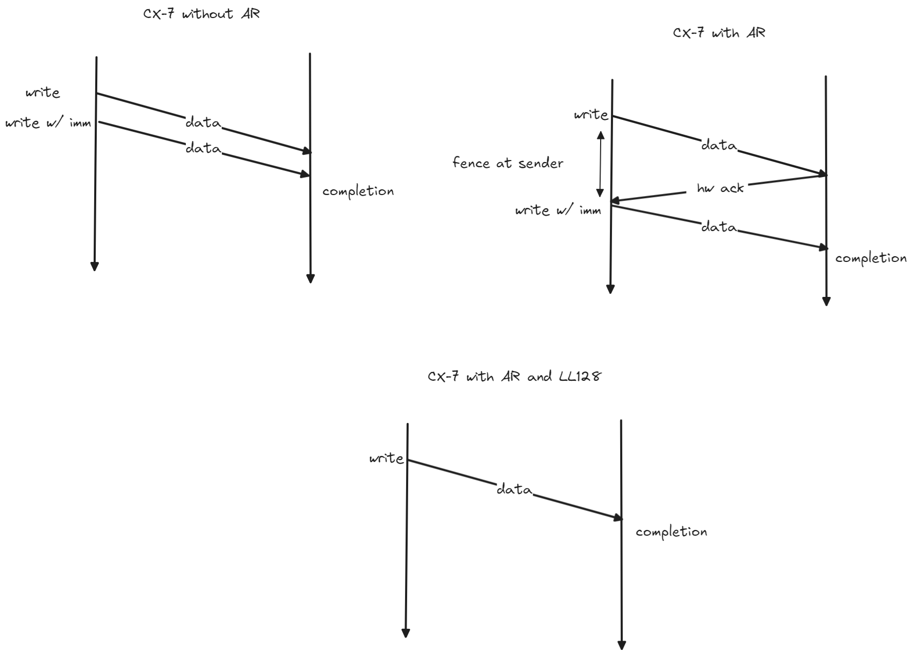

# skip ll completion
<!-- use this template to share the details of your feature. Non-commented sections are strongly encouraged -->

## Abstract

NCCL core tells the net plugin when it will detect arrival of data by polling on the data buffer 
instead of completion of receive request. This is applicable when LL or LL128 protocols are used.
This allows network plugin to optimize completions where appropriate.

<!-- ============================================================================================-->

<h2>Motivation and requirements</h2>

<!-- ============================================================================================-->
 
### NVbugs / Jira Tickets

https://nvbugspro.nvidia.com/bug/4225298

### User Experience

### Assumptions, constraints and dependencies

### Use Cases

Knowing NCCL relies on LL/LL128 allows the network plugin to skip completion generation. This
removes the need to use write with immediate operations and avoids fence overheads that come with it 
when Adaptive Routing or out-of-order handling is enabled on CX-7 and older NICs. 

### Platform Requirements

<!-- ### Functional Requirements -->
<!-- ### System Requirements -->
<!-- ### Interface Requirements -->
<!-- ### KPI Requirements -->
<!-- ### Security Requirements -->
<!-- ### Legal and Standards Requirements -->
<!-- ### Telemetry Requirements -->
<!-- ### Backward Compatibility Requirements -->
<!-- ### Virtualization Requirements -->

 
<!-- ============================================================================================-->

<h2>Design</h2>

<!-- ============================================================================================-->
 
### Proposed Design

Image showing the fence enforced at the sender when Aadaptive routing is enabled on CX-7. Use of 
LL128 removes the need for the write w/ imm to notify the target and hence removes the fence on 
the QP.

<!-- ### Interface Architecture -->
<!-- ### System KPIs & Metrics -->
<!-- ### Data Architecture -->
<!-- ### Security Design -->
<!-- ### Debugging & Troubleshooting -->
<!-- ### Logging and Instrumentation -->
<!-- ### Operational Considerations -->

 
<!-- ============================================================================================-->

<h2>Coding</h2>

<!-- ============================================================================================-->

NCCL sets request pointer in irecv to NCCL\_NET\_OPTIONAL\_RECV\_COMPLETION when it is using
LL or LL128 protocols. In these cases, NCCL polls on flag embedded in data to detect completion
of irecv and is resilient to redundant network writes. This allows the plugin to optimize request
completions on such irecvs (for example, complete the request immediately). The plugin is still
expected to set a valid request pointer on return which NCCL can poll to check for completion.

https://gitlab-master.nvidia.com/nccl/nccl/-/merge\_requests/610/diffs

### Commit list or MR 

 
<!-- ============================================================================================-->

<h2>Testing and Validation</h2>

<!-- ============================================================================================-->

### Objectives and Timeline

### Validation

#### Where to run?

#### What to run?

#### Expected output?
 
<!-- #### Code Coverage Goal Defined -->
<!-- #### KPI Coverage Goals Defined (performance, stress, stability, throughput, latency) -->
<!-- #### Requirement Coverage Goal Defined -->
<!-- #### Quality Thresholds Defined -->
<!-- #### Test Timeline -->
<!-- #### SW Verification and Test Plan -->
<!-- ### Test plan -->
<!-- #### Requirements Tests -->
<!-- #### Interface Tests -->
<!-- #### Fault-injection Tests -->
<!-- #### Resource Usage Tests -->
<!-- #### Design Coverage Testing -->
<!-- #### Boundary Tests -->
<!-- #### Certification Tests -->
<!-- #### Stress Tests -->
<!-- #### Stability Tests -->
<!-- #### Perf and Power KPI Tests -->
<!-- #### Usability & OOBE Tests -->
<!-- #### Manufacturing Diagnostic(Factory) Tests -->

### Performance

#### What is measured?

#### Results

 
<!-- ============================================================================================-->

<h2>Signoff List</h2>

<!-- ============================================================================================-->

Author(s): 
  - Sreeram Potluri

