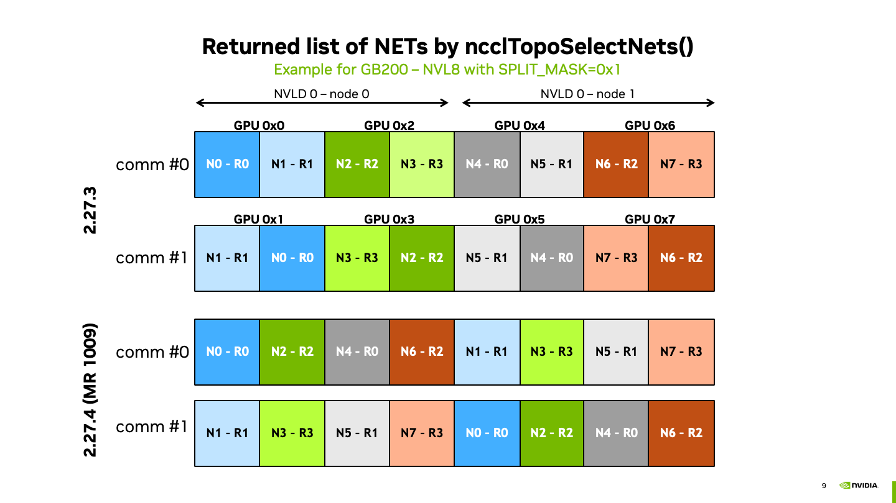

# NET to GPU assignement
<!-- use this template to share the details of your feature. Non-commented sections are strongly encouraged -->

## Abstract

This is more of a design document to document the changes made to NIC-to-GPU assignment in 2.27.4 ([MR!1009](https://gitlab-master.nvidia.com/nccl/nccl/-/merge_requests/1009)).

<!-- ============================================================================================-->
<details>
<summary><h2>Motivation and requirements</h2></summary>
<!-- ============================================================================================-->

When using splitmask with GB200, two successive communicators are sharing the same list of NICs, which leads to poor performance.
See bug [5294160](https://nvbugs/5294160).

<!-- ### NVbugs / Jira Tickets -->
<!---->
<!-- ### User Experience -->
<!---->
<!-- ### Assumptions, constraints and dependencies -->
<!---->
<!-- ### Use Cases -->
<!---->
<!-- ### Platform Requirements -->
<!---->
<!-- ### Functional Requirements -->
<!-- ### System Requirements -->
<!-- ### Interface Requirements -->
<!-- ### KPI Requirements -->
<!-- ### Security Requirements -->
<!-- ### Legal and Standards Requirements -->
<!-- ### Telemetry Requirements -->
<!-- ### Backward Compatibility Requirements -->
<!-- ### Virtualization Requirements -->

</details>

<!-- ============================================================================================-->
<details>
<summary><h2>Design</h2></summary>
<!-- ============================================================================================-->

### Proposed Design

In NCCL 2.27.4, we change the order in which network devices will be used by the graph search to build channels.

A summary for both communicator 0 and 1 is illustrated below

.

Starting the design explanation from  `ncclTopoGetLocalNet`. This function takes the GPU and a channel index.
For that GPU, we get the number (and index) of the closest (aka lowest path type and higher bandwidth) net, `localNetCount`.
For the net, we also get the closest GPUs, `localGpuCount`.
Then, the NET associated to a given channel for a given GPU is computed as 

```c
int net = system->nodes[GPU].nodes[gpu].gpu.dev;
if (isPow2(localNetCount)) net = mirrorBits(net, localNetCount);
net += channelId%(DIVUP(localNetCount,localGpuCount));
```

So each GPU will start at a different index in the array: `mirrorBits(net,localNetCount)`.
Then from that index, the GPU will round-robin on `DIVUP(localNetCount,localGpuCount)` NETs.

In the case of GB200, when all GPUs are in the communicator, we have `localNetCount = 2`, `localGpuCount = 2`.
Further, `GPU0` will get assigned to `NET0` and `GPU1` to `NET1`.

Now in the case of split_mask, the other GPUs are not in the communicator, and therefore not in the topology.
We now have `localNetCount=2`, but `localGpuCount=1`.
`GPU0` (rank `0` in comm `0`) will then get `NET0, NET1`, while `GPU1` (rank `1` in comm `1`) gets `NET1, NET0`.


Going up in the hierarchy of function calls, the graph search uses `ncclTopoSelectNets` with `gpu=-1` to list all the available NETs to build the channels from.
`ncclTopoSelectNets` loops on the GPUs, get the list of NET using `ncclTopoGetLocalNet` and add the NETs to the list if they are not present already.
The work is then distributed to all the NETs of a single `GPU` before moving to the next GPU, aka `NetFirst` or `ChannelFirst` approach.

Considering the case of two nodes within the same NVLD and splitmask = `0x1`, the list of NETs is then
- `comm0`: `N0, N1, N2, N3, N4, N5 N6, N7`, where `N0, N1` come from `GPU0` (rank `0`), `N2, N3` come from `GPU2` (rank `1`), etc.
- `comm1`: `N1, N0, N3, N2, N5, N4 N7, N6`, where `N1, N0` come from `GPU1` (rank `0`), `N3, N2` come from `GPU3` (rank `1`), etc.

This approach is ideal in the sense that it maximizes the number of rails used for each of the communicators (`N0` and `N4` and rail `0`, `N1` and `N5` on rail `1`, etc.).
The issue is that both `comm0` and `comm1` will rely on the same set of NETs, ignoring the existence of the other GPU.

The proposed solution is to switch to a `GpuFirst` approach, where the work is distributed to all the first NET devices of all the GPUs before moving to the second NET of each GPU.
Reusing the example above, we then have:
- `comm0`: `N0, N2, N4, N6, N1, N3 N5, N7`
- `comm1`: `N1, N3, N5, N7, N0, N2 N4, N6`

This way of doing ensures that the first `4` channels, will not use the same NICs on both comms. If more than `4` channels are needed, then the overlapping is inevitable and will happen.
This logic extends to the case of larger `NVLD` and was successfully used to use all 64 NICs on NVLD64 with `splitmask = 0x3`.


</details>

<!-- ============================================================================================-->
<details>
<summary><h2>Signoff List</h2></summary>
<!-- ============================================================================================-->

Author(s):
  - Thomas Gillis 
  - Sylvain Jeaugey

</details>
