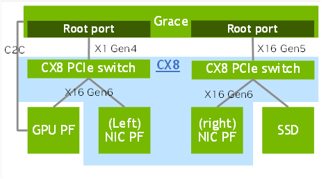
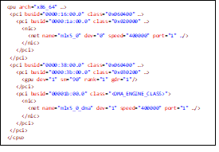
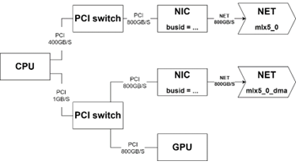

# DirectNIC support
<!-- use this template to share the details of your feature. Non-commented sections are strongly encouraged -->

## Abstract
<!-- here detail what the feature is about. A few sentence that can be copy-pasted to external actors -->

<!-- ============================================================================================-->

<h2>Motivation and requirements</h2>

<!-- ============================================================================================-->
 
 Oberon platform (GB200) will include CX-8, Blackwell and Grace CPU. While CX8 and Blackwell both support PCIe Gen 6 x16, Grace supports PCIe Gen 5 x16. This limits the total achievable networking bandwidth to 400Gb/s where the CX8 supports a total of 800Gb/s. However, though it is an acceptable limitation on CPU centric communication, for GPU qemcentric  communication, the 800Gb/s should be reached. Specifically, GPUDirect RDMA (and its flavors) should be able to saturate the network in 800Gb/s bandwidth. In addition, in the platforms with two GPUs per Grace, C2C bandwidth per GPU is only 1800Gb/s, and sending 800Gb/s networking would consume half of its bandwidth. 

Direct NIC is the chosen solution to overcome this limitation. In that solution, the CX8 will be connected directly to the GPU through a PCIe Gen 6 x16 link. The fully connectivity of the CX8 includes two additional connections to the Grace root-complex, one through the PCIe Gen 5 x16 root port, and another through the PCIe Gen 4 x1 root port. Under each root port, a CX8 PCIe switch and a CX8 NIC is exposed, where the PCIe switch under the Gen 4 root port is the one connected to the Blackwell GPU. The following figure describes the platform

### NVbugs / Jira Tickets

### User Experience

### Assumptions, constraints and dependencies

### Use Cases

### Platform Requirements

<!-- ### Functional Requirements -->
<!-- ### System Requirements -->
<!-- ### Interface Requirements -->
<!-- ### KPI Requirements -->
<!-- ### Security Requirements -->
<!-- ### Legal and Standards Requirements -->
<!-- ### Telemetry Requirements -->
<!-- ### Backward Compatibility Requirements -->
<!-- ### Virtualization Requirements -->

 
<!-- ============================================================================================-->

<h2>Design</h2>

<!-- ============================================================================================-->
 
### Proposed Design

The NET plugin for each net device with a DMA engine will return another NET device for the DMA engine with almost the same properties as the original network device.
The only difference in the DMA node properties and the NET device properties are:
- The name will have a “_dma” postfix
- PCI path – which will be the actual device PCI path.

The NET plugin responsibility is to call regMrDMABuf with the correct flag.
The handle type passed to cuMemGetHandleForAddressRange will be set according to the path between the GPU and NIC.

The XML will look like so:

The resulting graph will look like so

#### Plugin code
##### Loading libmlx5.so
The NET plugin will dynamically load libmlx.so library to use mlx5dv APIs. Build time flag `MLX5DV=1` can be used to build with external symbols and link with libmlx5.so.
The plugin will continue without DataDirect support in case if it is failed to load the symbols.

##### Discovery
For each IB device with the DMA engine the plugin will return it twice in the device list:
- The regular device
- The device with the DMA engine PCIe path 

In order to find the PCIe path of the DMA engine PCIe, the plugin should use the new mlx5dv API to query the DMA engine path of the IB device.uid

##### Reg MR
If the device used for reg MR is the DMA engine, plugin should use the new mlx5dv API with the direct data flag. Otherwise, use the old flow.
##### iFlush 
For the DMA engine device, the flush should be enabled and done through either:
- Loop back RDMA read (as of today)
- 0-byte read from BAR0/1

NCCL device's `forceFlush` attribute being set for direct-nic and this causes NCCL core to call the iflush

 
<!-- ============================================================================================-->

<h2>Coding</h2>

<!-- ============================================================================================-->

### Commit list or MR

 - [Gitlab Merge Request](https://gitlab-master.nvidia.com/nccl/nccl/-/merge_requests/800)
 

 
<!-- ============================================================================================-->

<h2>Testing and Validation</h2>

<!-- ============================================================================================-->

### Objectives and Timeline

### Validation
Functional and performance, if applicable

#### Where to run?
On GB200 plotform with CX-8 Direct-NIC

#### What to run?
Standard benchmark suite (QA dual-node perf)

#### Expected output?
XDR line rate (100 GBs)
 
<!-- #### Code Coverage Goal Defined -->
<!-- #### KPI Coverage Goals Defined (performance, stress, stability, throughput, latency) -->
<!-- #### Requirement Coverage Goal Defined -->
<!-- #### Quality Thresholds Defined -->
<!-- #### Test Timeline -->
<!-- #### SW Verification and Test Plan -->
<!-- ### Test plan -->
<!-- #### Requirements Tests -->
<!-- #### Interface Tests -->
<!-- #### Fault-injection Tests -->
<!-- #### Resource Usage Tests -->
<!-- #### Design Coverage Testing -->
<!-- #### Boundary Tests -->
<!-- #### Certification Tests -->
<!-- #### Stress Tests -->
<!-- #### Stability Tests -->
<!-- #### Perf and Power KPI Tests -->
<!-- #### Usability & OOBE Tests -->
<!-- #### Manufacturing Diagnostic(Factory) Tests -->

### Performance

#### What is measured?

#### Results

 
<!-- ============================================================================================-->

<h2>Signoff List</h2>

<!-- ============================================================================================-->

Author(s): 
  - Devendar Bureddy (devendar@nvidia.com)
  - Gal Shalom (galshalom@nvidia.com)

