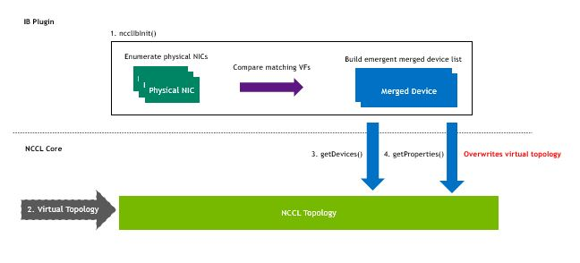
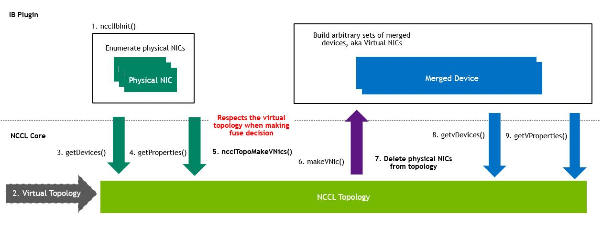
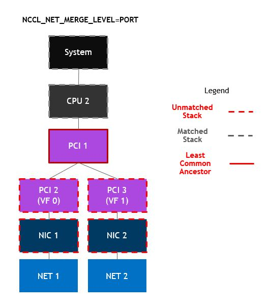
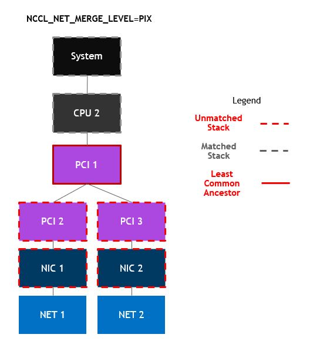
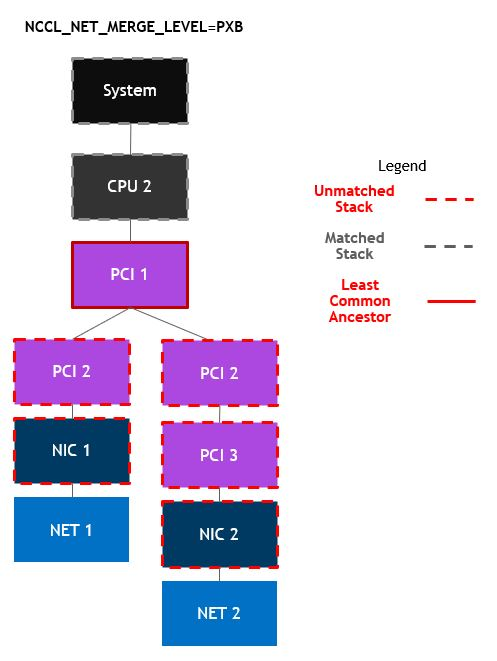
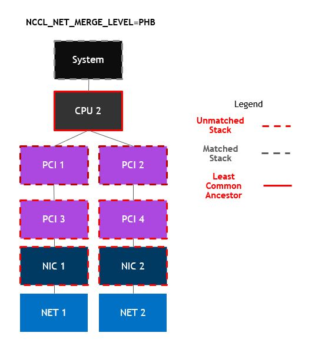
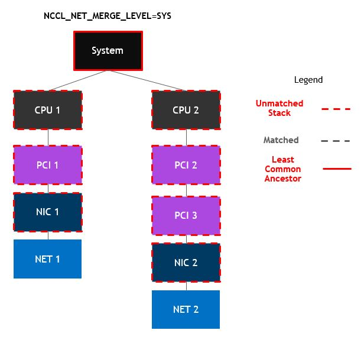

# NIC Fusion
<!-- use this template to share the details of your feature. Non-commented sections are strongly encouraged -->

## Abstract
<!-- here detail what the feature is about. A few sentence that can be copy-pasted to external actors -->
NIC Fusion is an extension of Port Fusion in NCCL. It enables NCCL's Infiniband plugin to group together physical NICs (up to 4) together into logical NICs used by NCCL's core algorithms.

<!-- ============================================================================================-->
<details>
<summary><h2>Motivation and requirements</h2></summary>
<!-- ============================================================================================-->
The reason to fuse any NICs together in the first place are as follows:
1. Some of NCCL's algorithms currently only work with 8 NICs, so on systems with 16 NICs, those algorithms could crash.
2. NCCL's core tuning code works best with 8 NICs - NCCL may tune itself to use too many channels when trying to drive 16 NICs.
3. Clusters are coming which will have, or appear to NCCL as, 16 or 32 NICs with 8 GPUs per-system.
4. This is a foundational feature which we can use to enhance future capabilities, such as NIC failover and dynamic load balancing.

The reason for NIC fusion as opposed to NCCL's existing port fusion is as follows:
1. Port fusion expects each port to present as a separate VF of the same PCI device.
2. Port fusion overwrote the physical properties of each NIC, presenting a false topology if the user wanted to dump it to a file.
3. Port fusion did not respect the user-provided topology when making a decision to merge NICs - it only used the pciPath the OS provided it with.

### NVbugs / Jira Tickets
 - [SWQA task for "Blackwell Enablement: NIC fusion (Extend port fusion in IB network plugin to cover multiple NICs)"](https://jirasw.nvidia.com/browse/NCCL-1664)
 - [[NCCL Feature Branch bewilliams/v2.23-nic-fusion] [Dual Viking] with NCCL_IB_FORCE_MERGE, scatter/alltoall/reduce_scatter/reduce/all_reduce tests/broadcast tests Failed.](https://nvbugspro.nvidia.com/bug/4742648)
 - [[RFE] NIC fusion (Extend port fusion in IB network plugin to cover multiple NICs)](https://nvbugspro.nvidia.com/bug/4463711)
 - [[NCCL 2.20.x][RFE] Azure HPC NCCL ETH Split CX7 4X100Gb/s - Variable num merged ports](https://nvbugspro.nvidia.com/bug/4496596)

### User Experience
NIC Fusion should happen automatically in the following situations:
1. The network plugin in use must have defined the new network API to take advantage - makeVDevice. If this has not been implemented, NIC fusion will be skipped. This change implements NIC Fusion in the internal IB plugin, so that option will always be available for users of NCCL.

2. If topology code detects NICs meeting the specific merge level from the environment variable NCCL_NET_MERGE_LEVEL. The possible values for this are as follows:
	- LOC - Merge with self, aka disable merging NICs
	- PORT (default) - Merge with other NICs presenting as multiple functions of the same PCI device (same behavior as before)
	- PIX - Merge with other NICs directly under the same PCI switch
	- PXB - Merge with other NICs under the same PCI tree
	- PHB - Merge with other NICs under the same CPU host bridge
	- SYS - Merge with other NICs on the same system, potentially crossing CPU host bridges

3. If the user has forced NCCL to merge an arbitrary set of NICs using NCCL_NET_FORCE_MERGE. This is a semicolon delimited list of comma delimited NICs to merge, aka:
   - `mlx5_0,mlx5_1;mlx5_2,mlx5_3;mlx5_4,mlx5_5,mlx5_6;mlx5_7`
   Will merge mlx5_0,mlx5_1 into a single virtual NIC, mlx5_2,mlx5_3 into another, mlx5_4,mlx5_5,mlx5_6 into another, and finally mlx5_7 into its own. This example demonstrates that there is no requirement of symmetry with merged devices, although there's no guaruntee of good performance in all configurations.

NIC Fusion will automatically use the PCI paths in the provided topology, if specified, or simply use the values returned from system calls (realpath().)

NIC Fusion can always be disabled via NCCL_NET_MERGE_LEVEL=LOC. The environment variable NCCL_IB_MERGE_NICs=0 can also be set to force NCCL to not merge, although this will cause a ncclInvalidUsage error (this alone cannot make an application cleanly skip NIC fusion.) Therefore setting this in situations in which you don't want NICs to merge is good to enforce correctness, but NCCL_NET_MERGE_LEVEL=LOC is the preferred way.

### Assumptions, constraints and dependencies
NIC Fusion will work best in the event where all fused NICs are closest to a single GPU. In the event that NICs are fused which span PCI distant switches, traffic between non-local GPUs and NICs will result in sub-optimal performance and tuning. NCCL may tune itself differently given a single big fused NIC as opposed to multiple small physical NICs. Maximizing performance is not necessarily solved in all situtations, and continuous investment must be made into the area. 

### Use Cases
1. Dual-port / quad-port H100 systems
2. 2 NIC-per GPU B100 systems
3. Any system using dual-port NICs which present as separate PCI devices

### Platform Requirements
Multiple NICs per system.

</details>
 
<!-- ============================================================================================-->
<details>
<summary><h2>Design</h2></summary>
<!-- ============================================================================================-->
 
### Proposed Design

The point at which physical NICs are enumerated and virtual NICs (fused NICs) are emitted from the network plugin in NCCL was formerly at the same point - during network plugin initialization. This was fine given the former assumptions of port fusion in NCCL, but given the new requirements, the NCCL core needs more information from the topology to make this decision. Therefore, three major changes have occured:

1. Only discovery physical devices inside ncclIbInit(). Create a virtual NIC for each physical NIC for ease of use by external plugins.
2. Analyze the paths between every physical NIC and place them in virtual NICs within the topology code
3. Override the physical NICs with virtual NICs in the topology

#### Before


#### Proposed Design


#### NIC Fusion technique
The process for fusing NICs is as follows:
1. In ncclTopoGetSystem(), before merging devices, enumerate all physical net devices and place them in NCCL's topology, marking their "keep" property as 0. This will clear these devices later in the process.
2. In ncclTopoMakeVNics(), determine the merging criteria for network devices - that can either be force-merge or merge-level based.
3. After making new vNICs, enumerate each vNIC and make sure it is added to the topology (this can be false in multi-threaded use cases.)

##### Force Merge
1. Inspect NCCL_NET_FORCE_MERGE environment, and split by semicolon to list out physical nic-pairs
2. For each semi block, list out the physical devices (comma-separated) and try to place them into a vNIC
3. Find the shared parent in NCCL topology of this device, and place the newly created NET node into the topo.

##### Auto Merge (Merge-level Based)
1. Calculate the path between every pair of physical NICs using the following algorithm:
	- Get the ncclXmlNode* for that NIC ("net" nodes in the NCCL topology)
	- Build a stack of parent nodes for each child (all the way up to the root "system" node)
	- Compare each parent node from the stack until they no longer match
	- Given the type of parent node at the point of matching, determine the type of path between the nodes









2. Given these paths and the desired merge level, place all unplaced NICs into virtual devices and trigger the network plugin to allocate a new vDevice:
```
ncclNet->devices(&nDevs)
paths[nDevs][nDevs] = {0}
merge_level = getMergeLevel(getEnv(“NCCL_NET_MERGE_LEVEL”)) // int
foreach device d1:
	foreach device d2:
		Determine path p between d1 and d2 and store in paths[d1][d2]
foreach device d1:
	if d1 is unplaced:
		Allocate vDevice v and place d1 as child 0
		mark d1 as placed
		foreach device d2:
			if d2 is unplaced and paths(d1, d2) < merge_level:
				place d2 as next child of v
				mark d2 as placed
		ncclNet->makeVDevice(v)
```
This will work after force-merging NICs, so in the event the user wants to force-merge some NICs and let the rest automatically merge, that will work.\
3. Place this new vDevice into NCCL's topology, ignoring the stated pciPath and instead place it underneath the calculated parent.

### Interface Architecture

Three new network plugin APIs and a struct are defined by this change:

```
#define NCCL_NET_MAX_DEVS_PER_NIC_V9 4
#define NCCL_NET_MAX_DEVS_PER_NIC NCCL_NET_MAX_DEVS_PER_NIC_V9

typedef struct {
  int ndevs;
  int devs[NCCL_NET_MAX_DEVS_PER_NIC_V9];
} ncclNetVDeviceProps_v9_t;
typedef ncclNetVDeviceProps_v9_t ncclNetVDeviceProps_t;

typedef struct {
  // ...
  ncclNetVDeviceProps_v9_t vProps;
} ncclNetProperties_v9_t;
typedef ncclNetProperties_v9_t ncclNetProperties_t;

  ncclResult_t (*getProperties)(int dev, ncclNetProperties_v9_t* props);
  ncclResult_t (*makeVDevice)(int* d, ncclNetVDeviceProps_t* props);
```

makeVDevice() instructs the network plugin to create a new virtual device based on the specified devices, and will write the newly created device index to *d.

</details>
 
<!-- ============================================================================================-->
<details>
<summary><h2>Coding</h2></summary>
<!-- ============================================================================================-->

### Commit list or MR
 - [Gitlab Merge Request](https://gitlab-master.nvidia.com/nccl/nccl/-/merge_requests/496)

</details>
 
<!-- ============================================================================================-->
<details>
<summary><h2>Testing and Validation</h2></summary>
<!-- ============================================================================================-->

### Objectives and Timeline
1. Confirm that NIC fusion doesn't break or regress non-fused NIC systems (private QA spin)
2. Confirm that NIC fusion behaves the same as port fusion on dual-port systems (private QA spin)
3. Confirm that NIC fusion works correctly on next-gen systems (via PID drop to customers)

### Validation
Functional and performance, if applicable

#### Where to run?
1. DGX-H100 to confirm mainline usecase
2. OCI-HGX-A100 to confirm former port fusion cases still work as expected
3. B100 preview systems

#### What to run?
Standard benchmark suite (QA dual-node perf)

#### Expected output?
1. For non-fused systems - identical performance to before
2. For force-merged systems - functional correctness
3. For fused systems - Either identical performance to before or good performance with improved NCCL tuning and algorithm selection.
 
<!-- #### Code Coverage Goal Defined -->
<!-- #### KPI Coverage Goals Defined (performance, stress, stability, throughput, latency) -->
<!-- #### Requirement Coverage Goal Defined -->
<!-- #### Quality Thresholds Defined -->
<!-- #### Test Timeline -->
<!-- #### SW Verification and Test Plan -->
<!-- ### Test plan -->
<!-- #### Requirements Tests -->
<!-- #### Interface Tests -->
<!-- #### Fault-injection Tests -->
<!-- #### Resource Usage Tests -->
<!-- #### Design Coverage Testing -->
<!-- #### Boundary Tests -->
<!-- #### Certification Tests -->
<!-- #### Stress Tests -->
<!-- #### Stability Tests -->
<!-- #### Perf and Power KPI Tests -->
<!-- #### Usability & OOBE Tests -->
<!-- #### Manufacturing Diagnostic(Factory) Tests -->

### Performance
The performance should be on par with non-fused NICs. One caveat here is that with 16 or 32 NICs in a non-fused configuration, NCCL may tune itself to use double the channels it would with 8 fused logical NICs. In this situation, it will appear as though NIC fusion results in lower performance. The reality in end-to-end applications is NIC Fusion results in a 20% or greater end-to-end application performance gain due to the elimination of over-tuning. The SMs the application expects to have are released.

#### What is measured?

#### Results


</details>
 
<!-- ============================================================================================-->
<details>
<summary><h2>Signoff List</h2></summary>
<!-- ============================================================================================-->

Author(s): 
  - Ben Williams (bewilliams@nvidia.com)

</details>
